# Grafo de funciones del compilador

Generado por `make grafo` (`tests/grafo.py`); no se edita a mano.
Un diagrama por archivo: sus funciones y las que llama de otros
archivos (las de fuera llevan el nombre del archivo). Las llamadas
dentro del mismo archivo y las funciones del lenguaje no se dibujan.
Para saber quien llama a una funcion, mira `docs/llamadas.md`.

## compilador/cuerpos.t

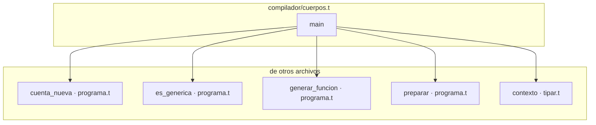

## compilador/expresiones.t

```mermaid
graph TD
    subgraph compilador_expresiones["compilador/expresiones.t"]
        compilador_expresiones__main["main"]
        compilador_expresiones__marca_de["marca_de"]
        compilador_expresiones__presta["presta"]
        compilador_expresiones__recoger_firmas["recoger_firmas"]
        compilador_expresiones__tipo_pelado["tipo_pelado"]
        compilador_expresiones__tras_dos_puntos["tras_dos_puntos"]
    end
    subgraph fuera["de otros archivos"]
        compilador_lib_generar__cuerpo["cuerpo · generar.t"]
        compilador_lib_generar__expresion_c["expresion_c · generar.t"]
        compilador_lib_generar__externas_de["externas_de · generar.t"]
        compilador_lib_generar__nombres_de_c["nombres_de_c · generar.t"]
        compilador_lib_generar__renombrar_para_c["renombrar_para_c · generar.t"]
        compilador_lib_tipar__abrir["abrir · tipar.t"]
        compilador_lib_tipar__cerrar["cerrar · tipar.t"]
        compilador_lib_tipar__contexto["contexto · tipar.t"]
        compilador_lib_tipar__declarar["declarar · tipar.t"]
        compilador_lib_tipos__leer_tipo["leer_tipo · tipos.t"]
        compilador_lib_tipos__leer_tipos["leer_tipos · tipos.t"]
        lexer_lib_sintaxis__enums_visibles["enums_visibles · sintaxis.t"]
        lexer_lib_sintaxis__estado_de["estado_de · sintaxis.t"]
        lexer_lib_sintaxis__programa["programa · sintaxis.t"]
        lexer_lib_sintaxis__structs_visibles["structs_visibles · sintaxis.t"]
        std_texto__empieza_con["empieza_con · std/texto"]
        std_texto__recortar["recortar · std/texto"]
    end

    compilador_expresiones__main --> compilador_lib_generar__cuerpo
    compilador_expresiones__main --> compilador_lib_generar__expresion_c
    compilador_expresiones__main --> compilador_lib_generar__externas_de
    compilador_expresiones__main --> compilador_lib_generar__nombres_de_c
    compilador_expresiones__main --> compilador_lib_generar__renombrar_para_c
    compilador_expresiones__main --> compilador_lib_tipar__abrir
    compilador_expresiones__main --> compilador_lib_tipar__cerrar
    compilador_expresiones__main --> compilador_lib_tipar__contexto
    compilador_expresiones__main --> compilador_lib_tipar__declarar
    compilador_expresiones__main --> lexer_lib_sintaxis__enums_visibles
    compilador_expresiones__main --> lexer_lib_sintaxis__estado_de
    compilador_expresiones__main --> lexer_lib_sintaxis__programa
    compilador_expresiones__main --> lexer_lib_sintaxis__structs_visibles
    compilador_expresiones__marca_de --> std_texto__empieza_con
    compilador_expresiones__presta --> std_texto__empieza_con
    compilador_expresiones__recoger_firmas --> compilador_lib_tipos__leer_tipo
    compilador_expresiones__recoger_firmas --> compilador_lib_tipos__leer_tipos
    compilador_expresiones__tipo_pelado --> std_texto__empieza_con
    compilador_expresiones__tras_dos_puntos --> std_texto__recortar
```

## compilador/firmas.t

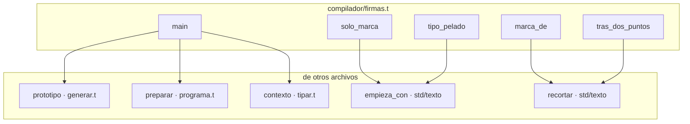

## compilador/lib/comprobar.t

```mermaid
graph TD
    subgraph compilador_lib_comprobar["compilador/lib/comprobar.t"]
        compilador_lib_comprobar__almacenable["almacenable"]
        compilador_lib_comprobar__avisar_sin_usar["avisar_sin_usar"]
        compilador_lib_comprobar__binaria["binaria"]
        compilador_lib_comprobar__c_tipos_vacio["c_tipos_vacio"]
        compilador_lib_comprobar__campo["campo"]
        compilador_lib_comprobar__campo_de["campo_de"]
        compilador_lib_comprobar__campos_nombres["campos_nombres"]
        compilador_lib_comprobar__campos_tipos["campos_tipos"]
        compilador_lib_comprobar__cierre["cierre"]
        compilador_lib_comprobar__como_mostrar["como_mostrar"]
        compilador_lib_comprobar__comprobar_conversion["comprobar_conversion"]
        compilador_lib_comprobar__comprobar_expresion_sin_anotar["comprobar_expresion_sin_anotar"]
        compilador_lib_comprobar__comprobar_externa["comprobar_externa"]
        compilador_lib_comprobar__comprobar_literal["comprobar_literal"]
        compilador_lib_comprobar__comprobar_mapa_valido["comprobar_mapa_valido"]
        compilador_lib_comprobar__comprobar_match["comprobar_match"]
        compilador_lib_comprobar__comprobar_programa["comprobar_programa"]
        compilador_lib_comprobar__comprobar_restricciones["comprobar_restricciones"]
        compilador_lib_comprobar__con_signo["con_signo"]
        compilador_lib_comprobar__contar_pendientes["contar_pendientes"]
        compilador_lib_comprobar__declarar_patron["declarar_patron"]
        compilador_lib_comprobar__desenvolver["desenvolver"]
        compilador_lib_comprobar__destino_de["destino_de"]
        compilador_lib_comprobar__encaja["encaja"]
        compilador_lib_comprobar__enum_lit["enum_lit"]
        compilador_lib_comprobar__enum_sin_datos["enum_sin_datos"]
        compilador_lib_comprobar__error_solo_lectura["error_solo_lectura"]
        compilador_lib_comprobar__es_compuesto["es_compuesto"]
        compilador_lib_comprobar__es_copiable["es_copiable"]
        compilador_lib_comprobar__es_struct_aplicado["es_struct_aplicado"]
        compilador_lib_comprobar__fijar_literal["fijar_literal"]
        compilador_lib_comprobar__fijar_literal_sin_contar["fijar_literal_sin_contar"]
        compilador_lib_comprobar__firma_valida["firma_valida"]
        compilador_lib_comprobar__formas_de["formas_de"]
        compilador_lib_comprobar__formas_legibles["formas_legibles"]
        compilador_lib_comprobar__funcion_de["funcion_de"]
        compilador_lib_comprobar__funcion_vista["funcion_vista"]
        compilador_lib_comprobar__indice["indice"]
        compilador_lib_comprobar__instanciar["instanciar"]
        compilador_lib_comprobar__interna["interna"]
        compilador_lib_comprobar__interna_anadir["interna_anadir"]
        compilador_lib_comprobar__interna_comparar["interna_comparar"]
        compilador_lib_comprobar__interna_copiar["interna_copiar"]
        compilador_lib_comprobar__interna_intercambiar["interna_intercambiar"]
        compilador_lib_comprobar__interna_largo["interna_largo"]
        compilador_lib_comprobar__interna_mapa["interna_mapa"]
        compilador_lib_comprobar__interna_numeros["interna_numeros"]
        compilador_lib_comprobar__interna_ordenar["interna_ordenar"]
        compilador_lib_comprobar__interna_redimensionar["interna_redimensionar"]
        compilador_lib_comprobar__interna_reservar["interna_reservar"]
        compilador_lib_comprobar__interna_texto["interna_texto"]
        compilador_lib_comprobar__interna_truncar["interna_truncar"]
        compilador_lib_comprobar__legible["legible"]
        compilador_lib_comprobar__literal_arreglo["literal_arreglo"]
        compilador_lib_comprobar__literal_struct["literal_struct"]
        compilador_lib_comprobar__llamada["llamada"]
        compilador_lib_comprobar__llamada_a_puntero["llamada_a_puntero"]
        compilador_lib_comprobar__lleva_partes["lleva_partes"]
        compilador_lib_comprobar__lleva_suelto["lleva_suelto"]
        compilador_lib_comprobar__lleva_vista_en["lleva_vista_en"]
        compilador_lib_comprobar__mutar["mutar"]
        compilador_lib_comprobar__nodo_de_cierre["nodo_de_cierre"]
        compilador_lib_comprobar__origenes_de["origenes_de"]
        compilador_lib_comprobar__origenes_de_puntero["origenes_de_puntero"]
        compilador_lib_comprobar__param_de["param_de"]
        compilador_lib_comprobar__partes_declaracion["partes_declaracion"]
        compilador_lib_comprobar__patron_valido["patron_valido"]
        compilador_lib_comprobar__por_que_no_se_compara["por_que_no_se_compara"]
        compilador_lib_comprobar__posee_memoria["posee_memoria"]
        compilador_lib_comprobar__presta_tipo["presta_tipo"]
        compilador_lib_comprobar__presta_un_sitio["presta_un_sitio"]
        compilador_lib_comprobar__prestado_como_vista["prestado_como_vista"]
        compilador_lib_comprobar__prestamos_vivos["prestamos_vivos"]
        compilador_lib_comprobar__prestar_sitio["prestar_sitio"]
        compilador_lib_comprobar__probar_juego["probar_juego"]
        compilador_lib_comprobar__procedencia_de["procedencia_de"]
        compilador_lib_comprobar__rango["rango"]
        compilador_lib_comprobar__registrar_aplicacion["registrar_aplicacion"]
        compilador_lib_comprobar__registrar_en_nodo["registrar_en_nodo"]
        compilador_lib_comprobar__registrar_enums["registrar_enums"]
        compilador_lib_comprobar__registrar_structs["registrar_structs"]
        compilador_lib_comprobar__registrar_tipo["registrar_tipo"]
        compilador_lib_comprobar__renombrar_capturas["renombrar_capturas"]
        compilador_lib_comprobar__resolver_nombre["resolver_nombre"]
        compilador_lib_comprobar__sacar_campo["sacar_campo"]
        compilador_lib_comprobar__se_contiene["se_contiene"]
        compilador_lib_comprobar__sentencia_asignacion["sentencia_asignacion"]
        compilador_lib_comprobar__sentencia_declaracion["sentencia_declaracion"]
        compilador_lib_comprobar__sentencia_mientras["sentencia_mientras"]
        compilador_lib_comprobar__sentencia_para["sentencia_para"]
        compilador_lib_comprobar__sentencia_retorno["sentencia_retorno"]
        compilador_lib_comprobar__sentencia_si["sentencia_si"]
        compilador_lib_comprobar__si_expr["si_expr"]
        compilador_lib_comprobar__siempre_sale_rama["siempre_sale_rama"]
        compilador_lib_comprobar__sin_prestamo["sin_prestamo"]
        compilador_lib_comprobar__solapan["solapan"]
        compilador_lib_comprobar__sustituir_en_arbol["sustituir_en_arbol"]
        compilador_lib_comprobar__tiene_forma["tiene_forma"]
        compilador_lib_comprobar__tipo_de_escrito["tipo_de_escrito"]
        compilador_lib_comprobar__tipo_de_literal_generico["tipo_de_literal_generico"]
        compilador_lib_comprobar__tipo_de_lugar["tipo_de_lugar"]
        compilador_lib_comprobar__tipo_del_sitio["tipo_del_sitio"]
        compilador_lib_comprobar__tipo_informe["tipo_informe"]
        compilador_lib_comprobar__tipo_probable["tipo_probable"]
        compilador_lib_comprobar__unaria["unaria"]
        compilador_lib_comprobar__unificar_tipo["unificar_tipo"]
        compilador_lib_comprobar__validar_campos["validar_campos"]
        compilador_lib_comprobar__validar_en_funcion["validar_en_funcion"]
        compilador_lib_comprobar__validar_en_nodo["validar_en_nodo"]
        compilador_lib_comprobar__validar_formas["validar_formas"]
        compilador_lib_comprobar__validar_tipo["validar_tipo"]
        compilador_lib_comprobar__valor_escrito["valor_escrito"]
        compilador_lib_comprobar__variable["variable"]
    end
    subgraph fuera["de otros archivos"]
        compilador_lib_generar__cabe_literal_decimal["cabe_literal_decimal · generar.t"]
        compilador_lib_generar__cabe_literal_entero["cabe_literal_entero · generar.t"]
        compilador_lib_generar__entero_exacto_en["entero_exacto_en · generar.t"]
        compilador_lib_generar__escrito["escrito · generar.t"]
        compilador_lib_generar__sin_ceros_izquierda["sin_ceros_izquierda · generar.t"]
        compilador_lib_tipar__antes_del_punto["antes_del_punto · tipar.t"]
        compilador_lib_tipar__contexto["contexto · tipar.t"]
        compilador_lib_tipar__funcion_de_cierre["funcion_de_cierre · tipar.t"]
        compilador_lib_tipar__lista_de["lista_de · tipar.t"]
        compilador_lib_tipar__literal_de["literal_de · tipar.t"]
        compilador_lib_tipar__nombre_resuelto["nombre_resuelto · tipar.t"]
        compilador_lib_tipar__sin_modulo["sin_modulo · tipar.t"]
        compilador_lib_tipar__tras_el_punto["tras_el_punto · tipar.t"]
        compilador_lib_tipos__apuntado["apuntado · tipos.t"]
        compilador_lib_tipos__apuntado_si["apuntado_si · tipos.t"]
        compilador_lib_tipos__base["base · tipos.t"]
        compilador_lib_tipos__base_de_aplicacion["base_de_aplicacion · tipos.t"]
        compilador_lib_tipos__conocido["conocido · tipos.t"]
        compilador_lib_tipos__cuantos_del_arreglo["cuantos_del_arreglo · tipos.t"]
        compilador_lib_tipos__elemento["elemento · tipos.t"]
        compilador_lib_tipos__es_aplicacion["es_aplicacion · tipos.t"]
        compilador_lib_tipos__es_arreglo["es_arreglo · tipos.t"]
        compilador_lib_tipos__es_bloque["es_bloque · tipos.t"]
        compilador_lib_tipos__es_de_nombre["es_de_nombre · tipos.t"]
        compilador_lib_tipos__es_funcion["es_funcion · tipos.t"]
        compilador_lib_tipos__es_lista["es_lista · tipos.t"]
        compilador_lib_tipos__es_mapa["es_mapa · tipos.t"]
        compilador_lib_tipos__es_rango["es_rango · tipos.t"]
        compilador_lib_tipos__es_referencia["es_referencia · tipos.t"]
        compilador_lib_tipos__es_referencia_mutable["es_referencia_mutable · tipos.t"]
        compilador_lib_tipos__escribir_de_mapa["escribir_de_mapa · tipos.t"]
        compilador_lib_tipos__escribir_de_mapa_tipos["escribir_de_mapa_tipos · tipos.t"]
        compilador_lib_tipos__escribir_tipo["escribir_tipo · tipos.t"]
        compilador_lib_tipos__hacer_arreglo["hacer_arreglo · tipos.t"]
        compilador_lib_tipos__hacer_lista["hacer_lista · tipos.t"]
        compilador_lib_tipos__hacer_prestado["hacer_prestado · tipos.t"]
        compilador_lib_tipos__hacer_prestado_mut["hacer_prestado_mut · tipos.t"]
        compilador_lib_tipos__hacer_rango["hacer_rango · tipos.t"]
        compilador_lib_tipos__leer_tipo["leer_tipo · tipos.t"]
        compilador_lib_tipos__leer_tipos["leer_tipos · tipos.t"]
        compilador_lib_tipos__marcador["marcador · tipos.t"]
        compilador_lib_tipos__ninguno["ninguno · tipos.t"]
        compilador_lib_tipos__partes["partes · tipos.t"]
        compilador_lib_tipos__partes_de_funcion["partes_de_funcion · tipos.t"]
        compilador_lib_tipos__posee_en["posee_en · tipos.t"]
        compilador_lib_tipos__sanear["sanear · tipos.t"]
        compilador_lib_tipos__sin_alias_tipo["sin_alias_tipo · tipos.t"]
        compilador_lib_tipos__sustituir["sustituir · tipos.t"]
        compilador_lib_tipos__sustituir_tipo["sustituir_tipo · tipos.t"]
        compilador_lib_tipos__tipos_de_mapa["tipos_de_mapa · tipos.t"]
        lexer_lib_sintaxis__es_lugar["es_lugar · sintaxis.t"]
        lexer_lib_sintaxis__hoja["hoja · sintaxis.t"]
        lexer_lib_sintaxis__rama["rama · sintaxis.t"]
        std_texto__contiene["contiene · std/texto"]
        std_texto__empieza_con["empieza_con · std/texto"]
        std_texto__recortar["recortar · std/texto"]
        std_texto__termina_con["termina_con · std/texto"]
    end

    compilador_lib_comprobar__almacenable --> compilador_lib_tipos__apuntado
    compilador_lib_comprobar__almacenable --> compilador_lib_tipos__elemento
    compilador_lib_comprobar__almacenable --> compilador_lib_tipos__es_arreglo
    compilador_lib_comprobar__almacenable --> compilador_lib_tipos__es_bloque
    compilador_lib_comprobar__almacenable --> compilador_lib_tipos__es_funcion
    compilador_lib_comprobar__almacenable --> compilador_lib_tipos__es_lista
    compilador_lib_comprobar__almacenable --> compilador_lib_tipos__es_mapa
    compilador_lib_comprobar__almacenable --> compilador_lib_tipos__es_referencia
    compilador_lib_comprobar__almacenable --> compilador_lib_tipos__partes
    compilador_lib_comprobar__almacenable --> compilador_lib_tipos__partes_de_funcion
    compilador_lib_comprobar__avisar_sin_usar --> compilador_lib_generar__escrito
    compilador_lib_comprobar__avisar_sin_usar --> std_texto__empieza_con
    compilador_lib_comprobar__binaria --> compilador_lib_tipos__conocido
    compilador_lib_comprobar__binaria --> compilador_lib_tipos__escribir_tipo
    compilador_lib_comprobar__binaria --> compilador_lib_tipos__ninguno
    compilador_lib_comprobar__c_tipos_vacio --> compilador_lib_tipar__contexto
    compilador_lib_comprobar__campo --> compilador_lib_tipos__conocido
    compilador_lib_comprobar__campo --> compilador_lib_tipos__escribir_tipo
    compilador_lib_comprobar__campo --> compilador_lib_tipos__ninguno
    compilador_lib_comprobar__campo --> std_texto__empieza_con
    compilador_lib_comprobar__campo_de --> compilador_lib_tipos__sin_alias_tipo
    compilador_lib_comprobar__campo_de --> std_texto__recortar
    compilador_lib_comprobar__campos_nombres --> compilador_lib_tipar__lista_de
    compilador_lib_comprobar__campos_nombres --> compilador_lib_tipos__base_de_aplicacion
    compilador_lib_comprobar__campos_tipos --> compilador_lib_tipar__lista_de
    compilador_lib_comprobar__campos_tipos --> compilador_lib_tipos__base_de_aplicacion
    compilador_lib_comprobar__campos_tipos --> compilador_lib_tipos__escribir_de_mapa_tipos
    compilador_lib_comprobar__campos_tipos --> compilador_lib_tipos__escribir_tipo
    compilador_lib_comprobar__campos_tipos --> compilador_lib_tipos__partes
    compilador_lib_comprobar__campos_tipos --> compilador_lib_tipos__sustituir_tipo
    compilador_lib_comprobar__campos_tipos --> compilador_lib_tipos__tipos_de_mapa
    compilador_lib_comprobar__cierre --> compilador_lib_generar__escrito
    compilador_lib_comprobar__cierre --> compilador_lib_tipos__es_referencia
    compilador_lib_comprobar__cierre --> compilador_lib_tipos__leer_tipos
    compilador_lib_comprobar__cierre --> std_texto__empieza_con
    compilador_lib_comprobar__como_mostrar --> compilador_lib_tipos__es_arreglo
    compilador_lib_comprobar__como_mostrar --> compilador_lib_tipos__es_bloque
    compilador_lib_comprobar__como_mostrar --> compilador_lib_tipos__es_lista
    compilador_lib_comprobar__como_mostrar --> compilador_lib_tipos__es_mapa
    compilador_lib_comprobar__comprobar_conversion --> compilador_lib_tipar__literal_de
    compilador_lib_comprobar__comprobar_conversion --> compilador_lib_tipos__escribir_tipo
    compilador_lib_comprobar__comprobar_conversion --> compilador_lib_tipos__sin_alias_tipo
    compilador_lib_comprobar__comprobar_conversion --> std_texto__empieza_con
    compilador_lib_comprobar__comprobar_expresion_sin_anotar --> compilador_lib_tipos__conocido
    compilador_lib_comprobar__comprobar_expresion_sin_anotar --> compilador_lib_tipos__es_referencia
    compilador_lib_comprobar__comprobar_expresion_sin_anotar --> compilador_lib_tipos__escribir_tipo
    compilador_lib_comprobar__comprobar_expresion_sin_anotar --> compilador_lib_tipos__leer_tipo
    compilador_lib_comprobar__comprobar_expresion_sin_anotar --> compilador_lib_tipos__marcador
    compilador_lib_comprobar__comprobar_expresion_sin_anotar --> compilador_lib_tipos__ninguno
    compilador_lib_comprobar__comprobar_externa --> compilador_lib_tipos__es_referencia
    compilador_lib_comprobar__comprobar_literal --> compilador_lib_generar__cabe_literal_decimal
    compilador_lib_comprobar__comprobar_literal --> compilador_lib_generar__cabe_literal_entero
    compilador_lib_comprobar__comprobar_literal --> compilador_lib_generar__entero_exacto_en
    compilador_lib_comprobar__comprobar_literal --> compilador_lib_generar__sin_ceros_izquierda
    compilador_lib_comprobar__comprobar_literal --> compilador_lib_tipar__literal_de
    compilador_lib_comprobar__comprobar_mapa_valido --> compilador_lib_tipos__es_mapa
    compilador_lib_comprobar__comprobar_mapa_valido --> compilador_lib_tipos__es_referencia
    compilador_lib_comprobar__comprobar_mapa_valido --> compilador_lib_tipos__partes
    compilador_lib_comprobar__comprobar_match --> compilador_lib_tipar__lista_de
    compilador_lib_comprobar__comprobar_match --> compilador_lib_tipar__tras_el_punto
    compilador_lib_comprobar__comprobar_match --> compilador_lib_tipos__conocido
    compilador_lib_comprobar__comprobar_match --> compilador_lib_tipos__escribir_tipo
    compilador_lib_comprobar__comprobar_match --> compilador_lib_tipos__ninguno
    compilador_lib_comprobar__comprobar_programa --> std_texto__contiene
    compilador_lib_comprobar__comprobar_restricciones --> std_texto__empieza_con
    compilador_lib_comprobar__con_signo --> std_texto__empieza_con
    compilador_lib_comprobar__contar_pendientes --> compilador_lib_tipos__escribir_de_mapa
    compilador_lib_comprobar__contar_pendientes --> compilador_lib_tipos__escribir_tipo
    compilador_lib_comprobar__contar_pendientes --> compilador_lib_tipos__marcador
    compilador_lib_comprobar__declarar_patron --> compilador_lib_tipar__tras_el_punto
    compilador_lib_comprobar__declarar_patron --> compilador_lib_tipos__hacer_prestado
    compilador_lib_comprobar__desenvolver --> compilador_lib_tipar__sin_modulo
    compilador_lib_comprobar__desenvolver --> compilador_lib_tipos__ninguno
    compilador_lib_comprobar__destino_de --> compilador_lib_tipos__cuantos_del_arreglo
    compilador_lib_comprobar__destino_de --> compilador_lib_tipos__elemento
    compilador_lib_comprobar__destino_de --> compilador_lib_tipos__es_arreglo
    compilador_lib_comprobar__encaja --> compilador_lib_tipos__apuntado
    compilador_lib_comprobar__encaja --> compilador_lib_tipos__es_referencia
    compilador_lib_comprobar__enum_lit --> compilador_lib_tipar__antes_del_punto
    compilador_lib_comprobar__enum_lit --> compilador_lib_tipar__sin_modulo
    compilador_lib_comprobar__enum_lit --> compilador_lib_tipar__tras_el_punto
    compilador_lib_comprobar__enum_lit --> compilador_lib_tipos__conocido
    compilador_lib_comprobar__enum_lit --> compilador_lib_tipos__escribir_tipo
    compilador_lib_comprobar__enum_lit --> compilador_lib_tipos__ninguno
    compilador_lib_comprobar__enum_sin_datos --> compilador_lib_tipar__lista_de
    compilador_lib_comprobar__error_solo_lectura --> compilador_lib_tipos__apuntado
    compilador_lib_comprobar__es_compuesto --> compilador_lib_tipos__es_arreglo
    compilador_lib_comprobar__es_compuesto --> compilador_lib_tipos__es_bloque
    compilador_lib_comprobar__es_compuesto --> compilador_lib_tipos__es_lista
    compilador_lib_comprobar__es_compuesto --> compilador_lib_tipos__es_mapa
    compilador_lib_comprobar__es_copiable --> compilador_lib_tipos__es_funcion
    compilador_lib_comprobar__es_struct_aplicado --> compilador_lib_tipos__base_de_aplicacion
    compilador_lib_comprobar__es_struct_aplicado --> compilador_lib_tipos__es_aplicacion
    compilador_lib_comprobar__fijar_literal --> compilador_lib_tipar__literal_de
    compilador_lib_comprobar__fijar_literal --> compilador_lib_tipos__escribir_de_mapa
    compilador_lib_comprobar__fijar_literal --> compilador_lib_tipos__escribir_tipo
    compilador_lib_comprobar__fijar_literal --> compilador_lib_tipos__marcador
    compilador_lib_comprobar__fijar_literal_sin_contar --> compilador_lib_tipar__literal_de
    compilador_lib_comprobar__fijar_literal_sin_contar --> compilador_lib_tipos__escribir_de_mapa
    compilador_lib_comprobar__fijar_literal_sin_contar --> compilador_lib_tipos__escribir_tipo
    compilador_lib_comprobar__fijar_literal_sin_contar --> compilador_lib_tipos__marcador
    compilador_lib_comprobar__firma_valida --> compilador_lib_tipos__sustituir
    compilador_lib_comprobar__formas_de --> compilador_lib_tipos__escribir_de_mapa_tipos
    compilador_lib_comprobar__formas_legibles --> compilador_lib_tipar__lista_de
    compilador_lib_comprobar__funcion_de --> compilador_lib_tipos__sin_alias_tipo
    compilador_lib_comprobar__funcion_vista --> compilador_lib_tipar__sin_modulo
    compilador_lib_comprobar__indice --> compilador_lib_tipos__conocido
    compilador_lib_comprobar__indice --> compilador_lib_tipos__elemento
    compilador_lib_comprobar__indice --> compilador_lib_tipos__es_arreglo
    compilador_lib_comprobar__indice --> compilador_lib_tipos__es_bloque
    compilador_lib_comprobar__indice --> compilador_lib_tipos__es_lista
    compilador_lib_comprobar__indice --> compilador_lib_tipos__escribir_tipo
    compilador_lib_comprobar__indice --> compilador_lib_tipos__ninguno
    compilador_lib_comprobar__instanciar --> compilador_lib_tipar__nombre_resuelto
    compilador_lib_comprobar__instanciar --> compilador_lib_tipos__apuntado
    compilador_lib_comprobar__instanciar --> compilador_lib_tipos__es_referencia
    compilador_lib_comprobar__instanciar --> compilador_lib_tipos__escribir_tipo
    compilador_lib_comprobar__instanciar --> compilador_lib_tipos__sanear
    compilador_lib_comprobar__instanciar --> compilador_lib_tipos__sustituir
    compilador_lib_comprobar__instanciar --> std_texto__contiene
    compilador_lib_comprobar__interna --> compilador_lib_tipos__conocido
    compilador_lib_comprobar__interna --> compilador_lib_tipos__es_referencia
    compilador_lib_comprobar__interna --> compilador_lib_tipos__escribir_tipo
    compilador_lib_comprobar__interna_anadir --> compilador_lib_tipos__conocido
    compilador_lib_comprobar__interna_anadir --> compilador_lib_tipos__elemento
    compilador_lib_comprobar__interna_anadir --> compilador_lib_tipos__es_lista
    compilador_lib_comprobar__interna_anadir --> compilador_lib_tipos__es_referencia
    compilador_lib_comprobar__interna_anadir --> compilador_lib_tipos__escribir_tipo
    compilador_lib_comprobar__interna_comparar --> compilador_lib_tipos__escribir_tipo
    compilador_lib_comprobar__interna_copiar --> compilador_lib_tipos__conocido
    compilador_lib_comprobar__interna_copiar --> compilador_lib_tipos__escribir_tipo
    compilador_lib_comprobar__interna_copiar --> compilador_lib_tipos__ninguno
    compilador_lib_comprobar__interna_intercambiar --> compilador_lib_tipos__conocido
    compilador_lib_comprobar__interna_intercambiar --> compilador_lib_tipos__es_referencia
    compilador_lib_comprobar__interna_intercambiar --> compilador_lib_tipos__escribir_tipo
    compilador_lib_comprobar__interna_intercambiar --> compilador_lib_tipos__ninguno
    compilador_lib_comprobar__interna_largo --> compilador_lib_tipos__conocido
    compilador_lib_comprobar__interna_largo --> compilador_lib_tipos__es_arreglo
    compilador_lib_comprobar__interna_largo --> compilador_lib_tipos__es_bloque
    compilador_lib_comprobar__interna_largo --> compilador_lib_tipos__es_lista
    compilador_lib_comprobar__interna_largo --> compilador_lib_tipos__es_mapa
    compilador_lib_comprobar__interna_largo --> compilador_lib_tipos__escribir_tipo
    compilador_lib_comprobar__interna_mapa --> compilador_lib_tipos__conocido
    compilador_lib_comprobar__interna_mapa --> compilador_lib_tipos__es_mapa
    compilador_lib_comprobar__interna_mapa --> compilador_lib_tipos__escribir_tipo
    compilador_lib_comprobar__interna_mapa --> compilador_lib_tipos__hacer_lista
    compilador_lib_comprobar__interna_mapa --> compilador_lib_tipos__hacer_prestado
    compilador_lib_comprobar__interna_mapa --> compilador_lib_tipos__hacer_prestado_mut
    compilador_lib_comprobar__interna_mapa --> compilador_lib_tipos__ninguno
    compilador_lib_comprobar__interna_mapa --> compilador_lib_tipos__partes
    compilador_lib_comprobar__interna_numeros --> compilador_lib_tipos__escribir_tipo
    compilador_lib_comprobar__interna_numeros --> compilador_lib_tipos__ninguno
    compilador_lib_comprobar__interna_ordenar --> compilador_lib_tipos__elemento
    compilador_lib_comprobar__interna_ordenar --> compilador_lib_tipos__es_lista
    compilador_lib_comprobar__interna_ordenar --> compilador_lib_tipos__es_referencia
    compilador_lib_comprobar__interna_ordenar --> compilador_lib_tipos__escribir_tipo
    compilador_lib_comprobar__interna_redimensionar --> compilador_lib_tipos__conocido
    compilador_lib_comprobar__interna_redimensionar --> compilador_lib_tipos__es_bloque
    compilador_lib_comprobar__interna_redimensionar --> compilador_lib_tipos__es_referencia
    compilador_lib_comprobar__interna_redimensionar --> compilador_lib_tipos__escribir_tipo
    compilador_lib_comprobar__interna_reservar --> compilador_lib_tipos__conocido
    compilador_lib_comprobar__interna_reservar --> compilador_lib_tipos__es_bloque
    compilador_lib_comprobar__interna_reservar --> compilador_lib_tipos__escribir_tipo
    compilador_lib_comprobar__interna_reservar --> compilador_lib_tipos__ninguno
    compilador_lib_comprobar__interna_texto --> compilador_lib_tipos__escribir_tipo
    compilador_lib_comprobar__interna_truncar --> compilador_lib_tipos__conocido
    compilador_lib_comprobar__interna_truncar --> compilador_lib_tipos__es_lista
    compilador_lib_comprobar__interna_truncar --> compilador_lib_tipos__es_referencia
    compilador_lib_comprobar__interna_truncar --> compilador_lib_tipos__escribir_tipo
    compilador_lib_comprobar__legible --> compilador_lib_generar__escrito
    compilador_lib_comprobar__legible --> compilador_lib_tipar__funcion_de_cierre
    compilador_lib_comprobar__legible --> compilador_lib_tipos__es_de_nombre
    compilador_lib_comprobar__legible --> std_texto__empieza_con
    compilador_lib_comprobar__literal_arreglo --> compilador_lib_tipos__conocido
    compilador_lib_comprobar__literal_arreglo --> compilador_lib_tipos__cuantos_del_arreglo
    compilador_lib_comprobar__literal_arreglo --> compilador_lib_tipos__elemento
    compilador_lib_comprobar__literal_arreglo --> compilador_lib_tipos__es_arreglo
    compilador_lib_comprobar__literal_arreglo --> compilador_lib_tipos__es_lista
    compilador_lib_comprobar__literal_arreglo --> compilador_lib_tipos__es_mapa
    compilador_lib_comprobar__literal_arreglo --> compilador_lib_tipos__escribir_tipo
    compilador_lib_comprobar__literal_arreglo --> compilador_lib_tipos__hacer_arreglo
    compilador_lib_comprobar__literal_arreglo --> compilador_lib_tipos__ninguno
    compilador_lib_comprobar__literal_struct --> compilador_lib_tipar__sin_modulo
    compilador_lib_comprobar__literal_struct --> compilador_lib_tipos__conocido
    compilador_lib_comprobar__literal_struct --> compilador_lib_tipos__escribir_tipo
    compilador_lib_comprobar__literal_struct --> compilador_lib_tipos__ninguno
    compilador_lib_comprobar__llamada --> compilador_lib_tipar__funcion_de_cierre
    compilador_lib_comprobar__llamada --> compilador_lib_tipar__sin_modulo
    compilador_lib_comprobar__llamada --> compilador_lib_tipos__apuntado
    compilador_lib_comprobar__llamada --> compilador_lib_tipos__conocido
    compilador_lib_comprobar__llamada --> compilador_lib_tipos__es_funcion
    compilador_lib_comprobar__llamada --> compilador_lib_tipos__es_referencia
    compilador_lib_comprobar__llamada --> compilador_lib_tipos__escribir_tipo
    compilador_lib_comprobar__llamada --> compilador_lib_tipos__ninguno
    compilador_lib_comprobar__llamada --> lexer_lib_sintaxis__hoja
    compilador_lib_comprobar__llamada --> lexer_lib_sintaxis__rama
    compilador_lib_comprobar__llamada --> std_texto__contiene
    compilador_lib_comprobar__llamada_a_puntero --> compilador_lib_tipos__conocido
    compilador_lib_comprobar__llamada_a_puntero --> compilador_lib_tipos__es_referencia
    compilador_lib_comprobar__llamada_a_puntero --> compilador_lib_tipos__es_referencia_mutable
    compilador_lib_comprobar__llamada_a_puntero --> compilador_lib_tipos__escribir_tipo
    compilador_lib_comprobar__llamada_a_puntero --> compilador_lib_tipos__ninguno
    compilador_lib_comprobar__llamada_a_puntero --> compilador_lib_tipos__partes_de_funcion
    compilador_lib_comprobar__lleva_partes --> compilador_lib_tipos__es_arreglo
    compilador_lib_comprobar__lleva_partes --> compilador_lib_tipos__es_bloque
    compilador_lib_comprobar__lleva_partes --> compilador_lib_tipos__es_lista
    compilador_lib_comprobar__lleva_partes --> compilador_lib_tipos__es_mapa
    compilador_lib_comprobar__lleva_partes --> compilador_lib_tipos__es_referencia
    compilador_lib_comprobar__lleva_suelto --> compilador_lib_tipos__es_de_nombre
    compilador_lib_comprobar__lleva_vista_en --> compilador_lib_tipos__partes
    compilador_lib_comprobar__mutar --> compilador_lib_tipos__es_referencia
    compilador_lib_comprobar__mutar --> compilador_lib_tipos__es_referencia_mutable
    compilador_lib_comprobar__nodo_de_cierre --> lexer_lib_sintaxis__rama
    compilador_lib_comprobar__origenes_de --> compilador_lib_tipar__funcion_de_cierre
    compilador_lib_comprobar__origenes_de --> compilador_lib_tipar__sin_modulo
    compilador_lib_comprobar__origenes_de --> compilador_lib_tipos__es_funcion
    compilador_lib_comprobar__origenes_de --> compilador_lib_tipos__es_referencia
    compilador_lib_comprobar__origenes_de_puntero --> compilador_lib_tipos__es_referencia
    compilador_lib_comprobar__origenes_de_puntero --> compilador_lib_tipos__partes_de_funcion
    compilador_lib_comprobar__param_de --> compilador_lib_tipos__apuntado
    compilador_lib_comprobar__param_de --> compilador_lib_tipos__es_referencia
    compilador_lib_comprobar__param_de --> compilador_lib_tipos__es_referencia_mutable
    compilador_lib_comprobar__param_de --> compilador_lib_tipos__sin_alias_tipo
    compilador_lib_comprobar__param_de --> std_texto__empieza_con
    compilador_lib_comprobar__param_de --> std_texto__recortar
    compilador_lib_comprobar__partes_declaracion --> compilador_lib_tipos__sin_alias_tipo
    compilador_lib_comprobar__partes_declaracion --> std_texto__recortar
    compilador_lib_comprobar__patron_valido --> compilador_lib_tipar__antes_del_punto
    compilador_lib_comprobar__patron_valido --> compilador_lib_tipar__sin_modulo
    compilador_lib_comprobar__patron_valido --> compilador_lib_tipar__tras_el_punto
    compilador_lib_comprobar__por_que_no_se_compara --> compilador_lib_tipos__es_arreglo
    compilador_lib_comprobar__por_que_no_se_compara --> compilador_lib_tipos__es_bloque
    compilador_lib_comprobar__por_que_no_se_compara --> compilador_lib_tipos__es_lista
    compilador_lib_comprobar__por_que_no_se_compara --> compilador_lib_tipos__es_mapa
    compilador_lib_comprobar__posee_memoria --> compilador_lib_tipos__leer_tipo
    compilador_lib_comprobar__posee_memoria --> compilador_lib_tipos__posee_en
    compilador_lib_comprobar__presta_tipo --> compilador_lib_tipos__es_referencia
    compilador_lib_comprobar__presta_un_sitio --> compilador_lib_tipos__apuntado
    compilador_lib_comprobar__presta_un_sitio --> compilador_lib_tipos__es_referencia
    compilador_lib_comprobar__prestado_como_vista --> lexer_lib_sintaxis__es_lugar
    compilador_lib_comprobar__prestado_como_vista --> lexer_lib_sintaxis__rama
    compilador_lib_comprobar__prestamos_vivos --> std_texto__empieza_con
    compilador_lib_comprobar__prestar_sitio --> compilador_lib_tipos__apuntado
    compilador_lib_comprobar__prestar_sitio --> compilador_lib_tipos__conocido
    compilador_lib_comprobar__prestar_sitio --> compilador_lib_tipos__es_referencia
    compilador_lib_comprobar__prestar_sitio --> compilador_lib_tipos__es_referencia_mutable
    compilador_lib_comprobar__prestar_sitio --> compilador_lib_tipos__escribir_tipo
    compilador_lib_comprobar__probar_juego --> compilador_lib_tipar__nombre_resuelto
    compilador_lib_comprobar__probar_juego --> compilador_lib_tipos__sanear
    compilador_lib_comprobar__probar_juego --> compilador_lib_tipos__sustituir
    compilador_lib_comprobar__procedencia_de --> compilador_lib_tipar__sin_modulo
    compilador_lib_comprobar__procedencia_de --> compilador_lib_tipos__es_referencia
    compilador_lib_comprobar__rango --> compilador_lib_tipos__conocido
    compilador_lib_comprobar__rango --> compilador_lib_tipos__escribir_tipo
    compilador_lib_comprobar__rango --> compilador_lib_tipos__hacer_rango
    compilador_lib_comprobar__rango --> compilador_lib_tipos__ninguno
    compilador_lib_comprobar__registrar_aplicacion --> compilador_lib_tipar__nombre_resuelto
    compilador_lib_comprobar__registrar_en_nodo --> compilador_lib_tipos__sin_alias_tipo
    compilador_lib_comprobar__registrar_enums --> compilador_lib_tipos__leer_tipos
    compilador_lib_comprobar__registrar_enums --> compilador_lib_tipos__sin_alias_tipo
    compilador_lib_comprobar__registrar_structs --> compilador_lib_tipos__leer_tipos
    compilador_lib_comprobar__registrar_tipo --> compilador_lib_tipos__partes
    compilador_lib_comprobar__registrar_tipo --> std_texto__contiene
    compilador_lib_comprobar__renombrar_capturas --> lexer_lib_sintaxis__hoja
    compilador_lib_comprobar__renombrar_capturas --> lexer_lib_sintaxis__rama
    compilador_lib_comprobar__resolver_nombre --> compilador_lib_tipar__sin_modulo
    compilador_lib_comprobar__sacar_campo --> compilador_lib_tipos__es_referencia
    compilador_lib_comprobar__se_contiene --> compilador_lib_tipar__lista_de
    compilador_lib_comprobar__se_contiene --> compilador_lib_tipos__elemento
    compilador_lib_comprobar__se_contiene --> compilador_lib_tipos__es_arreglo
    compilador_lib_comprobar__se_contiene --> compilador_lib_tipos__es_lista
    compilador_lib_comprobar__se_contiene --> compilador_lib_tipos__es_mapa
    compilador_lib_comprobar__sentencia_asignacion --> compilador_lib_tipos__conocido
    compilador_lib_comprobar__sentencia_asignacion --> compilador_lib_tipos__es_referencia
    compilador_lib_comprobar__sentencia_asignacion --> compilador_lib_tipos__es_referencia_mutable
    compilador_lib_comprobar__sentencia_asignacion --> compilador_lib_tipos__escribir_tipo
    compilador_lib_comprobar__sentencia_asignacion --> std_texto__empieza_con
    compilador_lib_comprobar__sentencia_declaracion --> compilador_lib_tipos__apuntado
    compilador_lib_comprobar__sentencia_declaracion --> compilador_lib_tipos__conocido
    compilador_lib_comprobar__sentencia_declaracion --> compilador_lib_tipos__es_referencia
    compilador_lib_comprobar__sentencia_declaracion --> compilador_lib_tipos__escribir_tipo
    compilador_lib_comprobar__sentencia_mientras --> compilador_lib_tipos__conocido
    compilador_lib_comprobar__sentencia_para --> compilador_lib_tipos__elemento
    compilador_lib_comprobar__sentencia_para --> compilador_lib_tipos__es_arreglo
    compilador_lib_comprobar__sentencia_para --> compilador_lib_tipos__es_lista
    compilador_lib_comprobar__sentencia_para --> compilador_lib_tipos__es_mapa
    compilador_lib_comprobar__sentencia_para --> compilador_lib_tipos__es_rango
    compilador_lib_comprobar__sentencia_para --> compilador_lib_tipos__escribir_tipo
    compilador_lib_comprobar__sentencia_para --> compilador_lib_tipos__partes
    compilador_lib_comprobar__sentencia_para --> std_texto__recortar
    compilador_lib_comprobar__sentencia_retorno --> compilador_lib_tipos__conocido
    compilador_lib_comprobar__sentencia_retorno --> compilador_lib_tipos__escribir_tipo
    compilador_lib_comprobar__sentencia_retorno --> compilador_lib_tipos__ninguno
    compilador_lib_comprobar__sentencia_si --> compilador_lib_tipos__conocido
    compilador_lib_comprobar__si_expr --> compilador_lib_tipos__apuntado_si
    compilador_lib_comprobar__si_expr --> compilador_lib_tipos__conocido
    compilador_lib_comprobar__si_expr --> compilador_lib_tipos__escribir_tipo
    compilador_lib_comprobar__siempre_sale_rama --> lexer_lib_sintaxis__rama
    compilador_lib_comprobar__sin_prestamo --> compilador_lib_tipos__apuntado_si
    compilador_lib_comprobar__solapan --> std_texto__empieza_con
    compilador_lib_comprobar__sustituir_en_arbol --> compilador_lib_tipos__sustituir
    compilador_lib_comprobar__tiene_forma --> compilador_lib_tipar__lista_de
    compilador_lib_comprobar__tipo_de_escrito --> compilador_lib_tipos__leer_tipo
    compilador_lib_comprobar__tipo_de_escrito --> compilador_lib_tipos__marcador
    compilador_lib_comprobar__tipo_de_literal_generico --> compilador_lib_tipar__lista_de
    compilador_lib_comprobar__tipo_de_literal_generico --> compilador_lib_tipos__apuntado
    compilador_lib_comprobar__tipo_de_literal_generico --> compilador_lib_tipos__base_de_aplicacion
    compilador_lib_comprobar__tipo_de_literal_generico --> compilador_lib_tipos__es_aplicacion
    compilador_lib_comprobar__tipo_de_literal_generico --> compilador_lib_tipos__es_referencia
    compilador_lib_comprobar__tipo_de_literal_generico --> compilador_lib_tipos__escribir_tipo
    compilador_lib_comprobar__tipo_de_literal_generico --> compilador_lib_tipos__leer_tipo
    compilador_lib_comprobar__tipo_de_literal_generico --> compilador_lib_tipos__ninguno
    compilador_lib_comprobar__tipo_de_literal_generico --> compilador_lib_tipos__partes
    compilador_lib_comprobar__tipo_de_literal_generico --> compilador_lib_tipos__tipos_de_mapa
    compilador_lib_comprobar__tipo_de_lugar --> compilador_lib_tipos__leer_tipo
    compilador_lib_comprobar__tipo_de_lugar --> compilador_lib_tipos__ninguno
    compilador_lib_comprobar__tipo_del_sitio --> compilador_lib_tipos__elemento
    compilador_lib_comprobar__tipo_del_sitio --> compilador_lib_tipos__es_arreglo
    compilador_lib_comprobar__tipo_del_sitio --> compilador_lib_tipos__es_lista
    compilador_lib_comprobar__tipo_informe --> compilador_lib_tipar__nombre_resuelto
    compilador_lib_comprobar__tipo_probable --> compilador_lib_tipar__literal_de
    compilador_lib_comprobar__tipo_probable --> compilador_lib_tipar__sin_modulo
    compilador_lib_comprobar__tipo_probable --> compilador_lib_tipos__apuntado_si
    compilador_lib_comprobar__tipo_probable --> compilador_lib_tipos__conocido
    compilador_lib_comprobar__tipo_probable --> compilador_lib_tipos__escribir_tipo
    compilador_lib_comprobar__tipo_probable --> compilador_lib_tipos__leer_tipo
    compilador_lib_comprobar__tipo_probable --> compilador_lib_tipos__ninguno
    compilador_lib_comprobar__tipo_probable --> std_texto__empieza_con
    compilador_lib_comprobar__unaria --> compilador_lib_tipos__conocido
    compilador_lib_comprobar__unaria --> compilador_lib_tipos__escribir_tipo
    compilador_lib_comprobar__unificar_tipo --> compilador_lib_tipos__apuntado
    compilador_lib_comprobar__unificar_tipo --> compilador_lib_tipos__base_de_aplicacion
    compilador_lib_comprobar__unificar_tipo --> compilador_lib_tipos__cuantos_del_arreglo
    compilador_lib_comprobar__unificar_tipo --> compilador_lib_tipos__elemento
    compilador_lib_comprobar__unificar_tipo --> compilador_lib_tipos__es_aplicacion
    compilador_lib_comprobar__unificar_tipo --> compilador_lib_tipos__es_arreglo
    compilador_lib_comprobar__unificar_tipo --> compilador_lib_tipos__es_lista
    compilador_lib_comprobar__unificar_tipo --> compilador_lib_tipos__es_mapa
    compilador_lib_comprobar__unificar_tipo --> compilador_lib_tipos__es_referencia
    compilador_lib_comprobar__unificar_tipo --> compilador_lib_tipos__es_referencia_mutable
    compilador_lib_comprobar__unificar_tipo --> compilador_lib_tipos__partes
    compilador_lib_comprobar__validar_campos --> compilador_lib_tipos__es_referencia
    compilador_lib_comprobar__validar_en_funcion --> compilador_lib_tipos__sin_alias_tipo
    compilador_lib_comprobar__validar_en_nodo --> compilador_lib_tipos__sin_alias_tipo
    compilador_lib_comprobar__validar_formas --> compilador_lib_tipos__es_referencia
    compilador_lib_comprobar__validar_formas --> compilador_lib_tipos__sin_alias_tipo
    compilador_lib_comprobar__validar_tipo --> compilador_lib_tipar__lista_de
    compilador_lib_comprobar__validar_tipo --> compilador_lib_tipos__base
    compilador_lib_comprobar__validar_tipo --> compilador_lib_tipos__es_funcion
    compilador_lib_comprobar__validar_tipo --> compilador_lib_tipos__partes
    compilador_lib_comprobar__validar_tipo --> std_texto__contiene
    compilador_lib_comprobar__validar_tipo --> std_texto__termina_con
    compilador_lib_comprobar__valor_escrito --> compilador_lib_generar__cabe_literal_entero
    compilador_lib_comprobar__valor_escrito --> compilador_lib_generar__sin_ceros_izquierda
    compilador_lib_comprobar__variable --> compilador_lib_tipos__ninguno
```

## compilador/lib/generar.t

```mermaid
graph TD
    subgraph compilador_lib_generar["compilador/lib/generar.t"]
        compilador_lib_generar__anadir_c["anadir_c"]
        compilador_lib_generar__apuntar_arreglo["apuntar_arreglo"]
        compilador_lib_generar__apuntar_nombres_c["apuntar_nombres_c"]
        compilador_lib_generar__asignacion_c["asignacion_c"]
        compilador_lib_generar__atrapar_c["atrapar_c"]
        compilador_lib_generar__binaria_c["binaria_c"]
        compilador_lib_generar__bloque_c["bloque_c"]
        compilador_lib_generar__cabe_literal_entero["cabe_literal_entero"]
        compilador_lib_generar__campo_c["campo_c"]
        compilador_lib_generar__choca_con_c["choca_con_c"]
        compilador_lib_generar__cierre_c["cierre_c"]
        compilador_lib_generar__como_vista["como_vista"]
        compilador_lib_generar__condiciones_patron_c["condiciones_patron_c"]
        compilador_lib_generar__conversion_c["conversion_c"]
        compilador_lib_generar__cuantos_bytes["cuantos_bytes"]
        compilador_lib_generar__cuantos_de_arreglo["cuantos_de_arreglo"]
        compilador_lib_generar__cuerpo_brazo_c["cuerpo_brazo_c"]
        compilador_lib_generar__da_texto["da_texto"]
        compilador_lib_generar__decimal_c["decimal_c"]
        compilador_lib_generar__declaracion_c["declaracion_c"]
        compilador_lib_generar__descartar_c["descartar_c"]
        compilador_lib_generar__entrega_suelta["entrega_suelta"]
        compilador_lib_generar__enum_lit_c["enum_lit_c"]
        compilador_lib_generar__es_puntero["es_puntero"]
        compilador_lib_generar__escrito["escrito"]
        compilador_lib_generar__hueco_c["hueco_c"]
        compilador_lib_generar__indice_c["indice_c"]
        compilador_lib_generar__interna_pura_comparar["interna_pura_comparar"]
        compilador_lib_generar__interna_pura_copiar["interna_pura_copiar"]
        compilador_lib_generar__interna_pura_imprimir["interna_pura_imprimir"]
        compilador_lib_generar__interna_pura_intercambiar["interna_pura_intercambiar"]
        compilador_lib_generar__interna_pura_largo["interna_pura_largo"]
        compilador_lib_generar__interna_pura_mapa["interna_pura_mapa"]
        compilador_lib_generar__interna_pura_numeros["interna_pura_numeros"]
        compilador_lib_generar__interna_pura_ordenar["interna_pura_ordenar"]
        compilador_lib_generar__interna_pura_redimensionar["interna_pura_redimensionar"]
        compilador_lib_generar__interna_pura_texto["interna_pura_texto"]
        compilador_lib_generar__interpolada_c["interpolada_c"]
        compilador_lib_generar__junta["junta"]
        compilador_lib_generar__legible_c["legible_c"]
        compilador_lib_generar__liberacion["liberacion"]
        compilador_lib_generar__literal_c["literal_c"]
        compilador_lib_generar__literal_lista_c["literal_lista_c"]
        compilador_lib_generar__literal_struct_c["literal_struct_c"]
        compilador_lib_generar__llamada_a_valor["llamada_a_valor"]
        compilador_lib_generar__llamada_c["llamada_c"]
        compilador_lib_generar__llamada_con_firma["llamada_con_firma"]
        compilador_lib_generar__llamada_externa_c["llamada_externa_c"]
        compilador_lib_generar__mangle["mangle"]
        compilador_lib_generar__match_c["match_c"]
        compilador_lib_generar__match_condiciones["match_condiciones"]
        compilador_lib_generar__match_valor["match_valor"]
        compilador_lib_generar__mientras_c["mientras_c"]
        compilador_lib_generar__movidas_en["movidas_en"]
        compilador_lib_generar__movidas_hondo_en["movidas_hondo_en"]
        compilador_lib_generar__para_c["para_c"]
        compilador_lib_generar__para_rango_c["para_rango_c"]
        compilador_lib_generar__presta_argumento["presta_argumento"]
        compilador_lib_generar__primer_nombre["primer_nombre"]
        compilador_lib_generar__prototipo["prototipo"]
        compilador_lib_generar__reservar_c["reservar_c"]
        compilador_lib_generar__se_llama_como["se_llama_como"]
        compilador_lib_generar__segundo_nombre["segundo_nombre"]
        compilador_lib_generar__si_expr_c["si_expr_c"]
        compilador_lib_generar__sitio_c["sitio_c"]
        compilador_lib_generar__sitio_solo_lectura["sitio_solo_lectura"]
        compilador_lib_generar__texto_de["texto_de"]
        compilador_lib_generar__texto_para_c["texto_para_c"]
        compilador_lib_generar__tiene_duenio["tiene_duenio"]
        compilador_lib_generar__tipo_c["tipo_c"]
        compilador_lib_generar__tipo_c_prestamo["tipo_c_prestamo"]
        compilador_lib_generar__tipo_escrito["tipo_escrito"]
        compilador_lib_generar__tipo_si_va_bien["tipo_si_va_bien"]
        compilador_lib_generar__tipo_suelto["tipo_suelto"]
        compilador_lib_generar__truncar_c["truncar_c"]
        compilador_lib_generar__unaria_c["unaria_c"]
        compilador_lib_generar__variable_c["variable_c"]
    end
    subgraph fuera["de otros archivos"]
        compilador_lib_tipar__abrir["abrir · tipar.t"]
        compilador_lib_tipar__antes_del_punto["antes_del_punto · tipar.t"]
        compilador_lib_tipar__buscar["buscar · tipar.t"]
        compilador_lib_tipar__cerrar["cerrar · tipar.t"]
        compilador_lib_tipar__declarar["declarar · tipar.t"]
        compilador_lib_tipar__firma_de_funcion["firma_de_funcion · tipar.t"]
        compilador_lib_tipar__funcion_de_cierre["funcion_de_cierre · tipar.t"]
        compilador_lib_tipar__lista_de["lista_de · tipar.t"]
        compilador_lib_tipar__literal_de["literal_de · tipar.t"]
        compilador_lib_tipar__nombre_resuelto["nombre_resuelto · tipar.t"]
        compilador_lib_tipar__posee_con_formas["posee_con_formas · tipar.t"]
        compilador_lib_tipar__sin_modulo["sin_modulo · tipar.t"]
        compilador_lib_tipar__tipo_anotado["tipo_anotado · tipar.t"]
        compilador_lib_tipar__tipo_cuenta["tipo_cuenta · tipar.t"]
        compilador_lib_tipar__tipo_de["tipo_de · tipar.t"]
        compilador_lib_tipar__tipo_de_campo["tipo_de_campo · tipar.t"]
        compilador_lib_tipar__tras_el_punto["tras_el_punto · tipar.t"]
        compilador_lib_tipos__apuntado["apuntado · tipos.t"]
        compilador_lib_tipos__apuntado_si["apuntado_si · tipos.t"]
        compilador_lib_tipos__base_de_aplicacion["base_de_aplicacion · tipos.t"]
        compilador_lib_tipos__conocido["conocido · tipos.t"]
        compilador_lib_tipos__elemento["elemento · tipos.t"]
        compilador_lib_tipos__es_aplicacion["es_aplicacion · tipos.t"]
        compilador_lib_tipos__es_arreglo["es_arreglo · tipos.t"]
        compilador_lib_tipos__es_bloque["es_bloque · tipos.t"]
        compilador_lib_tipos__es_de_nombre["es_de_nombre · tipos.t"]
        compilador_lib_tipos__es_funcion["es_funcion · tipos.t"]
        compilador_lib_tipos__es_lista["es_lista · tipos.t"]
        compilador_lib_tipos__es_mapa["es_mapa · tipos.t"]
        compilador_lib_tipos__es_referencia["es_referencia · tipos.t"]
        compilador_lib_tipos__es_referencia_mutable["es_referencia_mutable · tipos.t"]
        compilador_lib_tipos__escribir_de_mapa["escribir_de_mapa · tipos.t"]
        compilador_lib_tipos__escribir_tipo["escribir_tipo · tipos.t"]
        compilador_lib_tipos__escribir_tipos["escribir_tipos · tipos.t"]
        compilador_lib_tipos__hacer_prestado["hacer_prestado · tipos.t"]
        compilador_lib_tipos__leer_tipo["leer_tipo · tipos.t"]
        compilador_lib_tipos__leer_tipos["leer_tipos · tipos.t"]
        compilador_lib_tipos__ligar_tipo["ligar_tipo · tipos.t"]
        compilador_lib_tipos__ninguno["ninguno · tipos.t"]
        compilador_lib_tipos__partes["partes · tipos.t"]
        compilador_lib_tipos__partes_de_funcion["partes_de_funcion · tipos.t"]
        compilador_lib_tipos__sanear["sanear · tipos.t"]
        compilador_lib_tipos__sin_alias_tipo["sin_alias_tipo · tipos.t"]
        compilador_lib_tipos__sustituir_tipo["sustituir_tipo · tipos.t"]
        compilador_lib_tipos__tipos_de_mapa["tipos_de_mapa · tipos.t"]
        compilador_lib_tipos__valor_de_mapa["valor_de_mapa · tipos.t"]
        lexer_lib_lexico__cierre_de_hueco["cierre_de_hueco · lexico.t"]
        lexer_lib_sintaxis__desescapar["desescapar · sintaxis.t"]
        lexer_lib_sintaxis__hoja["hoja · sintaxis.t"]
        lexer_lib_sintaxis__rama["rama · sintaxis.t"]
        std_texto__contiene["contiene · std/texto"]
        std_texto__empieza_con["empieza_con · std/texto"]
        std_texto__palabras["palabras · std/texto"]
        std_texto__recortar["recortar · std/texto"]
    end

    compilador_lib_generar__anadir_c --> compilador_lib_tipar__tipo_de
    compilador_lib_generar__anadir_c --> compilador_lib_tipos__apuntado_si
    compilador_lib_generar__anadir_c --> compilador_lib_tipos__elemento
    compilador_lib_generar__anadir_c --> compilador_lib_tipos__es_lista
    compilador_lib_generar__anadir_c --> compilador_lib_tipos__escribir_tipo
    compilador_lib_generar__apuntar_arreglo --> compilador_lib_tipos__elemento
    compilador_lib_generar__apuntar_arreglo --> compilador_lib_tipos__es_arreglo
    compilador_lib_generar__apuntar_nombres_c --> std_texto__palabras
    compilador_lib_generar__asignacion_c --> compilador_lib_tipar__posee_con_formas
    compilador_lib_generar__asignacion_c --> compilador_lib_tipar__tipo_de
    compilador_lib_generar__asignacion_c --> compilador_lib_tipos__escribir_tipo
    compilador_lib_generar__atrapar_c --> compilador_lib_tipar__declarar
    compilador_lib_generar__atrapar_c --> compilador_lib_tipar__posee_con_formas
    compilador_lib_generar__atrapar_c --> compilador_lib_tipar__sin_modulo
    compilador_lib_generar__atrapar_c --> compilador_lib_tipar__tras_el_punto
    compilador_lib_generar__atrapar_c --> compilador_lib_tipos__escribir_tipo
    compilador_lib_generar__atrapar_c --> compilador_lib_tipos__hacer_prestado
    compilador_lib_generar__atrapar_c --> compilador_lib_tipos__tipos_de_mapa
    compilador_lib_generar__binaria_c --> compilador_lib_tipar__tipo_cuenta
    compilador_lib_generar__binaria_c --> compilador_lib_tipar__tipo_de
    compilador_lib_generar__binaria_c --> compilador_lib_tipos__apuntado_si
    compilador_lib_generar__binaria_c --> compilador_lib_tipos__escribir_tipo
    compilador_lib_generar__binaria_c --> lexer_lib_sintaxis__rama
    compilador_lib_generar__binaria_c --> std_texto__empieza_con
    compilador_lib_generar__bloque_c --> compilador_lib_tipar__abrir
    compilador_lib_generar__bloque_c --> compilador_lib_tipar__cerrar
    compilador_lib_generar__cabe_literal_entero --> std_texto__empieza_con
    compilador_lib_generar__campo_c --> compilador_lib_tipar__tipo_de
    compilador_lib_generar__campo_c --> compilador_lib_tipos__escribir_tipo
    compilador_lib_generar__choca_con_c --> std_texto__empieza_con
    compilador_lib_generar__cierre_c --> compilador_lib_tipar__buscar
    compilador_lib_generar__cierre_c --> compilador_lib_tipar__funcion_de_cierre
    compilador_lib_generar__cierre_c --> compilador_lib_tipar__posee_con_formas
    compilador_lib_generar__cierre_c --> compilador_lib_tipos__es_referencia
    compilador_lib_generar__cierre_c --> compilador_lib_tipos__sin_alias_tipo
    compilador_lib_generar__cierre_c --> lexer_lib_sintaxis__hoja
    compilador_lib_generar__como_vista --> compilador_lib_tipar__tipo_de
    compilador_lib_generar__como_vista --> compilador_lib_tipos__apuntado
    compilador_lib_generar__como_vista --> compilador_lib_tipos__es_referencia
    compilador_lib_generar__como_vista --> compilador_lib_tipos__escribir_tipo
    compilador_lib_generar__condiciones_patron_c --> compilador_lib_tipar__sin_modulo
    compilador_lib_generar__condiciones_patron_c --> compilador_lib_tipar__tras_el_punto
    compilador_lib_generar__condiciones_patron_c --> compilador_lib_tipos__escribir_tipo
    compilador_lib_generar__condiciones_patron_c --> compilador_lib_tipos__tipos_de_mapa
    compilador_lib_generar__conversion_c --> compilador_lib_tipar__tipo_de
    compilador_lib_generar__conversion_c --> compilador_lib_tipos__apuntado_si
    compilador_lib_generar__conversion_c --> compilador_lib_tipos__escribir_tipo
    compilador_lib_generar__conversion_c --> std_texto__empieza_con
    compilador_lib_generar__cuantos_bytes --> lexer_lib_sintaxis__desescapar
    compilador_lib_generar__cuantos_de_arreglo --> std_texto__recortar
    compilador_lib_generar__cuerpo_brazo_c --> compilador_lib_tipar__tipo_de
    compilador_lib_generar__cuerpo_brazo_c --> compilador_lib_tipos__escribir_tipo
    compilador_lib_generar__da_texto --> compilador_lib_tipar__tipo_de
    compilador_lib_generar__da_texto --> compilador_lib_tipos__apuntado_si
    compilador_lib_generar__da_texto --> compilador_lib_tipos__escribir_tipo
    compilador_lib_generar__decimal_c --> std_texto__contiene
    compilador_lib_generar__declaracion_c --> compilador_lib_tipar__declarar
    compilador_lib_generar__declaracion_c --> compilador_lib_tipar__posee_con_formas
    compilador_lib_generar__declaracion_c --> compilador_lib_tipar__tipo_de
    compilador_lib_generar__declaracion_c --> compilador_lib_tipos__es_referencia
    compilador_lib_generar__declaracion_c --> compilador_lib_tipos__escribir_tipo
    compilador_lib_generar__descartar_c --> compilador_lib_tipar__posee_con_formas
    compilador_lib_generar__entrega_suelta --> compilador_lib_tipar__posee_con_formas
    compilador_lib_generar__entrega_suelta --> compilador_lib_tipar__tipo_de
    compilador_lib_generar__entrega_suelta --> compilador_lib_tipos__escribir_tipo
    compilador_lib_generar__enum_lit_c --> compilador_lib_tipar__antes_del_punto
    compilador_lib_generar__enum_lit_c --> compilador_lib_tipar__sin_modulo
    compilador_lib_generar__enum_lit_c --> compilador_lib_tipar__tras_el_punto
    compilador_lib_generar__enum_lit_c --> compilador_lib_tipos__escribir_tipo
    compilador_lib_generar__enum_lit_c --> compilador_lib_tipos__tipos_de_mapa
    compilador_lib_generar__es_puntero --> compilador_lib_tipar__buscar
    compilador_lib_generar__es_puntero --> compilador_lib_tipos__es_referencia
    compilador_lib_generar__escrito --> std_texto__empieza_con
    compilador_lib_generar__hueco_c --> compilador_lib_tipar__tipo_de
    compilador_lib_generar__hueco_c --> compilador_lib_tipos__escribir_tipo
    compilador_lib_generar__indice_c --> compilador_lib_tipar__tipo_de
    compilador_lib_generar__indice_c --> compilador_lib_tipos__apuntado_si
    compilador_lib_generar__indice_c --> compilador_lib_tipos__es_arreglo
    compilador_lib_generar__indice_c --> compilador_lib_tipos__es_bloque
    compilador_lib_generar__indice_c --> compilador_lib_tipos__es_lista
    compilador_lib_generar__indice_c --> compilador_lib_tipos__escribir_tipo
    compilador_lib_generar__interna_pura_comparar --> compilador_lib_tipar__tipo_de
    compilador_lib_generar__interna_pura_comparar --> compilador_lib_tipos__apuntado_si
    compilador_lib_generar__interna_pura_comparar --> compilador_lib_tipos__escribir_tipo
    compilador_lib_generar__interna_pura_copiar --> compilador_lib_tipar__posee_con_formas
    compilador_lib_generar__interna_pura_copiar --> compilador_lib_tipar__tipo_de
    compilador_lib_generar__interna_pura_copiar --> compilador_lib_tipos__apuntado_si
    compilador_lib_generar__interna_pura_copiar --> compilador_lib_tipos__es_referencia
    compilador_lib_generar__interna_pura_copiar --> compilador_lib_tipos__escribir_tipo
    compilador_lib_generar__interna_pura_copiar --> compilador_lib_tipos__sin_alias_tipo
    compilador_lib_generar__interna_pura_imprimir --> compilador_lib_tipar__tipo_de
    compilador_lib_generar__interna_pura_imprimir --> compilador_lib_tipos__escribir_tipo
    compilador_lib_generar__interna_pura_imprimir --> std_texto__empieza_con
    compilador_lib_generar__interna_pura_intercambiar --> compilador_lib_tipar__tipo_de
    compilador_lib_generar__interna_pura_intercambiar --> compilador_lib_tipos__conocido
    compilador_lib_generar__interna_pura_intercambiar --> compilador_lib_tipos__escribir_tipo
    compilador_lib_generar__interna_pura_intercambiar --> compilador_lib_tipos__leer_tipo
    compilador_lib_generar__interna_pura_largo --> compilador_lib_tipar__tipo_de
    compilador_lib_generar__interna_pura_largo --> compilador_lib_tipos__apuntado_si
    compilador_lib_generar__interna_pura_largo --> compilador_lib_tipos__es_bloque
    compilador_lib_generar__interna_pura_largo --> compilador_lib_tipos__es_lista
    compilador_lib_generar__interna_pura_largo --> compilador_lib_tipos__es_mapa
    compilador_lib_generar__interna_pura_largo --> compilador_lib_tipos__escribir_tipo
    compilador_lib_generar__interna_pura_mapa --> compilador_lib_tipar__tipo_de
    compilador_lib_generar__interna_pura_mapa --> compilador_lib_tipos__apuntado_si
    compilador_lib_generar__interna_pura_mapa --> compilador_lib_tipos__es_mapa
    compilador_lib_generar__interna_pura_mapa --> compilador_lib_tipos__escribir_tipo
    compilador_lib_generar__interna_pura_mapa --> compilador_lib_tipos__valor_de_mapa
    compilador_lib_generar__interna_pura_numeros --> compilador_lib_tipar__tipo_de
    compilador_lib_generar__interna_pura_numeros --> compilador_lib_tipos__apuntado_si
    compilador_lib_generar__interna_pura_numeros --> compilador_lib_tipos__escribir_tipo
    compilador_lib_generar__interna_pura_ordenar --> compilador_lib_tipar__tipo_de
    compilador_lib_generar__interna_pura_ordenar --> compilador_lib_tipos__apuntado_si
    compilador_lib_generar__interna_pura_ordenar --> compilador_lib_tipos__es_lista
    compilador_lib_generar__interna_pura_ordenar --> compilador_lib_tipos__escribir_tipo
    compilador_lib_generar__interna_pura_redimensionar --> compilador_lib_tipar__tipo_de
    compilador_lib_generar__interna_pura_redimensionar --> compilador_lib_tipos__apuntado_si
    compilador_lib_generar__interna_pura_redimensionar --> compilador_lib_tipos__es_bloque
    compilador_lib_generar__interna_pura_redimensionar --> compilador_lib_tipos__escribir_tipo
    compilador_lib_generar__interna_pura_texto --> compilador_lib_tipar__tipo_de
    compilador_lib_generar__interna_pura_texto --> compilador_lib_tipos__escribir_tipo
    compilador_lib_generar__interpolada_c --> lexer_lib_lexico__cierre_de_hueco
    compilador_lib_generar__junta --> std_texto__contiene
    compilador_lib_generar__junta --> std_texto__empieza_con
    compilador_lib_generar__legible_c --> compilador_lib_tipos__es_de_nombre
    compilador_lib_generar__liberacion --> compilador_lib_tipar__nombre_resuelto
    compilador_lib_generar__liberacion --> compilador_lib_tipar__posee_con_formas
    compilador_lib_generar__liberacion --> compilador_lib_tipar__sin_modulo
    compilador_lib_generar__liberacion --> compilador_lib_tipos__elemento
    compilador_lib_generar__liberacion --> compilador_lib_tipos__es_aplicacion
    compilador_lib_generar__liberacion --> compilador_lib_tipos__es_arreglo
    compilador_lib_generar__liberacion --> compilador_lib_tipos__es_bloque
    compilador_lib_generar__liberacion --> compilador_lib_tipos__es_lista
    compilador_lib_generar__liberacion --> compilador_lib_tipos__es_mapa
    compilador_lib_generar__literal_c --> lexer_lib_sintaxis__desescapar
    compilador_lib_generar__literal_lista_c --> compilador_lib_tipar__tipo_de
    compilador_lib_generar__literal_lista_c --> compilador_lib_tipos__elemento
    compilador_lib_generar__literal_lista_c --> compilador_lib_tipos__es_arreglo
    compilador_lib_generar__literal_lista_c --> compilador_lib_tipos__es_lista
    compilador_lib_generar__literal_lista_c --> compilador_lib_tipos__es_mapa
    compilador_lib_generar__literal_lista_c --> compilador_lib_tipos__escribir_tipo
    compilador_lib_generar__literal_lista_c --> compilador_lib_tipos__leer_tipo
    compilador_lib_generar__literal_struct_c --> compilador_lib_tipar__sin_modulo
    compilador_lib_generar__literal_struct_c --> compilador_lib_tipar__tipo_de
    compilador_lib_generar__literal_struct_c --> compilador_lib_tipar__tipo_de_campo
    compilador_lib_generar__literal_struct_c --> compilador_lib_tipos__base_de_aplicacion
    compilador_lib_generar__literal_struct_c --> compilador_lib_tipos__es_aplicacion
    compilador_lib_generar__literal_struct_c --> compilador_lib_tipos__escribir_tipo
    compilador_lib_generar__literal_struct_c --> std_texto__contiene
    compilador_lib_generar__llamada_a_valor --> compilador_lib_tipar__funcion_de_cierre
    compilador_lib_generar__llamada_a_valor --> compilador_lib_tipos__apuntado_si
    compilador_lib_generar__llamada_a_valor --> compilador_lib_tipos__es_funcion
    compilador_lib_generar__llamada_a_valor --> compilador_lib_tipos__es_referencia
    compilador_lib_generar__llamada_a_valor --> compilador_lib_tipos__es_referencia_mutable
    compilador_lib_generar__llamada_a_valor --> compilador_lib_tipos__partes_de_funcion
    compilador_lib_generar__llamada_a_valor --> lexer_lib_sintaxis__hoja
    compilador_lib_generar__llamada_a_valor --> lexer_lib_sintaxis__rama
    compilador_lib_generar__llamada_c --> compilador_lib_tipar__buscar
    compilador_lib_generar__llamada_c --> compilador_lib_tipar__lista_de
    compilador_lib_generar__llamada_c --> compilador_lib_tipar__nombre_resuelto
    compilador_lib_generar__llamada_c --> compilador_lib_tipar__sin_modulo
    compilador_lib_generar__llamada_c --> compilador_lib_tipar__tipo_de
    compilador_lib_generar__llamada_c --> compilador_lib_tipos__escribir_tipo
    compilador_lib_generar__llamada_c --> compilador_lib_tipos__escribir_tipos
    compilador_lib_generar__llamada_c --> compilador_lib_tipos__leer_tipos
    compilador_lib_generar__llamada_c --> compilador_lib_tipos__ligar_tipo
    compilador_lib_generar__llamada_c --> compilador_lib_tipos__sanear
    compilador_lib_generar__llamada_c --> compilador_lib_tipos__sin_alias_tipo
    compilador_lib_generar__llamada_c --> compilador_lib_tipos__sustituir_tipo
    compilador_lib_generar__llamada_c --> compilador_lib_tipos__tipos_de_mapa
    compilador_lib_generar__llamada_c --> std_texto__contiene
    compilador_lib_generar__llamada_con_firma --> compilador_lib_tipar__posee_con_formas
    compilador_lib_generar__llamada_con_firma --> compilador_lib_tipar__tipo_de
    compilador_lib_generar__llamada_con_firma --> compilador_lib_tipos__conocido
    compilador_lib_generar__llamada_con_firma --> compilador_lib_tipos__es_referencia
    compilador_lib_generar__llamada_con_firma --> std_texto__empieza_con
    compilador_lib_generar__llamada_externa_c --> compilador_lib_tipar__sin_modulo
    compilador_lib_generar__llamada_externa_c --> compilador_lib_tipos__escribir_tipo
    compilador_lib_generar__llamada_externa_c --> compilador_lib_tipos__tipos_de_mapa
    compilador_lib_generar__mangle --> compilador_lib_tipar__nombre_resuelto
    compilador_lib_generar__mangle --> compilador_lib_tipar__sin_modulo
    compilador_lib_generar__mangle --> compilador_lib_tipos__apuntado
    compilador_lib_generar__mangle --> compilador_lib_tipos__elemento
    compilador_lib_generar__mangle --> compilador_lib_tipos__es_aplicacion
    compilador_lib_generar__mangle --> compilador_lib_tipos__es_arreglo
    compilador_lib_generar__mangle --> compilador_lib_tipos__es_bloque
    compilador_lib_generar__mangle --> compilador_lib_tipos__es_funcion
    compilador_lib_generar__mangle --> compilador_lib_tipos__es_lista
    compilador_lib_generar__mangle --> compilador_lib_tipos__es_mapa
    compilador_lib_generar__mangle --> compilador_lib_tipos__es_referencia
    compilador_lib_generar__mangle --> compilador_lib_tipos__es_referencia_mutable
    compilador_lib_generar__mangle --> compilador_lib_tipos__partes
    compilador_lib_generar__mangle --> compilador_lib_tipos__partes_de_funcion
    compilador_lib_generar__match_c --> compilador_lib_tipar__abrir
    compilador_lib_generar__match_c --> compilador_lib_tipar__cerrar
    compilador_lib_generar__match_c --> compilador_lib_tipar__sin_modulo
    compilador_lib_generar__match_c --> compilador_lib_tipar__tipo_de
    compilador_lib_generar__match_c --> compilador_lib_tipar__tras_el_punto
    compilador_lib_generar__match_c --> compilador_lib_tipos__apuntado_si
    compilador_lib_generar__match_c --> compilador_lib_tipos__escribir_tipo
    compilador_lib_generar__match_condiciones --> compilador_lib_tipar__abrir
    compilador_lib_generar__match_condiciones --> compilador_lib_tipar__cerrar
    compilador_lib_generar__match_condiciones --> compilador_lib_tipar__tras_el_punto
    compilador_lib_generar__match_valor --> compilador_lib_tipar__posee_con_formas
    compilador_lib_generar__match_valor --> compilador_lib_tipar__tipo_de
    compilador_lib_generar__match_valor --> compilador_lib_tipos__escribir_tipo
    compilador_lib_generar__mientras_c --> compilador_lib_tipar__abrir
    compilador_lib_generar__mientras_c --> compilador_lib_tipar__cerrar
    compilador_lib_generar__movidas_en --> compilador_lib_tipos__es_referencia
    compilador_lib_generar__movidas_en --> lexer_lib_sintaxis__hoja
    compilador_lib_generar__movidas_hondo_en --> compilador_lib_tipar__abrir
    compilador_lib_generar__movidas_hondo_en --> compilador_lib_tipar__cerrar
    compilador_lib_generar__movidas_hondo_en --> compilador_lib_tipar__declarar
    compilador_lib_generar__movidas_hondo_en --> compilador_lib_tipar__tipo_de
    compilador_lib_generar__movidas_hondo_en --> compilador_lib_tipos__apuntado_si
    compilador_lib_generar__movidas_hondo_en --> compilador_lib_tipos__elemento
    compilador_lib_generar__movidas_hondo_en --> compilador_lib_tipos__es_mapa
    compilador_lib_generar__movidas_hondo_en --> compilador_lib_tipos__escribir_tipo
    compilador_lib_generar__movidas_hondo_en --> compilador_lib_tipos__partes
    compilador_lib_generar__para_c --> compilador_lib_tipar__abrir
    compilador_lib_generar__para_c --> compilador_lib_tipar__cerrar
    compilador_lib_generar__para_c --> compilador_lib_tipar__declarar
    compilador_lib_generar__para_c --> compilador_lib_tipar__posee_con_formas
    compilador_lib_generar__para_c --> compilador_lib_tipar__tipo_de
    compilador_lib_generar__para_c --> compilador_lib_tipos__apuntado_si
    compilador_lib_generar__para_c --> compilador_lib_tipos__elemento
    compilador_lib_generar__para_c --> compilador_lib_tipos__es_arreglo
    compilador_lib_generar__para_c --> compilador_lib_tipos__es_lista
    compilador_lib_generar__para_c --> compilador_lib_tipos__es_mapa
    compilador_lib_generar__para_c --> compilador_lib_tipos__escribir_tipo
    compilador_lib_generar__para_c --> compilador_lib_tipos__partes
    compilador_lib_generar__para_c --> compilador_lib_tipos__valor_de_mapa
    compilador_lib_generar__para_rango_c --> compilador_lib_tipar__abrir
    compilador_lib_generar__para_rango_c --> compilador_lib_tipar__cerrar
    compilador_lib_generar__para_rango_c --> compilador_lib_tipar__declarar
    compilador_lib_generar__para_rango_c --> compilador_lib_tipar__tipo_de
    compilador_lib_generar__para_rango_c --> compilador_lib_tipos__elemento
    compilador_lib_generar__para_rango_c --> compilador_lib_tipos__escribir_tipo
    compilador_lib_generar__presta_argumento --> compilador_lib_tipar__lista_de
    compilador_lib_generar__presta_argumento --> compilador_lib_tipos__es_referencia
    compilador_lib_generar__presta_argumento --> compilador_lib_tipos__tipos_de_mapa
    compilador_lib_generar__presta_argumento --> std_texto__empieza_con
    compilador_lib_generar__primer_nombre --> std_texto__recortar
    compilador_lib_generar__prototipo --> compilador_lib_tipos__es_referencia
    compilador_lib_generar__prototipo --> compilador_lib_tipos__es_referencia_mutable
    compilador_lib_generar__prototipo --> std_texto__empieza_con
    compilador_lib_generar__reservar_c --> compilador_lib_tipar__tipo_de
    compilador_lib_generar__reservar_c --> compilador_lib_tipos__es_bloque
    compilador_lib_generar__reservar_c --> compilador_lib_tipos__escribir_tipo
    compilador_lib_generar__reservar_c --> compilador_lib_tipos__leer_tipo
    compilador_lib_generar__se_llama_como --> compilador_lib_tipar__buscar
    compilador_lib_generar__se_llama_como --> compilador_lib_tipar__sin_modulo
    compilador_lib_generar__segundo_nombre --> std_texto__recortar
    compilador_lib_generar__si_expr_c --> compilador_lib_tipar__literal_de
    compilador_lib_generar__si_expr_c --> compilador_lib_tipar__posee_con_formas
    compilador_lib_generar__si_expr_c --> compilador_lib_tipar__tipo_anotado
    compilador_lib_generar__si_expr_c --> compilador_lib_tipar__tipo_de
    compilador_lib_generar__si_expr_c --> compilador_lib_tipos__escribir_tipo
    compilador_lib_generar__sitio_c --> compilador_lib_tipar__posee_con_formas
    compilador_lib_generar__sitio_c --> compilador_lib_tipar__tipo_de
    compilador_lib_generar__sitio_c --> compilador_lib_tipos__conocido
    compilador_lib_generar__sitio_c --> compilador_lib_tipos__escribir_tipo
    compilador_lib_generar__sitio_c --> compilador_lib_tipos__leer_tipo
    compilador_lib_generar__sitio_solo_lectura --> compilador_lib_tipar__tipo_de
    compilador_lib_generar__sitio_solo_lectura --> compilador_lib_tipos__es_referencia
    compilador_lib_generar__sitio_solo_lectura --> compilador_lib_tipos__es_referencia_mutable
    compilador_lib_generar__sitio_solo_lectura --> compilador_lib_tipos__escribir_tipo
    compilador_lib_generar__texto_de --> std_texto__empieza_con
    compilador_lib_generar__texto_para_c --> compilador_lib_tipos__es_de_nombre
    compilador_lib_generar__tiene_duenio --> compilador_lib_tipos__es_bloque
    compilador_lib_generar__tiene_duenio --> compilador_lib_tipos__es_lista
    compilador_lib_generar__tiene_duenio --> compilador_lib_tipos__es_mapa
    compilador_lib_generar__tipo_c --> compilador_lib_tipar__nombre_resuelto
    compilador_lib_generar__tipo_c --> compilador_lib_tipar__sin_modulo
    compilador_lib_generar__tipo_c --> compilador_lib_tipos__apuntado
    compilador_lib_generar__tipo_c --> compilador_lib_tipos__es_aplicacion
    compilador_lib_generar__tipo_c --> compilador_lib_tipos__es_arreglo
    compilador_lib_generar__tipo_c --> compilador_lib_tipos__es_bloque
    compilador_lib_generar__tipo_c --> compilador_lib_tipos__es_funcion
    compilador_lib_generar__tipo_c --> compilador_lib_tipos__es_lista
    compilador_lib_generar__tipo_c --> compilador_lib_tipos__es_mapa
    compilador_lib_generar__tipo_c --> compilador_lib_tipos__es_referencia
    compilador_lib_generar__tipo_c --> compilador_lib_tipos__es_referencia_mutable
    compilador_lib_generar__tipo_c_prestamo --> compilador_lib_tipos__es_referencia
    compilador_lib_generar__tipo_escrito --> std_texto__recortar
    compilador_lib_generar__tipo_si_va_bien --> compilador_lib_tipar__tipo_de
    compilador_lib_generar__tipo_si_va_bien --> compilador_lib_tipos__escribir_de_mapa
    compilador_lib_generar__tipo_si_va_bien --> compilador_lib_tipos__escribir_tipo
    compilador_lib_generar__tipo_si_va_bien --> compilador_lib_tipos__ninguno
    compilador_lib_generar__tipo_suelto --> compilador_lib_tipar__tipo_de
    compilador_lib_generar__tipo_suelto --> compilador_lib_tipos__escribir_de_mapa
    compilador_lib_generar__tipo_suelto --> compilador_lib_tipos__escribir_tipo
    compilador_lib_generar__tipo_suelto --> compilador_lib_tipos__ninguno
    compilador_lib_generar__truncar_c --> compilador_lib_tipar__tipo_de
    compilador_lib_generar__truncar_c --> compilador_lib_tipos__apuntado_si
    compilador_lib_generar__truncar_c --> compilador_lib_tipos__elemento
    compilador_lib_generar__truncar_c --> compilador_lib_tipos__es_lista
    compilador_lib_generar__truncar_c --> compilador_lib_tipos__escribir_tipo
    compilador_lib_generar__unaria_c --> compilador_lib_tipar__literal_de
    compilador_lib_generar__unaria_c --> compilador_lib_tipar__tipo_de
    compilador_lib_generar__unaria_c --> compilador_lib_tipos__escribir_tipo
    compilador_lib_generar__unaria_c --> compilador_lib_tipos__leer_tipo
    compilador_lib_generar__unaria_c --> std_texto__empieza_con
    compilador_lib_generar__variable_c --> compilador_lib_tipar__buscar
    compilador_lib_generar__variable_c --> compilador_lib_tipar__firma_de_funcion
    compilador_lib_generar__variable_c --> compilador_lib_tipar__sin_modulo
```

## compilador/lib/programa.t

```mermaid
graph TD
    subgraph compilador_lib_programa["compilador/lib/programa.t"]
        compilador_lib_programa__copiar_firma["copiar_firma"]
        compilador_lib_programa__declarar_de_para["declarar_de_para"]
        compilador_lib_programa__generar_funcion["generar_funcion"]
        compilador_lib_programa__marca_de["marca_de"]
        compilador_lib_programa__prefijo_unico["prefijo_unico"]
        compilador_lib_programa__preparar["preparar"]
        compilador_lib_programa__preparar_con_error["preparar_con_error"]
        compilador_lib_programa__prestar_si_str["prestar_si_str"]
        compilador_lib_programa__quitar_alias_de_tipos["quitar_alias_de_tipos"]
        compilador_lib_programa__recoger_de_modulo["recoger_de_modulo"]
        compilador_lib_programa__recoger_firmas["recoger_firmas"]
        compilador_lib_programa__tipo_pelado["tipo_pelado"]
        compilador_lib_programa__tipo_sin_alias_tras_nombre["tipo_sin_alias_tras_nombre"]
        compilador_lib_programa__tras_dos_puntos["tras_dos_puntos"]
        compilador_lib_programa__vistas_en_bloque["vistas_en_bloque"]
        compilador_lib_programa__vistas_en_funcion["vistas_en_funcion"]
        compilador_lib_programa__vistas_en_sentencia["vistas_en_sentencia"]
        compilador_lib_programa__vistas_implicitas["vistas_implicitas"]
    end
    subgraph fuera["de otros archivos"]
        compilador_lib_generar__abrir_bloque["abrir_bloque · generar.t"]
        compilador_lib_generar__anotar_duenio["anotar_duenio · generar.t"]
        compilador_lib_generar__apuntar_fallo["apuntar_fallo · generar.t"]
        compilador_lib_generar__clave_de["clave_de · generar.t"]
        compilador_lib_generar__cuerpo["cuerpo · generar.t"]
        compilador_lib_generar__emitir["emitir · generar.t"]
        compilador_lib_generar__emitir_final_bien["emitir_final_bien · generar.t"]
        compilador_lib_generar__externas_de["externas_de · generar.t"]
        compilador_lib_generar__liberar_todo["liberar_todo · generar.t"]
        compilador_lib_generar__marca_sola["marca_sola · generar.t"]
        compilador_lib_generar__movidas_hondo["movidas_hondo · generar.t"]
        compilador_lib_generar__nace_bandera["nace_bandera · generar.t"]
        compilador_lib_generar__nombre_de_param["nombre_de_param · generar.t"]
        compilador_lib_generar__nombre_declarado["nombre_declarado · generar.t"]
        compilador_lib_generar__nombres_de_c["nombres_de_c · generar.t"]
        compilador_lib_generar__primer_nombre["primer_nombre · generar.t"]
        compilador_lib_generar__prototipo["prototipo · generar.t"]
        compilador_lib_generar__renombrar_para_c["renombrar_para_c · generar.t"]
        compilador_lib_generar__segundo_nombre["segundo_nombre · generar.t"]
        compilador_lib_generar__sentencia_c["sentencia_c · generar.t"]
        compilador_lib_generar__termina_saliendo["termina_saliendo · generar.t"]
        compilador_lib_generar__tipo_escrito["tipo_escrito · generar.t"]
        compilador_lib_generar__tipo_resultado["tipo_resultado · generar.t"]
        compilador_lib_tipar__abrir["abrir · tipar.t"]
        compilador_lib_tipar__cerrar["cerrar · tipar.t"]
        compilador_lib_tipar__contexto["contexto · tipar.t"]
        compilador_lib_tipar__declarar["declarar · tipar.t"]
        compilador_lib_tipar__lista_de["lista_de · tipar.t"]
        compilador_lib_tipar__posee_con_formas["posee_con_formas · tipar.t"]
        compilador_lib_tipar__tipo_de["tipo_de · tipar.t"]
        compilador_lib_tipos__apuntado["apuntado · tipos.t"]
        compilador_lib_tipos__apuntado_si["apuntado_si · tipos.t"]
        compilador_lib_tipos__elemento["elemento · tipos.t"]
        compilador_lib_tipos__es_de_nombre["es_de_nombre · tipos.t"]
        compilador_lib_tipos__es_mapa["es_mapa · tipos.t"]
        compilador_lib_tipos__es_rango["es_rango · tipos.t"]
        compilador_lib_tipos__es_referencia["es_referencia · tipos.t"]
        compilador_lib_tipos__es_referencia_mutable["es_referencia_mutable · tipos.t"]
        compilador_lib_tipos__escribir_tipo["escribir_tipo · tipos.t"]
        compilador_lib_tipos__leer_tipo["leer_tipo · tipos.t"]
        compilador_lib_tipos__leer_tipos["leer_tipos · tipos.t"]
        compilador_lib_tipos__ninguno["ninguno · tipos.t"]
        compilador_lib_tipos__partes["partes · tipos.t"]
        compilador_lib_tipos__sin_alias_tipo["sin_alias_tipo · tipos.t"]
        compilador_lib_tipos__tipo_de_mapa["tipo_de_mapa · tipos.t"]
        compilador_lib_tipos__tipos_de_mapa["tipos_de_mapa · tipos.t"]
        lexer_lib_sintaxis__es_lugar["es_lugar · sintaxis.t"]
        lexer_lib_sintaxis__estado_de["estado_de · sintaxis.t"]
        lexer_lib_sintaxis__leidos["leidos · sintaxis.t"]
        lexer_lib_sintaxis__modulos_usados_con["modulos_usados_con · sintaxis.t"]
        lexer_lib_sintaxis__modulos_usados_transitivos["modulos_usados_transitivos · sintaxis.t"]
        lexer_lib_sintaxis__numerar["numerar · sintaxis.t"]
        lexer_lib_sintaxis__programa["programa · sintaxis.t"]
        lexer_lib_sintaxis__rama["rama · sintaxis.t"]
        lexer_lib_sintaxis__visibles_con["visibles_con · sintaxis.t"]
        std_texto__contiene["contiene · std/texto"]
        std_texto__empieza_con["empieza_con · std/texto"]
        std_texto__indice_de["indice_de · std/texto"]
        std_texto__recortar["recortar · std/texto"]
    end

    compilador_lib_programa__copiar_firma --> compilador_lib_tipar__lista_de
    compilador_lib_programa__copiar_firma --> compilador_lib_tipos__ninguno
    compilador_lib_programa__copiar_firma --> compilador_lib_tipos__tipo_de_mapa
    compilador_lib_programa__copiar_firma --> compilador_lib_tipos__tipos_de_mapa
    compilador_lib_programa__declarar_de_para --> compilador_lib_generar__primer_nombre
    compilador_lib_programa__declarar_de_para --> compilador_lib_generar__segundo_nombre
    compilador_lib_programa__declarar_de_para --> compilador_lib_tipar__declarar
    compilador_lib_programa__declarar_de_para --> compilador_lib_tipar__tipo_de
    compilador_lib_programa__declarar_de_para --> compilador_lib_tipos__apuntado_si
    compilador_lib_programa__declarar_de_para --> compilador_lib_tipos__elemento
    compilador_lib_programa__declarar_de_para --> compilador_lib_tipos__es_mapa
    compilador_lib_programa__declarar_de_para --> compilador_lib_tipos__es_rango
    compilador_lib_programa__declarar_de_para --> compilador_lib_tipos__escribir_tipo
    compilador_lib_programa__declarar_de_para --> compilador_lib_tipos__partes
    compilador_lib_programa__generar_funcion --> compilador_lib_generar__abrir_bloque
    compilador_lib_programa__generar_funcion --> compilador_lib_generar__anotar_duenio
    compilador_lib_programa__generar_funcion --> compilador_lib_generar__apuntar_fallo
    compilador_lib_programa__generar_funcion --> compilador_lib_generar__clave_de
    compilador_lib_programa__generar_funcion --> compilador_lib_generar__cuerpo
    compilador_lib_programa__generar_funcion --> compilador_lib_generar__emitir
    compilador_lib_programa__generar_funcion --> compilador_lib_generar__emitir_final_bien
    compilador_lib_programa__generar_funcion --> compilador_lib_generar__liberar_todo
    compilador_lib_programa__generar_funcion --> compilador_lib_generar__marca_sola
    compilador_lib_programa__generar_funcion --> compilador_lib_generar__movidas_hondo
    compilador_lib_programa__generar_funcion --> compilador_lib_generar__nace_bandera
    compilador_lib_programa__generar_funcion --> compilador_lib_generar__nombre_de_param
    compilador_lib_programa__generar_funcion --> compilador_lib_generar__prototipo
    compilador_lib_programa__generar_funcion --> compilador_lib_generar__sentencia_c
    compilador_lib_programa__generar_funcion --> compilador_lib_generar__termina_saliendo
    compilador_lib_programa__generar_funcion --> compilador_lib_generar__tipo_resultado
    compilador_lib_programa__generar_funcion --> compilador_lib_tipar__abrir
    compilador_lib_programa__generar_funcion --> compilador_lib_tipar__cerrar
    compilador_lib_programa__generar_funcion --> compilador_lib_tipar__declarar
    compilador_lib_programa__generar_funcion --> compilador_lib_tipar__posee_con_formas
    compilador_lib_programa__marca_de --> compilador_lib_tipos__es_referencia
    compilador_lib_programa__marca_de --> compilador_lib_tipos__es_referencia_mutable
    compilador_lib_programa__marca_de --> std_texto__empieza_con
    compilador_lib_programa__prefijo_unico --> compilador_lib_tipos__es_de_nombre
    compilador_lib_programa__preparar --> lexer_lib_sintaxis__leidos
    compilador_lib_programa__preparar_con_error --> compilador_lib_generar__externas_de
    compilador_lib_programa__preparar_con_error --> compilador_lib_generar__nombres_de_c
    compilador_lib_programa__preparar_con_error --> compilador_lib_generar__renombrar_para_c
    compilador_lib_programa__preparar_con_error --> lexer_lib_sintaxis__estado_de
    compilador_lib_programa__preparar_con_error --> lexer_lib_sintaxis__modulos_usados_con
    compilador_lib_programa__preparar_con_error --> lexer_lib_sintaxis__modulos_usados_transitivos
    compilador_lib_programa__preparar_con_error --> lexer_lib_sintaxis__programa
    compilador_lib_programa__preparar_con_error --> lexer_lib_sintaxis__rama
    compilador_lib_programa__preparar_con_error --> lexer_lib_sintaxis__visibles_con
    compilador_lib_programa__prestar_si_str --> compilador_lib_tipar__tipo_de
    compilador_lib_programa__prestar_si_str --> compilador_lib_tipos__apuntado_si
    compilador_lib_programa__prestar_si_str --> compilador_lib_tipos__escribir_tipo
    compilador_lib_programa__prestar_si_str --> lexer_lib_sintaxis__es_lugar
    compilador_lib_programa__prestar_si_str --> lexer_lib_sintaxis__rama
    compilador_lib_programa__quitar_alias_de_tipos --> compilador_lib_tipos__sin_alias_tipo
    compilador_lib_programa__quitar_alias_de_tipos --> std_texto__contiene
    compilador_lib_programa__recoger_de_modulo --> compilador_lib_tipar__contexto
    compilador_lib_programa__recoger_de_modulo --> compilador_lib_tipar__lista_de
    compilador_lib_programa__recoger_de_modulo --> compilador_lib_tipos__tipos_de_mapa
    compilador_lib_programa__recoger_firmas --> compilador_lib_tipos__leer_tipo
    compilador_lib_programa__recoger_firmas --> compilador_lib_tipos__leer_tipos
    compilador_lib_programa__recoger_firmas --> compilador_lib_tipos__sin_alias_tipo
    compilador_lib_programa__tipo_pelado --> compilador_lib_tipos__apuntado
    compilador_lib_programa__tipo_pelado --> compilador_lib_tipos__es_referencia
    compilador_lib_programa__tipo_pelado --> compilador_lib_tipos__sin_alias_tipo
    compilador_lib_programa__tipo_pelado --> std_texto__empieza_con
    compilador_lib_programa__tipo_sin_alias_tras_nombre --> compilador_lib_tipos__sin_alias_tipo
    compilador_lib_programa__tipo_sin_alias_tras_nombre --> std_texto__indice_de
    compilador_lib_programa__tras_dos_puntos --> std_texto__recortar
    compilador_lib_programa__vistas_en_bloque --> compilador_lib_tipar__abrir
    compilador_lib_programa__vistas_en_bloque --> compilador_lib_tipar__cerrar
    compilador_lib_programa__vistas_en_funcion --> compilador_lib_tipar__abrir
    compilador_lib_programa__vistas_en_funcion --> compilador_lib_tipar__cerrar
    compilador_lib_programa__vistas_en_funcion --> compilador_lib_tipar__declarar
    compilador_lib_programa__vistas_en_funcion --> compilador_lib_tipos__sin_alias_tipo
    compilador_lib_programa__vistas_en_sentencia --> compilador_lib_generar__nombre_declarado
    compilador_lib_programa__vistas_en_sentencia --> compilador_lib_generar__tipo_escrito
    compilador_lib_programa__vistas_en_sentencia --> compilador_lib_tipar__abrir
    compilador_lib_programa__vistas_en_sentencia --> compilador_lib_tipar__cerrar
    compilador_lib_programa__vistas_en_sentencia --> compilador_lib_tipar__declarar
    compilador_lib_programa__vistas_en_sentencia --> compilador_lib_tipar__tipo_de
    compilador_lib_programa__vistas_en_sentencia --> compilador_lib_tipos__escribir_tipo
    compilador_lib_programa__vistas_en_sentencia --> compilador_lib_tipos__sin_alias_tipo
    compilador_lib_programa__vistas_implicitas --> lexer_lib_sintaxis__numerar
```

## compilador/lib/propiedad.t

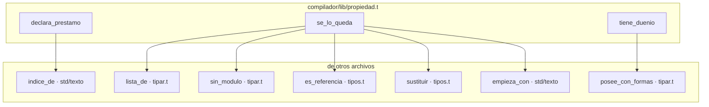

## compilador/lib/tipar.t

```mermaid
graph TD
    subgraph compilador_lib_tipar["compilador/lib/tipar.t"]
        compilador_lib_tipar__anotado_crudo["anotado_crudo"]
        compilador_lib_tipar__buscar["buscar"]
        compilador_lib_tipar__declarar["declarar"]
        compilador_lib_tipar__firma_de_funcion["firma_de_funcion"]
        compilador_lib_tipar__funcion_de_cierre["funcion_de_cierre"]
        compilador_lib_tipar__nombre_resuelto["nombre_resuelto"]
        compilador_lib_tipar__posee_con_formas["posee_con_formas"]
        compilador_lib_tipar__redimensionar_ambitos["redimensionar_ambitos"]
        compilador_lib_tipar__tipo_atrapado["tipo_atrapado"]
        compilador_lib_tipar__tipo_cuenta["tipo_cuenta"]
        compilador_lib_tipar__tipo_de["tipo_de"]
        compilador_lib_tipar__tipo_de_campo["tipo_de_campo"]
        compilador_lib_tipar__tipo_de_llamada["tipo_de_llamada"]
        compilador_lib_tipar__tipos_de_aplicacion["tipos_de_aplicacion"]
    end
    subgraph fuera["de otros archivos"]
        compilador_lib_tipos__apuntado_si["apuntado_si · tipos.t"]
        compilador_lib_tipos__base_de_aplicacion["base_de_aplicacion · tipos.t"]
        compilador_lib_tipos__con_partes["con_partes · tipos.t"]
        compilador_lib_tipos__conocido["conocido · tipos.t"]
        compilador_lib_tipos__elemento["elemento · tipos.t"]
        compilador_lib_tipos__es_aplicacion["es_aplicacion · tipos.t"]
        compilador_lib_tipos__es_arreglo["es_arreglo · tipos.t"]
        compilador_lib_tipos__es_bloque["es_bloque · tipos.t"]
        compilador_lib_tipos__es_funcion["es_funcion · tipos.t"]
        compilador_lib_tipos__es_lista["es_lista · tipos.t"]
        compilador_lib_tipos__es_mapa["es_mapa · tipos.t"]
        compilador_lib_tipos__es_referencia["es_referencia · tipos.t"]
        compilador_lib_tipos__escribir_de_mapa["escribir_de_mapa · tipos.t"]
        compilador_lib_tipos__escribir_tipo["escribir_tipo · tipos.t"]
        compilador_lib_tipos__hacer_arreglo["hacer_arreglo · tipos.t"]
        compilador_lib_tipos__hacer_lista["hacer_lista · tipos.t"]
        compilador_lib_tipos__hacer_prestado["hacer_prestado · tipos.t"]
        compilador_lib_tipos__hacer_prestado_mut["hacer_prestado_mut · tipos.t"]
        compilador_lib_tipos__hacer_rango["hacer_rango · tipos.t"]
        compilador_lib_tipos__leer_tipo["leer_tipo · tipos.t"]
        compilador_lib_tipos__ligar_tipo["ligar_tipo · tipos.t"]
        compilador_lib_tipos__ninguno["ninguno · tipos.t"]
        compilador_lib_tipos__nombre_de_copia["nombre_de_copia · tipos.t"]
        compilador_lib_tipos__partes["partes · tipos.t"]
        compilador_lib_tipos__partes_de_funcion["partes_de_funcion · tipos.t"]
        compilador_lib_tipos__posee_en["posee_en · tipos.t"]
        compilador_lib_tipos__sustituir["sustituir · tipos.t"]
        compilador_lib_tipos__sustituir_tipo["sustituir_tipo · tipos.t"]
        compilador_lib_tipos__tipo_de_mapa["tipo_de_mapa · tipos.t"]
        compilador_lib_tipos__tipos_de_mapa["tipos_de_mapa · tipos.t"]
        std_texto__contiene["contiene · std/texto"]
        std_texto__empieza_con["empieza_con · std/texto"]
    end

    compilador_lib_tipar__anotado_crudo --> compilador_lib_tipos__escribir_de_mapa
    compilador_lib_tipar__anotado_crudo --> compilador_lib_tipos__escribir_tipo
    compilador_lib_tipar__anotado_crudo --> compilador_lib_tipos__ninguno
    compilador_lib_tipar__buscar --> compilador_lib_tipos__escribir_de_mapa
    compilador_lib_tipar__buscar --> compilador_lib_tipos__escribir_tipo
    compilador_lib_tipar__buscar --> compilador_lib_tipos__ninguno
    compilador_lib_tipar__declarar --> compilador_lib_tipos__leer_tipo
    compilador_lib_tipar__firma_de_funcion --> compilador_lib_tipos__escribir_de_mapa
    compilador_lib_tipar__firma_de_funcion --> compilador_lib_tipos__escribir_tipo
    compilador_lib_tipar__firma_de_funcion --> compilador_lib_tipos__ninguno
    compilador_lib_tipar__firma_de_funcion --> compilador_lib_tipos__tipos_de_mapa
    compilador_lib_tipar__funcion_de_cierre --> std_texto__empieza_con
    compilador_lib_tipar__nombre_resuelto --> compilador_lib_tipos__base_de_aplicacion
    compilador_lib_tipar__nombre_resuelto --> compilador_lib_tipos__con_partes
    compilador_lib_tipar__nombre_resuelto --> compilador_lib_tipos__es_aplicacion
    compilador_lib_tipar__nombre_resuelto --> compilador_lib_tipos__es_arreglo
    compilador_lib_tipar__nombre_resuelto --> compilador_lib_tipos__es_bloque
    compilador_lib_tipar__nombre_resuelto --> compilador_lib_tipos__es_lista
    compilador_lib_tipar__nombre_resuelto --> compilador_lib_tipos__es_mapa
    compilador_lib_tipar__nombre_resuelto --> compilador_lib_tipos__es_referencia
    compilador_lib_tipar__nombre_resuelto --> compilador_lib_tipos__nombre_de_copia
    compilador_lib_tipar__nombre_resuelto --> compilador_lib_tipos__partes
    compilador_lib_tipar__nombre_resuelto --> std_texto__contiene
    compilador_lib_tipar__posee_con_formas --> compilador_lib_tipos__leer_tipo
    compilador_lib_tipar__posee_con_formas --> compilador_lib_tipos__posee_en
    compilador_lib_tipar__redimensionar_ambitos --> compilador_lib_tipos__ninguno
    compilador_lib_tipar__redimensionar_ambitos --> compilador_lib_tipos__tipo_de_mapa
    compilador_lib_tipar__tipo_atrapado --> compilador_lib_tipos__hacer_prestado
    compilador_lib_tipar__tipo_cuenta --> compilador_lib_tipos__escribir_tipo
    compilador_lib_tipar__tipo_de --> compilador_lib_tipos__apuntado_si
    compilador_lib_tipar__tipo_de --> compilador_lib_tipos__base_de_aplicacion
    compilador_lib_tipar__tipo_de --> compilador_lib_tipos__conocido
    compilador_lib_tipar__tipo_de --> compilador_lib_tipos__elemento
    compilador_lib_tipar__tipo_de --> compilador_lib_tipos__es_aplicacion
    compilador_lib_tipar__tipo_de --> compilador_lib_tipos__escribir_tipo
    compilador_lib_tipar__tipo_de --> compilador_lib_tipos__hacer_arreglo
    compilador_lib_tipar__tipo_de --> compilador_lib_tipos__hacer_rango
    compilador_lib_tipar__tipo_de --> compilador_lib_tipos__leer_tipo
    compilador_lib_tipar__tipo_de --> compilador_lib_tipos__ninguno
    compilador_lib_tipar__tipo_de --> std_texto__contiene
    compilador_lib_tipar__tipo_de --> std_texto__empieza_con
    compilador_lib_tipar__tipo_de_campo --> compilador_lib_tipos__base_de_aplicacion
    compilador_lib_tipar__tipo_de_campo --> compilador_lib_tipos__es_aplicacion
    compilador_lib_tipar__tipo_de_campo --> compilador_lib_tipos__escribir_tipo
    compilador_lib_tipar__tipo_de_llamada --> compilador_lib_tipos__apuntado_si
    compilador_lib_tipar__tipo_de_llamada --> compilador_lib_tipos__es_funcion
    compilador_lib_tipar__tipo_de_llamada --> compilador_lib_tipos__escribir_de_mapa
    compilador_lib_tipar__tipo_de_llamada --> compilador_lib_tipos__escribir_tipo
    compilador_lib_tipar__tipo_de_llamada --> compilador_lib_tipos__hacer_lista
    compilador_lib_tipar__tipo_de_llamada --> compilador_lib_tipos__hacer_prestado
    compilador_lib_tipar__tipo_de_llamada --> compilador_lib_tipos__hacer_prestado_mut
    compilador_lib_tipar__tipo_de_llamada --> compilador_lib_tipos__ligar_tipo
    compilador_lib_tipar__tipo_de_llamada --> compilador_lib_tipos__ninguno
    compilador_lib_tipar__tipo_de_llamada --> compilador_lib_tipos__partes
    compilador_lib_tipar__tipo_de_llamada --> compilador_lib_tipos__partes_de_funcion
    compilador_lib_tipar__tipo_de_llamada --> compilador_lib_tipos__sustituir
    compilador_lib_tipar__tipo_de_llamada --> compilador_lib_tipos__tipos_de_mapa
    compilador_lib_tipar__tipos_de_aplicacion --> compilador_lib_tipos__base_de_aplicacion
    compilador_lib_tipar__tipos_de_aplicacion --> compilador_lib_tipos__escribir_tipo
    compilador_lib_tipar__tipos_de_aplicacion --> compilador_lib_tipos__partes
    compilador_lib_tipar__tipos_de_aplicacion --> compilador_lib_tipos__sustituir_tipo
```

## compilador/lib/tipos.t

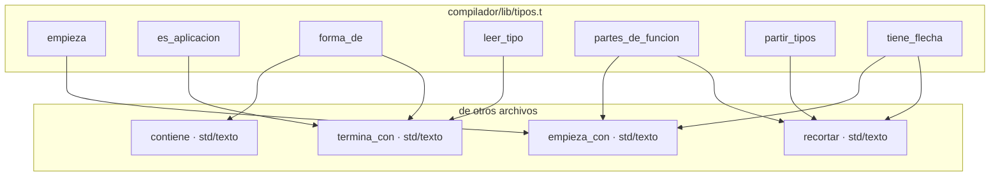

## compilador/tcodec.t

```mermaid
graph TD
    subgraph compilador_tcodec["compilador/tcodec.t"]
        compilador_tcodec__ajustar_contextos["ajustar_contextos"]
        compilador_tcodec__apuntar_nombres["apuntar_nombres"]
        compilador_tcodec__apuntar_tipo_funcion["apuntar_tipo_funcion"]
        compilador_tcodec__aritmetica_usada["aritmetica_usada"]
        compilador_tcodec__ayudante_escribir_archivo["ayudante_escribir_archivo"]
        compilador_tcodec__ayudante_leer_archivo["ayudante_leer_archivo"]
        compilador_tcodec__ayudante_leer_parte_archivo["ayudante_leer_parte_archivo"]
        compilador_tcodec__con_prefijo["con_prefijo"]
        compilador_tcodec__construir["construir"]
        compilador_tcodec__copia_de["copia_de"]
        compilador_tcodec__copiar_sustituido["copiar_sustituido"]
        compilador_tcodec__cuerpo_copiador["cuerpo_copiador"]
        compilador_tcodec__cuerpo_enum_c["cuerpo_enum_c"]
        compilador_tcodec__declarar_tipos["declarar_tipos"]
        compilador_tcodec__definir_tipo_c["definir_tipo_c"]
        compilador_tcodec__definir_tipos["definir_tipos"]
        compilador_tcodec__dependencias_de_agregado["dependencias_de_agregado"]
        compilador_tcodec__descubrir["descubrir"]
        compilador_tcodec__emitir_funcion["emitir_funcion"]
        compilador_tcodec__ensamblar_c["ensamblar_c"]
        compilador_tcodec__envolver_arreglo_c["envolver_arreglo_c"]
        compilador_tcodec__es_compuesto_t["es_compuesto_t"]
        compilador_tcodec__escribir_de_una_vez["escribir_de_una_vez"]
        compilador_tcodec__formatear_archivo["formatear_archivo"]
        compilador_tcodec__funcion_bloque["funcion_bloque"]
        compilador_tcodec__funcion_mapa["funcion_mapa"]
        compilador_tcodec__funcion_ordenar["funcion_ordenar"]
        compilador_tcodec__funcion_push["funcion_push"]
        compilador_tcodec__generar_copiadores["generar_copiadores"]
        compilador_tcodec__generar_funciones["generar_funciones"]
        compilador_tcodec__generar_soporte["generar_soporte"]
        compilador_tcodec__internas_del_sistema["internas_del_sistema"]
        compilador_tcodec__leer_opciones["leer_opciones"]
        compilador_tcodec__leer_programa["leer_programa"]
        compilador_tcodec__linea_arreglo["linea_arreglo"]
        compilador_tcodec__lineas_liberacion["lineas_liberacion"]
        compilador_tcodec__locales_de["locales_de"]
        compilador_tcodec__main["main"]
        compilador_tcodec__mirar_bloque["mirar_bloque"]
        compilador_tcodec__mirar_funcion["mirar_funcion"]
        compilador_tcodec__mirar_tapadas["mirar_tapadas"]
        compilador_tcodec__mirar_tipo["mirar_tipo"]
        compilador_tcodec__necesita_copiador["necesita_copiador"]
        compilador_tcodec__nodo_instancia["nodo_instancia"]
        compilador_tcodec__nombre_de_declaracion["nombre_de_declaracion"]
        compilador_tcodec__nombre_de_param["nombre_de_param"]
        compilador_tcodec__nombres_con_raya["nombres_con_raya"]
        compilador_tcodec__numerar_cierres["numerar_cierres"]
        compilador_tcodec__poner_typedef["poner_typedef"]
        compilador_tcodec__preparar_cierres["preparar_cierres"]
        compilador_tcodec__preparar_instancias["preparar_instancias"]
        compilador_tcodec__programa_no_leido["programa_no_leido"]
        compilador_tcodec__prototipo_externo["prototipo_externo"]
        compilador_tcodec__raiz_instalada["raiz_instalada"]
        compilador_tcodec__registrar_resultado["registrar_resultado"]
        compilador_tcodec__resolver["resolver"]
        compilador_tcodec__resolver_en_nodo["resolver_en_nodo"]
        compilador_tcodec__resolver_reg["resolver_reg"]
        compilador_tcodec__resultados_de_internas["resultados_de_internas"]
        compilador_tcodec__revisar_nombres["revisar_nombres"]
        compilador_tcodec__revisar_usos_generados["revisar_usos_generados"]
        compilador_tcodec__sin_pedir["sin_pedir"]
        compilador_tcodec__soltar_enums["soltar_enums"]
        compilador_tcodec__soltar_structs["soltar_structs"]
        compilador_tcodec__tipo_de_nombre_mapa["tipo_de_nombre_mapa"]
        compilador_tcodec__tipo_obtener["tipo_obtener"]
        compilador_tcodec__tipos_funcion_de["tipos_funcion_de"]
        compilador_tcodec__tipos_funcion_usados["tipos_funcion_usados"]
        compilador_tcodec__typedef_resultado["typedef_resultado"]
        compilador_tcodec__visitar["visitar"]
        compilador_tcodec__visitar_struct["visitar_struct"]
    end
    subgraph fuera["de otros archivos"]
        compilador_lib_comprobar__comprobar_programa["comprobar_programa · comprobar.t"]
        compilador_lib_comprobar__nombra_interna["nombra_interna · comprobar.t"]
        compilador_lib_formato__formatear["formatear · formato.t"]
        compilador_lib_generar__cuerpo["cuerpo · generar.t"]
        compilador_lib_generar__escrito["escrito · generar.t"]
        compilador_lib_generar__etiqueta["etiqueta · generar.t"]
        compilador_lib_generar__legible_c["legible_c · generar.t"]
        compilador_lib_generar__liberacion["liberacion · generar.t"]
        compilador_lib_generar__mangle["mangle · generar.t"]
        compilador_lib_generar__nombre_declarado["nombre_declarado · generar.t"]
        compilador_lib_generar__tipo_c["tipo_c · generar.t"]
        compilador_lib_generar__tipo_escrito["tipo_escrito · generar.t"]
        compilador_lib_generar__tipo_resultado["tipo_resultado · generar.t"]
        compilador_lib_programa__cuenta_nueva["cuenta_nueva · programa.t"]
        compilador_lib_programa__es_generica["es_generica · programa.t"]
        compilador_lib_programa__generar_funcion["generar_funcion · programa.t"]
        compilador_lib_programa__nombre_de["nombre_de · programa.t"]
        compilador_lib_programa__normalizar["normalizar · programa.t"]
        compilador_lib_programa__prefijo_unico["prefijo_unico · programa.t"]
        compilador_lib_programa__preparar_con_error["preparar_con_error · programa.t"]
        compilador_lib_programa__quitar_alias_de_tipos["quitar_alias_de_tipos · programa.t"]
        compilador_lib_programa__recoger_firmas["recoger_firmas · programa.t"]
        compilador_lib_programa__tipo_pelado["tipo_pelado · programa.t"]
        compilador_lib_tipar__abrir["abrir · tipar.t"]
        compilador_lib_tipar__antes_del_punto["antes_del_punto · tipar.t"]
        compilador_lib_tipar__cerrar["cerrar · tipar.t"]
        compilador_lib_tipar__contexto["contexto · tipar.t"]
        compilador_lib_tipar__declarar["declarar · tipar.t"]
        compilador_lib_tipar__firma_de_funcion["firma_de_funcion · tipar.t"]
        compilador_lib_tipar__funcion_de_cierre["funcion_de_cierre · tipar.t"]
        compilador_lib_tipar__lista_de["lista_de · tipar.t"]
        compilador_lib_tipar__nombre_resuelto["nombre_resuelto · tipar.t"]
        compilador_lib_tipar__posee_con_formas["posee_con_formas · tipar.t"]
        compilador_lib_tipar__tipo_de["tipo_de · tipar.t"]
        compilador_lib_tipos__apuntado_si["apuntado_si · tipos.t"]
        compilador_lib_tipos__arreglos_dentro["arreglos_dentro · tipos.t"]
        compilador_lib_tipos__base_de_aplicacion["base_de_aplicacion · tipos.t"]
        compilador_lib_tipos__con_partes["con_partes · tipos.t"]
        compilador_lib_tipos__elemento["elemento · tipos.t"]
        compilador_lib_tipos__es_aplicacion["es_aplicacion · tipos.t"]
        compilador_lib_tipos__es_arreglo["es_arreglo · tipos.t"]
        compilador_lib_tipos__es_bloque["es_bloque · tipos.t"]
        compilador_lib_tipos__es_de_nombre["es_de_nombre · tipos.t"]
        compilador_lib_tipos__es_funcion["es_funcion · tipos.t"]
        compilador_lib_tipos__es_lista["es_lista · tipos.t"]
        compilador_lib_tipos__es_mapa["es_mapa · tipos.t"]
        compilador_lib_tipos__es_referencia["es_referencia · tipos.t"]
        compilador_lib_tipos__escribir_tipo["escribir_tipo · tipos.t"]
        compilador_lib_tipos__hacer_lista["hacer_lista · tipos.t"]
        compilador_lib_tipos__hacer_prestado["hacer_prestado · tipos.t"]
        compilador_lib_tipos__hacer_prestado_mut["hacer_prestado_mut · tipos.t"]
        compilador_lib_tipos__leer_tipos["leer_tipos · tipos.t"]
        compilador_lib_tipos__lleva_bloque_o_arreglo["lleva_bloque_o_arreglo · tipos.t"]
        compilador_lib_tipos__nombre_de_copia["nombre_de_copia · tipos.t"]
        compilador_lib_tipos__partes["partes · tipos.t"]
        compilador_lib_tipos__partes_de_arreglo["partes_de_arreglo · tipos.t"]
        compilador_lib_tipos__partes_de_funcion["partes_de_funcion · tipos.t"]
        compilador_lib_tipos__sin_alias_tipo["sin_alias_tipo · tipos.t"]
        compilador_lib_tipos__sustituir["sustituir · tipos.t"]
        compilador_lib_tipos__tipos_de_mapa["tipos_de_mapa · tipos.t"]
        lexer_lib_sintaxis__carpeta["carpeta · sintaxis.t"]
        lexer_lib_sintaxis__leidos_en["leidos_en · sintaxis.t"]
        lexer_lib_sintaxis__rama["rama · sintaxis.t"]
        std_archivo__borrar["borrar · std/archivo"]
        std_archivo__es_archivo["es_archivo · std/archivo"]
        std_archivo__instalar["instalar · std/archivo"]
        std_archivo__misma_ruta["misma_ruta · std/archivo"]
        std_archivo__ruta_real["ruta_real · std/archivo"]
        std_archivo__temporal_junto["temporal_junto · std/archivo"]
        std_entorno__directorio_temporal["directorio_temporal · std/entorno"]
        std_proceso__ejecutar["ejecutar · std/proceso"]
        std_texto__a_entero["a_entero · std/texto"]
        std_texto__contiene["contiene · std/texto"]
        std_texto__empieza_con["empieza_con · std/texto"]
        std_texto__recortar["recortar · std/texto"]
        std_texto__reemplazar["reemplazar · std/texto"]
        std_texto__termina_con["termina_con · std/texto"]
    end

    compilador_tcodec__ajustar_contextos --> compilador_lib_programa__prefijo_unico
    compilador_tcodec__ajustar_contextos --> compilador_lib_tipar__lista_de
    compilador_tcodec__ajustar_contextos --> compilador_lib_tipos__tipos_de_mapa
    compilador_tcodec__ajustar_contextos --> lexer_lib_sintaxis__carpeta
    compilador_tcodec__apuntar_nombres --> compilador_lib_tipos__es_de_nombre
    compilador_tcodec__apuntar_tipo_funcion --> compilador_lib_tipos__apuntado_si
    compilador_tcodec__apuntar_tipo_funcion --> compilador_lib_tipos__es_funcion
    compilador_tcodec__apuntar_tipo_funcion --> compilador_lib_tipos__partes_de_funcion
    compilador_tcodec__aritmetica_usada --> compilador_lib_generar__tipo_c
    compilador_tcodec__aritmetica_usada --> std_texto__empieza_con
    compilador_tcodec__ayudante_escribir_archivo --> compilador_lib_generar__tipo_resultado
    compilador_tcodec__ayudante_leer_archivo --> compilador_lib_generar__tipo_resultado
    compilador_tcodec__ayudante_leer_parte_archivo --> compilador_lib_generar__tipo_resultado
    compilador_tcodec__con_prefijo --> std_texto__empieza_con
    compilador_tcodec__construir --> std_archivo__borrar
    compilador_tcodec__construir --> std_archivo__es_archivo
    compilador_tcodec__construir --> std_archivo__instalar
    compilador_tcodec__construir --> std_archivo__misma_ruta
    compilador_tcodec__construir --> std_archivo__ruta_real
    compilador_tcodec__construir --> std_archivo__temporal_junto
    compilador_tcodec__construir --> std_entorno__directorio_temporal
    compilador_tcodec__construir --> std_proceso__ejecutar
    compilador_tcodec__construir --> std_texto__contiene
    compilador_tcodec__construir --> std_texto__recortar
    compilador_tcodec__construir --> std_texto__termina_con
    compilador_tcodec__copia_de --> compilador_lib_generar__mangle
    compilador_tcodec__copia_de --> compilador_lib_tipar__posee_con_formas
    compilador_tcodec__copiar_sustituido --> compilador_lib_tipos__sustituir
    compilador_tcodec__copiar_sustituido --> lexer_lib_sintaxis__rama
    compilador_tcodec__cuerpo_copiador --> compilador_lib_generar__etiqueta
    compilador_tcodec__cuerpo_copiador --> compilador_lib_generar__mangle
    compilador_tcodec__cuerpo_copiador --> compilador_lib_generar__tipo_c
    compilador_tcodec__cuerpo_copiador --> compilador_lib_tipar__posee_con_formas
    compilador_tcodec__cuerpo_copiador --> compilador_lib_tipos__elemento
    compilador_tcodec__cuerpo_copiador --> compilador_lib_tipos__es_arreglo
    compilador_tcodec__cuerpo_copiador --> compilador_lib_tipos__es_bloque
    compilador_tcodec__cuerpo_copiador --> compilador_lib_tipos__es_lista
    compilador_tcodec__cuerpo_copiador --> compilador_lib_tipos__es_mapa
    compilador_tcodec__cuerpo_copiador --> compilador_lib_tipos__partes
    compilador_tcodec__cuerpo_copiador --> compilador_lib_tipos__partes_de_arreglo
    compilador_tcodec__cuerpo_enum_c --> compilador_lib_generar__tipo_c
    compilador_tcodec__declarar_tipos --> compilador_lib_generar__etiqueta
    compilador_tcodec__declarar_tipos --> compilador_lib_generar__tipo_c
    compilador_tcodec__declarar_tipos --> compilador_lib_tipos__es_arreglo
    compilador_tcodec__definir_tipo_c --> compilador_lib_generar__tipo_c
    compilador_tcodec__definir_tipo_c --> compilador_lib_tipos__es_arreglo
    compilador_tcodec__definir_tipos --> compilador_lib_tipar__posee_con_formas
    compilador_tcodec__definir_tipos --> compilador_lib_tipos__arreglos_dentro
    compilador_tcodec__dependencias_de_agregado --> compilador_lib_tipos__elemento
    compilador_tcodec__dependencias_de_agregado --> compilador_lib_tipos__es_bloque
    compilador_tcodec__dependencias_de_agregado --> compilador_lib_tipos__es_lista
    compilador_tcodec__dependencias_de_agregado --> compilador_lib_tipos__partes
    compilador_tcodec__descubrir --> compilador_lib_programa__cuenta_nueva
    compilador_tcodec__descubrir --> compilador_lib_programa__generar_funcion
    compilador_tcodec__descubrir --> compilador_lib_tipos__leer_tipos
    compilador_tcodec__emitir_funcion --> compilador_lib_programa__generar_funcion
    compilador_tcodec__emitir_funcion --> std_texto__empieza_con
    compilador_tcodec__ensamblar_c --> std_texto__contiene
    compilador_tcodec__ensamblar_c --> std_texto__empieza_con
    compilador_tcodec__ensamblar_c --> std_texto__termina_con
    compilador_tcodec__envolver_arreglo_c --> compilador_lib_tipos__es_arreglo
    compilador_tcodec__envolver_arreglo_c --> compilador_lib_tipos__partes_de_arreglo
    compilador_tcodec__es_compuesto_t --> compilador_lib_tipos__es_arreglo
    compilador_tcodec__es_compuesto_t --> compilador_lib_tipos__es_bloque
    compilador_tcodec__es_compuesto_t --> compilador_lib_tipos__es_lista
    compilador_tcodec__es_compuesto_t --> compilador_lib_tipos__es_mapa
    compilador_tcodec__escribir_de_una_vez --> std_archivo__borrar
    compilador_tcodec__escribir_de_una_vez --> std_archivo__instalar
    compilador_tcodec__escribir_de_una_vez --> std_archivo__ruta_real
    compilador_tcodec__escribir_de_una_vez --> std_archivo__temporal_junto
    compilador_tcodec__formatear_archivo --> compilador_lib_formato__formatear
    compilador_tcodec__funcion_bloque --> compilador_lib_generar__mangle
    compilador_tcodec__funcion_bloque --> compilador_lib_generar__tipo_c
    compilador_tcodec__funcion_bloque --> compilador_lib_tipar__posee_con_formas
    compilador_tcodec__funcion_bloque --> compilador_lib_tipos__elemento
    compilador_tcodec__funcion_mapa --> compilador_lib_generar__mangle
    compilador_tcodec__funcion_mapa --> compilador_lib_generar__tipo_c
    compilador_tcodec__funcion_mapa --> compilador_lib_generar__tipo_resultado
    compilador_tcodec__funcion_mapa --> compilador_lib_tipar__posee_con_formas
    compilador_tcodec__funcion_mapa --> compilador_lib_tipos__hacer_lista
    compilador_tcodec__funcion_mapa --> compilador_lib_tipos__hacer_prestado_mut
    compilador_tcodec__funcion_mapa --> compilador_lib_tipos__partes
    compilador_tcodec__funcion_ordenar --> compilador_lib_generar__mangle
    compilador_tcodec__funcion_ordenar --> compilador_lib_generar__tipo_c
    compilador_tcodec__funcion_ordenar --> compilador_lib_tipos__elemento
    compilador_tcodec__funcion_push --> compilador_lib_generar__mangle
    compilador_tcodec__funcion_push --> compilador_lib_generar__tipo_c
    compilador_tcodec__funcion_push --> compilador_lib_tipos__elemento
    compilador_tcodec__generar_copiadores --> compilador_lib_generar__mangle
    compilador_tcodec__generar_copiadores --> compilador_lib_generar__tipo_c
    compilador_tcodec__generar_copiadores --> compilador_lib_tipar__nombre_resuelto
    compilador_tcodec__generar_funciones --> compilador_lib_programa__es_generica
    compilador_tcodec__generar_soporte --> compilador_lib_programa__cuenta_nueva
    compilador_tcodec__internas_del_sistema --> compilador_lib_generar__tipo_resultado
    compilador_tcodec__internas_del_sistema --> std_texto__reemplazar
    compilador_tcodec__leer_opciones --> std_archivo__es_archivo
    compilador_tcodec__leer_opciones --> std_texto__empieza_con
    compilador_tcodec__leer_programa --> compilador_lib_programa__es_generica
    compilador_tcodec__leer_programa --> compilador_lib_programa__nombre_de
    compilador_tcodec__leer_programa --> compilador_lib_programa__normalizar
    compilador_tcodec__leer_programa --> compilador_lib_programa__preparar_con_error
    compilador_tcodec__leer_programa --> compilador_lib_programa__quitar_alias_de_tipos
    compilador_tcodec__leer_programa --> compilador_lib_programa__recoger_firmas
    compilador_tcodec__leer_programa --> compilador_lib_programa__tipo_pelado
    compilador_tcodec__leer_programa --> compilador_lib_tipar__contexto
    compilador_tcodec__leer_programa --> compilador_lib_tipos__lleva_bloque_o_arreglo
    compilador_tcodec__leer_programa --> compilador_lib_tipos__sin_alias_tipo
    compilador_tcodec__leer_programa --> lexer_lib_sintaxis__leidos_en
    compilador_tcodec__leer_programa --> lexer_lib_sintaxis__rama
    compilador_tcodec__linea_arreglo --> compilador_lib_generar__tipo_c
    compilador_tcodec__linea_arreglo --> compilador_lib_tipos__partes_de_arreglo
    compilador_tcodec__lineas_liberacion --> compilador_lib_generar__cuerpo
    compilador_tcodec__lineas_liberacion --> compilador_lib_generar__liberacion
    compilador_tcodec__locales_de --> std_texto__recortar
    compilador_tcodec__main --> compilador_lib_comprobar__comprobar_programa
    compilador_tcodec__main --> compilador_lib_programa__es_generica
    compilador_tcodec__main --> compilador_lib_programa__tipo_pelado
    compilador_tcodec__mirar_bloque --> compilador_lib_generar__nombre_declarado
    compilador_tcodec__mirar_bloque --> compilador_lib_generar__tipo_escrito
    compilador_tcodec__mirar_bloque --> compilador_lib_tipar__abrir
    compilador_tcodec__mirar_bloque --> compilador_lib_tipar__cerrar
    compilador_tcodec__mirar_bloque --> compilador_lib_tipar__declarar
    compilador_tcodec__mirar_bloque --> compilador_lib_tipar__tipo_de
    compilador_tcodec__mirar_bloque --> compilador_lib_tipos__escribir_tipo
    compilador_tcodec__mirar_funcion --> compilador_lib_programa__nombre_de
    compilador_tcodec__mirar_funcion --> compilador_lib_programa__tipo_pelado
    compilador_tcodec__mirar_funcion --> compilador_lib_tipar__abrir
    compilador_tcodec__mirar_funcion --> compilador_lib_tipar__cerrar
    compilador_tcodec__mirar_funcion --> compilador_lib_tipar__declarar
    compilador_tcodec__mirar_tapadas --> std_texto__recortar
    compilador_tcodec__mirar_tipo --> compilador_lib_tipar__nombre_resuelto
    compilador_tcodec__mirar_tipo --> compilador_lib_tipos__elemento
    compilador_tcodec__mirar_tipo --> compilador_lib_tipos__es_arreglo
    compilador_tcodec__mirar_tipo --> compilador_lib_tipos__es_bloque
    compilador_tcodec__mirar_tipo --> compilador_lib_tipos__es_lista
    compilador_tcodec__mirar_tipo --> compilador_lib_tipos__es_mapa
    compilador_tcodec__mirar_tipo --> compilador_lib_tipos__es_referencia
    compilador_tcodec__mirar_tipo --> compilador_lib_tipos__hacer_lista
    compilador_tcodec__mirar_tipo --> compilador_lib_tipos__hacer_prestado_mut
    compilador_tcodec__mirar_tipo --> compilador_lib_tipos__lleva_bloque_o_arreglo
    compilador_tcodec__mirar_tipo --> compilador_lib_tipos__partes
    compilador_tcodec__mirar_tipo --> compilador_lib_tipos__partes_de_arreglo
    compilador_tcodec__mirar_tipo --> std_texto__contiene
    compilador_tcodec__necesita_copiador --> compilador_lib_tipar__lista_de
    compilador_tcodec__necesita_copiador --> compilador_lib_tipar__posee_con_formas
    compilador_tcodec__necesita_copiador --> compilador_lib_tipos__elemento
    compilador_tcodec__necesita_copiador --> compilador_lib_tipos__es_arreglo
    compilador_tcodec__necesita_copiador --> compilador_lib_tipos__es_bloque
    compilador_tcodec__necesita_copiador --> compilador_lib_tipos__es_lista
    compilador_tcodec__necesita_copiador --> compilador_lib_tipos__es_mapa
    compilador_tcodec__necesita_copiador --> compilador_lib_tipos__escribir_tipo
    compilador_tcodec__necesita_copiador --> compilador_lib_tipos__partes
    compilador_tcodec__necesita_copiador --> compilador_lib_tipos__partes_de_arreglo
    compilador_tcodec__necesita_copiador --> compilador_lib_tipos__tipos_de_mapa
    compilador_tcodec__nodo_instancia --> lexer_lib_sintaxis__rama
    compilador_tcodec__nombre_de_declaracion --> std_texto__recortar
    compilador_tcodec__nombre_de_param --> std_texto__recortar
    compilador_tcodec__nombres_con_raya --> compilador_lib_tipos__es_de_nombre
    compilador_tcodec__numerar_cierres --> lexer_lib_sintaxis__rama
    compilador_tcodec__poner_typedef --> compilador_lib_generar__tipo_c
    compilador_tcodec__poner_typedef --> compilador_lib_tipos__elemento
    compilador_tcodec__poner_typedef --> compilador_lib_tipos__es_bloque
    compilador_tcodec__poner_typedef --> compilador_lib_tipos__es_lista
    compilador_tcodec__poner_typedef --> compilador_lib_tipos__partes
    compilador_tcodec__preparar_cierres --> compilador_lib_programa__es_generica
    compilador_tcodec__preparar_cierres --> compilador_lib_programa__recoger_firmas
    compilador_tcodec__preparar_instancias --> compilador_lib_programa__cuenta_nueva
    compilador_tcodec__preparar_instancias --> compilador_lib_programa__es_generica
    compilador_tcodec__preparar_instancias --> compilador_lib_programa__generar_funcion
    compilador_tcodec__preparar_instancias --> compilador_lib_tipos__leer_tipos
    compilador_tcodec__programa_no_leido --> compilador_lib_tipar__contexto
    compilador_tcodec__prototipo_externo --> compilador_lib_generar__tipo_c
    compilador_tcodec__raiz_instalada --> std_archivo__es_archivo
    compilador_tcodec__raiz_instalada --> std_archivo__ruta_real
    compilador_tcodec__registrar_resultado --> compilador_lib_tipar__nombre_resuelto
    compilador_tcodec__resolver --> compilador_lib_programa__normalizar
    compilador_tcodec__resolver --> std_archivo__es_archivo
    compilador_tcodec__resolver --> std_texto__empieza_con
    compilador_tcodec__resolver --> std_texto__termina_con
    compilador_tcodec__resolver_en_nodo --> compilador_lib_generar__tipo_escrito
    compilador_tcodec__resolver_en_nodo --> compilador_lib_programa__tipo_pelado
    compilador_tcodec__resolver_reg --> compilador_lib_tipos__base_de_aplicacion
    compilador_tcodec__resolver_reg --> compilador_lib_tipos__con_partes
    compilador_tcodec__resolver_reg --> compilador_lib_tipos__es_aplicacion
    compilador_tcodec__resolver_reg --> compilador_lib_tipos__es_arreglo
    compilador_tcodec__resolver_reg --> compilador_lib_tipos__es_bloque
    compilador_tcodec__resolver_reg --> compilador_lib_tipos__es_lista
    compilador_tcodec__resolver_reg --> compilador_lib_tipos__es_mapa
    compilador_tcodec__resolver_reg --> compilador_lib_tipos__es_referencia
    compilador_tcodec__resolver_reg --> compilador_lib_tipos__leer_tipos
    compilador_tcodec__resolver_reg --> compilador_lib_tipos__nombre_de_copia
    compilador_tcodec__resolver_reg --> compilador_lib_tipos__partes
    compilador_tcodec__resolver_reg --> compilador_lib_tipos__sustituir
    compilador_tcodec__resolver_reg --> std_texto__contiene
    compilador_tcodec__resultados_de_internas --> compilador_lib_tipar__funcion_de_cierre
    compilador_tcodec__revisar_nombres --> compilador_lib_generar__escrito
    compilador_tcodec__revisar_nombres --> compilador_lib_generar__legible_c
    compilador_tcodec__revisar_nombres --> compilador_lib_programa__prefijo_unico
    compilador_tcodec__revisar_nombres --> lexer_lib_sintaxis__carpeta
    compilador_tcodec__revisar_usos_generados --> compilador_lib_generar__tipo_c
    compilador_tcodec__revisar_usos_generados --> compilador_lib_generar__tipo_resultado
    compilador_tcodec__revisar_usos_generados --> compilador_lib_tipos__arreglos_dentro
    compilador_tcodec__revisar_usos_generados --> compilador_lib_tipos__partes_de_arreglo
    compilador_tcodec__sin_pedir --> compilador_lib_comprobar__nombra_interna
    compilador_tcodec__sin_pedir --> compilador_lib_tipar__antes_del_punto
    compilador_tcodec__soltar_enums --> compilador_lib_generar__etiqueta
    compilador_tcodec__soltar_enums --> compilador_lib_tipar__posee_con_formas
    compilador_tcodec__soltar_structs --> compilador_lib_generar__cuerpo
    compilador_tcodec__soltar_structs --> compilador_lib_generar__liberacion
    compilador_tcodec__soltar_structs --> compilador_lib_tipar__posee_con_formas
    compilador_tcodec__tipo_de_nombre_mapa --> std_texto__empieza_con
    compilador_tcodec__tipo_obtener --> compilador_lib_tipar__posee_con_formas
    compilador_tcodec__tipo_obtener --> compilador_lib_tipos__hacer_prestado
    compilador_tcodec__tipos_funcion_de --> compilador_lib_programa__tipo_pelado
    compilador_tcodec__tipos_funcion_usados --> compilador_lib_generar__tipo_c
    compilador_tcodec__tipos_funcion_usados --> compilador_lib_programa__es_generica
    compilador_tcodec__tipos_funcion_usados --> compilador_lib_tipar__firma_de_funcion
    compilador_tcodec__tipos_funcion_usados --> compilador_lib_tipos__partes_de_funcion
    compilador_tcodec__tipos_funcion_usados --> std_texto__contiene
    compilador_tcodec__typedef_resultado --> compilador_lib_generar__tipo_c
    compilador_tcodec__typedef_resultado --> compilador_lib_generar__tipo_resultado
    compilador_tcodec__visitar --> lexer_lib_sintaxis__carpeta
    compilador_tcodec__visitar --> std_archivo__es_archivo
    compilador_tcodec__visitar --> std_texto__a_entero
    compilador_tcodec__visitar --> std_texto__contiene
    compilador_tcodec__visitar --> std_texto__empieza_con
    compilador_tcodec__visitar --> std_texto__termina_con
    compilador_tcodec__visitar_struct --> compilador_lib_tipos__es_arreglo
    compilador_tcodec__visitar_struct --> compilador_lib_tipos__partes_de_arreglo
```

## compilador/tipar.t

```mermaid
graph TD
    subgraph compilador_tipar["compilador/tipar.t"]
        compilador_tipar__anotar_propiedad["anotar_propiedad"]
        compilador_tipar__atrapar["atrapar"]
        compilador_tipar__elemento_de_bruto["elemento_de_bruto"]
        compilador_tipar__main["main"]
        compilador_tipar__mirar_modulo["mirar_modulo"]
        compilador_tipar__partir_angulos["partir_angulos"]
        compilador_tipar__primera_de["primera_de"]
        compilador_tipar__programa_o_vacio["programa_o_vacio"]
        compilador_tipar__quitar_prestamo["quitar_prestamo"]
        compilador_tipar__recoger_declaraciones["recoger_declaraciones"]
        compilador_tipar__recorrer["recorrer"]
        compilador_tipar__tipo_con_marca["tipo_con_marca"]
        compilador_tipar__tipo_de_declaracion["tipo_de_declaracion"]
        compilador_tipar__tipo_desnudo["tipo_desnudo"]
        compilador_tipar__try_partir["try_partir"]
        compilador_tipar__valor_de["valor_de"]
    end
    subgraph fuera["de otros archivos"]
        compilador_lib_propiedad__destino_de["destino_de · propiedad.t"]
        compilador_lib_propiedad__mirar["mirar · propiedad.t"]
        compilador_lib_propiedad__tiene_duenio["tiene_duenio · propiedad.t"]
        compilador_lib_propiedad__vigilar["vigilar · propiedad.t"]
        compilador_lib_tipar__abrir["abrir · tipar.t"]
        compilador_lib_tipar__cerrar["cerrar · tipar.t"]
        compilador_lib_tipar__contexto["contexto · tipar.t"]
        compilador_lib_tipar__declarar["declarar · tipar.t"]
        compilador_lib_tipar__nombre_resuelto["nombre_resuelto · tipar.t"]
        compilador_lib_tipar__tipo_atrapado["tipo_atrapado · tipar.t"]
        compilador_lib_tipar__tipo_de["tipo_de · tipar.t"]
        compilador_lib_tipos__escribir_tipo["escribir_tipo · tipos.t"]
        compilador_lib_tipos__leer_tipo["leer_tipo · tipos.t"]
        compilador_lib_tipos__leer_tipos["leer_tipos · tipos.t"]
        compilador_lib_tipos__sin_alias_tipo["sin_alias_tipo · tipos.t"]
        compilador_lib_tipos__tipos_de_mapa["tipos_de_mapa · tipos.t"]
        lexer_lib_sintaxis__enums_visibles["enums_visibles · sintaxis.t"]
        lexer_lib_sintaxis__estado_de["estado_de · sintaxis.t"]
        lexer_lib_sintaxis__hoja["hoja · sintaxis.t"]
        lexer_lib_sintaxis__programa["programa · sintaxis.t"]
        lexer_lib_sintaxis__structs_visibles["structs_visibles · sintaxis.t"]
        std_texto__empieza_con["empieza_con · std/texto"]
        std_texto__indice_de["indice_de · std/texto"]
        std_texto__recortar["recortar · std/texto"]
    end

    compilador_tipar__anotar_propiedad --> compilador_lib_propiedad__destino_de
    compilador_tipar__anotar_propiedad --> compilador_lib_propiedad__mirar
    compilador_tipar__anotar_propiedad --> compilador_lib_propiedad__tiene_duenio
    compilador_tipar__anotar_propiedad --> compilador_lib_propiedad__vigilar
    compilador_tipar__anotar_propiedad --> std_texto__empieza_con
    compilador_tipar__atrapar --> compilador_lib_tipar__declarar
    compilador_tipar__atrapar --> compilador_lib_tipar__tipo_atrapado
    compilador_tipar__atrapar --> compilador_lib_tipos__escribir_tipo
    compilador_tipar__atrapar --> compilador_lib_tipos__tipos_de_mapa
    compilador_tipar__elemento_de_bruto --> std_texto__empieza_con
    compilador_tipar__main --> compilador_lib_tipar__abrir
    compilador_tipar__main --> compilador_lib_tipar__cerrar
    compilador_tipar__main --> compilador_lib_tipar__contexto
    compilador_tipar__main --> compilador_lib_tipar__declarar
    compilador_tipar__main --> compilador_lib_tipar__nombre_resuelto
    compilador_tipar__main --> lexer_lib_sintaxis__enums_visibles
    compilador_tipar__main --> lexer_lib_sintaxis__estado_de
    compilador_tipar__main --> lexer_lib_sintaxis__programa
    compilador_tipar__main --> lexer_lib_sintaxis__structs_visibles
    compilador_tipar__mirar_modulo --> lexer_lib_sintaxis__enums_visibles
    compilador_tipar__mirar_modulo --> lexer_lib_sintaxis__estado_de
    compilador_tipar__mirar_modulo --> lexer_lib_sintaxis__structs_visibles
    compilador_tipar__partir_angulos --> std_texto__recortar
    compilador_tipar__primera_de --> std_texto__empieza_con
    compilador_tipar__programa_o_vacio --> lexer_lib_sintaxis__hoja
    compilador_tipar__programa_o_vacio --> lexer_lib_sintaxis__programa
    compilador_tipar__quitar_prestamo --> std_texto__empieza_con
    compilador_tipar__recoger_declaraciones --> compilador_lib_tipos__leer_tipo
    compilador_tipar__recoger_declaraciones --> compilador_lib_tipos__leer_tipos
    compilador_tipar__recoger_declaraciones --> compilador_lib_tipos__sin_alias_tipo
    compilador_tipar__recorrer --> compilador_lib_tipar__abrir
    compilador_tipar__recorrer --> compilador_lib_tipar__cerrar
    compilador_tipar__recorrer --> compilador_lib_tipar__declarar
    compilador_tipar__recorrer --> compilador_lib_tipar__tipo_de
    compilador_tipar__recorrer --> compilador_lib_tipos__escribir_tipo
    compilador_tipar__tipo_con_marca --> std_texto__recortar
    compilador_tipar__tipo_de_declaracion --> std_texto__empieza_con
    compilador_tipar__tipo_de_declaracion --> std_texto__indice_de
    compilador_tipar__tipo_de_declaracion --> std_texto__recortar
    compilador_tipar__tipo_desnudo --> std_texto__empieza_con
    compilador_tipar__tipo_desnudo --> std_texto__recortar
    compilador_tipar__try_partir --> std_texto__recortar
    compilador_tipar__valor_de --> std_texto__empieza_con
```

## compilador/tipos.t

```mermaid
graph TD
    subgraph compilador_tipos["compilador/tipos.t"]
        compilador_tipos__main["main"]
        compilador_tipos__posee_de["posee_de"]
        compilador_tipos__tras_dos_puntos["tras_dos_puntos"]
    end
    subgraph fuera["de otros archivos"]
        compilador_lib_tipos__con_partes["con_partes · tipos.t"]
        compilador_lib_tipos__escribir_tipo["escribir_tipo · tipos.t"]
        compilador_lib_tipos__leer_tipo["leer_tipo · tipos.t"]
        compilador_lib_tipos__leer_tipos["leer_tipos · tipos.t"]
        compilador_lib_tipos__partes["partes · tipos.t"]
        compilador_lib_tipos__posee_en["posee_en · tipos.t"]
        compilador_lib_tipos__tipo_existe["tipo_existe · tipos.t"]
        lexer_lib_sintaxis__enums_visibles["enums_visibles · sintaxis.t"]
        lexer_lib_sintaxis__estado_de["estado_de · sintaxis.t"]
        lexer_lib_sintaxis__programa["programa · sintaxis.t"]
        lexer_lib_sintaxis__structs_visibles["structs_visibles · sintaxis.t"]
        std_texto__empieza_con["empieza_con · std/texto"]
        std_texto__recortar["recortar · std/texto"]
    end

    compilador_tipos__main --> compilador_lib_tipos__con_partes
    compilador_tipos__main --> compilador_lib_tipos__escribir_tipo
    compilador_tipos__main --> compilador_lib_tipos__leer_tipo
    compilador_tipos__main --> compilador_lib_tipos__leer_tipos
    compilador_tipos__main --> compilador_lib_tipos__partes
    compilador_tipos__main --> compilador_lib_tipos__tipo_existe
    compilador_tipos__main --> lexer_lib_sintaxis__enums_visibles
    compilador_tipos__main --> lexer_lib_sintaxis__estado_de
    compilador_tipos__main --> lexer_lib_sintaxis__programa
    compilador_tipos__main --> lexer_lib_sintaxis__structs_visibles
    compilador_tipos__posee_de --> compilador_lib_tipos__posee_en
    compilador_tipos__tras_dos_puntos --> std_texto__empieza_con
    compilador_tipos__tras_dos_puntos --> std_texto__recortar
```

## lexer/lib/lexico.t

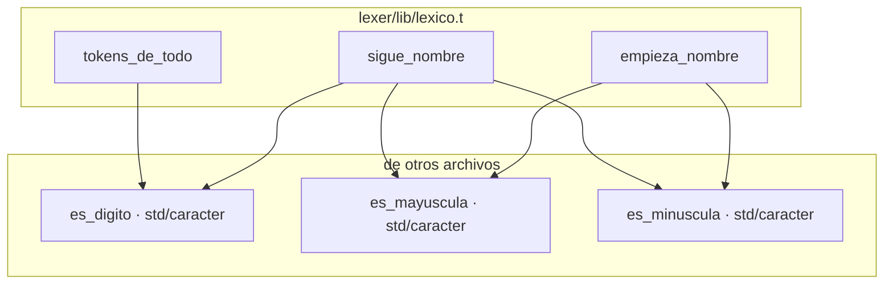

## lexer/lib/sintaxis.t

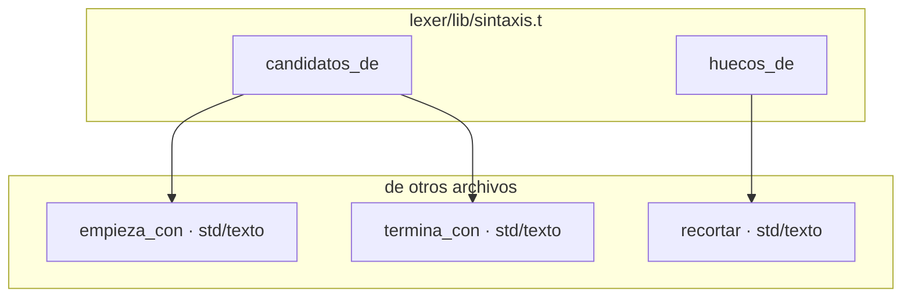

