# Grafo de funciones de los `.t` del repositorio

Generado por `make grafo` (`tests/grafo.py`); no se edita a mano.

**Que cubre:** todos los `.t` de `ejemplos/`, `programas/` y `bench/`,
mas los modulos de `std/` que estos importan (directa o
transitivamente). **No cubre** los `.t` de
`tests/`.

Un diagrama por archivo: sus funciones y las que llama de otros
archivos (cada una con su ruta entera y si esta o no en `tcodec`). Las
llamadas dentro del mismo archivo y las funciones del lenguaje no se
dibujan. Para saber quien llama a una funcion, mira `docs/llamadas.md`.

## ejemplos/binario.t (fuera de tcodec)

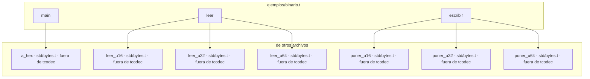

## ejemplos/bloques.t (fuera de tcodec)

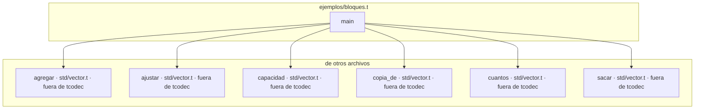

## ejemplos/compilador/cuerpos.t (fuera de tcodec)

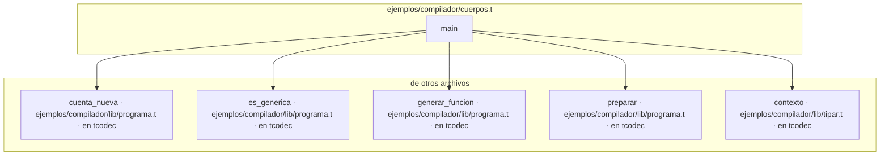

## ejemplos/compilador/expresiones.t (fuera de tcodec)

```mermaid
graph TD
    subgraph ejemplos_compilador_expresiones["ejemplos/compilador/expresiones.t"]
        ejemplos_compilador_expresiones__main["main"]
        ejemplos_compilador_expresiones__marca_de["marca_de"]
        ejemplos_compilador_expresiones__presta["presta"]
        ejemplos_compilador_expresiones__recoger_firmas["recoger_firmas"]
        ejemplos_compilador_expresiones__tipo_pelado["tipo_pelado"]
        ejemplos_compilador_expresiones__tras_dos_puntos["tras_dos_puntos"]
    end
    subgraph fuera["de otros archivos"]
        ejemplos_compilador_lib_generar__cuerpo["cuerpo · ejemplos/compilador/lib/generar.t · en tcodec"]
        ejemplos_compilador_lib_generar__expresion_c["expresion_c · ejemplos/compilador/lib/generar.t · en tcodec"]
        ejemplos_compilador_lib_generar__externas_de["externas_de · ejemplos/compilador/lib/generar.t · en tcodec"]
        ejemplos_compilador_lib_generar__nombres_de_c["nombres_de_c · ejemplos/compilador/lib/generar.t · en tcodec"]
        ejemplos_compilador_lib_generar__renombrar_para_c["renombrar_para_c · ejemplos/compilador/lib/generar.t · en tcodec"]
        ejemplos_compilador_lib_tipar__abrir["abrir · ejemplos/compilador/lib/tipar.t · en tcodec"]
        ejemplos_compilador_lib_tipar__cerrar["cerrar · ejemplos/compilador/lib/tipar.t · en tcodec"]
        ejemplos_compilador_lib_tipar__contexto["contexto · ejemplos/compilador/lib/tipar.t · en tcodec"]
        ejemplos_compilador_lib_tipar__declarar["declarar · ejemplos/compilador/lib/tipar.t · en tcodec"]
        ejemplos_compilador_lib_tipos__leer_tipo["leer_tipo · ejemplos/compilador/lib/tipos.t · en tcodec"]
        ejemplos_compilador_lib_tipos__leer_tipos["leer_tipos · ejemplos/compilador/lib/tipos.t · en tcodec"]
        ejemplos_lexer_lib_lexico__analizar["analizar · ejemplos/lexer/lib/lexico.t · en tcodec"]
        ejemplos_lexer_lib_sintaxis__enums_visibles["enums_visibles · ejemplos/lexer/lib/sintaxis.t · en tcodec"]
        ejemplos_lexer_lib_sintaxis__estado_de["estado_de · ejemplos/lexer/lib/sintaxis.t · en tcodec"]
        ejemplos_lexer_lib_sintaxis__programa["programa · ejemplos/lexer/lib/sintaxis.t · en tcodec"]
        ejemplos_lexer_lib_sintaxis__structs_visibles["structs_visibles · ejemplos/lexer/lib/sintaxis.t · en tcodec"]
        std_texto__empieza_con["empieza_con · std/texto.t · en tcodec"]
        std_texto__recortar["recortar · std/texto.t · en tcodec"]
    end

    ejemplos_compilador_expresiones__main --> ejemplos_compilador_lib_generar__cuerpo
    ejemplos_compilador_expresiones__main --> ejemplos_compilador_lib_generar__expresion_c
    ejemplos_compilador_expresiones__main --> ejemplos_compilador_lib_generar__externas_de
    ejemplos_compilador_expresiones__main --> ejemplos_compilador_lib_generar__nombres_de_c
    ejemplos_compilador_expresiones__main --> ejemplos_compilador_lib_generar__renombrar_para_c
    ejemplos_compilador_expresiones__main --> ejemplos_compilador_lib_tipar__abrir
    ejemplos_compilador_expresiones__main --> ejemplos_compilador_lib_tipar__cerrar
    ejemplos_compilador_expresiones__main --> ejemplos_compilador_lib_tipar__contexto
    ejemplos_compilador_expresiones__main --> ejemplos_compilador_lib_tipar__declarar
    ejemplos_compilador_expresiones__main --> ejemplos_lexer_lib_lexico__analizar
    ejemplos_compilador_expresiones__main --> ejemplos_lexer_lib_sintaxis__enums_visibles
    ejemplos_compilador_expresiones__main --> ejemplos_lexer_lib_sintaxis__estado_de
    ejemplos_compilador_expresiones__main --> ejemplos_lexer_lib_sintaxis__programa
    ejemplos_compilador_expresiones__main --> ejemplos_lexer_lib_sintaxis__structs_visibles
    ejemplos_compilador_expresiones__marca_de --> std_texto__empieza_con
    ejemplos_compilador_expresiones__presta --> std_texto__empieza_con
    ejemplos_compilador_expresiones__recoger_firmas --> ejemplos_compilador_lib_tipos__leer_tipo
    ejemplos_compilador_expresiones__recoger_firmas --> ejemplos_compilador_lib_tipos__leer_tipos
    ejemplos_compilador_expresiones__tipo_pelado --> std_texto__empieza_con
    ejemplos_compilador_expresiones__tras_dos_puntos --> std_texto__recortar
```

## ejemplos/compilador/firmas.t (fuera de tcodec)

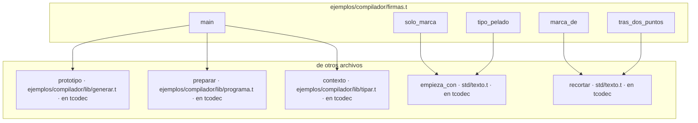

## ejemplos/compilador/lib/comprobar.t (en tcodec)

```mermaid
graph TD
    subgraph ejemplos_compilador_lib_comprobar["ejemplos/compilador/lib/comprobar.t"]
        ejemplos_compilador_lib_comprobar__almacenable["almacenable"]
        ejemplos_compilador_lib_comprobar__avisar_sin_usar["avisar_sin_usar"]
        ejemplos_compilador_lib_comprobar__binaria["binaria"]
        ejemplos_compilador_lib_comprobar__c_tipos_vacio["c_tipos_vacio"]
        ejemplos_compilador_lib_comprobar__campo["campo"]
        ejemplos_compilador_lib_comprobar__campo_de["campo_de"]
        ejemplos_compilador_lib_comprobar__campos_nombres["campos_nombres"]
        ejemplos_compilador_lib_comprobar__campos_tipos["campos_tipos"]
        ejemplos_compilador_lib_comprobar__cierre["cierre"]
        ejemplos_compilador_lib_comprobar__como_mostrar["como_mostrar"]
        ejemplos_compilador_lib_comprobar__comprobar_conversion["comprobar_conversion"]
        ejemplos_compilador_lib_comprobar__comprobar_expresion_sin_anotar["comprobar_expresion_sin_anotar"]
        ejemplos_compilador_lib_comprobar__comprobar_externa["comprobar_externa"]
        ejemplos_compilador_lib_comprobar__comprobar_literal["comprobar_literal"]
        ejemplos_compilador_lib_comprobar__comprobar_mapa_valido["comprobar_mapa_valido"]
        ejemplos_compilador_lib_comprobar__comprobar_match["comprobar_match"]
        ejemplos_compilador_lib_comprobar__comprobar_programa["comprobar_programa"]
        ejemplos_compilador_lib_comprobar__comprobar_restricciones["comprobar_restricciones"]
        ejemplos_compilador_lib_comprobar__con_signo["con_signo"]
        ejemplos_compilador_lib_comprobar__contar_pendientes["contar_pendientes"]
        ejemplos_compilador_lib_comprobar__declarar_patron["declarar_patron"]
        ejemplos_compilador_lib_comprobar__desenvolver["desenvolver"]
        ejemplos_compilador_lib_comprobar__destino_de["destino_de"]
        ejemplos_compilador_lib_comprobar__encaja["encaja"]
        ejemplos_compilador_lib_comprobar__enum_lit["enum_lit"]
        ejemplos_compilador_lib_comprobar__enum_sin_datos["enum_sin_datos"]
        ejemplos_compilador_lib_comprobar__error_solo_lectura["error_solo_lectura"]
        ejemplos_compilador_lib_comprobar__es_compuesto["es_compuesto"]
        ejemplos_compilador_lib_comprobar__es_copiable["es_copiable"]
        ejemplos_compilador_lib_comprobar__es_struct_aplicado["es_struct_aplicado"]
        ejemplos_compilador_lib_comprobar__fijar_literal["fijar_literal"]
        ejemplos_compilador_lib_comprobar__fijar_literal_sin_contar["fijar_literal_sin_contar"]
        ejemplos_compilador_lib_comprobar__firma_valida["firma_valida"]
        ejemplos_compilador_lib_comprobar__formas_de["formas_de"]
        ejemplos_compilador_lib_comprobar__formas_legibles["formas_legibles"]
        ejemplos_compilador_lib_comprobar__funcion_de["funcion_de"]
        ejemplos_compilador_lib_comprobar__funcion_vista["funcion_vista"]
        ejemplos_compilador_lib_comprobar__indice["indice"]
        ejemplos_compilador_lib_comprobar__instanciar["instanciar"]
        ejemplos_compilador_lib_comprobar__interna["interna"]
        ejemplos_compilador_lib_comprobar__interna_anadir["interna_anadir"]
        ejemplos_compilador_lib_comprobar__interna_comparar["interna_comparar"]
        ejemplos_compilador_lib_comprobar__interna_copiar["interna_copiar"]
        ejemplos_compilador_lib_comprobar__interna_intercambiar["interna_intercambiar"]
        ejemplos_compilador_lib_comprobar__interna_largo["interna_largo"]
        ejemplos_compilador_lib_comprobar__interna_mapa["interna_mapa"]
        ejemplos_compilador_lib_comprobar__interna_numeros["interna_numeros"]
        ejemplos_compilador_lib_comprobar__interna_ordenar["interna_ordenar"]
        ejemplos_compilador_lib_comprobar__interna_redimensionar["interna_redimensionar"]
        ejemplos_compilador_lib_comprobar__interna_reservar["interna_reservar"]
        ejemplos_compilador_lib_comprobar__interna_texto["interna_texto"]
        ejemplos_compilador_lib_comprobar__interna_truncar["interna_truncar"]
        ejemplos_compilador_lib_comprobar__legible["legible"]
        ejemplos_compilador_lib_comprobar__literal_arreglo["literal_arreglo"]
        ejemplos_compilador_lib_comprobar__literal_struct["literal_struct"]
        ejemplos_compilador_lib_comprobar__llamada["llamada"]
        ejemplos_compilador_lib_comprobar__llamada_a_puntero["llamada_a_puntero"]
        ejemplos_compilador_lib_comprobar__lleva_partes["lleva_partes"]
        ejemplos_compilador_lib_comprobar__lleva_suelto["lleva_suelto"]
        ejemplos_compilador_lib_comprobar__lleva_vista_en["lleva_vista_en"]
        ejemplos_compilador_lib_comprobar__mutar["mutar"]
        ejemplos_compilador_lib_comprobar__nodo_de_cierre["nodo_de_cierre"]
        ejemplos_compilador_lib_comprobar__origenes_de["origenes_de"]
        ejemplos_compilador_lib_comprobar__origenes_de_puntero["origenes_de_puntero"]
        ejemplos_compilador_lib_comprobar__param_de["param_de"]
        ejemplos_compilador_lib_comprobar__partes_declaracion["partes_declaracion"]
        ejemplos_compilador_lib_comprobar__patron_valido["patron_valido"]
        ejemplos_compilador_lib_comprobar__por_que_no_se_compara["por_que_no_se_compara"]
        ejemplos_compilador_lib_comprobar__posee_memoria["posee_memoria"]
        ejemplos_compilador_lib_comprobar__presta_tipo["presta_tipo"]
        ejemplos_compilador_lib_comprobar__presta_un_sitio["presta_un_sitio"]
        ejemplos_compilador_lib_comprobar__prestado_como_vista["prestado_como_vista"]
        ejemplos_compilador_lib_comprobar__prestamos_vivos["prestamos_vivos"]
        ejemplos_compilador_lib_comprobar__prestar_sitio["prestar_sitio"]
        ejemplos_compilador_lib_comprobar__probar_juego["probar_juego"]
        ejemplos_compilador_lib_comprobar__procedencia_de["procedencia_de"]
        ejemplos_compilador_lib_comprobar__rango["rango"]
        ejemplos_compilador_lib_comprobar__registrar_aplicacion["registrar_aplicacion"]
        ejemplos_compilador_lib_comprobar__registrar_en_nodo["registrar_en_nodo"]
        ejemplos_compilador_lib_comprobar__registrar_enums["registrar_enums"]
        ejemplos_compilador_lib_comprobar__registrar_structs["registrar_structs"]
        ejemplos_compilador_lib_comprobar__registrar_tipo["registrar_tipo"]
        ejemplos_compilador_lib_comprobar__renombrar_capturas["renombrar_capturas"]
        ejemplos_compilador_lib_comprobar__resolver_nombre["resolver_nombre"]
        ejemplos_compilador_lib_comprobar__sacar_campo["sacar_campo"]
        ejemplos_compilador_lib_comprobar__se_contiene["se_contiene"]
        ejemplos_compilador_lib_comprobar__sentencia_asignacion["sentencia_asignacion"]
        ejemplos_compilador_lib_comprobar__sentencia_declaracion["sentencia_declaracion"]
        ejemplos_compilador_lib_comprobar__sentencia_mientras["sentencia_mientras"]
        ejemplos_compilador_lib_comprobar__sentencia_para["sentencia_para"]
        ejemplos_compilador_lib_comprobar__sentencia_retorno["sentencia_retorno"]
        ejemplos_compilador_lib_comprobar__sentencia_si["sentencia_si"]
        ejemplos_compilador_lib_comprobar__si_expr["si_expr"]
        ejemplos_compilador_lib_comprobar__siempre_sale_rama["siempre_sale_rama"]
        ejemplos_compilador_lib_comprobar__sin_prestamo["sin_prestamo"]
        ejemplos_compilador_lib_comprobar__solapan["solapan"]
        ejemplos_compilador_lib_comprobar__sustituir_en_arbol["sustituir_en_arbol"]
        ejemplos_compilador_lib_comprobar__tiene_forma["tiene_forma"]
        ejemplos_compilador_lib_comprobar__tipo_de_escrito["tipo_de_escrito"]
        ejemplos_compilador_lib_comprobar__tipo_de_literal_generico["tipo_de_literal_generico"]
        ejemplos_compilador_lib_comprobar__tipo_de_lugar["tipo_de_lugar"]
        ejemplos_compilador_lib_comprobar__tipo_del_sitio["tipo_del_sitio"]
        ejemplos_compilador_lib_comprobar__tipo_informe["tipo_informe"]
        ejemplos_compilador_lib_comprobar__tipo_probable["tipo_probable"]
        ejemplos_compilador_lib_comprobar__unaria["unaria"]
        ejemplos_compilador_lib_comprobar__unificar_tipo["unificar_tipo"]
        ejemplos_compilador_lib_comprobar__validar_campos["validar_campos"]
        ejemplos_compilador_lib_comprobar__validar_en_funcion["validar_en_funcion"]
        ejemplos_compilador_lib_comprobar__validar_en_nodo["validar_en_nodo"]
        ejemplos_compilador_lib_comprobar__validar_formas["validar_formas"]
        ejemplos_compilador_lib_comprobar__validar_tipo["validar_tipo"]
        ejemplos_compilador_lib_comprobar__valor_escrito["valor_escrito"]
        ejemplos_compilador_lib_comprobar__variable["variable"]
    end
    subgraph fuera["de otros archivos"]
        ejemplos_compilador_lib_generar__cabe_literal_decimal["cabe_literal_decimal · ejemplos/compilador/lib/generar.t · en tcodec"]
        ejemplos_compilador_lib_generar__cabe_literal_entero["cabe_literal_entero · ejemplos/compilador/lib/generar.t · en tcodec"]
        ejemplos_compilador_lib_generar__entero_exacto_en["entero_exacto_en · ejemplos/compilador/lib/generar.t · en tcodec"]
        ejemplos_compilador_lib_generar__escrito["escrito · ejemplos/compilador/lib/generar.t · en tcodec"]
        ejemplos_compilador_lib_generar__sin_ceros_izquierda["sin_ceros_izquierda · ejemplos/compilador/lib/generar.t · en tcodec"]
        ejemplos_compilador_lib_tipar__antes_del_punto["antes_del_punto · ejemplos/compilador/lib/tipar.t · en tcodec"]
        ejemplos_compilador_lib_tipar__contexto["contexto · ejemplos/compilador/lib/tipar.t · en tcodec"]
        ejemplos_compilador_lib_tipar__funcion_de_cierre["funcion_de_cierre · ejemplos/compilador/lib/tipar.t · en tcodec"]
        ejemplos_compilador_lib_tipar__lista_de["lista_de · ejemplos/compilador/lib/tipar.t · en tcodec"]
        ejemplos_compilador_lib_tipar__literal_de["literal_de · ejemplos/compilador/lib/tipar.t · en tcodec"]
        ejemplos_compilador_lib_tipar__nombre_resuelto["nombre_resuelto · ejemplos/compilador/lib/tipar.t · en tcodec"]
        ejemplos_compilador_lib_tipar__sin_modulo["sin_modulo · ejemplos/compilador/lib/tipar.t · en tcodec"]
        ejemplos_compilador_lib_tipar__tras_el_punto["tras_el_punto · ejemplos/compilador/lib/tipar.t · en tcodec"]
        ejemplos_compilador_lib_tipos__apuntado["apuntado · ejemplos/compilador/lib/tipos.t · en tcodec"]
        ejemplos_compilador_lib_tipos__apuntado_si["apuntado_si · ejemplos/compilador/lib/tipos.t · en tcodec"]
        ejemplos_compilador_lib_tipos__base["base · ejemplos/compilador/lib/tipos.t · en tcodec"]
        ejemplos_compilador_lib_tipos__base_de_aplicacion["base_de_aplicacion · ejemplos/compilador/lib/tipos.t · en tcodec"]
        ejemplos_compilador_lib_tipos__conocido["conocido · ejemplos/compilador/lib/tipos.t · en tcodec"]
        ejemplos_compilador_lib_tipos__cuantos_del_arreglo["cuantos_del_arreglo · ejemplos/compilador/lib/tipos.t · en tcodec"]
        ejemplos_compilador_lib_tipos__elemento["elemento · ejemplos/compilador/lib/tipos.t · en tcodec"]
        ejemplos_compilador_lib_tipos__es_aplicacion["es_aplicacion · ejemplos/compilador/lib/tipos.t · en tcodec"]
        ejemplos_compilador_lib_tipos__es_arreglo["es_arreglo · ejemplos/compilador/lib/tipos.t · en tcodec"]
        ejemplos_compilador_lib_tipos__es_bloque["es_bloque · ejemplos/compilador/lib/tipos.t · en tcodec"]
        ejemplos_compilador_lib_tipos__es_de_nombre["es_de_nombre · ejemplos/compilador/lib/tipos.t · en tcodec"]
        ejemplos_compilador_lib_tipos__es_funcion["es_funcion · ejemplos/compilador/lib/tipos.t · en tcodec"]
        ejemplos_compilador_lib_tipos__es_lista["es_lista · ejemplos/compilador/lib/tipos.t · en tcodec"]
        ejemplos_compilador_lib_tipos__es_mapa["es_mapa · ejemplos/compilador/lib/tipos.t · en tcodec"]
        ejemplos_compilador_lib_tipos__es_rango["es_rango · ejemplos/compilador/lib/tipos.t · en tcodec"]
        ejemplos_compilador_lib_tipos__es_referencia["es_referencia · ejemplos/compilador/lib/tipos.t · en tcodec"]
        ejemplos_compilador_lib_tipos__es_referencia_mutable["es_referencia_mutable · ejemplos/compilador/lib/tipos.t · en tcodec"]
        ejemplos_compilador_lib_tipos__escribir_de_mapa["escribir_de_mapa · ejemplos/compilador/lib/tipos.t · en tcodec"]
        ejemplos_compilador_lib_tipos__escribir_de_mapa_tipos["escribir_de_mapa_tipos · ejemplos/compilador/lib/tipos.t · en tcodec"]
        ejemplos_compilador_lib_tipos__escribir_tipo["escribir_tipo · ejemplos/compilador/lib/tipos.t · en tcodec"]
        ejemplos_compilador_lib_tipos__hacer_arreglo["hacer_arreglo · ejemplos/compilador/lib/tipos.t · en tcodec"]
        ejemplos_compilador_lib_tipos__hacer_lista["hacer_lista · ejemplos/compilador/lib/tipos.t · en tcodec"]
        ejemplos_compilador_lib_tipos__hacer_prestado["hacer_prestado · ejemplos/compilador/lib/tipos.t · en tcodec"]
        ejemplos_compilador_lib_tipos__hacer_prestado_mut["hacer_prestado_mut · ejemplos/compilador/lib/tipos.t · en tcodec"]
        ejemplos_compilador_lib_tipos__hacer_rango["hacer_rango · ejemplos/compilador/lib/tipos.t · en tcodec"]
        ejemplos_compilador_lib_tipos__leer_tipo["leer_tipo · ejemplos/compilador/lib/tipos.t · en tcodec"]
        ejemplos_compilador_lib_tipos__leer_tipos["leer_tipos · ejemplos/compilador/lib/tipos.t · en tcodec"]
        ejemplos_compilador_lib_tipos__marcador["marcador · ejemplos/compilador/lib/tipos.t · en tcodec"]
        ejemplos_compilador_lib_tipos__ninguno["ninguno · ejemplos/compilador/lib/tipos.t · en tcodec"]
        ejemplos_compilador_lib_tipos__partes["partes · ejemplos/compilador/lib/tipos.t · en tcodec"]
        ejemplos_compilador_lib_tipos__partes_de_funcion["partes_de_funcion · ejemplos/compilador/lib/tipos.t · en tcodec"]
        ejemplos_compilador_lib_tipos__posee_en["posee_en · ejemplos/compilador/lib/tipos.t · en tcodec"]
        ejemplos_compilador_lib_tipos__sanear["sanear · ejemplos/compilador/lib/tipos.t · en tcodec"]
        ejemplos_compilador_lib_tipos__sin_alias_tipo["sin_alias_tipo · ejemplos/compilador/lib/tipos.t · en tcodec"]
        ejemplos_compilador_lib_tipos__sustituir["sustituir · ejemplos/compilador/lib/tipos.t · en tcodec"]
        ejemplos_compilador_lib_tipos__sustituir_tipo["sustituir_tipo · ejemplos/compilador/lib/tipos.t · en tcodec"]
        ejemplos_compilador_lib_tipos__tipos_de_mapa["tipos_de_mapa · ejemplos/compilador/lib/tipos.t · en tcodec"]
        ejemplos_lexer_lib_sintaxis__es_lugar["es_lugar · ejemplos/lexer/lib/sintaxis.t · en tcodec"]
        ejemplos_lexer_lib_sintaxis__hoja["hoja · ejemplos/lexer/lib/sintaxis.t · en tcodec"]
        ejemplos_lexer_lib_sintaxis__rama["rama · ejemplos/lexer/lib/sintaxis.t · en tcodec"]
        std_texto__contiene["contiene · std/texto.t · en tcodec"]
        std_texto__empieza_con["empieza_con · std/texto.t · en tcodec"]
        std_texto__recortar["recortar · std/texto.t · en tcodec"]
        std_texto__termina_con["termina_con · std/texto.t · en tcodec"]
    end

    ejemplos_compilador_lib_comprobar__almacenable --> ejemplos_compilador_lib_tipos__apuntado
    ejemplos_compilador_lib_comprobar__almacenable --> ejemplos_compilador_lib_tipos__elemento
    ejemplos_compilador_lib_comprobar__almacenable --> ejemplos_compilador_lib_tipos__es_arreglo
    ejemplos_compilador_lib_comprobar__almacenable --> ejemplos_compilador_lib_tipos__es_bloque
    ejemplos_compilador_lib_comprobar__almacenable --> ejemplos_compilador_lib_tipos__es_funcion
    ejemplos_compilador_lib_comprobar__almacenable --> ejemplos_compilador_lib_tipos__es_lista
    ejemplos_compilador_lib_comprobar__almacenable --> ejemplos_compilador_lib_tipos__es_mapa
    ejemplos_compilador_lib_comprobar__almacenable --> ejemplos_compilador_lib_tipos__es_referencia
    ejemplos_compilador_lib_comprobar__almacenable --> ejemplos_compilador_lib_tipos__partes
    ejemplos_compilador_lib_comprobar__almacenable --> ejemplos_compilador_lib_tipos__partes_de_funcion
    ejemplos_compilador_lib_comprobar__avisar_sin_usar --> ejemplos_compilador_lib_generar__escrito
    ejemplos_compilador_lib_comprobar__avisar_sin_usar --> std_texto__empieza_con
    ejemplos_compilador_lib_comprobar__binaria --> ejemplos_compilador_lib_tipos__conocido
    ejemplos_compilador_lib_comprobar__binaria --> ejemplos_compilador_lib_tipos__escribir_tipo
    ejemplos_compilador_lib_comprobar__binaria --> ejemplos_compilador_lib_tipos__ninguno
    ejemplos_compilador_lib_comprobar__c_tipos_vacio --> ejemplos_compilador_lib_tipar__contexto
    ejemplos_compilador_lib_comprobar__campo --> ejemplos_compilador_lib_tipos__conocido
    ejemplos_compilador_lib_comprobar__campo --> ejemplos_compilador_lib_tipos__escribir_tipo
    ejemplos_compilador_lib_comprobar__campo --> ejemplos_compilador_lib_tipos__ninguno
    ejemplos_compilador_lib_comprobar__campo --> std_texto__empieza_con
    ejemplos_compilador_lib_comprobar__campo_de --> ejemplos_compilador_lib_tipos__sin_alias_tipo
    ejemplos_compilador_lib_comprobar__campo_de --> std_texto__recortar
    ejemplos_compilador_lib_comprobar__campos_nombres --> ejemplos_compilador_lib_tipar__lista_de
    ejemplos_compilador_lib_comprobar__campos_nombres --> ejemplos_compilador_lib_tipos__base_de_aplicacion
    ejemplos_compilador_lib_comprobar__campos_tipos --> ejemplos_compilador_lib_tipar__lista_de
    ejemplos_compilador_lib_comprobar__campos_tipos --> ejemplos_compilador_lib_tipos__base_de_aplicacion
    ejemplos_compilador_lib_comprobar__campos_tipos --> ejemplos_compilador_lib_tipos__escribir_de_mapa_tipos
    ejemplos_compilador_lib_comprobar__campos_tipos --> ejemplos_compilador_lib_tipos__escribir_tipo
    ejemplos_compilador_lib_comprobar__campos_tipos --> ejemplos_compilador_lib_tipos__partes
    ejemplos_compilador_lib_comprobar__campos_tipos --> ejemplos_compilador_lib_tipos__sustituir_tipo
    ejemplos_compilador_lib_comprobar__campos_tipos --> ejemplos_compilador_lib_tipos__tipos_de_mapa
    ejemplos_compilador_lib_comprobar__cierre --> ejemplos_compilador_lib_generar__escrito
    ejemplos_compilador_lib_comprobar__cierre --> ejemplos_compilador_lib_tipos__es_referencia
    ejemplos_compilador_lib_comprobar__cierre --> ejemplos_compilador_lib_tipos__leer_tipos
    ejemplos_compilador_lib_comprobar__cierre --> std_texto__empieza_con
    ejemplos_compilador_lib_comprobar__como_mostrar --> ejemplos_compilador_lib_tipos__es_arreglo
    ejemplos_compilador_lib_comprobar__como_mostrar --> ejemplos_compilador_lib_tipos__es_bloque
    ejemplos_compilador_lib_comprobar__como_mostrar --> ejemplos_compilador_lib_tipos__es_lista
    ejemplos_compilador_lib_comprobar__como_mostrar --> ejemplos_compilador_lib_tipos__es_mapa
    ejemplos_compilador_lib_comprobar__comprobar_conversion --> ejemplos_compilador_lib_tipar__literal_de
    ejemplos_compilador_lib_comprobar__comprobar_conversion --> ejemplos_compilador_lib_tipos__escribir_tipo
    ejemplos_compilador_lib_comprobar__comprobar_conversion --> ejemplos_compilador_lib_tipos__sin_alias_tipo
    ejemplos_compilador_lib_comprobar__comprobar_conversion --> std_texto__empieza_con
    ejemplos_compilador_lib_comprobar__comprobar_expresion_sin_anotar --> ejemplos_compilador_lib_tipos__conocido
    ejemplos_compilador_lib_comprobar__comprobar_expresion_sin_anotar --> ejemplos_compilador_lib_tipos__es_referencia
    ejemplos_compilador_lib_comprobar__comprobar_expresion_sin_anotar --> ejemplos_compilador_lib_tipos__escribir_tipo
    ejemplos_compilador_lib_comprobar__comprobar_expresion_sin_anotar --> ejemplos_compilador_lib_tipos__leer_tipo
    ejemplos_compilador_lib_comprobar__comprobar_expresion_sin_anotar --> ejemplos_compilador_lib_tipos__marcador
    ejemplos_compilador_lib_comprobar__comprobar_expresion_sin_anotar --> ejemplos_compilador_lib_tipos__ninguno
    ejemplos_compilador_lib_comprobar__comprobar_externa --> ejemplos_compilador_lib_tipos__es_referencia
    ejemplos_compilador_lib_comprobar__comprobar_literal --> ejemplos_compilador_lib_generar__cabe_literal_decimal
    ejemplos_compilador_lib_comprobar__comprobar_literal --> ejemplos_compilador_lib_generar__cabe_literal_entero
    ejemplos_compilador_lib_comprobar__comprobar_literal --> ejemplos_compilador_lib_generar__entero_exacto_en
    ejemplos_compilador_lib_comprobar__comprobar_literal --> ejemplos_compilador_lib_generar__sin_ceros_izquierda
    ejemplos_compilador_lib_comprobar__comprobar_literal --> ejemplos_compilador_lib_tipar__literal_de
    ejemplos_compilador_lib_comprobar__comprobar_mapa_valido --> ejemplos_compilador_lib_tipos__es_mapa
    ejemplos_compilador_lib_comprobar__comprobar_mapa_valido --> ejemplos_compilador_lib_tipos__es_referencia
    ejemplos_compilador_lib_comprobar__comprobar_mapa_valido --> ejemplos_compilador_lib_tipos__partes
    ejemplos_compilador_lib_comprobar__comprobar_match --> ejemplos_compilador_lib_tipar__lista_de
    ejemplos_compilador_lib_comprobar__comprobar_match --> ejemplos_compilador_lib_tipar__tras_el_punto
    ejemplos_compilador_lib_comprobar__comprobar_match --> ejemplos_compilador_lib_tipos__conocido
    ejemplos_compilador_lib_comprobar__comprobar_match --> ejemplos_compilador_lib_tipos__escribir_tipo
    ejemplos_compilador_lib_comprobar__comprobar_match --> ejemplos_compilador_lib_tipos__ninguno
    ejemplos_compilador_lib_comprobar__comprobar_programa --> std_texto__contiene
    ejemplos_compilador_lib_comprobar__comprobar_restricciones --> std_texto__empieza_con
    ejemplos_compilador_lib_comprobar__con_signo --> std_texto__empieza_con
    ejemplos_compilador_lib_comprobar__contar_pendientes --> ejemplos_compilador_lib_tipos__escribir_de_mapa
    ejemplos_compilador_lib_comprobar__contar_pendientes --> ejemplos_compilador_lib_tipos__escribir_tipo
    ejemplos_compilador_lib_comprobar__contar_pendientes --> ejemplos_compilador_lib_tipos__marcador
    ejemplos_compilador_lib_comprobar__declarar_patron --> ejemplos_compilador_lib_tipar__tras_el_punto
    ejemplos_compilador_lib_comprobar__declarar_patron --> ejemplos_compilador_lib_tipos__hacer_prestado
    ejemplos_compilador_lib_comprobar__desenvolver --> ejemplos_compilador_lib_tipar__sin_modulo
    ejemplos_compilador_lib_comprobar__desenvolver --> ejemplos_compilador_lib_tipos__ninguno
    ejemplos_compilador_lib_comprobar__destino_de --> ejemplos_compilador_lib_tipos__cuantos_del_arreglo
    ejemplos_compilador_lib_comprobar__destino_de --> ejemplos_compilador_lib_tipos__elemento
    ejemplos_compilador_lib_comprobar__destino_de --> ejemplos_compilador_lib_tipos__es_arreglo
    ejemplos_compilador_lib_comprobar__encaja --> ejemplos_compilador_lib_tipos__apuntado
    ejemplos_compilador_lib_comprobar__encaja --> ejemplos_compilador_lib_tipos__es_referencia
    ejemplos_compilador_lib_comprobar__enum_lit --> ejemplos_compilador_lib_tipar__antes_del_punto
    ejemplos_compilador_lib_comprobar__enum_lit --> ejemplos_compilador_lib_tipar__sin_modulo
    ejemplos_compilador_lib_comprobar__enum_lit --> ejemplos_compilador_lib_tipar__tras_el_punto
    ejemplos_compilador_lib_comprobar__enum_lit --> ejemplos_compilador_lib_tipos__conocido
    ejemplos_compilador_lib_comprobar__enum_lit --> ejemplos_compilador_lib_tipos__escribir_tipo
    ejemplos_compilador_lib_comprobar__enum_lit --> ejemplos_compilador_lib_tipos__ninguno
    ejemplos_compilador_lib_comprobar__enum_sin_datos --> ejemplos_compilador_lib_tipar__lista_de
    ejemplos_compilador_lib_comprobar__error_solo_lectura --> ejemplos_compilador_lib_tipos__apuntado
    ejemplos_compilador_lib_comprobar__es_compuesto --> ejemplos_compilador_lib_tipos__es_arreglo
    ejemplos_compilador_lib_comprobar__es_compuesto --> ejemplos_compilador_lib_tipos__es_bloque
    ejemplos_compilador_lib_comprobar__es_compuesto --> ejemplos_compilador_lib_tipos__es_lista
    ejemplos_compilador_lib_comprobar__es_compuesto --> ejemplos_compilador_lib_tipos__es_mapa
    ejemplos_compilador_lib_comprobar__es_copiable --> ejemplos_compilador_lib_tipos__es_funcion
    ejemplos_compilador_lib_comprobar__es_struct_aplicado --> ejemplos_compilador_lib_tipos__base_de_aplicacion
    ejemplos_compilador_lib_comprobar__es_struct_aplicado --> ejemplos_compilador_lib_tipos__es_aplicacion
    ejemplos_compilador_lib_comprobar__fijar_literal --> ejemplos_compilador_lib_tipar__literal_de
    ejemplos_compilador_lib_comprobar__fijar_literal --> ejemplos_compilador_lib_tipos__escribir_de_mapa
    ejemplos_compilador_lib_comprobar__fijar_literal --> ejemplos_compilador_lib_tipos__escribir_tipo
    ejemplos_compilador_lib_comprobar__fijar_literal --> ejemplos_compilador_lib_tipos__marcador
    ejemplos_compilador_lib_comprobar__fijar_literal_sin_contar --> ejemplos_compilador_lib_tipar__literal_de
    ejemplos_compilador_lib_comprobar__fijar_literal_sin_contar --> ejemplos_compilador_lib_tipos__escribir_de_mapa
    ejemplos_compilador_lib_comprobar__fijar_literal_sin_contar --> ejemplos_compilador_lib_tipos__escribir_tipo
    ejemplos_compilador_lib_comprobar__fijar_literal_sin_contar --> ejemplos_compilador_lib_tipos__marcador
    ejemplos_compilador_lib_comprobar__firma_valida --> ejemplos_compilador_lib_tipos__sustituir
    ejemplos_compilador_lib_comprobar__formas_de --> ejemplos_compilador_lib_tipos__escribir_de_mapa_tipos
    ejemplos_compilador_lib_comprobar__formas_legibles --> ejemplos_compilador_lib_tipar__lista_de
    ejemplos_compilador_lib_comprobar__funcion_de --> ejemplos_compilador_lib_tipos__sin_alias_tipo
    ejemplos_compilador_lib_comprobar__funcion_vista --> ejemplos_compilador_lib_tipar__sin_modulo
    ejemplos_compilador_lib_comprobar__indice --> ejemplos_compilador_lib_tipos__conocido
    ejemplos_compilador_lib_comprobar__indice --> ejemplos_compilador_lib_tipos__elemento
    ejemplos_compilador_lib_comprobar__indice --> ejemplos_compilador_lib_tipos__es_arreglo
    ejemplos_compilador_lib_comprobar__indice --> ejemplos_compilador_lib_tipos__es_bloque
    ejemplos_compilador_lib_comprobar__indice --> ejemplos_compilador_lib_tipos__es_lista
    ejemplos_compilador_lib_comprobar__indice --> ejemplos_compilador_lib_tipos__escribir_tipo
    ejemplos_compilador_lib_comprobar__indice --> ejemplos_compilador_lib_tipos__ninguno
    ejemplos_compilador_lib_comprobar__instanciar --> ejemplos_compilador_lib_tipar__nombre_resuelto
    ejemplos_compilador_lib_comprobar__instanciar --> ejemplos_compilador_lib_tipos__apuntado
    ejemplos_compilador_lib_comprobar__instanciar --> ejemplos_compilador_lib_tipos__es_referencia
    ejemplos_compilador_lib_comprobar__instanciar --> ejemplos_compilador_lib_tipos__escribir_tipo
    ejemplos_compilador_lib_comprobar__instanciar --> ejemplos_compilador_lib_tipos__sanear
    ejemplos_compilador_lib_comprobar__instanciar --> ejemplos_compilador_lib_tipos__sustituir
    ejemplos_compilador_lib_comprobar__instanciar --> std_texto__contiene
    ejemplos_compilador_lib_comprobar__interna --> ejemplos_compilador_lib_tipos__conocido
    ejemplos_compilador_lib_comprobar__interna --> ejemplos_compilador_lib_tipos__es_referencia
    ejemplos_compilador_lib_comprobar__interna --> ejemplos_compilador_lib_tipos__escribir_tipo
    ejemplos_compilador_lib_comprobar__interna_anadir --> ejemplos_compilador_lib_tipos__conocido
    ejemplos_compilador_lib_comprobar__interna_anadir --> ejemplos_compilador_lib_tipos__elemento
    ejemplos_compilador_lib_comprobar__interna_anadir --> ejemplos_compilador_lib_tipos__es_lista
    ejemplos_compilador_lib_comprobar__interna_anadir --> ejemplos_compilador_lib_tipos__es_referencia
    ejemplos_compilador_lib_comprobar__interna_anadir --> ejemplos_compilador_lib_tipos__escribir_tipo
    ejemplos_compilador_lib_comprobar__interna_comparar --> ejemplos_compilador_lib_tipos__escribir_tipo
    ejemplos_compilador_lib_comprobar__interna_copiar --> ejemplos_compilador_lib_tipos__conocido
    ejemplos_compilador_lib_comprobar__interna_copiar --> ejemplos_compilador_lib_tipos__escribir_tipo
    ejemplos_compilador_lib_comprobar__interna_copiar --> ejemplos_compilador_lib_tipos__ninguno
    ejemplos_compilador_lib_comprobar__interna_intercambiar --> ejemplos_compilador_lib_tipos__conocido
    ejemplos_compilador_lib_comprobar__interna_intercambiar --> ejemplos_compilador_lib_tipos__es_referencia
    ejemplos_compilador_lib_comprobar__interna_intercambiar --> ejemplos_compilador_lib_tipos__escribir_tipo
    ejemplos_compilador_lib_comprobar__interna_intercambiar --> ejemplos_compilador_lib_tipos__ninguno
    ejemplos_compilador_lib_comprobar__interna_largo --> ejemplos_compilador_lib_tipos__conocido
    ejemplos_compilador_lib_comprobar__interna_largo --> ejemplos_compilador_lib_tipos__es_arreglo
    ejemplos_compilador_lib_comprobar__interna_largo --> ejemplos_compilador_lib_tipos__es_bloque
    ejemplos_compilador_lib_comprobar__interna_largo --> ejemplos_compilador_lib_tipos__es_lista
    ejemplos_compilador_lib_comprobar__interna_largo --> ejemplos_compilador_lib_tipos__es_mapa
    ejemplos_compilador_lib_comprobar__interna_largo --> ejemplos_compilador_lib_tipos__escribir_tipo
    ejemplos_compilador_lib_comprobar__interna_mapa --> ejemplos_compilador_lib_tipos__conocido
    ejemplos_compilador_lib_comprobar__interna_mapa --> ejemplos_compilador_lib_tipos__es_mapa
    ejemplos_compilador_lib_comprobar__interna_mapa --> ejemplos_compilador_lib_tipos__escribir_tipo
    ejemplos_compilador_lib_comprobar__interna_mapa --> ejemplos_compilador_lib_tipos__hacer_lista
    ejemplos_compilador_lib_comprobar__interna_mapa --> ejemplos_compilador_lib_tipos__hacer_prestado
    ejemplos_compilador_lib_comprobar__interna_mapa --> ejemplos_compilador_lib_tipos__hacer_prestado_mut
    ejemplos_compilador_lib_comprobar__interna_mapa --> ejemplos_compilador_lib_tipos__ninguno
    ejemplos_compilador_lib_comprobar__interna_mapa --> ejemplos_compilador_lib_tipos__partes
    ejemplos_compilador_lib_comprobar__interna_numeros --> ejemplos_compilador_lib_tipos__escribir_tipo
    ejemplos_compilador_lib_comprobar__interna_numeros --> ejemplos_compilador_lib_tipos__ninguno
    ejemplos_compilador_lib_comprobar__interna_ordenar --> ejemplos_compilador_lib_tipos__elemento
    ejemplos_compilador_lib_comprobar__interna_ordenar --> ejemplos_compilador_lib_tipos__es_lista
    ejemplos_compilador_lib_comprobar__interna_ordenar --> ejemplos_compilador_lib_tipos__es_referencia
    ejemplos_compilador_lib_comprobar__interna_ordenar --> ejemplos_compilador_lib_tipos__escribir_tipo
    ejemplos_compilador_lib_comprobar__interna_redimensionar --> ejemplos_compilador_lib_tipos__conocido
    ejemplos_compilador_lib_comprobar__interna_redimensionar --> ejemplos_compilador_lib_tipos__es_bloque
    ejemplos_compilador_lib_comprobar__interna_redimensionar --> ejemplos_compilador_lib_tipos__es_referencia
    ejemplos_compilador_lib_comprobar__interna_redimensionar --> ejemplos_compilador_lib_tipos__escribir_tipo
    ejemplos_compilador_lib_comprobar__interna_reservar --> ejemplos_compilador_lib_tipos__conocido
    ejemplos_compilador_lib_comprobar__interna_reservar --> ejemplos_compilador_lib_tipos__es_bloque
    ejemplos_compilador_lib_comprobar__interna_reservar --> ejemplos_compilador_lib_tipos__escribir_tipo
    ejemplos_compilador_lib_comprobar__interna_reservar --> ejemplos_compilador_lib_tipos__ninguno
    ejemplos_compilador_lib_comprobar__interna_texto --> ejemplos_compilador_lib_tipos__escribir_tipo
    ejemplos_compilador_lib_comprobar__interna_truncar --> ejemplos_compilador_lib_tipos__conocido
    ejemplos_compilador_lib_comprobar__interna_truncar --> ejemplos_compilador_lib_tipos__es_lista
    ejemplos_compilador_lib_comprobar__interna_truncar --> ejemplos_compilador_lib_tipos__es_referencia
    ejemplos_compilador_lib_comprobar__interna_truncar --> ejemplos_compilador_lib_tipos__escribir_tipo
    ejemplos_compilador_lib_comprobar__legible --> ejemplos_compilador_lib_generar__escrito
    ejemplos_compilador_lib_comprobar__legible --> ejemplos_compilador_lib_tipar__funcion_de_cierre
    ejemplos_compilador_lib_comprobar__legible --> ejemplos_compilador_lib_tipos__es_de_nombre
    ejemplos_compilador_lib_comprobar__legible --> std_texto__empieza_con
    ejemplos_compilador_lib_comprobar__literal_arreglo --> ejemplos_compilador_lib_tipos__conocido
    ejemplos_compilador_lib_comprobar__literal_arreglo --> ejemplos_compilador_lib_tipos__cuantos_del_arreglo
    ejemplos_compilador_lib_comprobar__literal_arreglo --> ejemplos_compilador_lib_tipos__elemento
    ejemplos_compilador_lib_comprobar__literal_arreglo --> ejemplos_compilador_lib_tipos__es_arreglo
    ejemplos_compilador_lib_comprobar__literal_arreglo --> ejemplos_compilador_lib_tipos__es_lista
    ejemplos_compilador_lib_comprobar__literal_arreglo --> ejemplos_compilador_lib_tipos__es_mapa
    ejemplos_compilador_lib_comprobar__literal_arreglo --> ejemplos_compilador_lib_tipos__escribir_tipo
    ejemplos_compilador_lib_comprobar__literal_arreglo --> ejemplos_compilador_lib_tipos__hacer_arreglo
    ejemplos_compilador_lib_comprobar__literal_arreglo --> ejemplos_compilador_lib_tipos__ninguno
    ejemplos_compilador_lib_comprobar__literal_struct --> ejemplos_compilador_lib_tipar__sin_modulo
    ejemplos_compilador_lib_comprobar__literal_struct --> ejemplos_compilador_lib_tipos__conocido
    ejemplos_compilador_lib_comprobar__literal_struct --> ejemplos_compilador_lib_tipos__escribir_tipo
    ejemplos_compilador_lib_comprobar__literal_struct --> ejemplos_compilador_lib_tipos__ninguno
    ejemplos_compilador_lib_comprobar__llamada --> ejemplos_compilador_lib_tipar__funcion_de_cierre
    ejemplos_compilador_lib_comprobar__llamada --> ejemplos_compilador_lib_tipar__sin_modulo
    ejemplos_compilador_lib_comprobar__llamada --> ejemplos_compilador_lib_tipos__apuntado
    ejemplos_compilador_lib_comprobar__llamada --> ejemplos_compilador_lib_tipos__conocido
    ejemplos_compilador_lib_comprobar__llamada --> ejemplos_compilador_lib_tipos__es_funcion
    ejemplos_compilador_lib_comprobar__llamada --> ejemplos_compilador_lib_tipos__es_referencia
    ejemplos_compilador_lib_comprobar__llamada --> ejemplos_compilador_lib_tipos__escribir_tipo
    ejemplos_compilador_lib_comprobar__llamada --> ejemplos_compilador_lib_tipos__ninguno
    ejemplos_compilador_lib_comprobar__llamada --> ejemplos_lexer_lib_sintaxis__hoja
    ejemplos_compilador_lib_comprobar__llamada --> ejemplos_lexer_lib_sintaxis__rama
    ejemplos_compilador_lib_comprobar__llamada --> std_texto__contiene
    ejemplos_compilador_lib_comprobar__llamada_a_puntero --> ejemplos_compilador_lib_tipos__conocido
    ejemplos_compilador_lib_comprobar__llamada_a_puntero --> ejemplos_compilador_lib_tipos__es_referencia
    ejemplos_compilador_lib_comprobar__llamada_a_puntero --> ejemplos_compilador_lib_tipos__es_referencia_mutable
    ejemplos_compilador_lib_comprobar__llamada_a_puntero --> ejemplos_compilador_lib_tipos__escribir_tipo
    ejemplos_compilador_lib_comprobar__llamada_a_puntero --> ejemplos_compilador_lib_tipos__ninguno
    ejemplos_compilador_lib_comprobar__llamada_a_puntero --> ejemplos_compilador_lib_tipos__partes_de_funcion
    ejemplos_compilador_lib_comprobar__lleva_partes --> ejemplos_compilador_lib_tipos__es_arreglo
    ejemplos_compilador_lib_comprobar__lleva_partes --> ejemplos_compilador_lib_tipos__es_bloque
    ejemplos_compilador_lib_comprobar__lleva_partes --> ejemplos_compilador_lib_tipos__es_lista
    ejemplos_compilador_lib_comprobar__lleva_partes --> ejemplos_compilador_lib_tipos__es_mapa
    ejemplos_compilador_lib_comprobar__lleva_partes --> ejemplos_compilador_lib_tipos__es_referencia
    ejemplos_compilador_lib_comprobar__lleva_suelto --> ejemplos_compilador_lib_tipos__es_de_nombre
    ejemplos_compilador_lib_comprobar__lleva_vista_en --> ejemplos_compilador_lib_tipos__partes
    ejemplos_compilador_lib_comprobar__mutar --> ejemplos_compilador_lib_tipos__es_referencia
    ejemplos_compilador_lib_comprobar__mutar --> ejemplos_compilador_lib_tipos__es_referencia_mutable
    ejemplos_compilador_lib_comprobar__nodo_de_cierre --> ejemplos_lexer_lib_sintaxis__rama
    ejemplos_compilador_lib_comprobar__origenes_de --> ejemplos_compilador_lib_tipar__funcion_de_cierre
    ejemplos_compilador_lib_comprobar__origenes_de --> ejemplos_compilador_lib_tipar__sin_modulo
    ejemplos_compilador_lib_comprobar__origenes_de --> ejemplos_compilador_lib_tipos__es_funcion
    ejemplos_compilador_lib_comprobar__origenes_de --> ejemplos_compilador_lib_tipos__es_referencia
    ejemplos_compilador_lib_comprobar__origenes_de_puntero --> ejemplos_compilador_lib_tipos__es_referencia
    ejemplos_compilador_lib_comprobar__origenes_de_puntero --> ejemplos_compilador_lib_tipos__partes_de_funcion
    ejemplos_compilador_lib_comprobar__param_de --> ejemplos_compilador_lib_tipos__apuntado
    ejemplos_compilador_lib_comprobar__param_de --> ejemplos_compilador_lib_tipos__es_referencia
    ejemplos_compilador_lib_comprobar__param_de --> ejemplos_compilador_lib_tipos__es_referencia_mutable
    ejemplos_compilador_lib_comprobar__param_de --> ejemplos_compilador_lib_tipos__sin_alias_tipo
    ejemplos_compilador_lib_comprobar__param_de --> std_texto__empieza_con
    ejemplos_compilador_lib_comprobar__param_de --> std_texto__recortar
    ejemplos_compilador_lib_comprobar__partes_declaracion --> ejemplos_compilador_lib_tipos__sin_alias_tipo
    ejemplos_compilador_lib_comprobar__partes_declaracion --> std_texto__recortar
    ejemplos_compilador_lib_comprobar__patron_valido --> ejemplos_compilador_lib_tipar__antes_del_punto
    ejemplos_compilador_lib_comprobar__patron_valido --> ejemplos_compilador_lib_tipar__sin_modulo
    ejemplos_compilador_lib_comprobar__patron_valido --> ejemplos_compilador_lib_tipar__tras_el_punto
    ejemplos_compilador_lib_comprobar__por_que_no_se_compara --> ejemplos_compilador_lib_tipos__es_arreglo
    ejemplos_compilador_lib_comprobar__por_que_no_se_compara --> ejemplos_compilador_lib_tipos__es_bloque
    ejemplos_compilador_lib_comprobar__por_que_no_se_compara --> ejemplos_compilador_lib_tipos__es_lista
    ejemplos_compilador_lib_comprobar__por_que_no_se_compara --> ejemplos_compilador_lib_tipos__es_mapa
    ejemplos_compilador_lib_comprobar__posee_memoria --> ejemplos_compilador_lib_tipos__leer_tipo
    ejemplos_compilador_lib_comprobar__posee_memoria --> ejemplos_compilador_lib_tipos__posee_en
    ejemplos_compilador_lib_comprobar__presta_tipo --> ejemplos_compilador_lib_tipos__es_referencia
    ejemplos_compilador_lib_comprobar__presta_un_sitio --> ejemplos_compilador_lib_tipos__apuntado
    ejemplos_compilador_lib_comprobar__presta_un_sitio --> ejemplos_compilador_lib_tipos__es_referencia
    ejemplos_compilador_lib_comprobar__prestado_como_vista --> ejemplos_lexer_lib_sintaxis__es_lugar
    ejemplos_compilador_lib_comprobar__prestado_como_vista --> ejemplos_lexer_lib_sintaxis__rama
    ejemplos_compilador_lib_comprobar__prestamos_vivos --> std_texto__empieza_con
    ejemplos_compilador_lib_comprobar__prestar_sitio --> ejemplos_compilador_lib_tipos__apuntado
    ejemplos_compilador_lib_comprobar__prestar_sitio --> ejemplos_compilador_lib_tipos__conocido
    ejemplos_compilador_lib_comprobar__prestar_sitio --> ejemplos_compilador_lib_tipos__es_referencia
    ejemplos_compilador_lib_comprobar__prestar_sitio --> ejemplos_compilador_lib_tipos__es_referencia_mutable
    ejemplos_compilador_lib_comprobar__prestar_sitio --> ejemplos_compilador_lib_tipos__escribir_tipo
    ejemplos_compilador_lib_comprobar__probar_juego --> ejemplos_compilador_lib_tipar__nombre_resuelto
    ejemplos_compilador_lib_comprobar__probar_juego --> ejemplos_compilador_lib_tipos__sanear
    ejemplos_compilador_lib_comprobar__probar_juego --> ejemplos_compilador_lib_tipos__sustituir
    ejemplos_compilador_lib_comprobar__procedencia_de --> ejemplos_compilador_lib_tipar__sin_modulo
    ejemplos_compilador_lib_comprobar__procedencia_de --> ejemplos_compilador_lib_tipos__es_referencia
    ejemplos_compilador_lib_comprobar__rango --> ejemplos_compilador_lib_tipos__conocido
    ejemplos_compilador_lib_comprobar__rango --> ejemplos_compilador_lib_tipos__escribir_tipo
    ejemplos_compilador_lib_comprobar__rango --> ejemplos_compilador_lib_tipos__hacer_rango
    ejemplos_compilador_lib_comprobar__rango --> ejemplos_compilador_lib_tipos__ninguno
    ejemplos_compilador_lib_comprobar__registrar_aplicacion --> ejemplos_compilador_lib_tipar__nombre_resuelto
    ejemplos_compilador_lib_comprobar__registrar_en_nodo --> ejemplos_compilador_lib_tipos__sin_alias_tipo
    ejemplos_compilador_lib_comprobar__registrar_enums --> ejemplos_compilador_lib_tipos__leer_tipos
    ejemplos_compilador_lib_comprobar__registrar_enums --> ejemplos_compilador_lib_tipos__sin_alias_tipo
    ejemplos_compilador_lib_comprobar__registrar_structs --> ejemplos_compilador_lib_tipos__leer_tipos
    ejemplos_compilador_lib_comprobar__registrar_tipo --> ejemplos_compilador_lib_tipos__partes
    ejemplos_compilador_lib_comprobar__registrar_tipo --> std_texto__contiene
    ejemplos_compilador_lib_comprobar__renombrar_capturas --> ejemplos_lexer_lib_sintaxis__hoja
    ejemplos_compilador_lib_comprobar__renombrar_capturas --> ejemplos_lexer_lib_sintaxis__rama
    ejemplos_compilador_lib_comprobar__resolver_nombre --> ejemplos_compilador_lib_tipar__sin_modulo
    ejemplos_compilador_lib_comprobar__sacar_campo --> ejemplos_compilador_lib_tipos__es_referencia
    ejemplos_compilador_lib_comprobar__se_contiene --> ejemplos_compilador_lib_tipar__lista_de
    ejemplos_compilador_lib_comprobar__se_contiene --> ejemplos_compilador_lib_tipos__elemento
    ejemplos_compilador_lib_comprobar__se_contiene --> ejemplos_compilador_lib_tipos__es_arreglo
    ejemplos_compilador_lib_comprobar__se_contiene --> ejemplos_compilador_lib_tipos__es_lista
    ejemplos_compilador_lib_comprobar__se_contiene --> ejemplos_compilador_lib_tipos__es_mapa
    ejemplos_compilador_lib_comprobar__sentencia_asignacion --> ejemplos_compilador_lib_tipos__conocido
    ejemplos_compilador_lib_comprobar__sentencia_asignacion --> ejemplos_compilador_lib_tipos__es_referencia
    ejemplos_compilador_lib_comprobar__sentencia_asignacion --> ejemplos_compilador_lib_tipos__es_referencia_mutable
    ejemplos_compilador_lib_comprobar__sentencia_asignacion --> ejemplos_compilador_lib_tipos__escribir_tipo
    ejemplos_compilador_lib_comprobar__sentencia_asignacion --> std_texto__empieza_con
    ejemplos_compilador_lib_comprobar__sentencia_declaracion --> ejemplos_compilador_lib_tipos__apuntado
    ejemplos_compilador_lib_comprobar__sentencia_declaracion --> ejemplos_compilador_lib_tipos__conocido
    ejemplos_compilador_lib_comprobar__sentencia_declaracion --> ejemplos_compilador_lib_tipos__es_referencia
    ejemplos_compilador_lib_comprobar__sentencia_declaracion --> ejemplos_compilador_lib_tipos__escribir_tipo
    ejemplos_compilador_lib_comprobar__sentencia_mientras --> ejemplos_compilador_lib_tipos__conocido
    ejemplos_compilador_lib_comprobar__sentencia_mientras --> ejemplos_compilador_lib_tipos__escribir_tipo
    ejemplos_compilador_lib_comprobar__sentencia_para --> ejemplos_compilador_lib_tipos__elemento
    ejemplos_compilador_lib_comprobar__sentencia_para --> ejemplos_compilador_lib_tipos__es_arreglo
    ejemplos_compilador_lib_comprobar__sentencia_para --> ejemplos_compilador_lib_tipos__es_lista
    ejemplos_compilador_lib_comprobar__sentencia_para --> ejemplos_compilador_lib_tipos__es_mapa
    ejemplos_compilador_lib_comprobar__sentencia_para --> ejemplos_compilador_lib_tipos__es_rango
    ejemplos_compilador_lib_comprobar__sentencia_para --> ejemplos_compilador_lib_tipos__escribir_tipo
    ejemplos_compilador_lib_comprobar__sentencia_para --> ejemplos_compilador_lib_tipos__partes
    ejemplos_compilador_lib_comprobar__sentencia_para --> std_texto__recortar
    ejemplos_compilador_lib_comprobar__sentencia_retorno --> ejemplos_compilador_lib_tipos__conocido
    ejemplos_compilador_lib_comprobar__sentencia_retorno --> ejemplos_compilador_lib_tipos__escribir_tipo
    ejemplos_compilador_lib_comprobar__sentencia_retorno --> ejemplos_compilador_lib_tipos__ninguno
    ejemplos_compilador_lib_comprobar__sentencia_si --> ejemplos_compilador_lib_tipos__conocido
    ejemplos_compilador_lib_comprobar__sentencia_si --> ejemplos_compilador_lib_tipos__escribir_tipo
    ejemplos_compilador_lib_comprobar__si_expr --> ejemplos_compilador_lib_tipos__apuntado_si
    ejemplos_compilador_lib_comprobar__si_expr --> ejemplos_compilador_lib_tipos__conocido
    ejemplos_compilador_lib_comprobar__si_expr --> ejemplos_compilador_lib_tipos__escribir_tipo
    ejemplos_compilador_lib_comprobar__siempre_sale_rama --> ejemplos_lexer_lib_sintaxis__rama
    ejemplos_compilador_lib_comprobar__sin_prestamo --> ejemplos_compilador_lib_tipos__apuntado_si
    ejemplos_compilador_lib_comprobar__solapan --> std_texto__empieza_con
    ejemplos_compilador_lib_comprobar__sustituir_en_arbol --> ejemplos_compilador_lib_tipos__sustituir
    ejemplos_compilador_lib_comprobar__tiene_forma --> ejemplos_compilador_lib_tipar__lista_de
    ejemplos_compilador_lib_comprobar__tipo_de_escrito --> ejemplos_compilador_lib_tipos__leer_tipo
    ejemplos_compilador_lib_comprobar__tipo_de_escrito --> ejemplos_compilador_lib_tipos__marcador
    ejemplos_compilador_lib_comprobar__tipo_de_literal_generico --> ejemplos_compilador_lib_tipar__lista_de
    ejemplos_compilador_lib_comprobar__tipo_de_literal_generico --> ejemplos_compilador_lib_tipos__apuntado
    ejemplos_compilador_lib_comprobar__tipo_de_literal_generico --> ejemplos_compilador_lib_tipos__base_de_aplicacion
    ejemplos_compilador_lib_comprobar__tipo_de_literal_generico --> ejemplos_compilador_lib_tipos__es_aplicacion
    ejemplos_compilador_lib_comprobar__tipo_de_literal_generico --> ejemplos_compilador_lib_tipos__es_referencia
    ejemplos_compilador_lib_comprobar__tipo_de_literal_generico --> ejemplos_compilador_lib_tipos__escribir_tipo
    ejemplos_compilador_lib_comprobar__tipo_de_literal_generico --> ejemplos_compilador_lib_tipos__leer_tipo
    ejemplos_compilador_lib_comprobar__tipo_de_literal_generico --> ejemplos_compilador_lib_tipos__ninguno
    ejemplos_compilador_lib_comprobar__tipo_de_literal_generico --> ejemplos_compilador_lib_tipos__partes
    ejemplos_compilador_lib_comprobar__tipo_de_literal_generico --> ejemplos_compilador_lib_tipos__tipos_de_mapa
    ejemplos_compilador_lib_comprobar__tipo_de_lugar --> ejemplos_compilador_lib_tipos__leer_tipo
    ejemplos_compilador_lib_comprobar__tipo_de_lugar --> ejemplos_compilador_lib_tipos__ninguno
    ejemplos_compilador_lib_comprobar__tipo_del_sitio --> ejemplos_compilador_lib_tipos__elemento
    ejemplos_compilador_lib_comprobar__tipo_del_sitio --> ejemplos_compilador_lib_tipos__es_arreglo
    ejemplos_compilador_lib_comprobar__tipo_del_sitio --> ejemplos_compilador_lib_tipos__es_lista
    ejemplos_compilador_lib_comprobar__tipo_informe --> ejemplos_compilador_lib_tipar__nombre_resuelto
    ejemplos_compilador_lib_comprobar__tipo_probable --> ejemplos_compilador_lib_tipar__literal_de
    ejemplos_compilador_lib_comprobar__tipo_probable --> ejemplos_compilador_lib_tipar__sin_modulo
    ejemplos_compilador_lib_comprobar__tipo_probable --> ejemplos_compilador_lib_tipos__apuntado_si
    ejemplos_compilador_lib_comprobar__tipo_probable --> ejemplos_compilador_lib_tipos__conocido
    ejemplos_compilador_lib_comprobar__tipo_probable --> ejemplos_compilador_lib_tipos__escribir_tipo
    ejemplos_compilador_lib_comprobar__tipo_probable --> ejemplos_compilador_lib_tipos__leer_tipo
    ejemplos_compilador_lib_comprobar__tipo_probable --> ejemplos_compilador_lib_tipos__ninguno
    ejemplos_compilador_lib_comprobar__tipo_probable --> std_texto__empieza_con
    ejemplos_compilador_lib_comprobar__unaria --> ejemplos_compilador_lib_tipos__conocido
    ejemplos_compilador_lib_comprobar__unaria --> ejemplos_compilador_lib_tipos__escribir_tipo
    ejemplos_compilador_lib_comprobar__unificar_tipo --> ejemplos_compilador_lib_tipos__apuntado
    ejemplos_compilador_lib_comprobar__unificar_tipo --> ejemplos_compilador_lib_tipos__base_de_aplicacion
    ejemplos_compilador_lib_comprobar__unificar_tipo --> ejemplos_compilador_lib_tipos__cuantos_del_arreglo
    ejemplos_compilador_lib_comprobar__unificar_tipo --> ejemplos_compilador_lib_tipos__elemento
    ejemplos_compilador_lib_comprobar__unificar_tipo --> ejemplos_compilador_lib_tipos__es_aplicacion
    ejemplos_compilador_lib_comprobar__unificar_tipo --> ejemplos_compilador_lib_tipos__es_arreglo
    ejemplos_compilador_lib_comprobar__unificar_tipo --> ejemplos_compilador_lib_tipos__es_lista
    ejemplos_compilador_lib_comprobar__unificar_tipo --> ejemplos_compilador_lib_tipos__es_mapa
    ejemplos_compilador_lib_comprobar__unificar_tipo --> ejemplos_compilador_lib_tipos__es_referencia
    ejemplos_compilador_lib_comprobar__unificar_tipo --> ejemplos_compilador_lib_tipos__es_referencia_mutable
    ejemplos_compilador_lib_comprobar__unificar_tipo --> ejemplos_compilador_lib_tipos__partes
    ejemplos_compilador_lib_comprobar__validar_campos --> ejemplos_compilador_lib_tipos__es_referencia
    ejemplos_compilador_lib_comprobar__validar_en_funcion --> ejemplos_compilador_lib_tipos__sin_alias_tipo
    ejemplos_compilador_lib_comprobar__validar_en_nodo --> ejemplos_compilador_lib_tipos__sin_alias_tipo
    ejemplos_compilador_lib_comprobar__validar_formas --> ejemplos_compilador_lib_tipos__es_referencia
    ejemplos_compilador_lib_comprobar__validar_formas --> ejemplos_compilador_lib_tipos__sin_alias_tipo
    ejemplos_compilador_lib_comprobar__validar_tipo --> ejemplos_compilador_lib_tipar__lista_de
    ejemplos_compilador_lib_comprobar__validar_tipo --> ejemplos_compilador_lib_tipos__base
    ejemplos_compilador_lib_comprobar__validar_tipo --> ejemplos_compilador_lib_tipos__es_funcion
    ejemplos_compilador_lib_comprobar__validar_tipo --> ejemplos_compilador_lib_tipos__partes
    ejemplos_compilador_lib_comprobar__validar_tipo --> std_texto__contiene
    ejemplos_compilador_lib_comprobar__validar_tipo --> std_texto__termina_con
    ejemplos_compilador_lib_comprobar__valor_escrito --> ejemplos_compilador_lib_generar__cabe_literal_entero
    ejemplos_compilador_lib_comprobar__valor_escrito --> ejemplos_compilador_lib_generar__sin_ceros_izquierda
    ejemplos_compilador_lib_comprobar__variable --> ejemplos_compilador_lib_tipos__ninguno
```

## ejemplos/compilador/lib/formato.t (en tcodec)

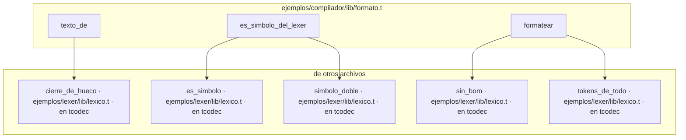

## ejemplos/compilador/lib/generar.t (en tcodec)

```mermaid
graph TD
    subgraph ejemplos_compilador_lib_generar["ejemplos/compilador/lib/generar.t"]
        ejemplos_compilador_lib_generar__anadir_c["anadir_c"]
        ejemplos_compilador_lib_generar__apuntar_arreglo["apuntar_arreglo"]
        ejemplos_compilador_lib_generar__apuntar_fallo["apuntar_fallo"]
        ejemplos_compilador_lib_generar__apuntar_nombres_c["apuntar_nombres_c"]
        ejemplos_compilador_lib_generar__asignacion_c["asignacion_c"]
        ejemplos_compilador_lib_generar__atrapar_c["atrapar_c"]
        ejemplos_compilador_lib_generar__binaria_c["binaria_c"]
        ejemplos_compilador_lib_generar__bloque_c["bloque_c"]
        ejemplos_compilador_lib_generar__cabe_literal_entero["cabe_literal_entero"]
        ejemplos_compilador_lib_generar__campo_c["campo_c"]
        ejemplos_compilador_lib_generar__choca_con_c["choca_con_c"]
        ejemplos_compilador_lib_generar__cierre_c["cierre_c"]
        ejemplos_compilador_lib_generar__como_vista["como_vista"]
        ejemplos_compilador_lib_generar__condiciones_patron_c["condiciones_patron_c"]
        ejemplos_compilador_lib_generar__conversion_c["conversion_c"]
        ejemplos_compilador_lib_generar__cuantos_bytes["cuantos_bytes"]
        ejemplos_compilador_lib_generar__cuantos_de_arreglo["cuantos_de_arreglo"]
        ejemplos_compilador_lib_generar__cuerpo_brazo_c["cuerpo_brazo_c"]
        ejemplos_compilador_lib_generar__da_texto["da_texto"]
        ejemplos_compilador_lib_generar__decimal_c["decimal_c"]
        ejemplos_compilador_lib_generar__declaracion_c["declaracion_c"]
        ejemplos_compilador_lib_generar__descartar_c["descartar_c"]
        ejemplos_compilador_lib_generar__direccion_de_condicional["direccion_de_condicional"]
        ejemplos_compilador_lib_generar__entrega_grabada["entrega_grabada"]
        ejemplos_compilador_lib_generar__entrega_suelta["entrega_suelta"]
        ejemplos_compilador_lib_generar__enum_lit_c["enum_lit_c"]
        ejemplos_compilador_lib_generar__es_puntero["es_puntero"]
        ejemplos_compilador_lib_generar__escrito["escrito"]
        ejemplos_compilador_lib_generar__hay_brazo_sin_leer["hay_brazo_sin_leer"]
        ejemplos_compilador_lib_generar__hueco_c["hueco_c"]
        ejemplos_compilador_lib_generar__indice_c["indice_c"]
        ejemplos_compilador_lib_generar__interna_pura_comparar["interna_pura_comparar"]
        ejemplos_compilador_lib_generar__interna_pura_copiar["interna_pura_copiar"]
        ejemplos_compilador_lib_generar__interna_pura_imprimir["interna_pura_imprimir"]
        ejemplos_compilador_lib_generar__interna_pura_intercambiar["interna_pura_intercambiar"]
        ejemplos_compilador_lib_generar__interna_pura_largo["interna_pura_largo"]
        ejemplos_compilador_lib_generar__interna_pura_mapa["interna_pura_mapa"]
        ejemplos_compilador_lib_generar__interna_pura_numeros["interna_pura_numeros"]
        ejemplos_compilador_lib_generar__interna_pura_ordenar["interna_pura_ordenar"]
        ejemplos_compilador_lib_generar__interna_pura_redimensionar["interna_pura_redimensionar"]
        ejemplos_compilador_lib_generar__interna_pura_texto["interna_pura_texto"]
        ejemplos_compilador_lib_generar__interpolada_c["interpolada_c"]
        ejemplos_compilador_lib_generar__junta["junta"]
        ejemplos_compilador_lib_generar__legible_c["legible_c"]
        ejemplos_compilador_lib_generar__liberacion["liberacion"]
        ejemplos_compilador_lib_generar__literal_c["literal_c"]
        ejemplos_compilador_lib_generar__literal_lista_c["literal_lista_c"]
        ejemplos_compilador_lib_generar__literal_struct_c["literal_struct_c"]
        ejemplos_compilador_lib_generar__llamada_a_valor["llamada_a_valor"]
        ejemplos_compilador_lib_generar__llamada_c["llamada_c"]
        ejemplos_compilador_lib_generar__llamada_con_firma["llamada_con_firma"]
        ejemplos_compilador_lib_generar__llamada_externa_c["llamada_externa_c"]
        ejemplos_compilador_lib_generar__mangle["mangle"]
        ejemplos_compilador_lib_generar__match_c["match_c"]
        ejemplos_compilador_lib_generar__match_condiciones["match_condiciones"]
        ejemplos_compilador_lib_generar__match_valor["match_valor"]
        ejemplos_compilador_lib_generar__mientras_c["mientras_c"]
        ejemplos_compilador_lib_generar__movidas_en["movidas_en"]
        ejemplos_compilador_lib_generar__movidas_hondo_en["movidas_hondo_en"]
        ejemplos_compilador_lib_generar__para_c["para_c"]
        ejemplos_compilador_lib_generar__para_rango_c["para_rango_c"]
        ejemplos_compilador_lib_generar__primer_nombre["primer_nombre"]
        ejemplos_compilador_lib_generar__prototipo["prototipo"]
        ejemplos_compilador_lib_generar__reservar_c["reservar_c"]
        ejemplos_compilador_lib_generar__se_llama_como["se_llama_como"]
        ejemplos_compilador_lib_generar__segundo_nombre["segundo_nombre"]
        ejemplos_compilador_lib_generar__si_expr_c["si_expr_c"]
        ejemplos_compilador_lib_generar__si_expr_suelto_c["si_expr_suelto_c"]
        ejemplos_compilador_lib_generar__sitio_c["sitio_c"]
        ejemplos_compilador_lib_generar__sitio_solo_lectura["sitio_solo_lectura"]
        ejemplos_compilador_lib_generar__texto_de["texto_de"]
        ejemplos_compilador_lib_generar__texto_para_c["texto_para_c"]
        ejemplos_compilador_lib_generar__tiene_duenio["tiene_duenio"]
        ejemplos_compilador_lib_generar__tipo_c["tipo_c"]
        ejemplos_compilador_lib_generar__tipo_c_prestamo["tipo_c_prestamo"]
        ejemplos_compilador_lib_generar__tipo_del_prestamo["tipo_del_prestamo"]
        ejemplos_compilador_lib_generar__tipo_escrito["tipo_escrito"]
        ejemplos_compilador_lib_generar__tipo_si_va_bien["tipo_si_va_bien"]
        ejemplos_compilador_lib_generar__tipo_suelto["tipo_suelto"]
        ejemplos_compilador_lib_generar__truncar_c["truncar_c"]
        ejemplos_compilador_lib_generar__unaria_c["unaria_c"]
        ejemplos_compilador_lib_generar__variable_c["variable_c"]
    end
    subgraph fuera["de otros archivos"]
        ejemplos_compilador_lib_tipar__abrir["abrir · ejemplos/compilador/lib/tipar.t · en tcodec"]
        ejemplos_compilador_lib_tipar__antes_del_punto["antes_del_punto · ejemplos/compilador/lib/tipar.t · en tcodec"]
        ejemplos_compilador_lib_tipar__buscar["buscar · ejemplos/compilador/lib/tipar.t · en tcodec"]
        ejemplos_compilador_lib_tipar__cerrar["cerrar · ejemplos/compilador/lib/tipar.t · en tcodec"]
        ejemplos_compilador_lib_tipar__declarar["declarar · ejemplos/compilador/lib/tipar.t · en tcodec"]
        ejemplos_compilador_lib_tipar__firma_de_funcion["firma_de_funcion · ejemplos/compilador/lib/tipar.t · en tcodec"]
        ejemplos_compilador_lib_tipar__funcion_de_cierre["funcion_de_cierre · ejemplos/compilador/lib/tipar.t · en tcodec"]
        ejemplos_compilador_lib_tipar__lista_de["lista_de · ejemplos/compilador/lib/tipar.t · en tcodec"]
        ejemplos_compilador_lib_tipar__literal_de["literal_de · ejemplos/compilador/lib/tipar.t · en tcodec"]
        ejemplos_compilador_lib_tipar__nombre_resuelto["nombre_resuelto · ejemplos/compilador/lib/tipar.t · en tcodec"]
        ejemplos_compilador_lib_tipar__posee_con_formas["posee_con_formas · ejemplos/compilador/lib/tipar.t · en tcodec"]
        ejemplos_compilador_lib_tipar__sin_modulo["sin_modulo · ejemplos/compilador/lib/tipar.t · en tcodec"]
        ejemplos_compilador_lib_tipar__tipo_anotado["tipo_anotado · ejemplos/compilador/lib/tipar.t · en tcodec"]
        ejemplos_compilador_lib_tipar__tipo_cuenta["tipo_cuenta · ejemplos/compilador/lib/tipar.t · en tcodec"]
        ejemplos_compilador_lib_tipar__tipo_de["tipo_de · ejemplos/compilador/lib/tipar.t · en tcodec"]
        ejemplos_compilador_lib_tipar__tipo_de_campo["tipo_de_campo · ejemplos/compilador/lib/tipar.t · en tcodec"]
        ejemplos_compilador_lib_tipar__tras_el_punto["tras_el_punto · ejemplos/compilador/lib/tipar.t · en tcodec"]
        ejemplos_compilador_lib_tipos__apuntado["apuntado · ejemplos/compilador/lib/tipos.t · en tcodec"]
        ejemplos_compilador_lib_tipos__apuntado_si["apuntado_si · ejemplos/compilador/lib/tipos.t · en tcodec"]
        ejemplos_compilador_lib_tipos__base_de_aplicacion["base_de_aplicacion · ejemplos/compilador/lib/tipos.t · en tcodec"]
        ejemplos_compilador_lib_tipos__conocido["conocido · ejemplos/compilador/lib/tipos.t · en tcodec"]
        ejemplos_compilador_lib_tipos__elemento["elemento · ejemplos/compilador/lib/tipos.t · en tcodec"]
        ejemplos_compilador_lib_tipos__es_aplicacion["es_aplicacion · ejemplos/compilador/lib/tipos.t · en tcodec"]
        ejemplos_compilador_lib_tipos__es_arreglo["es_arreglo · ejemplos/compilador/lib/tipos.t · en tcodec"]
        ejemplos_compilador_lib_tipos__es_bloque["es_bloque · ejemplos/compilador/lib/tipos.t · en tcodec"]
        ejemplos_compilador_lib_tipos__es_de_nombre["es_de_nombre · ejemplos/compilador/lib/tipos.t · en tcodec"]
        ejemplos_compilador_lib_tipos__es_funcion["es_funcion · ejemplos/compilador/lib/tipos.t · en tcodec"]
        ejemplos_compilador_lib_tipos__es_lista["es_lista · ejemplos/compilador/lib/tipos.t · en tcodec"]
        ejemplos_compilador_lib_tipos__es_mapa["es_mapa · ejemplos/compilador/lib/tipos.t · en tcodec"]
        ejemplos_compilador_lib_tipos__es_referencia["es_referencia · ejemplos/compilador/lib/tipos.t · en tcodec"]
        ejemplos_compilador_lib_tipos__es_referencia_mutable["es_referencia_mutable · ejemplos/compilador/lib/tipos.t · en tcodec"]
        ejemplos_compilador_lib_tipos__escribir_de_mapa["escribir_de_mapa · ejemplos/compilador/lib/tipos.t · en tcodec"]
        ejemplos_compilador_lib_tipos__escribir_tipo["escribir_tipo · ejemplos/compilador/lib/tipos.t · en tcodec"]
        ejemplos_compilador_lib_tipos__escribir_tipos["escribir_tipos · ejemplos/compilador/lib/tipos.t · en tcodec"]
        ejemplos_compilador_lib_tipos__hacer_prestado["hacer_prestado · ejemplos/compilador/lib/tipos.t · en tcodec"]
        ejemplos_compilador_lib_tipos__leer_tipo["leer_tipo · ejemplos/compilador/lib/tipos.t · en tcodec"]
        ejemplos_compilador_lib_tipos__leer_tipos["leer_tipos · ejemplos/compilador/lib/tipos.t · en tcodec"]
        ejemplos_compilador_lib_tipos__ligar_tipo["ligar_tipo · ejemplos/compilador/lib/tipos.t · en tcodec"]
        ejemplos_compilador_lib_tipos__ninguno["ninguno · ejemplos/compilador/lib/tipos.t · en tcodec"]
        ejemplos_compilador_lib_tipos__partes["partes · ejemplos/compilador/lib/tipos.t · en tcodec"]
        ejemplos_compilador_lib_tipos__partes_de_funcion["partes_de_funcion · ejemplos/compilador/lib/tipos.t · en tcodec"]
        ejemplos_compilador_lib_tipos__sanear["sanear · ejemplos/compilador/lib/tipos.t · en tcodec"]
        ejemplos_compilador_lib_tipos__sin_alias_tipo["sin_alias_tipo · ejemplos/compilador/lib/tipos.t · en tcodec"]
        ejemplos_compilador_lib_tipos__sustituir_tipo["sustituir_tipo · ejemplos/compilador/lib/tipos.t · en tcodec"]
        ejemplos_compilador_lib_tipos__tipos_de_mapa["tipos_de_mapa · ejemplos/compilador/lib/tipos.t · en tcodec"]
        ejemplos_compilador_lib_tipos__valor_de_mapa["valor_de_mapa · ejemplos/compilador/lib/tipos.t · en tcodec"]
        ejemplos_lexer_lib_clase__nombre_de_clase["nombre_de_clase · ejemplos/lexer/lib/clase.t · en tcodec"]
        ejemplos_lexer_lib_lexico__cierre_de_hueco["cierre_de_hueco · ejemplos/lexer/lib/lexico.t · en tcodec"]
        ejemplos_lexer_lib_sintaxis__desescapar["desescapar · ejemplos/lexer/lib/sintaxis.t · en tcodec"]
        ejemplos_lexer_lib_sintaxis__es_lugar["es_lugar · ejemplos/lexer/lib/sintaxis.t · en tcodec"]
        ejemplos_lexer_lib_sintaxis__hoja["hoja · ejemplos/lexer/lib/sintaxis.t · en tcodec"]
        ejemplos_lexer_lib_sintaxis__rama["rama · ejemplos/lexer/lib/sintaxis.t · en tcodec"]
        std_texto__contiene["contiene · std/texto.t · en tcodec"]
        std_texto__empieza_con["empieza_con · std/texto.t · en tcodec"]
        std_texto__palabras["palabras · std/texto.t · en tcodec"]
        std_texto__recortar["recortar · std/texto.t · en tcodec"]
    end

    ejemplos_compilador_lib_generar__anadir_c --> ejemplos_compilador_lib_tipar__tipo_de
    ejemplos_compilador_lib_generar__anadir_c --> ejemplos_compilador_lib_tipos__apuntado_si
    ejemplos_compilador_lib_generar__anadir_c --> ejemplos_compilador_lib_tipos__elemento
    ejemplos_compilador_lib_generar__anadir_c --> ejemplos_compilador_lib_tipos__es_lista
    ejemplos_compilador_lib_generar__anadir_c --> ejemplos_compilador_lib_tipos__escribir_tipo
    ejemplos_compilador_lib_generar__apuntar_arreglo --> ejemplos_compilador_lib_tipos__elemento
    ejemplos_compilador_lib_generar__apuntar_arreglo --> ejemplos_compilador_lib_tipos__es_arreglo
    ejemplos_compilador_lib_generar__apuntar_fallo --> ejemplos_lexer_lib_clase__nombre_de_clase
    ejemplos_compilador_lib_generar__apuntar_nombres_c --> std_texto__palabras
    ejemplos_compilador_lib_generar__asignacion_c --> ejemplos_compilador_lib_tipar__posee_con_formas
    ejemplos_compilador_lib_generar__asignacion_c --> ejemplos_compilador_lib_tipar__tipo_de
    ejemplos_compilador_lib_generar__asignacion_c --> ejemplos_compilador_lib_tipos__escribir_tipo
    ejemplos_compilador_lib_generar__atrapar_c --> ejemplos_compilador_lib_tipar__declarar
    ejemplos_compilador_lib_generar__atrapar_c --> ejemplos_compilador_lib_tipar__posee_con_formas
    ejemplos_compilador_lib_generar__atrapar_c --> ejemplos_compilador_lib_tipar__sin_modulo
    ejemplos_compilador_lib_generar__atrapar_c --> ejemplos_compilador_lib_tipar__tras_el_punto
    ejemplos_compilador_lib_generar__atrapar_c --> ejemplos_compilador_lib_tipos__escribir_tipo
    ejemplos_compilador_lib_generar__atrapar_c --> ejemplos_compilador_lib_tipos__hacer_prestado
    ejemplos_compilador_lib_generar__atrapar_c --> ejemplos_compilador_lib_tipos__tipos_de_mapa
    ejemplos_compilador_lib_generar__binaria_c --> ejemplos_compilador_lib_tipar__tipo_cuenta
    ejemplos_compilador_lib_generar__binaria_c --> ejemplos_compilador_lib_tipar__tipo_de
    ejemplos_compilador_lib_generar__binaria_c --> ejemplos_compilador_lib_tipos__apuntado_si
    ejemplos_compilador_lib_generar__binaria_c --> ejemplos_compilador_lib_tipos__escribir_tipo
    ejemplos_compilador_lib_generar__binaria_c --> ejemplos_lexer_lib_sintaxis__rama
    ejemplos_compilador_lib_generar__binaria_c --> std_texto__empieza_con
    ejemplos_compilador_lib_generar__bloque_c --> ejemplos_compilador_lib_tipar__abrir
    ejemplos_compilador_lib_generar__bloque_c --> ejemplos_compilador_lib_tipar__cerrar
    ejemplos_compilador_lib_generar__cabe_literal_entero --> std_texto__empieza_con
    ejemplos_compilador_lib_generar__campo_c --> ejemplos_compilador_lib_tipar__tipo_de
    ejemplos_compilador_lib_generar__campo_c --> ejemplos_compilador_lib_tipos__escribir_tipo
    ejemplos_compilador_lib_generar__choca_con_c --> std_texto__empieza_con
    ejemplos_compilador_lib_generar__cierre_c --> ejemplos_compilador_lib_tipar__buscar
    ejemplos_compilador_lib_generar__cierre_c --> ejemplos_compilador_lib_tipar__funcion_de_cierre
    ejemplos_compilador_lib_generar__cierre_c --> ejemplos_compilador_lib_tipar__posee_con_formas
    ejemplos_compilador_lib_generar__cierre_c --> ejemplos_compilador_lib_tipos__es_referencia
    ejemplos_compilador_lib_generar__cierre_c --> ejemplos_compilador_lib_tipos__sin_alias_tipo
    ejemplos_compilador_lib_generar__cierre_c --> ejemplos_lexer_lib_sintaxis__hoja
    ejemplos_compilador_lib_generar__como_vista --> ejemplos_compilador_lib_tipar__tipo_de
    ejemplos_compilador_lib_generar__como_vista --> ejemplos_compilador_lib_tipos__apuntado
    ejemplos_compilador_lib_generar__como_vista --> ejemplos_compilador_lib_tipos__es_referencia
    ejemplos_compilador_lib_generar__como_vista --> ejemplos_compilador_lib_tipos__escribir_tipo
    ejemplos_compilador_lib_generar__condiciones_patron_c --> ejemplos_compilador_lib_tipar__sin_modulo
    ejemplos_compilador_lib_generar__condiciones_patron_c --> ejemplos_compilador_lib_tipar__tras_el_punto
    ejemplos_compilador_lib_generar__condiciones_patron_c --> ejemplos_compilador_lib_tipos__escribir_tipo
    ejemplos_compilador_lib_generar__condiciones_patron_c --> ejemplos_compilador_lib_tipos__tipos_de_mapa
    ejemplos_compilador_lib_generar__conversion_c --> ejemplos_compilador_lib_tipar__tipo_de
    ejemplos_compilador_lib_generar__conversion_c --> ejemplos_compilador_lib_tipos__apuntado_si
    ejemplos_compilador_lib_generar__conversion_c --> ejemplos_compilador_lib_tipos__escribir_tipo
    ejemplos_compilador_lib_generar__conversion_c --> std_texto__empieza_con
    ejemplos_compilador_lib_generar__cuantos_bytes --> ejemplos_lexer_lib_sintaxis__desescapar
    ejemplos_compilador_lib_generar__cuantos_de_arreglo --> std_texto__recortar
    ejemplos_compilador_lib_generar__cuerpo_brazo_c --> ejemplos_compilador_lib_tipar__tipo_de
    ejemplos_compilador_lib_generar__cuerpo_brazo_c --> ejemplos_compilador_lib_tipos__es_referencia
    ejemplos_compilador_lib_generar__cuerpo_brazo_c --> ejemplos_compilador_lib_tipos__escribir_tipo
    ejemplos_compilador_lib_generar__da_texto --> ejemplos_compilador_lib_tipar__tipo_de
    ejemplos_compilador_lib_generar__da_texto --> ejemplos_compilador_lib_tipos__apuntado_si
    ejemplos_compilador_lib_generar__da_texto --> ejemplos_compilador_lib_tipos__escribir_tipo
    ejemplos_compilador_lib_generar__decimal_c --> std_texto__contiene
    ejemplos_compilador_lib_generar__declaracion_c --> ejemplos_compilador_lib_tipar__declarar
    ejemplos_compilador_lib_generar__declaracion_c --> ejemplos_compilador_lib_tipar__posee_con_formas
    ejemplos_compilador_lib_generar__declaracion_c --> ejemplos_compilador_lib_tipar__tipo_de
    ejemplos_compilador_lib_generar__declaracion_c --> ejemplos_compilador_lib_tipos__es_referencia
    ejemplos_compilador_lib_generar__declaracion_c --> ejemplos_compilador_lib_tipos__escribir_tipo
    ejemplos_compilador_lib_generar__descartar_c --> ejemplos_compilador_lib_tipar__posee_con_formas
    ejemplos_compilador_lib_generar__descartar_c --> ejemplos_lexer_lib_sintaxis__es_lugar
    ejemplos_compilador_lib_generar__direccion_de_condicional --> ejemplos_compilador_lib_tipar__posee_con_formas
    ejemplos_compilador_lib_generar__direccion_de_condicional --> ejemplos_compilador_lib_tipar__tipo_de
    ejemplos_compilador_lib_generar__direccion_de_condicional --> ejemplos_compilador_lib_tipos__es_referencia
    ejemplos_compilador_lib_generar__direccion_de_condicional --> ejemplos_compilador_lib_tipos__escribir_tipo
    ejemplos_compilador_lib_generar__entrega_grabada --> ejemplos_compilador_lib_tipar__posee_con_formas
    ejemplos_compilador_lib_generar__entrega_grabada --> ejemplos_compilador_lib_tipar__tipo_de
    ejemplos_compilador_lib_generar__entrega_grabada --> ejemplos_compilador_lib_tipos__escribir_tipo
    ejemplos_compilador_lib_generar__entrega_suelta --> ejemplos_compilador_lib_tipar__posee_con_formas
    ejemplos_compilador_lib_generar__entrega_suelta --> ejemplos_compilador_lib_tipar__tipo_de
    ejemplos_compilador_lib_generar__entrega_suelta --> ejemplos_compilador_lib_tipos__escribir_tipo
    ejemplos_compilador_lib_generar__enum_lit_c --> ejemplos_compilador_lib_tipar__antes_del_punto
    ejemplos_compilador_lib_generar__enum_lit_c --> ejemplos_compilador_lib_tipar__sin_modulo
    ejemplos_compilador_lib_generar__enum_lit_c --> ejemplos_compilador_lib_tipar__tras_el_punto
    ejemplos_compilador_lib_generar__enum_lit_c --> ejemplos_compilador_lib_tipos__escribir_tipo
    ejemplos_compilador_lib_generar__enum_lit_c --> ejemplos_compilador_lib_tipos__tipos_de_mapa
    ejemplos_compilador_lib_generar__es_puntero --> ejemplos_compilador_lib_tipar__buscar
    ejemplos_compilador_lib_generar__es_puntero --> ejemplos_compilador_lib_tipos__es_referencia
    ejemplos_compilador_lib_generar__escrito --> std_texto__empieza_con
    ejemplos_compilador_lib_generar__hay_brazo_sin_leer --> ejemplos_compilador_lib_tipar__tipo_de
    ejemplos_compilador_lib_generar__hay_brazo_sin_leer --> ejemplos_compilador_lib_tipos__es_referencia
    ejemplos_compilador_lib_generar__hay_brazo_sin_leer --> ejemplos_compilador_lib_tipos__escribir_tipo
    ejemplos_compilador_lib_generar__hueco_c --> ejemplos_compilador_lib_tipar__tipo_de
    ejemplos_compilador_lib_generar__hueco_c --> ejemplos_compilador_lib_tipos__escribir_tipo
    ejemplos_compilador_lib_generar__indice_c --> ejemplos_compilador_lib_tipar__tipo_de
    ejemplos_compilador_lib_generar__indice_c --> ejemplos_compilador_lib_tipos__apuntado_si
    ejemplos_compilador_lib_generar__indice_c --> ejemplos_compilador_lib_tipos__es_arreglo
    ejemplos_compilador_lib_generar__indice_c --> ejemplos_compilador_lib_tipos__es_bloque
    ejemplos_compilador_lib_generar__indice_c --> ejemplos_compilador_lib_tipos__es_lista
    ejemplos_compilador_lib_generar__indice_c --> ejemplos_compilador_lib_tipos__escribir_tipo
    ejemplos_compilador_lib_generar__interna_pura_comparar --> ejemplos_compilador_lib_tipar__tipo_de
    ejemplos_compilador_lib_generar__interna_pura_comparar --> ejemplos_compilador_lib_tipos__apuntado_si
    ejemplos_compilador_lib_generar__interna_pura_comparar --> ejemplos_compilador_lib_tipos__escribir_tipo
    ejemplos_compilador_lib_generar__interna_pura_copiar --> ejemplos_compilador_lib_tipar__posee_con_formas
    ejemplos_compilador_lib_generar__interna_pura_copiar --> ejemplos_compilador_lib_tipar__tipo_de
    ejemplos_compilador_lib_generar__interna_pura_copiar --> ejemplos_compilador_lib_tipos__apuntado_si
    ejemplos_compilador_lib_generar__interna_pura_copiar --> ejemplos_compilador_lib_tipos__es_referencia
    ejemplos_compilador_lib_generar__interna_pura_copiar --> ejemplos_compilador_lib_tipos__escribir_tipo
    ejemplos_compilador_lib_generar__interna_pura_copiar --> ejemplos_compilador_lib_tipos__sin_alias_tipo
    ejemplos_compilador_lib_generar__interna_pura_imprimir --> ejemplos_compilador_lib_tipar__tipo_de
    ejemplos_compilador_lib_generar__interna_pura_imprimir --> ejemplos_compilador_lib_tipos__escribir_tipo
    ejemplos_compilador_lib_generar__interna_pura_imprimir --> std_texto__empieza_con
    ejemplos_compilador_lib_generar__interna_pura_intercambiar --> ejemplos_compilador_lib_tipar__tipo_de
    ejemplos_compilador_lib_generar__interna_pura_intercambiar --> ejemplos_compilador_lib_tipos__conocido
    ejemplos_compilador_lib_generar__interna_pura_intercambiar --> ejemplos_compilador_lib_tipos__escribir_tipo
    ejemplos_compilador_lib_generar__interna_pura_intercambiar --> ejemplos_compilador_lib_tipos__leer_tipo
    ejemplos_compilador_lib_generar__interna_pura_largo --> ejemplos_compilador_lib_tipar__tipo_de
    ejemplos_compilador_lib_generar__interna_pura_largo --> ejemplos_compilador_lib_tipos__apuntado_si
    ejemplos_compilador_lib_generar__interna_pura_largo --> ejemplos_compilador_lib_tipos__es_arreglo
    ejemplos_compilador_lib_generar__interna_pura_largo --> ejemplos_compilador_lib_tipos__es_bloque
    ejemplos_compilador_lib_generar__interna_pura_largo --> ejemplos_compilador_lib_tipos__es_lista
    ejemplos_compilador_lib_generar__interna_pura_largo --> ejemplos_compilador_lib_tipos__es_mapa
    ejemplos_compilador_lib_generar__interna_pura_largo --> ejemplos_compilador_lib_tipos__escribir_tipo
    ejemplos_compilador_lib_generar__interna_pura_mapa --> ejemplos_compilador_lib_tipar__tipo_de
    ejemplos_compilador_lib_generar__interna_pura_mapa --> ejemplos_compilador_lib_tipos__apuntado_si
    ejemplos_compilador_lib_generar__interna_pura_mapa --> ejemplos_compilador_lib_tipos__es_mapa
    ejemplos_compilador_lib_generar__interna_pura_mapa --> ejemplos_compilador_lib_tipos__escribir_tipo
    ejemplos_compilador_lib_generar__interna_pura_mapa --> ejemplos_compilador_lib_tipos__valor_de_mapa
    ejemplos_compilador_lib_generar__interna_pura_numeros --> ejemplos_compilador_lib_tipar__tipo_de
    ejemplos_compilador_lib_generar__interna_pura_numeros --> ejemplos_compilador_lib_tipos__apuntado_si
    ejemplos_compilador_lib_generar__interna_pura_numeros --> ejemplos_compilador_lib_tipos__escribir_tipo
    ejemplos_compilador_lib_generar__interna_pura_ordenar --> ejemplos_compilador_lib_tipar__tipo_de
    ejemplos_compilador_lib_generar__interna_pura_ordenar --> ejemplos_compilador_lib_tipos__apuntado_si
    ejemplos_compilador_lib_generar__interna_pura_ordenar --> ejemplos_compilador_lib_tipos__es_lista
    ejemplos_compilador_lib_generar__interna_pura_ordenar --> ejemplos_compilador_lib_tipos__escribir_tipo
    ejemplos_compilador_lib_generar__interna_pura_redimensionar --> ejemplos_compilador_lib_tipar__tipo_de
    ejemplos_compilador_lib_generar__interna_pura_redimensionar --> ejemplos_compilador_lib_tipos__apuntado_si
    ejemplos_compilador_lib_generar__interna_pura_redimensionar --> ejemplos_compilador_lib_tipos__es_bloque
    ejemplos_compilador_lib_generar__interna_pura_redimensionar --> ejemplos_compilador_lib_tipos__escribir_tipo
    ejemplos_compilador_lib_generar__interna_pura_texto --> ejemplos_compilador_lib_tipar__tipo_de
    ejemplos_compilador_lib_generar__interna_pura_texto --> ejemplos_compilador_lib_tipos__escribir_tipo
    ejemplos_compilador_lib_generar__interpolada_c --> ejemplos_lexer_lib_lexico__cierre_de_hueco
    ejemplos_compilador_lib_generar__junta --> std_texto__contiene
    ejemplos_compilador_lib_generar__junta --> std_texto__empieza_con
    ejemplos_compilador_lib_generar__legible_c --> ejemplos_compilador_lib_tipos__es_de_nombre
    ejemplos_compilador_lib_generar__liberacion --> ejemplos_compilador_lib_tipar__nombre_resuelto
    ejemplos_compilador_lib_generar__liberacion --> ejemplos_compilador_lib_tipar__posee_con_formas
    ejemplos_compilador_lib_generar__liberacion --> ejemplos_compilador_lib_tipar__sin_modulo
    ejemplos_compilador_lib_generar__liberacion --> ejemplos_compilador_lib_tipos__elemento
    ejemplos_compilador_lib_generar__liberacion --> ejemplos_compilador_lib_tipos__es_aplicacion
    ejemplos_compilador_lib_generar__liberacion --> ejemplos_compilador_lib_tipos__es_arreglo
    ejemplos_compilador_lib_generar__liberacion --> ejemplos_compilador_lib_tipos__es_bloque
    ejemplos_compilador_lib_generar__liberacion --> ejemplos_compilador_lib_tipos__es_lista
    ejemplos_compilador_lib_generar__liberacion --> ejemplos_compilador_lib_tipos__es_mapa
    ejemplos_compilador_lib_generar__literal_c --> ejemplos_lexer_lib_sintaxis__desescapar
    ejemplos_compilador_lib_generar__literal_lista_c --> ejemplos_compilador_lib_tipar__tipo_de
    ejemplos_compilador_lib_generar__literal_lista_c --> ejemplos_compilador_lib_tipos__elemento
    ejemplos_compilador_lib_generar__literal_lista_c --> ejemplos_compilador_lib_tipos__es_arreglo
    ejemplos_compilador_lib_generar__literal_lista_c --> ejemplos_compilador_lib_tipos__es_lista
    ejemplos_compilador_lib_generar__literal_lista_c --> ejemplos_compilador_lib_tipos__es_mapa
    ejemplos_compilador_lib_generar__literal_lista_c --> ejemplos_compilador_lib_tipos__escribir_tipo
    ejemplos_compilador_lib_generar__literal_lista_c --> ejemplos_compilador_lib_tipos__leer_tipo
    ejemplos_compilador_lib_generar__literal_struct_c --> ejemplos_compilador_lib_tipar__sin_modulo
    ejemplos_compilador_lib_generar__literal_struct_c --> ejemplos_compilador_lib_tipar__tipo_de
    ejemplos_compilador_lib_generar__literal_struct_c --> ejemplos_compilador_lib_tipar__tipo_de_campo
    ejemplos_compilador_lib_generar__literal_struct_c --> ejemplos_compilador_lib_tipos__base_de_aplicacion
    ejemplos_compilador_lib_generar__literal_struct_c --> ejemplos_compilador_lib_tipos__es_aplicacion
    ejemplos_compilador_lib_generar__literal_struct_c --> ejemplos_compilador_lib_tipos__escribir_tipo
    ejemplos_compilador_lib_generar__literal_struct_c --> std_texto__contiene
    ejemplos_compilador_lib_generar__llamada_a_valor --> ejemplos_compilador_lib_tipar__funcion_de_cierre
    ejemplos_compilador_lib_generar__llamada_a_valor --> ejemplos_compilador_lib_tipos__apuntado_si
    ejemplos_compilador_lib_generar__llamada_a_valor --> ejemplos_compilador_lib_tipos__es_funcion
    ejemplos_compilador_lib_generar__llamada_a_valor --> ejemplos_compilador_lib_tipos__es_referencia
    ejemplos_compilador_lib_generar__llamada_a_valor --> ejemplos_compilador_lib_tipos__es_referencia_mutable
    ejemplos_compilador_lib_generar__llamada_a_valor --> ejemplos_compilador_lib_tipos__partes_de_funcion
    ejemplos_compilador_lib_generar__llamada_a_valor --> ejemplos_lexer_lib_sintaxis__hoja
    ejemplos_compilador_lib_generar__llamada_a_valor --> ejemplos_lexer_lib_sintaxis__rama
    ejemplos_compilador_lib_generar__llamada_c --> ejemplos_compilador_lib_tipar__buscar
    ejemplos_compilador_lib_generar__llamada_c --> ejemplos_compilador_lib_tipar__lista_de
    ejemplos_compilador_lib_generar__llamada_c --> ejemplos_compilador_lib_tipar__nombre_resuelto
    ejemplos_compilador_lib_generar__llamada_c --> ejemplos_compilador_lib_tipar__sin_modulo
    ejemplos_compilador_lib_generar__llamada_c --> ejemplos_compilador_lib_tipar__tipo_de
    ejemplos_compilador_lib_generar__llamada_c --> ejemplos_compilador_lib_tipos__escribir_tipo
    ejemplos_compilador_lib_generar__llamada_c --> ejemplos_compilador_lib_tipos__escribir_tipos
    ejemplos_compilador_lib_generar__llamada_c --> ejemplos_compilador_lib_tipos__leer_tipos
    ejemplos_compilador_lib_generar__llamada_c --> ejemplos_compilador_lib_tipos__ligar_tipo
    ejemplos_compilador_lib_generar__llamada_c --> ejemplos_compilador_lib_tipos__sanear
    ejemplos_compilador_lib_generar__llamada_c --> ejemplos_compilador_lib_tipos__sin_alias_tipo
    ejemplos_compilador_lib_generar__llamada_c --> ejemplos_compilador_lib_tipos__sustituir_tipo
    ejemplos_compilador_lib_generar__llamada_c --> ejemplos_compilador_lib_tipos__tipos_de_mapa
    ejemplos_compilador_lib_generar__llamada_c --> std_texto__contiene
    ejemplos_compilador_lib_generar__llamada_con_firma --> ejemplos_compilador_lib_tipar__posee_con_formas
    ejemplos_compilador_lib_generar__llamada_con_firma --> ejemplos_compilador_lib_tipar__tipo_de
    ejemplos_compilador_lib_generar__llamada_con_firma --> ejemplos_compilador_lib_tipos__conocido
    ejemplos_compilador_lib_generar__llamada_con_firma --> ejemplos_compilador_lib_tipos__es_referencia
    ejemplos_compilador_lib_generar__llamada_con_firma --> std_texto__empieza_con
    ejemplos_compilador_lib_generar__llamada_externa_c --> ejemplos_compilador_lib_tipar__sin_modulo
    ejemplos_compilador_lib_generar__llamada_externa_c --> ejemplos_compilador_lib_tipos__escribir_tipo
    ejemplos_compilador_lib_generar__llamada_externa_c --> ejemplos_compilador_lib_tipos__tipos_de_mapa
    ejemplos_compilador_lib_generar__mangle --> ejemplos_compilador_lib_tipar__nombre_resuelto
    ejemplos_compilador_lib_generar__mangle --> ejemplos_compilador_lib_tipar__sin_modulo
    ejemplos_compilador_lib_generar__mangle --> ejemplos_compilador_lib_tipos__apuntado
    ejemplos_compilador_lib_generar__mangle --> ejemplos_compilador_lib_tipos__elemento
    ejemplos_compilador_lib_generar__mangle --> ejemplos_compilador_lib_tipos__es_aplicacion
    ejemplos_compilador_lib_generar__mangle --> ejemplos_compilador_lib_tipos__es_arreglo
    ejemplos_compilador_lib_generar__mangle --> ejemplos_compilador_lib_tipos__es_bloque
    ejemplos_compilador_lib_generar__mangle --> ejemplos_compilador_lib_tipos__es_funcion
    ejemplos_compilador_lib_generar__mangle --> ejemplos_compilador_lib_tipos__es_lista
    ejemplos_compilador_lib_generar__mangle --> ejemplos_compilador_lib_tipos__es_mapa
    ejemplos_compilador_lib_generar__mangle --> ejemplos_compilador_lib_tipos__es_referencia
    ejemplos_compilador_lib_generar__mangle --> ejemplos_compilador_lib_tipos__es_referencia_mutable
    ejemplos_compilador_lib_generar__mangle --> ejemplos_compilador_lib_tipos__partes
    ejemplos_compilador_lib_generar__mangle --> ejemplos_compilador_lib_tipos__partes_de_funcion
    ejemplos_compilador_lib_generar__match_c --> ejemplos_compilador_lib_tipar__abrir
    ejemplos_compilador_lib_generar__match_c --> ejemplos_compilador_lib_tipar__cerrar
    ejemplos_compilador_lib_generar__match_c --> ejemplos_compilador_lib_tipar__sin_modulo
    ejemplos_compilador_lib_generar__match_c --> ejemplos_compilador_lib_tipar__tipo_de
    ejemplos_compilador_lib_generar__match_c --> ejemplos_compilador_lib_tipar__tras_el_punto
    ejemplos_compilador_lib_generar__match_c --> ejemplos_compilador_lib_tipos__apuntado_si
    ejemplos_compilador_lib_generar__match_c --> ejemplos_compilador_lib_tipos__escribir_tipo
    ejemplos_compilador_lib_generar__match_condiciones --> ejemplos_compilador_lib_tipar__abrir
    ejemplos_compilador_lib_generar__match_condiciones --> ejemplos_compilador_lib_tipar__cerrar
    ejemplos_compilador_lib_generar__match_condiciones --> ejemplos_compilador_lib_tipar__tras_el_punto
    ejemplos_compilador_lib_generar__match_valor --> ejemplos_compilador_lib_tipar__posee_con_formas
    ejemplos_compilador_lib_generar__match_valor --> ejemplos_compilador_lib_tipar__tipo_de
    ejemplos_compilador_lib_generar__match_valor --> ejemplos_compilador_lib_tipos__es_referencia
    ejemplos_compilador_lib_generar__match_valor --> ejemplos_compilador_lib_tipos__escribir_tipo
    ejemplos_compilador_lib_generar__mientras_c --> ejemplos_compilador_lib_tipar__abrir
    ejemplos_compilador_lib_generar__mientras_c --> ejemplos_compilador_lib_tipar__cerrar
    ejemplos_compilador_lib_generar__movidas_en --> ejemplos_compilador_lib_tipos__es_referencia
    ejemplos_compilador_lib_generar__movidas_en --> ejemplos_lexer_lib_sintaxis__hoja
    ejemplos_compilador_lib_generar__movidas_hondo_en --> ejemplos_compilador_lib_tipar__abrir
    ejemplos_compilador_lib_generar__movidas_hondo_en --> ejemplos_compilador_lib_tipar__cerrar
    ejemplos_compilador_lib_generar__movidas_hondo_en --> ejemplos_compilador_lib_tipar__declarar
    ejemplos_compilador_lib_generar__movidas_hondo_en --> ejemplos_compilador_lib_tipar__tipo_de
    ejemplos_compilador_lib_generar__movidas_hondo_en --> ejemplos_compilador_lib_tipos__apuntado_si
    ejemplos_compilador_lib_generar__movidas_hondo_en --> ejemplos_compilador_lib_tipos__elemento
    ejemplos_compilador_lib_generar__movidas_hondo_en --> ejemplos_compilador_lib_tipos__es_mapa
    ejemplos_compilador_lib_generar__movidas_hondo_en --> ejemplos_compilador_lib_tipos__escribir_tipo
    ejemplos_compilador_lib_generar__movidas_hondo_en --> ejemplos_compilador_lib_tipos__partes
    ejemplos_compilador_lib_generar__para_c --> ejemplos_compilador_lib_tipar__abrir
    ejemplos_compilador_lib_generar__para_c --> ejemplos_compilador_lib_tipar__cerrar
    ejemplos_compilador_lib_generar__para_c --> ejemplos_compilador_lib_tipar__declarar
    ejemplos_compilador_lib_generar__para_c --> ejemplos_compilador_lib_tipar__posee_con_formas
    ejemplos_compilador_lib_generar__para_c --> ejemplos_compilador_lib_tipar__tipo_de
    ejemplos_compilador_lib_generar__para_c --> ejemplos_compilador_lib_tipos__apuntado_si
    ejemplos_compilador_lib_generar__para_c --> ejemplos_compilador_lib_tipos__elemento
    ejemplos_compilador_lib_generar__para_c --> ejemplos_compilador_lib_tipos__es_arreglo
    ejemplos_compilador_lib_generar__para_c --> ejemplos_compilador_lib_tipos__es_lista
    ejemplos_compilador_lib_generar__para_c --> ejemplos_compilador_lib_tipos__es_mapa
    ejemplos_compilador_lib_generar__para_c --> ejemplos_compilador_lib_tipos__escribir_tipo
    ejemplos_compilador_lib_generar__para_c --> ejemplos_compilador_lib_tipos__partes
    ejemplos_compilador_lib_generar__para_c --> ejemplos_compilador_lib_tipos__valor_de_mapa
    ejemplos_compilador_lib_generar__para_rango_c --> ejemplos_compilador_lib_tipar__abrir
    ejemplos_compilador_lib_generar__para_rango_c --> ejemplos_compilador_lib_tipar__cerrar
    ejemplos_compilador_lib_generar__para_rango_c --> ejemplos_compilador_lib_tipar__declarar
    ejemplos_compilador_lib_generar__para_rango_c --> ejemplos_compilador_lib_tipar__tipo_de
    ejemplos_compilador_lib_generar__para_rango_c --> ejemplos_compilador_lib_tipos__elemento
    ejemplos_compilador_lib_generar__para_rango_c --> ejemplos_compilador_lib_tipos__escribir_tipo
    ejemplos_compilador_lib_generar__primer_nombre --> std_texto__recortar
    ejemplos_compilador_lib_generar__prototipo --> ejemplos_compilador_lib_tipos__es_referencia
    ejemplos_compilador_lib_generar__prototipo --> ejemplos_compilador_lib_tipos__es_referencia_mutable
    ejemplos_compilador_lib_generar__prototipo --> std_texto__empieza_con
    ejemplos_compilador_lib_generar__reservar_c --> ejemplos_compilador_lib_tipar__tipo_de
    ejemplos_compilador_lib_generar__reservar_c --> ejemplos_compilador_lib_tipos__es_bloque
    ejemplos_compilador_lib_generar__reservar_c --> ejemplos_compilador_lib_tipos__escribir_tipo
    ejemplos_compilador_lib_generar__reservar_c --> ejemplos_compilador_lib_tipos__leer_tipo
    ejemplos_compilador_lib_generar__se_llama_como --> ejemplos_compilador_lib_tipar__buscar
    ejemplos_compilador_lib_generar__se_llama_como --> ejemplos_compilador_lib_tipar__sin_modulo
    ejemplos_compilador_lib_generar__segundo_nombre --> std_texto__recortar
    ejemplos_compilador_lib_generar__si_expr_c --> ejemplos_compilador_lib_tipar__literal_de
    ejemplos_compilador_lib_generar__si_expr_c --> ejemplos_compilador_lib_tipar__posee_con_formas
    ejemplos_compilador_lib_generar__si_expr_c --> ejemplos_compilador_lib_tipar__tipo_anotado
    ejemplos_compilador_lib_generar__si_expr_c --> ejemplos_compilador_lib_tipar__tipo_de
    ejemplos_compilador_lib_generar__si_expr_c --> ejemplos_compilador_lib_tipos__escribir_tipo
    ejemplos_compilador_lib_generar__si_expr_suelto_c --> ejemplos_compilador_lib_tipar__literal_de
    ejemplos_compilador_lib_generar__si_expr_suelto_c --> ejemplos_compilador_lib_tipar__tipo_anotado
    ejemplos_compilador_lib_generar__si_expr_suelto_c --> ejemplos_compilador_lib_tipar__tipo_de
    ejemplos_compilador_lib_generar__si_expr_suelto_c --> ejemplos_compilador_lib_tipos__escribir_tipo
    ejemplos_compilador_lib_generar__sitio_c --> ejemplos_compilador_lib_tipar__posee_con_formas
    ejemplos_compilador_lib_generar__sitio_c --> ejemplos_compilador_lib_tipar__tipo_de
    ejemplos_compilador_lib_generar__sitio_c --> ejemplos_compilador_lib_tipos__conocido
    ejemplos_compilador_lib_generar__sitio_c --> ejemplos_compilador_lib_tipos__escribir_tipo
    ejemplos_compilador_lib_generar__sitio_c --> ejemplos_compilador_lib_tipos__leer_tipo
    ejemplos_compilador_lib_generar__sitio_solo_lectura --> ejemplos_compilador_lib_tipar__tipo_de
    ejemplos_compilador_lib_generar__sitio_solo_lectura --> ejemplos_compilador_lib_tipos__es_referencia
    ejemplos_compilador_lib_generar__sitio_solo_lectura --> ejemplos_compilador_lib_tipos__es_referencia_mutable
    ejemplos_compilador_lib_generar__sitio_solo_lectura --> ejemplos_compilador_lib_tipos__escribir_tipo
    ejemplos_compilador_lib_generar__texto_de --> std_texto__empieza_con
    ejemplos_compilador_lib_generar__texto_para_c --> ejemplos_compilador_lib_tipos__es_de_nombre
    ejemplos_compilador_lib_generar__tiene_duenio --> ejemplos_compilador_lib_tipos__es_bloque
    ejemplos_compilador_lib_generar__tiene_duenio --> ejemplos_compilador_lib_tipos__es_lista
    ejemplos_compilador_lib_generar__tiene_duenio --> ejemplos_compilador_lib_tipos__es_mapa
    ejemplos_compilador_lib_generar__tipo_c --> ejemplos_compilador_lib_tipar__nombre_resuelto
    ejemplos_compilador_lib_generar__tipo_c --> ejemplos_compilador_lib_tipar__sin_modulo
    ejemplos_compilador_lib_generar__tipo_c --> ejemplos_compilador_lib_tipos__apuntado
    ejemplos_compilador_lib_generar__tipo_c --> ejemplos_compilador_lib_tipos__es_aplicacion
    ejemplos_compilador_lib_generar__tipo_c --> ejemplos_compilador_lib_tipos__es_arreglo
    ejemplos_compilador_lib_generar__tipo_c --> ejemplos_compilador_lib_tipos__es_bloque
    ejemplos_compilador_lib_generar__tipo_c --> ejemplos_compilador_lib_tipos__es_funcion
    ejemplos_compilador_lib_generar__tipo_c --> ejemplos_compilador_lib_tipos__es_lista
    ejemplos_compilador_lib_generar__tipo_c --> ejemplos_compilador_lib_tipos__es_mapa
    ejemplos_compilador_lib_generar__tipo_c --> ejemplos_compilador_lib_tipos__es_referencia
    ejemplos_compilador_lib_generar__tipo_c --> ejemplos_compilador_lib_tipos__es_referencia_mutable
    ejemplos_compilador_lib_generar__tipo_c_prestamo --> ejemplos_compilador_lib_tipos__es_referencia
    ejemplos_compilador_lib_generar__tipo_del_prestamo --> ejemplos_compilador_lib_tipos__es_referencia
    ejemplos_compilador_lib_generar__tipo_escrito --> std_texto__recortar
    ejemplos_compilador_lib_generar__tipo_si_va_bien --> ejemplos_compilador_lib_tipar__tipo_de
    ejemplos_compilador_lib_generar__tipo_si_va_bien --> ejemplos_compilador_lib_tipos__escribir_de_mapa
    ejemplos_compilador_lib_generar__tipo_si_va_bien --> ejemplos_compilador_lib_tipos__escribir_tipo
    ejemplos_compilador_lib_generar__tipo_si_va_bien --> ejemplos_compilador_lib_tipos__ninguno
    ejemplos_compilador_lib_generar__tipo_suelto --> ejemplos_compilador_lib_tipar__tipo_de
    ejemplos_compilador_lib_generar__tipo_suelto --> ejemplos_compilador_lib_tipos__escribir_de_mapa
    ejemplos_compilador_lib_generar__tipo_suelto --> ejemplos_compilador_lib_tipos__escribir_tipo
    ejemplos_compilador_lib_generar__tipo_suelto --> ejemplos_compilador_lib_tipos__ninguno
    ejemplos_compilador_lib_generar__truncar_c --> ejemplos_compilador_lib_tipar__tipo_de
    ejemplos_compilador_lib_generar__truncar_c --> ejemplos_compilador_lib_tipos__apuntado_si
    ejemplos_compilador_lib_generar__truncar_c --> ejemplos_compilador_lib_tipos__elemento
    ejemplos_compilador_lib_generar__truncar_c --> ejemplos_compilador_lib_tipos__es_lista
    ejemplos_compilador_lib_generar__truncar_c --> ejemplos_compilador_lib_tipos__escribir_tipo
    ejemplos_compilador_lib_generar__unaria_c --> ejemplos_compilador_lib_tipar__literal_de
    ejemplos_compilador_lib_generar__unaria_c --> ejemplos_compilador_lib_tipar__tipo_de
    ejemplos_compilador_lib_generar__unaria_c --> ejemplos_compilador_lib_tipos__escribir_tipo
    ejemplos_compilador_lib_generar__unaria_c --> ejemplos_compilador_lib_tipos__leer_tipo
    ejemplos_compilador_lib_generar__unaria_c --> std_texto__empieza_con
    ejemplos_compilador_lib_generar__variable_c --> ejemplos_compilador_lib_tipar__buscar
    ejemplos_compilador_lib_generar__variable_c --> ejemplos_compilador_lib_tipar__firma_de_funcion
    ejemplos_compilador_lib_generar__variable_c --> ejemplos_compilador_lib_tipar__sin_modulo
```

## ejemplos/compilador/lib/programa.t (en tcodec)

```mermaid
graph TD
    subgraph ejemplos_compilador_lib_programa["ejemplos/compilador/lib/programa.t"]
        ejemplos_compilador_lib_programa__copiar_firma["copiar_firma"]
        ejemplos_compilador_lib_programa__declarar_de_para["declarar_de_para"]
        ejemplos_compilador_lib_programa__generar_funcion["generar_funcion"]
        ejemplos_compilador_lib_programa__marca_de["marca_de"]
        ejemplos_compilador_lib_programa__prefijo_unico["prefijo_unico"]
        ejemplos_compilador_lib_programa__preparar["preparar"]
        ejemplos_compilador_lib_programa__preparar_con_error["preparar_con_error"]
        ejemplos_compilador_lib_programa__prestar_si_str["prestar_si_str"]
        ejemplos_compilador_lib_programa__quitar_alias_de_tipos["quitar_alias_de_tipos"]
        ejemplos_compilador_lib_programa__recoger_de_modulo["recoger_de_modulo"]
        ejemplos_compilador_lib_programa__recoger_firmas["recoger_firmas"]
        ejemplos_compilador_lib_programa__tipo_pelado["tipo_pelado"]
        ejemplos_compilador_lib_programa__tipo_sin_alias_tras_nombre["tipo_sin_alias_tras_nombre"]
        ejemplos_compilador_lib_programa__tras_dos_puntos["tras_dos_puntos"]
        ejemplos_compilador_lib_programa__vistas_en_bloque["vistas_en_bloque"]
        ejemplos_compilador_lib_programa__vistas_en_funcion["vistas_en_funcion"]
        ejemplos_compilador_lib_programa__vistas_en_sentencia["vistas_en_sentencia"]
        ejemplos_compilador_lib_programa__vistas_implicitas["vistas_implicitas"]
    end
    subgraph fuera["de otros archivos"]
        ejemplos_compilador_lib_generar__abrir_bloque["abrir_bloque · ejemplos/compilador/lib/generar.t · en tcodec"]
        ejemplos_compilador_lib_generar__anotar_duenio["anotar_duenio · ejemplos/compilador/lib/generar.t · en tcodec"]
        ejemplos_compilador_lib_generar__apuntar_fallo["apuntar_fallo · ejemplos/compilador/lib/generar.t · en tcodec"]
        ejemplos_compilador_lib_generar__clave_de["clave_de · ejemplos/compilador/lib/generar.t · en tcodec"]
        ejemplos_compilador_lib_generar__cuerpo["cuerpo · ejemplos/compilador/lib/generar.t · en tcodec"]
        ejemplos_compilador_lib_generar__emitir["emitir · ejemplos/compilador/lib/generar.t · en tcodec"]
        ejemplos_compilador_lib_generar__emitir_final_bien["emitir_final_bien · ejemplos/compilador/lib/generar.t · en tcodec"]
        ejemplos_compilador_lib_generar__externas_de["externas_de · ejemplos/compilador/lib/generar.t · en tcodec"]
        ejemplos_compilador_lib_generar__liberar_todo["liberar_todo · ejemplos/compilador/lib/generar.t · en tcodec"]
        ejemplos_compilador_lib_generar__marca_sola["marca_sola · ejemplos/compilador/lib/generar.t · en tcodec"]
        ejemplos_compilador_lib_generar__movidas_hondo["movidas_hondo · ejemplos/compilador/lib/generar.t · en tcodec"]
        ejemplos_compilador_lib_generar__nace_bandera["nace_bandera · ejemplos/compilador/lib/generar.t · en tcodec"]
        ejemplos_compilador_lib_generar__nombre_de_param["nombre_de_param · ejemplos/compilador/lib/generar.t · en tcodec"]
        ejemplos_compilador_lib_generar__nombre_declarado["nombre_declarado · ejemplos/compilador/lib/generar.t · en tcodec"]
        ejemplos_compilador_lib_generar__nombres_de_c["nombres_de_c · ejemplos/compilador/lib/generar.t · en tcodec"]
        ejemplos_compilador_lib_generar__primer_nombre["primer_nombre · ejemplos/compilador/lib/generar.t · en tcodec"]
        ejemplos_compilador_lib_generar__prototipo["prototipo · ejemplos/compilador/lib/generar.t · en tcodec"]
        ejemplos_compilador_lib_generar__renombrar_para_c["renombrar_para_c · ejemplos/compilador/lib/generar.t · en tcodec"]
        ejemplos_compilador_lib_generar__segundo_nombre["segundo_nombre · ejemplos/compilador/lib/generar.t · en tcodec"]
        ejemplos_compilador_lib_generar__sentencia_c["sentencia_c · ejemplos/compilador/lib/generar.t · en tcodec"]
        ejemplos_compilador_lib_generar__termina_saliendo["termina_saliendo · ejemplos/compilador/lib/generar.t · en tcodec"]
        ejemplos_compilador_lib_generar__tipo_escrito["tipo_escrito · ejemplos/compilador/lib/generar.t · en tcodec"]
        ejemplos_compilador_lib_generar__tipo_resultado["tipo_resultado · ejemplos/compilador/lib/generar.t · en tcodec"]
        ejemplos_compilador_lib_tipar__abrir["abrir · ejemplos/compilador/lib/tipar.t · en tcodec"]
        ejemplos_compilador_lib_tipar__cerrar["cerrar · ejemplos/compilador/lib/tipar.t · en tcodec"]
        ejemplos_compilador_lib_tipar__contexto["contexto · ejemplos/compilador/lib/tipar.t · en tcodec"]
        ejemplos_compilador_lib_tipar__declarar["declarar · ejemplos/compilador/lib/tipar.t · en tcodec"]
        ejemplos_compilador_lib_tipar__lista_de["lista_de · ejemplos/compilador/lib/tipar.t · en tcodec"]
        ejemplos_compilador_lib_tipar__posee_con_formas["posee_con_formas · ejemplos/compilador/lib/tipar.t · en tcodec"]
        ejemplos_compilador_lib_tipar__tipo_de["tipo_de · ejemplos/compilador/lib/tipar.t · en tcodec"]
        ejemplos_compilador_lib_tipos__apuntado["apuntado · ejemplos/compilador/lib/tipos.t · en tcodec"]
        ejemplos_compilador_lib_tipos__apuntado_si["apuntado_si · ejemplos/compilador/lib/tipos.t · en tcodec"]
        ejemplos_compilador_lib_tipos__elemento["elemento · ejemplos/compilador/lib/tipos.t · en tcodec"]
        ejemplos_compilador_lib_tipos__es_de_nombre["es_de_nombre · ejemplos/compilador/lib/tipos.t · en tcodec"]
        ejemplos_compilador_lib_tipos__es_mapa["es_mapa · ejemplos/compilador/lib/tipos.t · en tcodec"]
        ejemplos_compilador_lib_tipos__es_rango["es_rango · ejemplos/compilador/lib/tipos.t · en tcodec"]
        ejemplos_compilador_lib_tipos__es_referencia["es_referencia · ejemplos/compilador/lib/tipos.t · en tcodec"]
        ejemplos_compilador_lib_tipos__es_referencia_mutable["es_referencia_mutable · ejemplos/compilador/lib/tipos.t · en tcodec"]
        ejemplos_compilador_lib_tipos__escribir_tipo["escribir_tipo · ejemplos/compilador/lib/tipos.t · en tcodec"]
        ejemplos_compilador_lib_tipos__leer_tipo["leer_tipo · ejemplos/compilador/lib/tipos.t · en tcodec"]
        ejemplos_compilador_lib_tipos__leer_tipos["leer_tipos · ejemplos/compilador/lib/tipos.t · en tcodec"]
        ejemplos_compilador_lib_tipos__ninguno["ninguno · ejemplos/compilador/lib/tipos.t · en tcodec"]
        ejemplos_compilador_lib_tipos__partes["partes · ejemplos/compilador/lib/tipos.t · en tcodec"]
        ejemplos_compilador_lib_tipos__sin_alias_tipo["sin_alias_tipo · ejemplos/compilador/lib/tipos.t · en tcodec"]
        ejemplos_compilador_lib_tipos__tipo_de_mapa["tipo_de_mapa · ejemplos/compilador/lib/tipos.t · en tcodec"]
        ejemplos_compilador_lib_tipos__tipos_de_mapa["tipos_de_mapa · ejemplos/compilador/lib/tipos.t · en tcodec"]
        ejemplos_lexer_lib_lexico__tokens_de["tokens_de · ejemplos/lexer/lib/lexico.t · en tcodec"]
        ejemplos_lexer_lib_sintaxis__es_lugar["es_lugar · ejemplos/lexer/lib/sintaxis.t · en tcodec"]
        ejemplos_lexer_lib_sintaxis__estado_de["estado_de · ejemplos/lexer/lib/sintaxis.t · en tcodec"]
        ejemplos_lexer_lib_sintaxis__leidos["leidos · ejemplos/lexer/lib/sintaxis.t · en tcodec"]
        ejemplos_lexer_lib_sintaxis__modulos_usados_con["modulos_usados_con · ejemplos/lexer/lib/sintaxis.t · en tcodec"]
        ejemplos_lexer_lib_sintaxis__modulos_usados_transitivos["modulos_usados_transitivos · ejemplos/lexer/lib/sintaxis.t · en tcodec"]
        ejemplos_lexer_lib_sintaxis__numerar["numerar · ejemplos/lexer/lib/sintaxis.t · en tcodec"]
        ejemplos_lexer_lib_sintaxis__programa["programa · ejemplos/lexer/lib/sintaxis.t · en tcodec"]
        ejemplos_lexer_lib_sintaxis__rama["rama · ejemplos/lexer/lib/sintaxis.t · en tcodec"]
        ejemplos_lexer_lib_sintaxis__visibles_con["visibles_con · ejemplos/lexer/lib/sintaxis.t · en tcodec"]
        std_texto__contiene["contiene · std/texto.t · en tcodec"]
        std_texto__empieza_con["empieza_con · std/texto.t · en tcodec"]
        std_texto__indice_de["indice_de · std/texto.t · en tcodec"]
        std_texto__recortar["recortar · std/texto.t · en tcodec"]
    end

    ejemplos_compilador_lib_programa__copiar_firma --> ejemplos_compilador_lib_tipar__lista_de
    ejemplos_compilador_lib_programa__copiar_firma --> ejemplos_compilador_lib_tipos__ninguno
    ejemplos_compilador_lib_programa__copiar_firma --> ejemplos_compilador_lib_tipos__tipo_de_mapa
    ejemplos_compilador_lib_programa__copiar_firma --> ejemplos_compilador_lib_tipos__tipos_de_mapa
    ejemplos_compilador_lib_programa__declarar_de_para --> ejemplos_compilador_lib_generar__primer_nombre
    ejemplos_compilador_lib_programa__declarar_de_para --> ejemplos_compilador_lib_generar__segundo_nombre
    ejemplos_compilador_lib_programa__declarar_de_para --> ejemplos_compilador_lib_tipar__declarar
    ejemplos_compilador_lib_programa__declarar_de_para --> ejemplos_compilador_lib_tipar__tipo_de
    ejemplos_compilador_lib_programa__declarar_de_para --> ejemplos_compilador_lib_tipos__apuntado_si
    ejemplos_compilador_lib_programa__declarar_de_para --> ejemplos_compilador_lib_tipos__elemento
    ejemplos_compilador_lib_programa__declarar_de_para --> ejemplos_compilador_lib_tipos__es_mapa
    ejemplos_compilador_lib_programa__declarar_de_para --> ejemplos_compilador_lib_tipos__es_rango
    ejemplos_compilador_lib_programa__declarar_de_para --> ejemplos_compilador_lib_tipos__escribir_tipo
    ejemplos_compilador_lib_programa__declarar_de_para --> ejemplos_compilador_lib_tipos__partes
    ejemplos_compilador_lib_programa__generar_funcion --> ejemplos_compilador_lib_generar__abrir_bloque
    ejemplos_compilador_lib_programa__generar_funcion --> ejemplos_compilador_lib_generar__anotar_duenio
    ejemplos_compilador_lib_programa__generar_funcion --> ejemplos_compilador_lib_generar__apuntar_fallo
    ejemplos_compilador_lib_programa__generar_funcion --> ejemplos_compilador_lib_generar__clave_de
    ejemplos_compilador_lib_programa__generar_funcion --> ejemplos_compilador_lib_generar__cuerpo
    ejemplos_compilador_lib_programa__generar_funcion --> ejemplos_compilador_lib_generar__emitir
    ejemplos_compilador_lib_programa__generar_funcion --> ejemplos_compilador_lib_generar__emitir_final_bien
    ejemplos_compilador_lib_programa__generar_funcion --> ejemplos_compilador_lib_generar__liberar_todo
    ejemplos_compilador_lib_programa__generar_funcion --> ejemplos_compilador_lib_generar__marca_sola
    ejemplos_compilador_lib_programa__generar_funcion --> ejemplos_compilador_lib_generar__movidas_hondo
    ejemplos_compilador_lib_programa__generar_funcion --> ejemplos_compilador_lib_generar__nace_bandera
    ejemplos_compilador_lib_programa__generar_funcion --> ejemplos_compilador_lib_generar__nombre_de_param
    ejemplos_compilador_lib_programa__generar_funcion --> ejemplos_compilador_lib_generar__prototipo
    ejemplos_compilador_lib_programa__generar_funcion --> ejemplos_compilador_lib_generar__sentencia_c
    ejemplos_compilador_lib_programa__generar_funcion --> ejemplos_compilador_lib_generar__termina_saliendo
    ejemplos_compilador_lib_programa__generar_funcion --> ejemplos_compilador_lib_generar__tipo_resultado
    ejemplos_compilador_lib_programa__generar_funcion --> ejemplos_compilador_lib_tipar__abrir
    ejemplos_compilador_lib_programa__generar_funcion --> ejemplos_compilador_lib_tipar__cerrar
    ejemplos_compilador_lib_programa__generar_funcion --> ejemplos_compilador_lib_tipar__declarar
    ejemplos_compilador_lib_programa__generar_funcion --> ejemplos_compilador_lib_tipar__posee_con_formas
    ejemplos_compilador_lib_programa__marca_de --> ejemplos_compilador_lib_tipos__es_referencia
    ejemplos_compilador_lib_programa__marca_de --> ejemplos_compilador_lib_tipos__es_referencia_mutable
    ejemplos_compilador_lib_programa__marca_de --> std_texto__empieza_con
    ejemplos_compilador_lib_programa__prefijo_unico --> ejemplos_compilador_lib_tipos__es_de_nombre
    ejemplos_compilador_lib_programa__preparar --> ejemplos_lexer_lib_sintaxis__leidos
    ejemplos_compilador_lib_programa__preparar_con_error --> ejemplos_compilador_lib_generar__externas_de
    ejemplos_compilador_lib_programa__preparar_con_error --> ejemplos_compilador_lib_generar__nombres_de_c
    ejemplos_compilador_lib_programa__preparar_con_error --> ejemplos_compilador_lib_generar__renombrar_para_c
    ejemplos_compilador_lib_programa__preparar_con_error --> ejemplos_lexer_lib_lexico__tokens_de
    ejemplos_compilador_lib_programa__preparar_con_error --> ejemplos_lexer_lib_sintaxis__estado_de
    ejemplos_compilador_lib_programa__preparar_con_error --> ejemplos_lexer_lib_sintaxis__modulos_usados_con
    ejemplos_compilador_lib_programa__preparar_con_error --> ejemplos_lexer_lib_sintaxis__modulos_usados_transitivos
    ejemplos_compilador_lib_programa__preparar_con_error --> ejemplos_lexer_lib_sintaxis__programa
    ejemplos_compilador_lib_programa__preparar_con_error --> ejemplos_lexer_lib_sintaxis__rama
    ejemplos_compilador_lib_programa__preparar_con_error --> ejemplos_lexer_lib_sintaxis__visibles_con
    ejemplos_compilador_lib_programa__prestar_si_str --> ejemplos_compilador_lib_tipar__tipo_de
    ejemplos_compilador_lib_programa__prestar_si_str --> ejemplos_compilador_lib_tipos__apuntado_si
    ejemplos_compilador_lib_programa__prestar_si_str --> ejemplos_compilador_lib_tipos__escribir_tipo
    ejemplos_compilador_lib_programa__prestar_si_str --> ejemplos_lexer_lib_sintaxis__es_lugar
    ejemplos_compilador_lib_programa__prestar_si_str --> ejemplos_lexer_lib_sintaxis__rama
    ejemplos_compilador_lib_programa__quitar_alias_de_tipos --> ejemplos_compilador_lib_tipos__sin_alias_tipo
    ejemplos_compilador_lib_programa__quitar_alias_de_tipos --> std_texto__contiene
    ejemplos_compilador_lib_programa__recoger_de_modulo --> ejemplos_compilador_lib_tipar__contexto
    ejemplos_compilador_lib_programa__recoger_de_modulo --> ejemplos_compilador_lib_tipar__lista_de
    ejemplos_compilador_lib_programa__recoger_de_modulo --> ejemplos_compilador_lib_tipos__tipos_de_mapa
    ejemplos_compilador_lib_programa__recoger_firmas --> ejemplos_compilador_lib_tipos__leer_tipo
    ejemplos_compilador_lib_programa__recoger_firmas --> ejemplos_compilador_lib_tipos__leer_tipos
    ejemplos_compilador_lib_programa__recoger_firmas --> ejemplos_compilador_lib_tipos__sin_alias_tipo
    ejemplos_compilador_lib_programa__tipo_pelado --> ejemplos_compilador_lib_tipos__apuntado
    ejemplos_compilador_lib_programa__tipo_pelado --> ejemplos_compilador_lib_tipos__es_referencia
    ejemplos_compilador_lib_programa__tipo_pelado --> ejemplos_compilador_lib_tipos__sin_alias_tipo
    ejemplos_compilador_lib_programa__tipo_pelado --> std_texto__empieza_con
    ejemplos_compilador_lib_programa__tipo_sin_alias_tras_nombre --> ejemplos_compilador_lib_tipos__sin_alias_tipo
    ejemplos_compilador_lib_programa__tipo_sin_alias_tras_nombre --> std_texto__indice_de
    ejemplos_compilador_lib_programa__tras_dos_puntos --> std_texto__recortar
    ejemplos_compilador_lib_programa__vistas_en_bloque --> ejemplos_compilador_lib_tipar__abrir
    ejemplos_compilador_lib_programa__vistas_en_bloque --> ejemplos_compilador_lib_tipar__cerrar
    ejemplos_compilador_lib_programa__vistas_en_funcion --> ejemplos_compilador_lib_tipar__abrir
    ejemplos_compilador_lib_programa__vistas_en_funcion --> ejemplos_compilador_lib_tipar__cerrar
    ejemplos_compilador_lib_programa__vistas_en_funcion --> ejemplos_compilador_lib_tipar__declarar
    ejemplos_compilador_lib_programa__vistas_en_funcion --> ejemplos_compilador_lib_tipos__sin_alias_tipo
    ejemplos_compilador_lib_programa__vistas_en_sentencia --> ejemplos_compilador_lib_generar__nombre_declarado
    ejemplos_compilador_lib_programa__vistas_en_sentencia --> ejemplos_compilador_lib_generar__tipo_escrito
    ejemplos_compilador_lib_programa__vistas_en_sentencia --> ejemplos_compilador_lib_tipar__abrir
    ejemplos_compilador_lib_programa__vistas_en_sentencia --> ejemplos_compilador_lib_tipar__cerrar
    ejemplos_compilador_lib_programa__vistas_en_sentencia --> ejemplos_compilador_lib_tipar__declarar
    ejemplos_compilador_lib_programa__vistas_en_sentencia --> ejemplos_compilador_lib_tipar__tipo_de
    ejemplos_compilador_lib_programa__vistas_en_sentencia --> ejemplos_compilador_lib_tipos__escribir_tipo
    ejemplos_compilador_lib_programa__vistas_en_sentencia --> ejemplos_compilador_lib_tipos__sin_alias_tipo
    ejemplos_compilador_lib_programa__vistas_implicitas --> ejemplos_lexer_lib_sintaxis__numerar
```

## ejemplos/compilador/lib/propiedad.t (fuera de tcodec)

```mermaid
graph TD
    subgraph ejemplos_compilador_lib_propiedad["ejemplos/compilador/lib/propiedad.t"]
        ejemplos_compilador_lib_propiedad__declara_prestamo["declara_prestamo"]
        ejemplos_compilador_lib_propiedad__se_lo_queda["se_lo_queda"]
        ejemplos_compilador_lib_propiedad__tiene_duenio["tiene_duenio"]
    end
    subgraph fuera["de otros archivos"]
        ejemplos_compilador_lib_tipar__lista_de["lista_de · ejemplos/compilador/lib/tipar.t · en tcodec"]
        ejemplos_compilador_lib_tipar__posee_con_formas["posee_con_formas · ejemplos/compilador/lib/tipar.t · en tcodec"]
        ejemplos_compilador_lib_tipar__sin_modulo["sin_modulo · ejemplos/compilador/lib/tipar.t · en tcodec"]
        ejemplos_compilador_lib_tipos__es_referencia["es_referencia · ejemplos/compilador/lib/tipos.t · en tcodec"]
        ejemplos_compilador_lib_tipos__sustituir["sustituir · ejemplos/compilador/lib/tipos.t · en tcodec"]
        std_texto__empieza_con["empieza_con · std/texto.t · en tcodec"]
        std_texto__indice_de["indice_de · std/texto.t · en tcodec"]
    end

    ejemplos_compilador_lib_propiedad__declara_prestamo --> std_texto__indice_de
    ejemplos_compilador_lib_propiedad__se_lo_queda --> ejemplos_compilador_lib_tipar__lista_de
    ejemplos_compilador_lib_propiedad__se_lo_queda --> ejemplos_compilador_lib_tipar__sin_modulo
    ejemplos_compilador_lib_propiedad__se_lo_queda --> ejemplos_compilador_lib_tipos__es_referencia
    ejemplos_compilador_lib_propiedad__se_lo_queda --> ejemplos_compilador_lib_tipos__sustituir
    ejemplos_compilador_lib_propiedad__se_lo_queda --> std_texto__empieza_con
    ejemplos_compilador_lib_propiedad__tiene_duenio --> ejemplos_compilador_lib_tipar__posee_con_formas
```

## ejemplos/compilador/lib/tipar.t (en tcodec)

```mermaid
graph TD
    subgraph ejemplos_compilador_lib_tipar["ejemplos/compilador/lib/tipar.t"]
        ejemplos_compilador_lib_tipar__anotado_crudo["anotado_crudo"]
        ejemplos_compilador_lib_tipar__buscar["buscar"]
        ejemplos_compilador_lib_tipar__declarar["declarar"]
        ejemplos_compilador_lib_tipar__firma_de_funcion["firma_de_funcion"]
        ejemplos_compilador_lib_tipar__funcion_de_cierre["funcion_de_cierre"]
        ejemplos_compilador_lib_tipar__nombre_resuelto["nombre_resuelto"]
        ejemplos_compilador_lib_tipar__posee_con_formas["posee_con_formas"]
        ejemplos_compilador_lib_tipar__redimensionar_ambitos["redimensionar_ambitos"]
        ejemplos_compilador_lib_tipar__tipo_atrapado["tipo_atrapado"]
        ejemplos_compilador_lib_tipar__tipo_cuenta["tipo_cuenta"]
        ejemplos_compilador_lib_tipar__tipo_de["tipo_de"]
        ejemplos_compilador_lib_tipar__tipo_de_campo["tipo_de_campo"]
        ejemplos_compilador_lib_tipar__tipo_de_llamada["tipo_de_llamada"]
        ejemplos_compilador_lib_tipar__tipos_de_aplicacion["tipos_de_aplicacion"]
    end
    subgraph fuera["de otros archivos"]
        ejemplos_compilador_lib_tipos__apuntado_si["apuntado_si · ejemplos/compilador/lib/tipos.t · en tcodec"]
        ejemplos_compilador_lib_tipos__base_de_aplicacion["base_de_aplicacion · ejemplos/compilador/lib/tipos.t · en tcodec"]
        ejemplos_compilador_lib_tipos__con_partes["con_partes · ejemplos/compilador/lib/tipos.t · en tcodec"]
        ejemplos_compilador_lib_tipos__conocido["conocido · ejemplos/compilador/lib/tipos.t · en tcodec"]
        ejemplos_compilador_lib_tipos__elemento["elemento · ejemplos/compilador/lib/tipos.t · en tcodec"]
        ejemplos_compilador_lib_tipos__es_aplicacion["es_aplicacion · ejemplos/compilador/lib/tipos.t · en tcodec"]
        ejemplos_compilador_lib_tipos__es_arreglo["es_arreglo · ejemplos/compilador/lib/tipos.t · en tcodec"]
        ejemplos_compilador_lib_tipos__es_bloque["es_bloque · ejemplos/compilador/lib/tipos.t · en tcodec"]
        ejemplos_compilador_lib_tipos__es_funcion["es_funcion · ejemplos/compilador/lib/tipos.t · en tcodec"]
        ejemplos_compilador_lib_tipos__es_lista["es_lista · ejemplos/compilador/lib/tipos.t · en tcodec"]
        ejemplos_compilador_lib_tipos__es_mapa["es_mapa · ejemplos/compilador/lib/tipos.t · en tcodec"]
        ejemplos_compilador_lib_tipos__es_referencia["es_referencia · ejemplos/compilador/lib/tipos.t · en tcodec"]
        ejemplos_compilador_lib_tipos__escribir_de_mapa["escribir_de_mapa · ejemplos/compilador/lib/tipos.t · en tcodec"]
        ejemplos_compilador_lib_tipos__escribir_tipo["escribir_tipo · ejemplos/compilador/lib/tipos.t · en tcodec"]
        ejemplos_compilador_lib_tipos__hacer_arreglo["hacer_arreglo · ejemplos/compilador/lib/tipos.t · en tcodec"]
        ejemplos_compilador_lib_tipos__hacer_lista["hacer_lista · ejemplos/compilador/lib/tipos.t · en tcodec"]
        ejemplos_compilador_lib_tipos__hacer_prestado["hacer_prestado · ejemplos/compilador/lib/tipos.t · en tcodec"]
        ejemplos_compilador_lib_tipos__hacer_prestado_mut["hacer_prestado_mut · ejemplos/compilador/lib/tipos.t · en tcodec"]
        ejemplos_compilador_lib_tipos__hacer_rango["hacer_rango · ejemplos/compilador/lib/tipos.t · en tcodec"]
        ejemplos_compilador_lib_tipos__leer_tipo["leer_tipo · ejemplos/compilador/lib/tipos.t · en tcodec"]
        ejemplos_compilador_lib_tipos__ligar_tipo["ligar_tipo · ejemplos/compilador/lib/tipos.t · en tcodec"]
        ejemplos_compilador_lib_tipos__ninguno["ninguno · ejemplos/compilador/lib/tipos.t · en tcodec"]
        ejemplos_compilador_lib_tipos__nombre_de_copia["nombre_de_copia · ejemplos/compilador/lib/tipos.t · en tcodec"]
        ejemplos_compilador_lib_tipos__partes["partes · ejemplos/compilador/lib/tipos.t · en tcodec"]
        ejemplos_compilador_lib_tipos__partes_de_funcion["partes_de_funcion · ejemplos/compilador/lib/tipos.t · en tcodec"]
        ejemplos_compilador_lib_tipos__posee_en["posee_en · ejemplos/compilador/lib/tipos.t · en tcodec"]
        ejemplos_compilador_lib_tipos__sustituir["sustituir · ejemplos/compilador/lib/tipos.t · en tcodec"]
        ejemplos_compilador_lib_tipos__sustituir_tipo["sustituir_tipo · ejemplos/compilador/lib/tipos.t · en tcodec"]
        ejemplos_compilador_lib_tipos__tipo_de_mapa["tipo_de_mapa · ejemplos/compilador/lib/tipos.t · en tcodec"]
        ejemplos_compilador_lib_tipos__tipos_de_mapa["tipos_de_mapa · ejemplos/compilador/lib/tipos.t · en tcodec"]
        std_texto__contiene["contiene · std/texto.t · en tcodec"]
        std_texto__empieza_con["empieza_con · std/texto.t · en tcodec"]
    end

    ejemplos_compilador_lib_tipar__anotado_crudo --> ejemplos_compilador_lib_tipos__escribir_de_mapa
    ejemplos_compilador_lib_tipar__anotado_crudo --> ejemplos_compilador_lib_tipos__escribir_tipo
    ejemplos_compilador_lib_tipar__anotado_crudo --> ejemplos_compilador_lib_tipos__ninguno
    ejemplos_compilador_lib_tipar__buscar --> ejemplos_compilador_lib_tipos__escribir_de_mapa
    ejemplos_compilador_lib_tipar__buscar --> ejemplos_compilador_lib_tipos__escribir_tipo
    ejemplos_compilador_lib_tipar__buscar --> ejemplos_compilador_lib_tipos__ninguno
    ejemplos_compilador_lib_tipar__declarar --> ejemplos_compilador_lib_tipos__leer_tipo
    ejemplos_compilador_lib_tipar__firma_de_funcion --> ejemplos_compilador_lib_tipos__escribir_de_mapa
    ejemplos_compilador_lib_tipar__firma_de_funcion --> ejemplos_compilador_lib_tipos__escribir_tipo
    ejemplos_compilador_lib_tipar__firma_de_funcion --> ejemplos_compilador_lib_tipos__ninguno
    ejemplos_compilador_lib_tipar__firma_de_funcion --> ejemplos_compilador_lib_tipos__tipos_de_mapa
    ejemplos_compilador_lib_tipar__funcion_de_cierre --> std_texto__empieza_con
    ejemplos_compilador_lib_tipar__nombre_resuelto --> ejemplos_compilador_lib_tipos__base_de_aplicacion
    ejemplos_compilador_lib_tipar__nombre_resuelto --> ejemplos_compilador_lib_tipos__con_partes
    ejemplos_compilador_lib_tipar__nombre_resuelto --> ejemplos_compilador_lib_tipos__es_aplicacion
    ejemplos_compilador_lib_tipar__nombre_resuelto --> ejemplos_compilador_lib_tipos__es_arreglo
    ejemplos_compilador_lib_tipar__nombre_resuelto --> ejemplos_compilador_lib_tipos__es_bloque
    ejemplos_compilador_lib_tipar__nombre_resuelto --> ejemplos_compilador_lib_tipos__es_lista
    ejemplos_compilador_lib_tipar__nombre_resuelto --> ejemplos_compilador_lib_tipos__es_mapa
    ejemplos_compilador_lib_tipar__nombre_resuelto --> ejemplos_compilador_lib_tipos__es_referencia
    ejemplos_compilador_lib_tipar__nombre_resuelto --> ejemplos_compilador_lib_tipos__nombre_de_copia
    ejemplos_compilador_lib_tipar__nombre_resuelto --> ejemplos_compilador_lib_tipos__partes
    ejemplos_compilador_lib_tipar__nombre_resuelto --> std_texto__contiene
    ejemplos_compilador_lib_tipar__posee_con_formas --> ejemplos_compilador_lib_tipos__leer_tipo
    ejemplos_compilador_lib_tipar__posee_con_formas --> ejemplos_compilador_lib_tipos__posee_en
    ejemplos_compilador_lib_tipar__redimensionar_ambitos --> ejemplos_compilador_lib_tipos__ninguno
    ejemplos_compilador_lib_tipar__redimensionar_ambitos --> ejemplos_compilador_lib_tipos__tipo_de_mapa
    ejemplos_compilador_lib_tipar__tipo_atrapado --> ejemplos_compilador_lib_tipos__hacer_prestado
    ejemplos_compilador_lib_tipar__tipo_cuenta --> ejemplos_compilador_lib_tipos__escribir_tipo
    ejemplos_compilador_lib_tipar__tipo_de --> ejemplos_compilador_lib_tipos__apuntado_si
    ejemplos_compilador_lib_tipar__tipo_de --> ejemplos_compilador_lib_tipos__base_de_aplicacion
    ejemplos_compilador_lib_tipar__tipo_de --> ejemplos_compilador_lib_tipos__conocido
    ejemplos_compilador_lib_tipar__tipo_de --> ejemplos_compilador_lib_tipos__elemento
    ejemplos_compilador_lib_tipar__tipo_de --> ejemplos_compilador_lib_tipos__es_aplicacion
    ejemplos_compilador_lib_tipar__tipo_de --> ejemplos_compilador_lib_tipos__escribir_tipo
    ejemplos_compilador_lib_tipar__tipo_de --> ejemplos_compilador_lib_tipos__hacer_arreglo
    ejemplos_compilador_lib_tipar__tipo_de --> ejemplos_compilador_lib_tipos__hacer_rango
    ejemplos_compilador_lib_tipar__tipo_de --> ejemplos_compilador_lib_tipos__leer_tipo
    ejemplos_compilador_lib_tipar__tipo_de --> ejemplos_compilador_lib_tipos__ninguno
    ejemplos_compilador_lib_tipar__tipo_de --> std_texto__contiene
    ejemplos_compilador_lib_tipar__tipo_de --> std_texto__empieza_con
    ejemplos_compilador_lib_tipar__tipo_de_campo --> ejemplos_compilador_lib_tipos__base_de_aplicacion
    ejemplos_compilador_lib_tipar__tipo_de_campo --> ejemplos_compilador_lib_tipos__es_aplicacion
    ejemplos_compilador_lib_tipar__tipo_de_campo --> ejemplos_compilador_lib_tipos__escribir_tipo
    ejemplos_compilador_lib_tipar__tipo_de_llamada --> ejemplos_compilador_lib_tipos__apuntado_si
    ejemplos_compilador_lib_tipar__tipo_de_llamada --> ejemplos_compilador_lib_tipos__es_funcion
    ejemplos_compilador_lib_tipar__tipo_de_llamada --> ejemplos_compilador_lib_tipos__escribir_de_mapa
    ejemplos_compilador_lib_tipar__tipo_de_llamada --> ejemplos_compilador_lib_tipos__escribir_tipo
    ejemplos_compilador_lib_tipar__tipo_de_llamada --> ejemplos_compilador_lib_tipos__hacer_lista
    ejemplos_compilador_lib_tipar__tipo_de_llamada --> ejemplos_compilador_lib_tipos__hacer_prestado
    ejemplos_compilador_lib_tipar__tipo_de_llamada --> ejemplos_compilador_lib_tipos__hacer_prestado_mut
    ejemplos_compilador_lib_tipar__tipo_de_llamada --> ejemplos_compilador_lib_tipos__ligar_tipo
    ejemplos_compilador_lib_tipar__tipo_de_llamada --> ejemplos_compilador_lib_tipos__ninguno
    ejemplos_compilador_lib_tipar__tipo_de_llamada --> ejemplos_compilador_lib_tipos__partes
    ejemplos_compilador_lib_tipar__tipo_de_llamada --> ejemplos_compilador_lib_tipos__partes_de_funcion
    ejemplos_compilador_lib_tipar__tipo_de_llamada --> ejemplos_compilador_lib_tipos__sustituir
    ejemplos_compilador_lib_tipar__tipo_de_llamada --> ejemplos_compilador_lib_tipos__tipos_de_mapa
    ejemplos_compilador_lib_tipar__tipos_de_aplicacion --> ejemplos_compilador_lib_tipos__base_de_aplicacion
    ejemplos_compilador_lib_tipar__tipos_de_aplicacion --> ejemplos_compilador_lib_tipos__escribir_tipo
    ejemplos_compilador_lib_tipar__tipos_de_aplicacion --> ejemplos_compilador_lib_tipos__partes
    ejemplos_compilador_lib_tipar__tipos_de_aplicacion --> ejemplos_compilador_lib_tipos__sustituir_tipo
```

## ejemplos/compilador/lib/tipos.t (en tcodec)

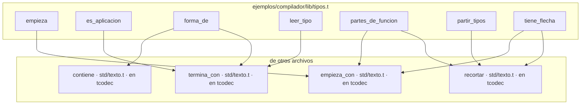

## ejemplos/compilador/tcodec.t (en tcodec)

```mermaid
graph TD
    subgraph ejemplos_compilador_tcodec["ejemplos/compilador/tcodec.t"]
        ejemplos_compilador_tcodec__ajustar_contextos["ajustar_contextos"]
        ejemplos_compilador_tcodec__apuntar_nombres["apuntar_nombres"]
        ejemplos_compilador_tcodec__apuntar_tipo_funcion["apuntar_tipo_funcion"]
        ejemplos_compilador_tcodec__aritmetica_usada["aritmetica_usada"]
        ejemplos_compilador_tcodec__ayudante_escribir_archivo["ayudante_escribir_archivo"]
        ejemplos_compilador_tcodec__ayudante_leer_archivo["ayudante_leer_archivo"]
        ejemplos_compilador_tcodec__ayudante_leer_parte_archivo["ayudante_leer_parte_archivo"]
        ejemplos_compilador_tcodec__con_prefijo["con_prefijo"]
        ejemplos_compilador_tcodec__construir["construir"]
        ejemplos_compilador_tcodec__copia_de["copia_de"]
        ejemplos_compilador_tcodec__copiar_sustituido["copiar_sustituido"]
        ejemplos_compilador_tcodec__cuerpo_copiador["cuerpo_copiador"]
        ejemplos_compilador_tcodec__cuerpo_enum_c["cuerpo_enum_c"]
        ejemplos_compilador_tcodec__declarar_tipos["declarar_tipos"]
        ejemplos_compilador_tcodec__definir_tipo_c["definir_tipo_c"]
        ejemplos_compilador_tcodec__definir_tipos["definir_tipos"]
        ejemplos_compilador_tcodec__dependencias_de_agregado["dependencias_de_agregado"]
        ejemplos_compilador_tcodec__descubrir["descubrir"]
        ejemplos_compilador_tcodec__emitir_funcion["emitir_funcion"]
        ejemplos_compilador_tcodec__ensamblar_c["ensamblar_c"]
        ejemplos_compilador_tcodec__envolver_arreglo_c["envolver_arreglo_c"]
        ejemplos_compilador_tcodec__es_compuesto_t["es_compuesto_t"]
        ejemplos_compilador_tcodec__escribir_de_una_vez["escribir_de_una_vez"]
        ejemplos_compilador_tcodec__formatear_archivo["formatear_archivo"]
        ejemplos_compilador_tcodec__funcion_bloque["funcion_bloque"]
        ejemplos_compilador_tcodec__funcion_mapa["funcion_mapa"]
        ejemplos_compilador_tcodec__funcion_ordenar["funcion_ordenar"]
        ejemplos_compilador_tcodec__funcion_push["funcion_push"]
        ejemplos_compilador_tcodec__generar_copiadores["generar_copiadores"]
        ejemplos_compilador_tcodec__generar_funciones["generar_funciones"]
        ejemplos_compilador_tcodec__generar_soporte["generar_soporte"]
        ejemplos_compilador_tcodec__internas_del_sistema["internas_del_sistema"]
        ejemplos_compilador_tcodec__leer_opciones["leer_opciones"]
        ejemplos_compilador_tcodec__leer_programa["leer_programa"]
        ejemplos_compilador_tcodec__linea_arreglo["linea_arreglo"]
        ejemplos_compilador_tcodec__lineas_liberacion["lineas_liberacion"]
        ejemplos_compilador_tcodec__locales_de["locales_de"]
        ejemplos_compilador_tcodec__main["main"]
        ejemplos_compilador_tcodec__mirar_bloque["mirar_bloque"]
        ejemplos_compilador_tcodec__mirar_funcion["mirar_funcion"]
        ejemplos_compilador_tcodec__mirar_tapadas["mirar_tapadas"]
        ejemplos_compilador_tcodec__mirar_tipo["mirar_tipo"]
        ejemplos_compilador_tcodec__necesita_copiador["necesita_copiador"]
        ejemplos_compilador_tcodec__nodo_instancia["nodo_instancia"]
        ejemplos_compilador_tcodec__nombre_de_declaracion["nombre_de_declaracion"]
        ejemplos_compilador_tcodec__nombre_de_param["nombre_de_param"]
        ejemplos_compilador_tcodec__nombres_con_raya["nombres_con_raya"]
        ejemplos_compilador_tcodec__numerar_cierres["numerar_cierres"]
        ejemplos_compilador_tcodec__poner_typedef["poner_typedef"]
        ejemplos_compilador_tcodec__preparar_cierres["preparar_cierres"]
        ejemplos_compilador_tcodec__preparar_instancias["preparar_instancias"]
        ejemplos_compilador_tcodec__programa_no_leido["programa_no_leido"]
        ejemplos_compilador_tcodec__prototipo_externo["prototipo_externo"]
        ejemplos_compilador_tcodec__raiz_instalada["raiz_instalada"]
        ejemplos_compilador_tcodec__registrar_resultado["registrar_resultado"]
        ejemplos_compilador_tcodec__resolver["resolver"]
        ejemplos_compilador_tcodec__resolver_en_nodo["resolver_en_nodo"]
        ejemplos_compilador_tcodec__resolver_reg["resolver_reg"]
        ejemplos_compilador_tcodec__resultados_de_internas["resultados_de_internas"]
        ejemplos_compilador_tcodec__revisar_nombres["revisar_nombres"]
        ejemplos_compilador_tcodec__revisar_usos_generados["revisar_usos_generados"]
        ejemplos_compilador_tcodec__ruta_del_ejecutable["ruta_del_ejecutable"]
        ejemplos_compilador_tcodec__sin_pedir["sin_pedir"]
        ejemplos_compilador_tcodec__soltar_enums["soltar_enums"]
        ejemplos_compilador_tcodec__soltar_structs["soltar_structs"]
        ejemplos_compilador_tcodec__tiene_main["tiene_main"]
        ejemplos_compilador_tcodec__tipo_de_nombre_mapa["tipo_de_nombre_mapa"]
        ejemplos_compilador_tcodec__tipo_obtener["tipo_obtener"]
        ejemplos_compilador_tcodec__tipos_funcion_de["tipos_funcion_de"]
        ejemplos_compilador_tcodec__tipos_funcion_usados["tipos_funcion_usados"]
        ejemplos_compilador_tcodec__typedef_resultado["typedef_resultado"]
        ejemplos_compilador_tcodec__usar_con_alias["usar_con_alias"]
        ejemplos_compilador_tcodec__usar_de["usar_de"]
        ejemplos_compilador_tcodec__visitar["visitar"]
        ejemplos_compilador_tcodec__visitar_struct["visitar_struct"]
    end
    subgraph fuera["de otros archivos"]
        ejemplos_compilador_lib_comprobar__comprobar_programa["comprobar_programa · ejemplos/compilador/lib/comprobar.t · en tcodec"]
        ejemplos_compilador_lib_comprobar__nombra_interna["nombra_interna · ejemplos/compilador/lib/comprobar.t · en tcodec"]
        ejemplos_compilador_lib_formato__formatear["formatear · ejemplos/compilador/lib/formato.t · en tcodec"]
        ejemplos_compilador_lib_generar__cuerpo["cuerpo · ejemplos/compilador/lib/generar.t · en tcodec"]
        ejemplos_compilador_lib_generar__escrito["escrito · ejemplos/compilador/lib/generar.t · en tcodec"]
        ejemplos_compilador_lib_generar__etiqueta["etiqueta · ejemplos/compilador/lib/generar.t · en tcodec"]
        ejemplos_compilador_lib_generar__legible_c["legible_c · ejemplos/compilador/lib/generar.t · en tcodec"]
        ejemplos_compilador_lib_generar__liberacion["liberacion · ejemplos/compilador/lib/generar.t · en tcodec"]
        ejemplos_compilador_lib_generar__mangle["mangle · ejemplos/compilador/lib/generar.t · en tcodec"]
        ejemplos_compilador_lib_generar__nombre_declarado["nombre_declarado · ejemplos/compilador/lib/generar.t · en tcodec"]
        ejemplos_compilador_lib_generar__tipo_c["tipo_c · ejemplos/compilador/lib/generar.t · en tcodec"]
        ejemplos_compilador_lib_generar__tipo_escrito["tipo_escrito · ejemplos/compilador/lib/generar.t · en tcodec"]
        ejemplos_compilador_lib_generar__tipo_resultado["tipo_resultado · ejemplos/compilador/lib/generar.t · en tcodec"]
        ejemplos_compilador_lib_programa__cuenta_nueva["cuenta_nueva · ejemplos/compilador/lib/programa.t · en tcodec"]
        ejemplos_compilador_lib_programa__es_generica["es_generica · ejemplos/compilador/lib/programa.t · en tcodec"]
        ejemplos_compilador_lib_programa__generar_funcion["generar_funcion · ejemplos/compilador/lib/programa.t · en tcodec"]
        ejemplos_compilador_lib_programa__nombre_de["nombre_de · ejemplos/compilador/lib/programa.t · en tcodec"]
        ejemplos_compilador_lib_programa__normalizar["normalizar · ejemplos/compilador/lib/programa.t · en tcodec"]
        ejemplos_compilador_lib_programa__prefijo_unico["prefijo_unico · ejemplos/compilador/lib/programa.t · en tcodec"]
        ejemplos_compilador_lib_programa__preparar_con_error["preparar_con_error · ejemplos/compilador/lib/programa.t · en tcodec"]
        ejemplos_compilador_lib_programa__quitar_alias_de_tipos["quitar_alias_de_tipos · ejemplos/compilador/lib/programa.t · en tcodec"]
        ejemplos_compilador_lib_programa__recoger_firmas["recoger_firmas · ejemplos/compilador/lib/programa.t · en tcodec"]
        ejemplos_compilador_lib_programa__tipo_pelado["tipo_pelado · ejemplos/compilador/lib/programa.t · en tcodec"]
        ejemplos_compilador_lib_tipar__abrir["abrir · ejemplos/compilador/lib/tipar.t · en tcodec"]
        ejemplos_compilador_lib_tipar__antes_del_punto["antes_del_punto · ejemplos/compilador/lib/tipar.t · en tcodec"]
        ejemplos_compilador_lib_tipar__cerrar["cerrar · ejemplos/compilador/lib/tipar.t · en tcodec"]
        ejemplos_compilador_lib_tipar__contexto["contexto · ejemplos/compilador/lib/tipar.t · en tcodec"]
        ejemplos_compilador_lib_tipar__declarar["declarar · ejemplos/compilador/lib/tipar.t · en tcodec"]
        ejemplos_compilador_lib_tipar__firma_de_funcion["firma_de_funcion · ejemplos/compilador/lib/tipar.t · en tcodec"]
        ejemplos_compilador_lib_tipar__funcion_de_cierre["funcion_de_cierre · ejemplos/compilador/lib/tipar.t · en tcodec"]
        ejemplos_compilador_lib_tipar__lista_de["lista_de · ejemplos/compilador/lib/tipar.t · en tcodec"]
        ejemplos_compilador_lib_tipar__nombre_resuelto["nombre_resuelto · ejemplos/compilador/lib/tipar.t · en tcodec"]
        ejemplos_compilador_lib_tipar__posee_con_formas["posee_con_formas · ejemplos/compilador/lib/tipar.t · en tcodec"]
        ejemplos_compilador_lib_tipar__tipo_de["tipo_de · ejemplos/compilador/lib/tipar.t · en tcodec"]
        ejemplos_compilador_lib_tipos__apuntado_si["apuntado_si · ejemplos/compilador/lib/tipos.t · en tcodec"]
        ejemplos_compilador_lib_tipos__arreglos_dentro["arreglos_dentro · ejemplos/compilador/lib/tipos.t · en tcodec"]
        ejemplos_compilador_lib_tipos__base_de_aplicacion["base_de_aplicacion · ejemplos/compilador/lib/tipos.t · en tcodec"]
        ejemplos_compilador_lib_tipos__con_partes["con_partes · ejemplos/compilador/lib/tipos.t · en tcodec"]
        ejemplos_compilador_lib_tipos__elemento["elemento · ejemplos/compilador/lib/tipos.t · en tcodec"]
        ejemplos_compilador_lib_tipos__es_aplicacion["es_aplicacion · ejemplos/compilador/lib/tipos.t · en tcodec"]
        ejemplos_compilador_lib_tipos__es_arreglo["es_arreglo · ejemplos/compilador/lib/tipos.t · en tcodec"]
        ejemplos_compilador_lib_tipos__es_bloque["es_bloque · ejemplos/compilador/lib/tipos.t · en tcodec"]
        ejemplos_compilador_lib_tipos__es_de_nombre["es_de_nombre · ejemplos/compilador/lib/tipos.t · en tcodec"]
        ejemplos_compilador_lib_tipos__es_funcion["es_funcion · ejemplos/compilador/lib/tipos.t · en tcodec"]
        ejemplos_compilador_lib_tipos__es_lista["es_lista · ejemplos/compilador/lib/tipos.t · en tcodec"]
        ejemplos_compilador_lib_tipos__es_mapa["es_mapa · ejemplos/compilador/lib/tipos.t · en tcodec"]
        ejemplos_compilador_lib_tipos__es_referencia["es_referencia · ejemplos/compilador/lib/tipos.t · en tcodec"]
        ejemplos_compilador_lib_tipos__escribir_tipo["escribir_tipo · ejemplos/compilador/lib/tipos.t · en tcodec"]
        ejemplos_compilador_lib_tipos__hacer_lista["hacer_lista · ejemplos/compilador/lib/tipos.t · en tcodec"]
        ejemplos_compilador_lib_tipos__hacer_prestado["hacer_prestado · ejemplos/compilador/lib/tipos.t · en tcodec"]
        ejemplos_compilador_lib_tipos__hacer_prestado_mut["hacer_prestado_mut · ejemplos/compilador/lib/tipos.t · en tcodec"]
        ejemplos_compilador_lib_tipos__leer_tipos["leer_tipos · ejemplos/compilador/lib/tipos.t · en tcodec"]
        ejemplos_compilador_lib_tipos__lleva_bloque_o_arreglo["lleva_bloque_o_arreglo · ejemplos/compilador/lib/tipos.t · en tcodec"]
        ejemplos_compilador_lib_tipos__nombre_de_copia["nombre_de_copia · ejemplos/compilador/lib/tipos.t · en tcodec"]
        ejemplos_compilador_lib_tipos__partes["partes · ejemplos/compilador/lib/tipos.t · en tcodec"]
        ejemplos_compilador_lib_tipos__partes_de_arreglo["partes_de_arreglo · ejemplos/compilador/lib/tipos.t · en tcodec"]
        ejemplos_compilador_lib_tipos__partes_de_funcion["partes_de_funcion · ejemplos/compilador/lib/tipos.t · en tcodec"]
        ejemplos_compilador_lib_tipos__sin_alias_tipo["sin_alias_tipo · ejemplos/compilador/lib/tipos.t · en tcodec"]
        ejemplos_compilador_lib_tipos__sustituir["sustituir · ejemplos/compilador/lib/tipos.t · en tcodec"]
        ejemplos_compilador_lib_tipos__tipos_de_mapa["tipos_de_mapa · ejemplos/compilador/lib/tipos.t · en tcodec"]
        ejemplos_lexer_lib_clase__nombre_de_clase["nombre_de_clase · ejemplos/lexer/lib/clase.t · en tcodec"]
        ejemplos_lexer_lib_lexico__analizar["analizar · ejemplos/lexer/lib/lexico.t · en tcodec"]
        ejemplos_lexer_lib_lexico__repr_texto["repr_texto · ejemplos/lexer/lib/lexico.t · en tcodec"]
        ejemplos_lexer_lib_sintaxis__carpeta["carpeta · ejemplos/lexer/lib/sintaxis.t · en tcodec"]
        ejemplos_lexer_lib_sintaxis__leidos_en["leidos_en · ejemplos/lexer/lib/sintaxis.t · en tcodec"]
        ejemplos_lexer_lib_sintaxis__rama["rama · ejemplos/lexer/lib/sintaxis.t · en tcodec"]
        std_archivo__borrar["borrar · std/archivo.t · en tcodec"]
        std_archivo__es_archivo["es_archivo · std/archivo.t · en tcodec"]
        std_archivo__instalar["instalar · std/archivo.t · en tcodec"]
        std_archivo__misma_ruta["misma_ruta · std/archivo.t · en tcodec"]
        std_archivo__ruta_real["ruta_real · std/archivo.t · en tcodec"]
        std_archivo__temporal_junto["temporal_junto · std/archivo.t · en tcodec"]
        std_entorno__directorio_temporal["directorio_temporal · std/entorno.t · en tcodec"]
        std_proceso__ejecutar["ejecutar · std/proceso.t · en tcodec"]
        std_texto__a_entero["a_entero · std/texto.t · en tcodec"]
        std_texto__contiene["contiene · std/texto.t · en tcodec"]
        std_texto__empieza_con["empieza_con · std/texto.t · en tcodec"]
        std_texto__partir["partir · std/texto.t · en tcodec"]
        std_texto__recortar["recortar · std/texto.t · en tcodec"]
        std_texto__reemplazar["reemplazar · std/texto.t · en tcodec"]
        std_texto__termina_con["termina_con · std/texto.t · en tcodec"]
    end

    ejemplos_compilador_tcodec__ajustar_contextos --> ejemplos_compilador_lib_programa__prefijo_unico
    ejemplos_compilador_tcodec__ajustar_contextos --> ejemplos_compilador_lib_tipar__lista_de
    ejemplos_compilador_tcodec__ajustar_contextos --> ejemplos_compilador_lib_tipos__tipos_de_mapa
    ejemplos_compilador_tcodec__ajustar_contextos --> ejemplos_lexer_lib_sintaxis__carpeta
    ejemplos_compilador_tcodec__apuntar_nombres --> ejemplos_compilador_lib_tipos__es_de_nombre
    ejemplos_compilador_tcodec__apuntar_tipo_funcion --> ejemplos_compilador_lib_tipos__apuntado_si
    ejemplos_compilador_tcodec__apuntar_tipo_funcion --> ejemplos_compilador_lib_tipos__es_funcion
    ejemplos_compilador_tcodec__apuntar_tipo_funcion --> ejemplos_compilador_lib_tipos__partes_de_funcion
    ejemplos_compilador_tcodec__aritmetica_usada --> ejemplos_compilador_lib_generar__tipo_c
    ejemplos_compilador_tcodec__aritmetica_usada --> std_texto__empieza_con
    ejemplos_compilador_tcodec__ayudante_escribir_archivo --> ejemplos_compilador_lib_generar__tipo_resultado
    ejemplos_compilador_tcodec__ayudante_leer_archivo --> ejemplos_compilador_lib_generar__tipo_resultado
    ejemplos_compilador_tcodec__ayudante_leer_parte_archivo --> ejemplos_compilador_lib_generar__tipo_resultado
    ejemplos_compilador_tcodec__con_prefijo --> std_texto__empieza_con
    ejemplos_compilador_tcodec__construir --> std_archivo__borrar
    ejemplos_compilador_tcodec__construir --> std_archivo__es_archivo
    ejemplos_compilador_tcodec__construir --> std_archivo__instalar
    ejemplos_compilador_tcodec__construir --> std_archivo__misma_ruta
    ejemplos_compilador_tcodec__construir --> std_archivo__ruta_real
    ejemplos_compilador_tcodec__construir --> std_archivo__temporal_junto
    ejemplos_compilador_tcodec__construir --> std_entorno__directorio_temporal
    ejemplos_compilador_tcodec__construir --> std_proceso__ejecutar
    ejemplos_compilador_tcodec__construir --> std_texto__contiene
    ejemplos_compilador_tcodec__construir --> std_texto__recortar
    ejemplos_compilador_tcodec__construir --> std_texto__termina_con
    ejemplos_compilador_tcodec__copia_de --> ejemplos_compilador_lib_generar__mangle
    ejemplos_compilador_tcodec__copia_de --> ejemplos_compilador_lib_tipar__posee_con_formas
    ejemplos_compilador_tcodec__copiar_sustituido --> ejemplos_compilador_lib_tipos__sustituir
    ejemplos_compilador_tcodec__copiar_sustituido --> ejemplos_lexer_lib_sintaxis__rama
    ejemplos_compilador_tcodec__cuerpo_copiador --> ejemplos_compilador_lib_generar__etiqueta
    ejemplos_compilador_tcodec__cuerpo_copiador --> ejemplos_compilador_lib_generar__mangle
    ejemplos_compilador_tcodec__cuerpo_copiador --> ejemplos_compilador_lib_generar__tipo_c
    ejemplos_compilador_tcodec__cuerpo_copiador --> ejemplos_compilador_lib_tipar__posee_con_formas
    ejemplos_compilador_tcodec__cuerpo_copiador --> ejemplos_compilador_lib_tipos__elemento
    ejemplos_compilador_tcodec__cuerpo_copiador --> ejemplos_compilador_lib_tipos__es_arreglo
    ejemplos_compilador_tcodec__cuerpo_copiador --> ejemplos_compilador_lib_tipos__es_bloque
    ejemplos_compilador_tcodec__cuerpo_copiador --> ejemplos_compilador_lib_tipos__es_lista
    ejemplos_compilador_tcodec__cuerpo_copiador --> ejemplos_compilador_lib_tipos__es_mapa
    ejemplos_compilador_tcodec__cuerpo_copiador --> ejemplos_compilador_lib_tipos__partes
    ejemplos_compilador_tcodec__cuerpo_copiador --> ejemplos_compilador_lib_tipos__partes_de_arreglo
    ejemplos_compilador_tcodec__cuerpo_enum_c --> ejemplos_compilador_lib_generar__tipo_c
    ejemplos_compilador_tcodec__declarar_tipos --> ejemplos_compilador_lib_generar__etiqueta
    ejemplos_compilador_tcodec__declarar_tipos --> ejemplos_compilador_lib_generar__tipo_c
    ejemplos_compilador_tcodec__declarar_tipos --> ejemplos_compilador_lib_tipos__es_arreglo
    ejemplos_compilador_tcodec__definir_tipo_c --> ejemplos_compilador_lib_generar__tipo_c
    ejemplos_compilador_tcodec__definir_tipo_c --> ejemplos_compilador_lib_tipos__es_arreglo
    ejemplos_compilador_tcodec__definir_tipos --> ejemplos_compilador_lib_tipar__posee_con_formas
    ejemplos_compilador_tcodec__definir_tipos --> ejemplos_compilador_lib_tipos__arreglos_dentro
    ejemplos_compilador_tcodec__dependencias_de_agregado --> ejemplos_compilador_lib_tipos__elemento
    ejemplos_compilador_tcodec__dependencias_de_agregado --> ejemplos_compilador_lib_tipos__es_bloque
    ejemplos_compilador_tcodec__dependencias_de_agregado --> ejemplos_compilador_lib_tipos__es_lista
    ejemplos_compilador_tcodec__dependencias_de_agregado --> ejemplos_compilador_lib_tipos__partes
    ejemplos_compilador_tcodec__descubrir --> ejemplos_compilador_lib_programa__cuenta_nueva
    ejemplos_compilador_tcodec__descubrir --> ejemplos_compilador_lib_programa__generar_funcion
    ejemplos_compilador_tcodec__descubrir --> ejemplos_compilador_lib_tipos__leer_tipos
    ejemplos_compilador_tcodec__emitir_funcion --> ejemplos_compilador_lib_programa__generar_funcion
    ejemplos_compilador_tcodec__emitir_funcion --> std_texto__empieza_con
    ejemplos_compilador_tcodec__ensamblar_c --> std_texto__contiene
    ejemplos_compilador_tcodec__ensamblar_c --> std_texto__empieza_con
    ejemplos_compilador_tcodec__ensamblar_c --> std_texto__termina_con
    ejemplos_compilador_tcodec__envolver_arreglo_c --> ejemplos_compilador_lib_tipos__es_arreglo
    ejemplos_compilador_tcodec__envolver_arreglo_c --> ejemplos_compilador_lib_tipos__partes_de_arreglo
    ejemplos_compilador_tcodec__es_compuesto_t --> ejemplos_compilador_lib_tipos__es_arreglo
    ejemplos_compilador_tcodec__es_compuesto_t --> ejemplos_compilador_lib_tipos__es_bloque
    ejemplos_compilador_tcodec__es_compuesto_t --> ejemplos_compilador_lib_tipos__es_lista
    ejemplos_compilador_tcodec__es_compuesto_t --> ejemplos_compilador_lib_tipos__es_mapa
    ejemplos_compilador_tcodec__escribir_de_una_vez --> std_archivo__borrar
    ejemplos_compilador_tcodec__escribir_de_una_vez --> std_archivo__instalar
    ejemplos_compilador_tcodec__escribir_de_una_vez --> std_archivo__ruta_real
    ejemplos_compilador_tcodec__escribir_de_una_vez --> std_archivo__temporal_junto
    ejemplos_compilador_tcodec__formatear_archivo --> ejemplos_compilador_lib_formato__formatear
    ejemplos_compilador_tcodec__funcion_bloque --> ejemplos_compilador_lib_generar__mangle
    ejemplos_compilador_tcodec__funcion_bloque --> ejemplos_compilador_lib_generar__tipo_c
    ejemplos_compilador_tcodec__funcion_bloque --> ejemplos_compilador_lib_tipar__posee_con_formas
    ejemplos_compilador_tcodec__funcion_bloque --> ejemplos_compilador_lib_tipos__elemento
    ejemplos_compilador_tcodec__funcion_mapa --> ejemplos_compilador_lib_generar__mangle
    ejemplos_compilador_tcodec__funcion_mapa --> ejemplos_compilador_lib_generar__tipo_c
    ejemplos_compilador_tcodec__funcion_mapa --> ejemplos_compilador_lib_generar__tipo_resultado
    ejemplos_compilador_tcodec__funcion_mapa --> ejemplos_compilador_lib_tipar__posee_con_formas
    ejemplos_compilador_tcodec__funcion_mapa --> ejemplos_compilador_lib_tipos__hacer_lista
    ejemplos_compilador_tcodec__funcion_mapa --> ejemplos_compilador_lib_tipos__hacer_prestado_mut
    ejemplos_compilador_tcodec__funcion_mapa --> ejemplos_compilador_lib_tipos__partes
    ejemplos_compilador_tcodec__funcion_ordenar --> ejemplos_compilador_lib_generar__mangle
    ejemplos_compilador_tcodec__funcion_ordenar --> ejemplos_compilador_lib_generar__tipo_c
    ejemplos_compilador_tcodec__funcion_ordenar --> ejemplos_compilador_lib_tipos__elemento
    ejemplos_compilador_tcodec__funcion_push --> ejemplos_compilador_lib_generar__mangle
    ejemplos_compilador_tcodec__funcion_push --> ejemplos_compilador_lib_generar__tipo_c
    ejemplos_compilador_tcodec__funcion_push --> ejemplos_compilador_lib_tipos__elemento
    ejemplos_compilador_tcodec__generar_copiadores --> ejemplos_compilador_lib_generar__mangle
    ejemplos_compilador_tcodec__generar_copiadores --> ejemplos_compilador_lib_generar__tipo_c
    ejemplos_compilador_tcodec__generar_copiadores --> ejemplos_compilador_lib_tipar__nombre_resuelto
    ejemplos_compilador_tcodec__generar_funciones --> ejemplos_compilador_lib_programa__es_generica
    ejemplos_compilador_tcodec__generar_soporte --> ejemplos_compilador_lib_programa__cuenta_nueva
    ejemplos_compilador_tcodec__internas_del_sistema --> ejemplos_compilador_lib_generar__tipo_resultado
    ejemplos_compilador_tcodec__internas_del_sistema --> std_texto__reemplazar
    ejemplos_compilador_tcodec__leer_opciones --> std_archivo__es_archivo
    ejemplos_compilador_tcodec__leer_opciones --> std_texto__empieza_con
    ejemplos_compilador_tcodec__leer_programa --> ejemplos_compilador_lib_programa__es_generica
    ejemplos_compilador_tcodec__leer_programa --> ejemplos_compilador_lib_programa__nombre_de
    ejemplos_compilador_tcodec__leer_programa --> ejemplos_compilador_lib_programa__normalizar
    ejemplos_compilador_tcodec__leer_programa --> ejemplos_compilador_lib_programa__preparar_con_error
    ejemplos_compilador_tcodec__leer_programa --> ejemplos_compilador_lib_programa__quitar_alias_de_tipos
    ejemplos_compilador_tcodec__leer_programa --> ejemplos_compilador_lib_programa__recoger_firmas
    ejemplos_compilador_tcodec__leer_programa --> ejemplos_compilador_lib_programa__tipo_pelado
    ejemplos_compilador_tcodec__leer_programa --> ejemplos_compilador_lib_tipar__contexto
    ejemplos_compilador_tcodec__leer_programa --> ejemplos_compilador_lib_tipos__lleva_bloque_o_arreglo
    ejemplos_compilador_tcodec__leer_programa --> ejemplos_compilador_lib_tipos__sin_alias_tipo
    ejemplos_compilador_tcodec__leer_programa --> ejemplos_lexer_lib_clase__nombre_de_clase
    ejemplos_compilador_tcodec__leer_programa --> ejemplos_lexer_lib_sintaxis__leidos_en
    ejemplos_compilador_tcodec__leer_programa --> ejemplos_lexer_lib_sintaxis__rama
    ejemplos_compilador_tcodec__linea_arreglo --> ejemplos_compilador_lib_generar__tipo_c
    ejemplos_compilador_tcodec__linea_arreglo --> ejemplos_compilador_lib_tipos__partes_de_arreglo
    ejemplos_compilador_tcodec__lineas_liberacion --> ejemplos_compilador_lib_generar__cuerpo
    ejemplos_compilador_tcodec__lineas_liberacion --> ejemplos_compilador_lib_generar__liberacion
    ejemplos_compilador_tcodec__locales_de --> std_texto__recortar
    ejemplos_compilador_tcodec__main --> ejemplos_compilador_lib_comprobar__comprobar_programa
    ejemplos_compilador_tcodec__main --> ejemplos_compilador_lib_programa__es_generica
    ejemplos_compilador_tcodec__main --> ejemplos_compilador_lib_programa__tipo_pelado
    ejemplos_compilador_tcodec__mirar_bloque --> ejemplos_compilador_lib_generar__nombre_declarado
    ejemplos_compilador_tcodec__mirar_bloque --> ejemplos_compilador_lib_generar__tipo_escrito
    ejemplos_compilador_tcodec__mirar_bloque --> ejemplos_compilador_lib_tipar__abrir
    ejemplos_compilador_tcodec__mirar_bloque --> ejemplos_compilador_lib_tipar__cerrar
    ejemplos_compilador_tcodec__mirar_bloque --> ejemplos_compilador_lib_tipar__declarar
    ejemplos_compilador_tcodec__mirar_bloque --> ejemplos_compilador_lib_tipar__tipo_de
    ejemplos_compilador_tcodec__mirar_bloque --> ejemplos_compilador_lib_tipos__escribir_tipo
    ejemplos_compilador_tcodec__mirar_funcion --> ejemplos_compilador_lib_programa__nombre_de
    ejemplos_compilador_tcodec__mirar_funcion --> ejemplos_compilador_lib_programa__tipo_pelado
    ejemplos_compilador_tcodec__mirar_funcion --> ejemplos_compilador_lib_tipar__abrir
    ejemplos_compilador_tcodec__mirar_funcion --> ejemplos_compilador_lib_tipar__cerrar
    ejemplos_compilador_tcodec__mirar_funcion --> ejemplos_compilador_lib_tipar__declarar
    ejemplos_compilador_tcodec__mirar_tapadas --> std_texto__recortar
    ejemplos_compilador_tcodec__mirar_tipo --> ejemplos_compilador_lib_tipar__nombre_resuelto
    ejemplos_compilador_tcodec__mirar_tipo --> ejemplos_compilador_lib_tipos__elemento
    ejemplos_compilador_tcodec__mirar_tipo --> ejemplos_compilador_lib_tipos__es_arreglo
    ejemplos_compilador_tcodec__mirar_tipo --> ejemplos_compilador_lib_tipos__es_bloque
    ejemplos_compilador_tcodec__mirar_tipo --> ejemplos_compilador_lib_tipos__es_lista
    ejemplos_compilador_tcodec__mirar_tipo --> ejemplos_compilador_lib_tipos__es_mapa
    ejemplos_compilador_tcodec__mirar_tipo --> ejemplos_compilador_lib_tipos__es_referencia
    ejemplos_compilador_tcodec__mirar_tipo --> ejemplos_compilador_lib_tipos__hacer_lista
    ejemplos_compilador_tcodec__mirar_tipo --> ejemplos_compilador_lib_tipos__hacer_prestado_mut
    ejemplos_compilador_tcodec__mirar_tipo --> ejemplos_compilador_lib_tipos__lleva_bloque_o_arreglo
    ejemplos_compilador_tcodec__mirar_tipo --> ejemplos_compilador_lib_tipos__partes
    ejemplos_compilador_tcodec__mirar_tipo --> ejemplos_compilador_lib_tipos__partes_de_arreglo
    ejemplos_compilador_tcodec__mirar_tipo --> std_texto__contiene
    ejemplos_compilador_tcodec__necesita_copiador --> ejemplos_compilador_lib_tipar__lista_de
    ejemplos_compilador_tcodec__necesita_copiador --> ejemplos_compilador_lib_tipar__posee_con_formas
    ejemplos_compilador_tcodec__necesita_copiador --> ejemplos_compilador_lib_tipos__elemento
    ejemplos_compilador_tcodec__necesita_copiador --> ejemplos_compilador_lib_tipos__es_arreglo
    ejemplos_compilador_tcodec__necesita_copiador --> ejemplos_compilador_lib_tipos__es_bloque
    ejemplos_compilador_tcodec__necesita_copiador --> ejemplos_compilador_lib_tipos__es_lista
    ejemplos_compilador_tcodec__necesita_copiador --> ejemplos_compilador_lib_tipos__es_mapa
    ejemplos_compilador_tcodec__necesita_copiador --> ejemplos_compilador_lib_tipos__escribir_tipo
    ejemplos_compilador_tcodec__necesita_copiador --> ejemplos_compilador_lib_tipos__partes
    ejemplos_compilador_tcodec__necesita_copiador --> ejemplos_compilador_lib_tipos__partes_de_arreglo
    ejemplos_compilador_tcodec__necesita_copiador --> ejemplos_compilador_lib_tipos__tipos_de_mapa
    ejemplos_compilador_tcodec__nodo_instancia --> ejemplos_lexer_lib_sintaxis__rama
    ejemplos_compilador_tcodec__nombre_de_declaracion --> std_texto__recortar
    ejemplos_compilador_tcodec__nombre_de_param --> std_texto__recortar
    ejemplos_compilador_tcodec__nombres_con_raya --> ejemplos_compilador_lib_tipos__es_de_nombre
    ejemplos_compilador_tcodec__numerar_cierres --> ejemplos_lexer_lib_sintaxis__rama
    ejemplos_compilador_tcodec__poner_typedef --> ejemplos_compilador_lib_generar__tipo_c
    ejemplos_compilador_tcodec__poner_typedef --> ejemplos_compilador_lib_tipos__elemento
    ejemplos_compilador_tcodec__poner_typedef --> ejemplos_compilador_lib_tipos__es_bloque
    ejemplos_compilador_tcodec__poner_typedef --> ejemplos_compilador_lib_tipos__es_lista
    ejemplos_compilador_tcodec__poner_typedef --> ejemplos_compilador_lib_tipos__partes
    ejemplos_compilador_tcodec__preparar_cierres --> ejemplos_compilador_lib_programa__es_generica
    ejemplos_compilador_tcodec__preparar_cierres --> ejemplos_compilador_lib_programa__recoger_firmas
    ejemplos_compilador_tcodec__preparar_instancias --> ejemplos_compilador_lib_programa__cuenta_nueva
    ejemplos_compilador_tcodec__preparar_instancias --> ejemplos_compilador_lib_programa__es_generica
    ejemplos_compilador_tcodec__preparar_instancias --> ejemplos_compilador_lib_programa__generar_funcion
    ejemplos_compilador_tcodec__preparar_instancias --> ejemplos_compilador_lib_tipos__leer_tipos
    ejemplos_compilador_tcodec__programa_no_leido --> ejemplos_compilador_lib_tipar__contexto
    ejemplos_compilador_tcodec__prototipo_externo --> ejemplos_compilador_lib_generar__tipo_c
    ejemplos_compilador_tcodec__raiz_instalada --> std_archivo__es_archivo
    ejemplos_compilador_tcodec__registrar_resultado --> ejemplos_compilador_lib_tipar__nombre_resuelto
    ejemplos_compilador_tcodec__resolver --> ejemplos_compilador_lib_programa__normalizar
    ejemplos_compilador_tcodec__resolver --> std_archivo__es_archivo
    ejemplos_compilador_tcodec__resolver --> std_texto__empieza_con
    ejemplos_compilador_tcodec__resolver --> std_texto__termina_con
    ejemplos_compilador_tcodec__resolver_en_nodo --> ejemplos_compilador_lib_generar__tipo_escrito
    ejemplos_compilador_tcodec__resolver_en_nodo --> ejemplos_compilador_lib_programa__tipo_pelado
    ejemplos_compilador_tcodec__resolver_reg --> ejemplos_compilador_lib_tipos__base_de_aplicacion
    ejemplos_compilador_tcodec__resolver_reg --> ejemplos_compilador_lib_tipos__con_partes
    ejemplos_compilador_tcodec__resolver_reg --> ejemplos_compilador_lib_tipos__es_aplicacion
    ejemplos_compilador_tcodec__resolver_reg --> ejemplos_compilador_lib_tipos__es_arreglo
    ejemplos_compilador_tcodec__resolver_reg --> ejemplos_compilador_lib_tipos__es_bloque
    ejemplos_compilador_tcodec__resolver_reg --> ejemplos_compilador_lib_tipos__es_lista
    ejemplos_compilador_tcodec__resolver_reg --> ejemplos_compilador_lib_tipos__es_mapa
    ejemplos_compilador_tcodec__resolver_reg --> ejemplos_compilador_lib_tipos__es_referencia
    ejemplos_compilador_tcodec__resolver_reg --> ejemplos_compilador_lib_tipos__leer_tipos
    ejemplos_compilador_tcodec__resolver_reg --> ejemplos_compilador_lib_tipos__nombre_de_copia
    ejemplos_compilador_tcodec__resolver_reg --> ejemplos_compilador_lib_tipos__partes
    ejemplos_compilador_tcodec__resolver_reg --> ejemplos_compilador_lib_tipos__sustituir
    ejemplos_compilador_tcodec__resolver_reg --> std_texto__contiene
    ejemplos_compilador_tcodec__resultados_de_internas --> ejemplos_compilador_lib_tipar__funcion_de_cierre
    ejemplos_compilador_tcodec__revisar_nombres --> ejemplos_compilador_lib_generar__escrito
    ejemplos_compilador_tcodec__revisar_nombres --> ejemplos_compilador_lib_generar__legible_c
    ejemplos_compilador_tcodec__revisar_nombres --> ejemplos_compilador_lib_programa__prefijo_unico
    ejemplos_compilador_tcodec__revisar_nombres --> ejemplos_lexer_lib_sintaxis__carpeta
    ejemplos_compilador_tcodec__revisar_usos_generados --> ejemplos_compilador_lib_generar__tipo_c
    ejemplos_compilador_tcodec__revisar_usos_generados --> ejemplos_compilador_lib_generar__tipo_resultado
    ejemplos_compilador_tcodec__revisar_usos_generados --> ejemplos_compilador_lib_tipos__arreglos_dentro
    ejemplos_compilador_tcodec__revisar_usos_generados --> ejemplos_compilador_lib_tipos__partes_de_arreglo
    ejemplos_compilador_tcodec__ruta_del_ejecutable --> std_archivo__es_archivo
    ejemplos_compilador_tcodec__ruta_del_ejecutable --> std_archivo__ruta_real
    ejemplos_compilador_tcodec__ruta_del_ejecutable --> std_texto__contiene
    ejemplos_compilador_tcodec__ruta_del_ejecutable --> std_texto__partir
    ejemplos_compilador_tcodec__sin_pedir --> ejemplos_compilador_lib_comprobar__nombra_interna
    ejemplos_compilador_tcodec__sin_pedir --> ejemplos_compilador_lib_tipar__antes_del_punto
    ejemplos_compilador_tcodec__soltar_enums --> ejemplos_compilador_lib_generar__etiqueta
    ejemplos_compilador_tcodec__soltar_enums --> ejemplos_compilador_lib_tipar__posee_con_formas
    ejemplos_compilador_tcodec__soltar_structs --> ejemplos_compilador_lib_generar__cuerpo
    ejemplos_compilador_tcodec__soltar_structs --> ejemplos_compilador_lib_generar__liberacion
    ejemplos_compilador_tcodec__soltar_structs --> ejemplos_compilador_lib_tipar__posee_con_formas
    ejemplos_compilador_tcodec__tiene_main --> ejemplos_lexer_lib_lexico__analizar
    ejemplos_compilador_tcodec__tipo_de_nombre_mapa --> std_texto__empieza_con
    ejemplos_compilador_tcodec__tipo_obtener --> ejemplos_compilador_lib_tipar__posee_con_formas
    ejemplos_compilador_tcodec__tipo_obtener --> ejemplos_compilador_lib_tipos__hacer_prestado
    ejemplos_compilador_tcodec__tipos_funcion_de --> ejemplos_compilador_lib_programa__tipo_pelado
    ejemplos_compilador_tcodec__tipos_funcion_usados --> ejemplos_compilador_lib_generar__tipo_c
    ejemplos_compilador_tcodec__tipos_funcion_usados --> ejemplos_compilador_lib_programa__es_generica
    ejemplos_compilador_tcodec__tipos_funcion_usados --> ejemplos_compilador_lib_tipar__firma_de_funcion
    ejemplos_compilador_tcodec__tipos_funcion_usados --> ejemplos_compilador_lib_tipos__partes_de_funcion
    ejemplos_compilador_tcodec__tipos_funcion_usados --> std_texto__contiene
    ejemplos_compilador_tcodec__typedef_resultado --> ejemplos_compilador_lib_generar__tipo_c
    ejemplos_compilador_tcodec__typedef_resultado --> ejemplos_compilador_lib_generar__tipo_resultado
    ejemplos_compilador_tcodec__usar_con_alias --> ejemplos_lexer_lib_lexico__analizar
    ejemplos_compilador_tcodec__usar_de --> ejemplos_lexer_lib_lexico__analizar
    ejemplos_compilador_tcodec__visitar --> ejemplos_lexer_lib_lexico__repr_texto
    ejemplos_compilador_tcodec__visitar --> ejemplos_lexer_lib_sintaxis__carpeta
    ejemplos_compilador_tcodec__visitar --> std_archivo__es_archivo
    ejemplos_compilador_tcodec__visitar --> std_texto__a_entero
    ejemplos_compilador_tcodec__visitar --> std_texto__contiene
    ejemplos_compilador_tcodec__visitar --> std_texto__empieza_con
    ejemplos_compilador_tcodec__visitar --> std_texto__termina_con
    ejemplos_compilador_tcodec__visitar_struct --> ejemplos_compilador_lib_tipos__es_arreglo
    ejemplos_compilador_tcodec__visitar_struct --> ejemplos_compilador_lib_tipos__partes_de_arreglo
```

## ejemplos/compilador/tipar.t (fuera de tcodec)

```mermaid
graph TD
    subgraph ejemplos_compilador_tipar["ejemplos/compilador/tipar.t"]
        ejemplos_compilador_tipar__anotar_propiedad["anotar_propiedad"]
        ejemplos_compilador_tipar__atrapar["atrapar"]
        ejemplos_compilador_tipar__elemento_de_bruto["elemento_de_bruto"]
        ejemplos_compilador_tipar__main["main"]
        ejemplos_compilador_tipar__mirar_modulo["mirar_modulo"]
        ejemplos_compilador_tipar__partir_angulos["partir_angulos"]
        ejemplos_compilador_tipar__primera_de["primera_de"]
        ejemplos_compilador_tipar__programa_o_vacio["programa_o_vacio"]
        ejemplos_compilador_tipar__quitar_prestamo["quitar_prestamo"]
        ejemplos_compilador_tipar__recoger_declaraciones["recoger_declaraciones"]
        ejemplos_compilador_tipar__recorrer["recorrer"]
        ejemplos_compilador_tipar__tipo_con_marca["tipo_con_marca"]
        ejemplos_compilador_tipar__tipo_de_declaracion["tipo_de_declaracion"]
        ejemplos_compilador_tipar__tipo_desnudo["tipo_desnudo"]
        ejemplos_compilador_tipar__try_partir["try_partir"]
        ejemplos_compilador_tipar__valor_de["valor_de"]
    end
    subgraph fuera["de otros archivos"]
        ejemplos_compilador_lib_propiedad__destino_de["destino_de · ejemplos/compilador/lib/propiedad.t · fuera de tcodec"]
        ejemplos_compilador_lib_propiedad__mirar["mirar · ejemplos/compilador/lib/propiedad.t · fuera de tcodec"]
        ejemplos_compilador_lib_propiedad__tiene_duenio["tiene_duenio · ejemplos/compilador/lib/propiedad.t · fuera de tcodec"]
        ejemplos_compilador_lib_propiedad__vigilar["vigilar · ejemplos/compilador/lib/propiedad.t · fuera de tcodec"]
        ejemplos_compilador_lib_tipar__abrir["abrir · ejemplos/compilador/lib/tipar.t · en tcodec"]
        ejemplos_compilador_lib_tipar__cerrar["cerrar · ejemplos/compilador/lib/tipar.t · en tcodec"]
        ejemplos_compilador_lib_tipar__contexto["contexto · ejemplos/compilador/lib/tipar.t · en tcodec"]
        ejemplos_compilador_lib_tipar__declarar["declarar · ejemplos/compilador/lib/tipar.t · en tcodec"]
        ejemplos_compilador_lib_tipar__nombre_resuelto["nombre_resuelto · ejemplos/compilador/lib/tipar.t · en tcodec"]
        ejemplos_compilador_lib_tipar__tipo_atrapado["tipo_atrapado · ejemplos/compilador/lib/tipar.t · en tcodec"]
        ejemplos_compilador_lib_tipar__tipo_de["tipo_de · ejemplos/compilador/lib/tipar.t · en tcodec"]
        ejemplos_compilador_lib_tipos__escribir_tipo["escribir_tipo · ejemplos/compilador/lib/tipos.t · en tcodec"]
        ejemplos_compilador_lib_tipos__leer_tipo["leer_tipo · ejemplos/compilador/lib/tipos.t · en tcodec"]
        ejemplos_compilador_lib_tipos__leer_tipos["leer_tipos · ejemplos/compilador/lib/tipos.t · en tcodec"]
        ejemplos_compilador_lib_tipos__sin_alias_tipo["sin_alias_tipo · ejemplos/compilador/lib/tipos.t · en tcodec"]
        ejemplos_compilador_lib_tipos__tipos_de_mapa["tipos_de_mapa · ejemplos/compilador/lib/tipos.t · en tcodec"]
        ejemplos_lexer_lib_lexico__analizar["analizar · ejemplos/lexer/lib/lexico.t · en tcodec"]
        ejemplos_lexer_lib_sintaxis__enums_visibles["enums_visibles · ejemplos/lexer/lib/sintaxis.t · en tcodec"]
        ejemplos_lexer_lib_sintaxis__estado_de["estado_de · ejemplos/lexer/lib/sintaxis.t · en tcodec"]
        ejemplos_lexer_lib_sintaxis__hoja["hoja · ejemplos/lexer/lib/sintaxis.t · en tcodec"]
        ejemplos_lexer_lib_sintaxis__programa["programa · ejemplos/lexer/lib/sintaxis.t · en tcodec"]
        ejemplos_lexer_lib_sintaxis__structs_visibles["structs_visibles · ejemplos/lexer/lib/sintaxis.t · en tcodec"]
        std_texto__empieza_con["empieza_con · std/texto.t · en tcodec"]
        std_texto__indice_de["indice_de · std/texto.t · en tcodec"]
        std_texto__recortar["recortar · std/texto.t · en tcodec"]
    end

    ejemplos_compilador_tipar__anotar_propiedad --> ejemplos_compilador_lib_propiedad__destino_de
    ejemplos_compilador_tipar__anotar_propiedad --> ejemplos_compilador_lib_propiedad__mirar
    ejemplos_compilador_tipar__anotar_propiedad --> ejemplos_compilador_lib_propiedad__tiene_duenio
    ejemplos_compilador_tipar__anotar_propiedad --> ejemplos_compilador_lib_propiedad__vigilar
    ejemplos_compilador_tipar__anotar_propiedad --> std_texto__empieza_con
    ejemplos_compilador_tipar__atrapar --> ejemplos_compilador_lib_tipar__declarar
    ejemplos_compilador_tipar__atrapar --> ejemplos_compilador_lib_tipar__tipo_atrapado
    ejemplos_compilador_tipar__atrapar --> ejemplos_compilador_lib_tipos__escribir_tipo
    ejemplos_compilador_tipar__atrapar --> ejemplos_compilador_lib_tipos__tipos_de_mapa
    ejemplos_compilador_tipar__elemento_de_bruto --> std_texto__empieza_con
    ejemplos_compilador_tipar__main --> ejemplos_compilador_lib_tipar__abrir
    ejemplos_compilador_tipar__main --> ejemplos_compilador_lib_tipar__cerrar
    ejemplos_compilador_tipar__main --> ejemplos_compilador_lib_tipar__contexto
    ejemplos_compilador_tipar__main --> ejemplos_compilador_lib_tipar__declarar
    ejemplos_compilador_tipar__main --> ejemplos_compilador_lib_tipar__nombre_resuelto
    ejemplos_compilador_tipar__main --> ejemplos_lexer_lib_lexico__analizar
    ejemplos_compilador_tipar__main --> ejemplos_lexer_lib_sintaxis__enums_visibles
    ejemplos_compilador_tipar__main --> ejemplos_lexer_lib_sintaxis__estado_de
    ejemplos_compilador_tipar__main --> ejemplos_lexer_lib_sintaxis__programa
    ejemplos_compilador_tipar__main --> ejemplos_lexer_lib_sintaxis__structs_visibles
    ejemplos_compilador_tipar__mirar_modulo --> ejemplos_lexer_lib_lexico__analizar
    ejemplos_compilador_tipar__mirar_modulo --> ejemplos_lexer_lib_sintaxis__enums_visibles
    ejemplos_compilador_tipar__mirar_modulo --> ejemplos_lexer_lib_sintaxis__estado_de
    ejemplos_compilador_tipar__mirar_modulo --> ejemplos_lexer_lib_sintaxis__structs_visibles
    ejemplos_compilador_tipar__partir_angulos --> std_texto__recortar
    ejemplos_compilador_tipar__primera_de --> std_texto__empieza_con
    ejemplos_compilador_tipar__programa_o_vacio --> ejemplos_lexer_lib_sintaxis__hoja
    ejemplos_compilador_tipar__programa_o_vacio --> ejemplos_lexer_lib_sintaxis__programa
    ejemplos_compilador_tipar__quitar_prestamo --> std_texto__empieza_con
    ejemplos_compilador_tipar__recoger_declaraciones --> ejemplos_compilador_lib_tipos__leer_tipo
    ejemplos_compilador_tipar__recoger_declaraciones --> ejemplos_compilador_lib_tipos__leer_tipos
    ejemplos_compilador_tipar__recoger_declaraciones --> ejemplos_compilador_lib_tipos__sin_alias_tipo
    ejemplos_compilador_tipar__recorrer --> ejemplos_compilador_lib_tipar__abrir
    ejemplos_compilador_tipar__recorrer --> ejemplos_compilador_lib_tipar__cerrar
    ejemplos_compilador_tipar__recorrer --> ejemplos_compilador_lib_tipar__declarar
    ejemplos_compilador_tipar__recorrer --> ejemplos_compilador_lib_tipar__tipo_de
    ejemplos_compilador_tipar__recorrer --> ejemplos_compilador_lib_tipos__escribir_tipo
    ejemplos_compilador_tipar__tipo_con_marca --> std_texto__recortar
    ejemplos_compilador_tipar__tipo_de_declaracion --> std_texto__empieza_con
    ejemplos_compilador_tipar__tipo_de_declaracion --> std_texto__indice_de
    ejemplos_compilador_tipar__tipo_de_declaracion --> std_texto__recortar
    ejemplos_compilador_tipar__tipo_desnudo --> std_texto__empieza_con
    ejemplos_compilador_tipar__tipo_desnudo --> std_texto__recortar
    ejemplos_compilador_tipar__try_partir --> std_texto__recortar
    ejemplos_compilador_tipar__valor_de --> std_texto__empieza_con
```

## ejemplos/compilador/tipos.t (fuera de tcodec)

```mermaid
graph TD
    subgraph ejemplos_compilador_tipos["ejemplos/compilador/tipos.t"]
        ejemplos_compilador_tipos__main["main"]
        ejemplos_compilador_tipos__posee_de["posee_de"]
        ejemplos_compilador_tipos__tras_dos_puntos["tras_dos_puntos"]
    end
    subgraph fuera["de otros archivos"]
        ejemplos_compilador_lib_tipos__con_partes["con_partes · ejemplos/compilador/lib/tipos.t · en tcodec"]
        ejemplos_compilador_lib_tipos__escribir_tipo["escribir_tipo · ejemplos/compilador/lib/tipos.t · en tcodec"]
        ejemplos_compilador_lib_tipos__leer_tipo["leer_tipo · ejemplos/compilador/lib/tipos.t · en tcodec"]
        ejemplos_compilador_lib_tipos__leer_tipos["leer_tipos · ejemplos/compilador/lib/tipos.t · en tcodec"]
        ejemplos_compilador_lib_tipos__partes["partes · ejemplos/compilador/lib/tipos.t · en tcodec"]
        ejemplos_compilador_lib_tipos__posee_en["posee_en · ejemplos/compilador/lib/tipos.t · en tcodec"]
        ejemplos_compilador_lib_tipos__tipo_existe["tipo_existe · ejemplos/compilador/lib/tipos.t · en tcodec"]
        ejemplos_lexer_lib_lexico__analizar["analizar · ejemplos/lexer/lib/lexico.t · en tcodec"]
        ejemplos_lexer_lib_sintaxis__enums_visibles["enums_visibles · ejemplos/lexer/lib/sintaxis.t · en tcodec"]
        ejemplos_lexer_lib_sintaxis__estado_de["estado_de · ejemplos/lexer/lib/sintaxis.t · en tcodec"]
        ejemplos_lexer_lib_sintaxis__programa["programa · ejemplos/lexer/lib/sintaxis.t · en tcodec"]
        ejemplos_lexer_lib_sintaxis__structs_visibles["structs_visibles · ejemplos/lexer/lib/sintaxis.t · en tcodec"]
        std_texto__empieza_con["empieza_con · std/texto.t · en tcodec"]
        std_texto__recortar["recortar · std/texto.t · en tcodec"]
    end

    ejemplos_compilador_tipos__main --> ejemplos_compilador_lib_tipos__con_partes
    ejemplos_compilador_tipos__main --> ejemplos_compilador_lib_tipos__escribir_tipo
    ejemplos_compilador_tipos__main --> ejemplos_compilador_lib_tipos__leer_tipo
    ejemplos_compilador_tipos__main --> ejemplos_compilador_lib_tipos__leer_tipos
    ejemplos_compilador_tipos__main --> ejemplos_compilador_lib_tipos__partes
    ejemplos_compilador_tipos__main --> ejemplos_compilador_lib_tipos__tipo_existe
    ejemplos_compilador_tipos__main --> ejemplos_lexer_lib_lexico__analizar
    ejemplos_compilador_tipos__main --> ejemplos_lexer_lib_sintaxis__enums_visibles
    ejemplos_compilador_tipos__main --> ejemplos_lexer_lib_sintaxis__estado_de
    ejemplos_compilador_tipos__main --> ejemplos_lexer_lib_sintaxis__programa
    ejemplos_compilador_tipos__main --> ejemplos_lexer_lib_sintaxis__structs_visibles
    ejemplos_compilador_tipos__posee_de --> ejemplos_compilador_lib_tipos__posee_en
    ejemplos_compilador_tipos__tras_dos_puntos --> std_texto__empieza_con
    ejemplos_compilador_tipos__tras_dos_puntos --> std_texto__recortar
```

## ejemplos/contador.t (fuera de tcodec)

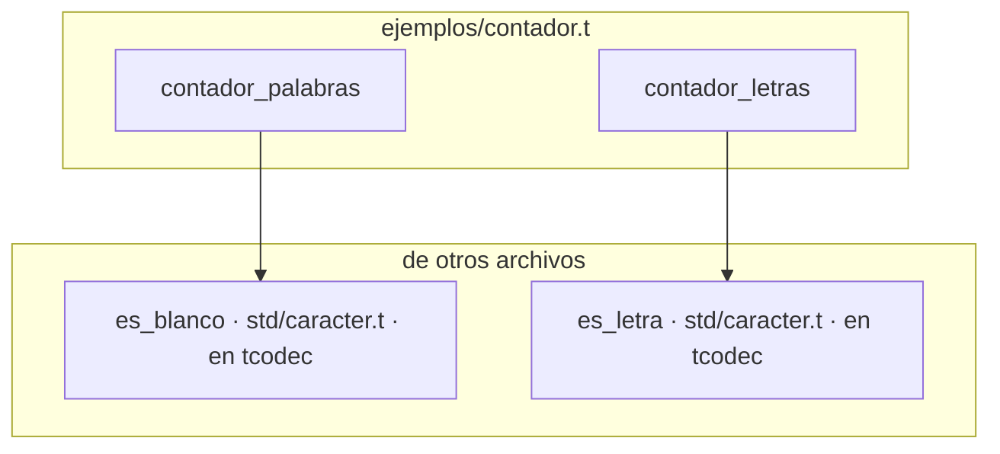

## ejemplos/contar.t (fuera de tcodec)

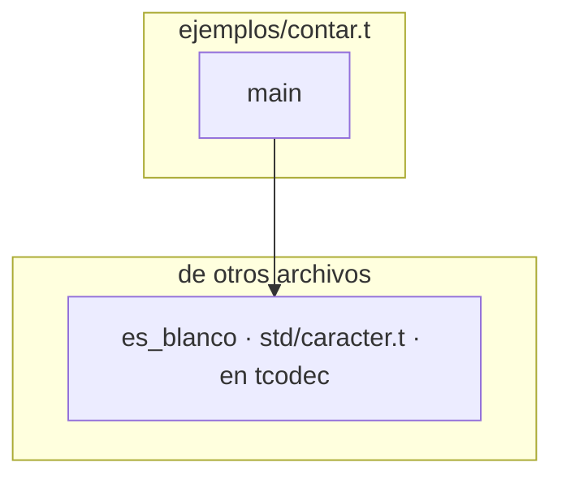

## ejemplos/frecuencia.t (fuera de tcodec)

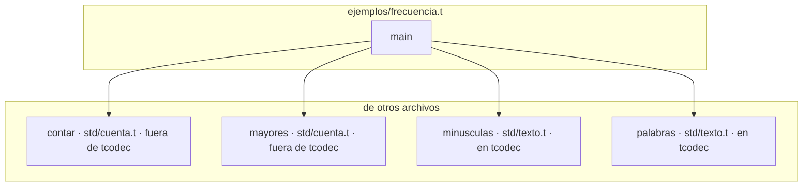

## ejemplos/genericos.t (fuera de tcodec)

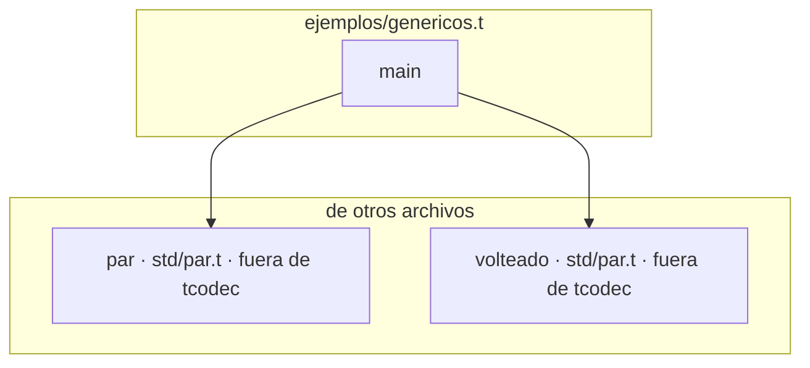

## ejemplos/informe/informe.t (fuera de tcodec)

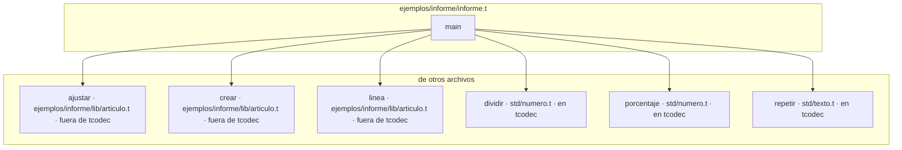

## ejemplos/informe/lib/articulo.t (fuera de tcodec)

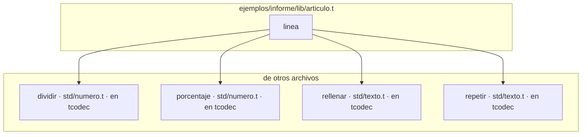

## ejemplos/inventario.t (fuera de tcodec)

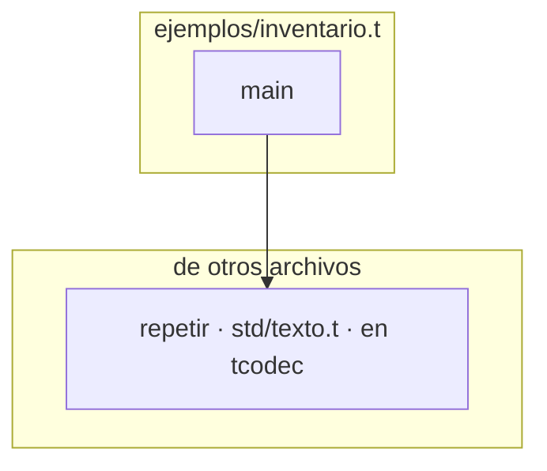

## ejemplos/lexer/lexer.t (fuera de tcodec)

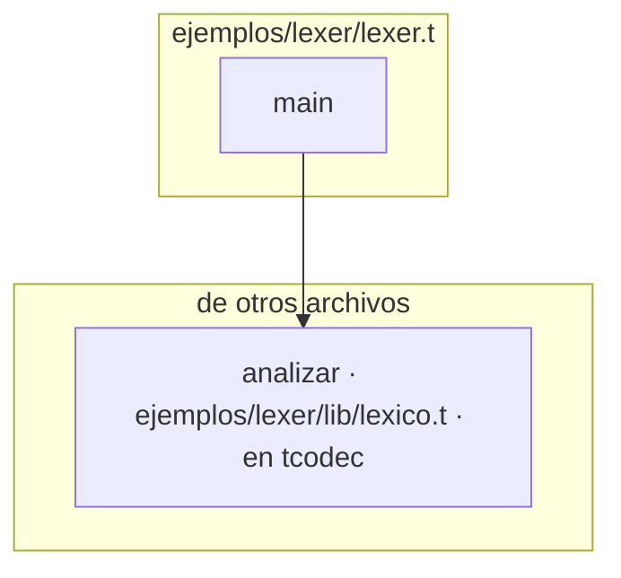

## ejemplos/lexer/lib/lexico.t (en tcodec)

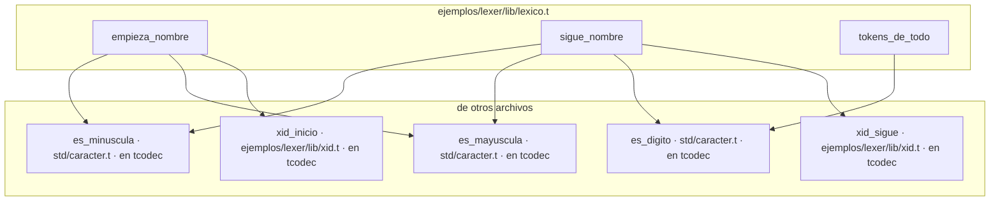

## ejemplos/lexer/lib/sintaxis.t (en tcodec)

```mermaid
graph TD
    subgraph ejemplos_lexer_lib_sintaxis["ejemplos/lexer/lib/sintaxis.t"]
        ejemplos_lexer_lib_sintaxis__candidatos_de["candidatos_de"]
        ejemplos_lexer_lib_sintaxis__comillas_de_antes["comillas_de_antes"]
        ejemplos_lexer_lib_sintaxis__descifrado["descifrado"]
        ejemplos_lexer_lib_sintaxis__espera["espera"]
        ejemplos_lexer_lib_sintaxis__huecos_de["huecos_de"]
        ejemplos_lexer_lib_sintaxis__leido["leido"]
        ejemplos_lexer_lib_sintaxis__mostrar["mostrar"]
        ejemplos_lexer_lib_sintaxis__visto_en["visto_en"]
    end
    subgraph fuera["de otros archivos"]
        ejemplos_lexer_lib_clase__nombre_de_clase["nombre_de_clase · ejemplos/lexer/lib/clase.t · en tcodec"]
        ejemplos_lexer_lib_lexico__analizar["analizar · ejemplos/lexer/lib/lexico.t · en tcodec"]
        ejemplos_lexer_lib_lexico__cierre_de_hueco["cierre_de_hueco · ejemplos/lexer/lib/lexico.t · en tcodec"]
        ejemplos_lexer_lib_lexico__fin_de_texto["fin_de_texto · ejemplos/lexer/lib/lexico.t · en tcodec"]
        ejemplos_lexer_lib_lexico__repr_texto["repr_texto · ejemplos/lexer/lib/lexico.t · en tcodec"]
        ejemplos_lexer_lib_lexico__tokens_desde["tokens_desde · ejemplos/lexer/lib/lexico.t · en tcodec"]
        std_texto__empieza_con["empieza_con · std/texto.t · en tcodec"]
        std_texto__recortar["recortar · std/texto.t · en tcodec"]
        std_texto__termina_con["termina_con · std/texto.t · en tcodec"]
    end

    ejemplos_lexer_lib_sintaxis__candidatos_de --> std_texto__empieza_con
    ejemplos_lexer_lib_sintaxis__candidatos_de --> std_texto__termina_con
    ejemplos_lexer_lib_sintaxis__comillas_de_antes --> ejemplos_lexer_lib_lexico__fin_de_texto
    ejemplos_lexer_lib_sintaxis__descifrado --> ejemplos_lexer_lib_lexico__cierre_de_hueco
    ejemplos_lexer_lib_sintaxis__espera --> ejemplos_lexer_lib_lexico__repr_texto
    ejemplos_lexer_lib_sintaxis__huecos_de --> ejemplos_lexer_lib_lexico__cierre_de_hueco
    ejemplos_lexer_lib_sintaxis__huecos_de --> ejemplos_lexer_lib_lexico__repr_texto
    ejemplos_lexer_lib_sintaxis__huecos_de --> ejemplos_lexer_lib_lexico__tokens_desde
    ejemplos_lexer_lib_sintaxis__huecos_de --> std_texto__recortar
    ejemplos_lexer_lib_sintaxis__leido --> ejemplos_lexer_lib_lexico__analizar
    ejemplos_lexer_lib_sintaxis__mostrar --> ejemplos_lexer_lib_clase__nombre_de_clase
    ejemplos_lexer_lib_sintaxis__visto_en --> ejemplos_lexer_lib_lexico__repr_texto
```

## ejemplos/lexer/parser.t (fuera de tcodec)

```mermaid
graph TD
    subgraph ejemplos_lexer_parser["ejemplos/lexer/parser.t"]
        ejemplos_lexer_parser__main["main"]
    end
    subgraph fuera["de otros archivos"]
        ejemplos_lexer_lib_lexico__analizar["analizar · ejemplos/lexer/lib/lexico.t · en tcodec"]
        ejemplos_lexer_lib_sintaxis__contar_nodos["contar_nodos · ejemplos/lexer/lib/sintaxis.t · en tcodec"]
        ejemplos_lexer_lib_sintaxis__enums_visibles["enums_visibles · ejemplos/lexer/lib/sintaxis.t · en tcodec"]
        ejemplos_lexer_lib_sintaxis__estado_de["estado_de · ejemplos/lexer/lib/sintaxis.t · en tcodec"]
        ejemplos_lexer_lib_sintaxis__hondura["hondura · ejemplos/lexer/lib/sintaxis.t · en tcodec"]
        ejemplos_lexer_lib_sintaxis__mostrar["mostrar · ejemplos/lexer/lib/sintaxis.t · en tcodec"]
        ejemplos_lexer_lib_sintaxis__programa["programa · ejemplos/lexer/lib/sintaxis.t · en tcodec"]
        ejemplos_lexer_lib_sintaxis__structs_visibles["structs_visibles · ejemplos/lexer/lib/sintaxis.t · en tcodec"]
    end

    ejemplos_lexer_parser__main --> ejemplos_lexer_lib_lexico__analizar
    ejemplos_lexer_parser__main --> ejemplos_lexer_lib_sintaxis__contar_nodos
    ejemplos_lexer_parser__main --> ejemplos_lexer_lib_sintaxis__enums_visibles
    ejemplos_lexer_parser__main --> ejemplos_lexer_lib_sintaxis__estado_de
    ejemplos_lexer_parser__main --> ejemplos_lexer_lib_sintaxis__hondura
    ejemplos_lexer_parser__main --> ejemplos_lexer_lib_sintaxis__mostrar
    ejemplos_lexer_parser__main --> ejemplos_lexer_lib_sintaxis__programa
    ejemplos_lexer_parser__main --> ejemplos_lexer_lib_sintaxis__structs_visibles
```

## ejemplos/mario.t (fuera de tcodec)

```mermaid
graph TD
    subgraph ejemplos_mario["ejemplos/mario.t"]
        ejemplos_mario__main["main"]
    end
    subgraph fuera["de otros archivos"]
        std_texto__a_entero["a_entero · std/texto.t · en tcodec"]
        std_texto__recortar["recortar · std/texto.t · en tcodec"]
    end

    ejemplos_mario__main --> std_texto__a_entero
    ejemplos_mario__main --> std_texto__recortar
```

## ejemplos/modulos/escalas.t (fuera de tcodec)

```mermaid
graph TD
    subgraph ejemplos_modulos_escalas["ejemplos/modulos/escalas.t"]
        ejemplos_modulos_escalas__linea["linea"]
        ejemplos_modulos_escalas__main["main"]
    end
    subgraph fuera["de otros archivos"]
        ejemplos_modulos_lib_celsius__desde_kelvin["desde_kelvin · ejemplos/modulos/lib/celsius.t · fuera de tcodec"]
        ejemplos_modulos_lib_celsius__nombre["nombre · ejemplos/modulos/lib/celsius.t · fuera de tcodec"]
        ejemplos_modulos_lib_fahrenheit__desde_kelvin["desde_kelvin · ejemplos/modulos/lib/fahrenheit.t · fuera de tcodec"]
        ejemplos_modulos_lib_fahrenheit__nombre["nombre · ejemplos/modulos/lib/fahrenheit.t · fuera de tcodec"]
        std_texto__rellenar["rellenar · std/texto.t · en tcodec"]
    end

    ejemplos_modulos_escalas__linea --> std_texto__rellenar
    ejemplos_modulos_escalas__main --> ejemplos_modulos_lib_celsius__desde_kelvin
    ejemplos_modulos_escalas__main --> ejemplos_modulos_lib_celsius__nombre
    ejemplos_modulos_escalas__main --> ejemplos_modulos_lib_fahrenheit__desde_kelvin
    ejemplos_modulos_escalas__main --> ejemplos_modulos_lib_fahrenheit__nombre
```

## ejemplos/ordenar.t (fuera de tcodec)

```mermaid
graph TD
    subgraph ejemplos_ordenar["ejemplos/ordenar.t"]
        ejemplos_ordenar__main["main"]
    end
    subgraph fuera["de otros archivos"]
        std_cuenta__contar["contar · std/cuenta.t · fuera de tcodec"]
        std_lista__primeras["primeras · std/lista.t · en tcodec"]
        std_texto__terminos["terminos · std/texto.t · en tcodec"]
    end

    ejemplos_ordenar__main --> std_cuenta__contar
    ejemplos_ordenar__main --> std_lista__primeras
    ejemplos_ordenar__main --> std_texto__terminos
```

## ejemplos/pruebas.t (fuera de tcodec)

```mermaid
graph TD
    subgraph ejemplos_pruebas["ejemplos/pruebas.t"]
        ejemplos_pruebas__main["main"]
    end
    subgraph fuera["de otros archivos"]
        std_bytes__a_hex["a_hex · std/bytes.t · fuera de tcodec"]
        std_bytes__de_hex["de_hex · std/bytes.t · fuera de tcodec"]
        std_bytes__leer_u32["leer_u32 · std/bytes.t · fuera de tcodec"]
        std_bytes__poner_u32["poner_u32 · std/bytes.t · fuera de tcodec"]
        std_conjunto__cuantos_hay["cuantos_hay · std/conjunto.t · fuera de tcodec"]
        std_conjunto__de_lista["de_lista · std/conjunto.t · fuera de tcodec"]
        std_conjunto__diferencia["diferencia · std/conjunto.t · fuera de tcodec"]
        std_conjunto__elementos["elementos · std/conjunto.t · fuera de tcodec"]
        std_conjunto__interseccion["interseccion · std/conjunto.t · fuera de tcodec"]
        std_conjunto__union["union · std/conjunto.t · fuera de tcodec"]
        std_formato__con_decimales["con_decimales · std/formato.t · fuera de tcodec"]
        std_formato__con_millares["con_millares · std/formato.t · fuera de tcodec"]
        std_iterador__alguna["alguna · std/iterador.t · fuera de tcodec"]
        std_iterador__plegar["plegar · std/iterador.t · fuera de tcodec"]
        std_iterador__primera_que["primera_que · std/iterador.t · fuera de tcodec"]
        std_iterador__todas["todas · std/iterador.t · fuera de tcodec"]
        std_iterador__transformar["transformar · std/iterador.t · fuera de tcodec"]
        std_lista__aplanar["aplanar · std/lista.t · en tcodec"]
        std_lista__cuantas_cumplen["cuantas_cumplen · std/lista.t · en tcodec"]
        std_lista__filtradas["filtradas · std/lista.t · en tcodec"]
        std_lista__invertida["invertida · std/lista.t · en tcodec"]
        std_lista__maximo["maximo · std/lista.t · en tcodec"]
        std_lista__media["media · std/lista.t · en tcodec"]
        std_lista__minimo["minimo · std/lista.t · en tcodec"]
        std_lista__ordenadas_por["ordenadas_por · std/lista.t · en tcodec"]
        std_lista__primeras["primeras · std/lista.t · en tcodec"]
        std_lista__suma["suma · std/lista.t · en tcodec"]
        std_lista__ultima_posicion["ultima_posicion · std/lista.t · en tcodec"]
        std_mapa__actualizar["actualizar · std/mapa.t · en tcodec"]
        std_mapa__acumular["acumular · std/mapa.t · en tcodec"]
        std_mapa__claves_ordenadas["claves_ordenadas · std/mapa.t · en tcodec"]
        std_mapa__obtener_o["obtener_o · std/mapa.t · en tcodec"]
        std_mapa__valores_ordenados["valores_ordenados · std/mapa.t · en tcodec"]
        std_numero__acotar["acotar · std/numero.t · en tcodec"]
        std_numero__cerca["cerca · std/numero.t · en tcodec"]
        std_numero__dividir["dividir · std/numero.t · en tcodec"]
        std_numero__porcentaje["porcentaje · std/numero.t · en tcodec"]
        std_par__par["par · std/par.t · fuera de tcodec"]
        std_par__volteado["volteado · std/par.t · fuera de tcodec"]
        std_prueba__afirmar["afirmar · std/prueba.t · fuera de tcodec"]
        std_prueba__afirmar_igual_numero["afirmar_igual_numero · std/prueba.t · fuera de tcodec"]
        std_prueba__afirmar_igual_texto["afirmar_igual_texto · std/prueba.t · fuera de tcodec"]
        std_prueba__pruebas["pruebas · std/prueba.t · fuera de tcodec"]
        std_prueba__terminar["terminar · std/prueba.t · fuera de tcodec"]
        std_texto__a_entero["a_entero · std/texto.t · en tcodec"]
        std_texto__alinear["alinear · std/texto.t · en tcodec"]
        std_texto__apariciones["apariciones · std/texto.t · en tcodec"]
        std_texto__empieza_con["empieza_con · std/texto.t · en tcodec"]
        std_texto__lineas["lineas · std/texto.t · en tcodec"]
        std_texto__mayusculas["mayusculas · std/texto.t · en tcodec"]
        std_texto__minusculas["minusculas · std/texto.t · en tcodec"]
        std_texto__palabras["palabras · std/texto.t · en tcodec"]
        std_texto__partir["partir · std/texto.t · en tcodec"]
        std_texto__recortar["recortar · std/texto.t · en tcodec"]
        std_texto__reemplazar["reemplazar · std/texto.t · en tcodec"]
        std_texto__rellenar["rellenar · std/texto.t · en tcodec"]
        std_texto__termina_con["termina_con · std/texto.t · en tcodec"]
        std_texto__terminos["terminos · std/texto.t · en tcodec"]
        std_texto__unir["unir · std/texto.t · en tcodec"]
        std_vector__a_lista["a_lista · std/vector.t · fuera de tcodec"]
        std_vector__agregar["agregar · std/vector.t · fuera de tcodec"]
        std_vector__cuantos["cuantos · std/vector.t · fuera de tcodec"]
        std_vector__sacar["sacar · std/vector.t · fuera de tcodec"]
    end

    ejemplos_pruebas__main --> std_bytes__a_hex
    ejemplos_pruebas__main --> std_bytes__de_hex
    ejemplos_pruebas__main --> std_bytes__leer_u32
    ejemplos_pruebas__main --> std_bytes__poner_u32
    ejemplos_pruebas__main --> std_conjunto__cuantos_hay
    ejemplos_pruebas__main --> std_conjunto__de_lista
    ejemplos_pruebas__main --> std_conjunto__diferencia
    ejemplos_pruebas__main --> std_conjunto__elementos
    ejemplos_pruebas__main --> std_conjunto__interseccion
    ejemplos_pruebas__main --> std_conjunto__union
    ejemplos_pruebas__main --> std_formato__con_decimales
    ejemplos_pruebas__main --> std_formato__con_millares
    ejemplos_pruebas__main --> std_iterador__alguna
    ejemplos_pruebas__main --> std_iterador__plegar
    ejemplos_pruebas__main --> std_iterador__primera_que
    ejemplos_pruebas__main --> std_iterador__todas
    ejemplos_pruebas__main --> std_iterador__transformar
    ejemplos_pruebas__main --> std_lista__aplanar
    ejemplos_pruebas__main --> std_lista__cuantas_cumplen
    ejemplos_pruebas__main --> std_lista__filtradas
    ejemplos_pruebas__main --> std_lista__invertida
    ejemplos_pruebas__main --> std_lista__maximo
    ejemplos_pruebas__main --> std_lista__media
    ejemplos_pruebas__main --> std_lista__minimo
    ejemplos_pruebas__main --> std_lista__ordenadas_por
    ejemplos_pruebas__main --> std_lista__primeras
    ejemplos_pruebas__main --> std_lista__suma
    ejemplos_pruebas__main --> std_lista__ultima_posicion
    ejemplos_pruebas__main --> std_mapa__actualizar
    ejemplos_pruebas__main --> std_mapa__acumular
    ejemplos_pruebas__main --> std_mapa__claves_ordenadas
    ejemplos_pruebas__main --> std_mapa__obtener_o
    ejemplos_pruebas__main --> std_mapa__valores_ordenados
    ejemplos_pruebas__main --> std_numero__acotar
    ejemplos_pruebas__main --> std_numero__cerca
    ejemplos_pruebas__main --> std_numero__dividir
    ejemplos_pruebas__main --> std_numero__porcentaje
    ejemplos_pruebas__main --> std_par__par
    ejemplos_pruebas__main --> std_par__volteado
    ejemplos_pruebas__main --> std_prueba__afirmar
    ejemplos_pruebas__main --> std_prueba__afirmar_igual_numero
    ejemplos_pruebas__main --> std_prueba__afirmar_igual_texto
    ejemplos_pruebas__main --> std_prueba__pruebas
    ejemplos_pruebas__main --> std_prueba__terminar
    ejemplos_pruebas__main --> std_texto__a_entero
    ejemplos_pruebas__main --> std_texto__alinear
    ejemplos_pruebas__main --> std_texto__apariciones
    ejemplos_pruebas__main --> std_texto__empieza_con
    ejemplos_pruebas__main --> std_texto__lineas
    ejemplos_pruebas__main --> std_texto__mayusculas
    ejemplos_pruebas__main --> std_texto__minusculas
    ejemplos_pruebas__main --> std_texto__palabras
    ejemplos_pruebas__main --> std_texto__partir
    ejemplos_pruebas__main --> std_texto__recortar
    ejemplos_pruebas__main --> std_texto__reemplazar
    ejemplos_pruebas__main --> std_texto__rellenar
    ejemplos_pruebas__main --> std_texto__termina_con
    ejemplos_pruebas__main --> std_texto__terminos
    ejemplos_pruebas__main --> std_texto__unir
    ejemplos_pruebas__main --> std_vector__a_lista
    ejemplos_pruebas__main --> std_vector__agregar
    ejemplos_pruebas__main --> std_vector__cuantos
    ejemplos_pruebas__main --> std_vector__sacar
```

## ejemplos/texto.t (fuera de tcodec)

```mermaid
graph TD
    subgraph ejemplos_texto["ejemplos/texto.t"]
        ejemplos_texto__main["main"]
        ejemplos_texto__marco["marco"]
    end
    subgraph fuera["de otros archivos"]
        std_texto__empieza_con["empieza_con · std/texto.t · en tcodec"]
        std_texto__repetir["repetir · std/texto.t · en tcodec"]
        std_texto__termina_con["termina_con · std/texto.t · en tcodec"]
        std_texto__unir["unir · std/texto.t · en tcodec"]
    end

    ejemplos_texto__main --> std_texto__empieza_con
    ejemplos_texto__main --> std_texto__repetir
    ejemplos_texto__main --> std_texto__termina_con
    ejemplos_texto__main --> std_texto__unir
    ejemplos_texto__marco --> std_texto__repetir
```

## programas/base64.t (fuera de tcodec)

```mermaid
graph TD
    subgraph programas_base64["programas/base64.t"]
        programas_base64__main["main"]
    end
    subgraph fuera["de otros archivos"]
        std_base64__codificar["codificar · std/base64.t · fuera de tcodec"]
        std_base64__decodificar["decodificar · std/base64.t · fuera de tcodec"]
    end

    programas_base64__main --> std_base64__codificar
    programas_base64__main --> std_base64__decodificar
```

## programas/buscar.t (fuera de tcodec)

```mermaid
graph TD
    subgraph programas_buscar["programas/buscar.t"]
        programas_buscar__main["main"]
    end
    subgraph fuera["de otros archivos"]
        std_texto__contiene["contiene · std/texto.t · en tcodec"]
        std_texto__minusculas["minusculas · std/texto.t · en tcodec"]
    end

    programas_buscar__main --> std_texto__contiene
    programas_buscar__main --> std_texto__minusculas
```

## programas/json.t (fuera de tcodec)

```mermaid
graph TD
    subgraph programas_json["programas/json.t"]
        programas_json__main["main"]
    end
    subgraph fuera["de otros archivos"]
        std_cli__leer["leer · std/cli.t · fuera de tcodec"]
        std_cli__tiene_bandera["tiene_bandera · std/cli.t · fuera de tcodec"]
        std_json__escribir["escribir · std/json.t · fuera de tcodec"]
        std_json__escribir_con_sangria["escribir_con_sangria · std/json.t · fuera de tcodec"]
        std_json__leer["leer · std/json.t · fuera de tcodec"]
    end

    programas_json__main --> std_cli__leer
    programas_json__main --> std_cli__tiene_bandera
    programas_json__main --> std_json__escribir
    programas_json__main --> std_json__escribir_con_sangria
    programas_json__main --> std_json__leer
```

## programas/tc-config.t (fuera de tcodec)

```mermaid
graph TD
    subgraph programas_tc-config["programas/tc-config.t"]
        programas_tc-config__main["main"]
    end
    subgraph fuera["de otros archivos"]
        std_cli__leer["leer · std/cli.t · fuera de tcodec"]
        std_cli__opcion["opcion · std/cli.t · fuera de tcodec"]
        std_json__escribir["escribir · std/json.t · fuera de tcodec"]
        std_json__escribir_con_sangria["escribir_con_sangria · std/json.t · fuera de tcodec"]
        std_toml__crudo_de["crudo_de · std/toml.t · fuera de tcodec"]
        std_toml__leer["leer · std/toml.t · fuera de tcodec"]
        std_toml__tiene_clave["tiene_clave · std/toml.t · fuera de tcodec"]
    end

    programas_tc-config__main --> std_cli__leer
    programas_tc-config__main --> std_cli__opcion
    programas_tc-config__main --> std_json__escribir
    programas_tc-config__main --> std_json__escribir_con_sangria
    programas_tc-config__main --> std_toml__crudo_de
    programas_tc-config__main --> std_toml__leer
    programas_tc-config__main --> std_toml__tiene_clave
```

## programas/vida.t (fuera de tcodec)

```mermaid
graph TD
    subgraph programas_vida["programas/vida.t"]
        programas_vida__leer["leer"]
        programas_vida__main["main"]
    end
    subgraph fuera["de otros archivos"]
        std_texto__a_entero["a_entero · std/texto.t · en tcodec"]
        std_texto__lineas["lineas · std/texto.t · en tcodec"]
    end

    programas_vida__leer --> std_texto__lineas
    programas_vida__main --> std_texto__a_entero
```

## programas/wc.t (fuera de tcodec)

```mermaid
graph TD
    subgraph programas_wc["programas/wc.t"]
        programas_wc__contar["contar"]
    end
    subgraph fuera["de otros archivos"]
        std_caracter__es_blanco["es_blanco · std/caracter.t · en tcodec"]
    end

    programas_wc__contar --> std_caracter__es_blanco
```

## std/archivo.t (en tcodec)

```mermaid
graph TD
    subgraph std_archivo["std/archivo.t"]
        std_archivo__buffer_de_ruta["buffer_de_ruta"]
        std_archivo__ruta_real["ruta_real"]
        std_archivo__temporal_junto["temporal_junto"]
    end
    subgraph fuera["de otros archivos"]
        std_camino__carpeta_o_actual["carpeta_o_actual · std/camino.t · en tcodec"]
        std_camino__nombre_de["nombre_de · std/camino.t · en tcodec"]
        std_camino__unir_ruta["unir_ruta · std/camino.t · en tcodec"]
        std_texto__repetir["repetir · std/texto.t · en tcodec"]
    end

    std_archivo__buffer_de_ruta --> std_texto__repetir
    std_archivo__ruta_real --> std_camino__carpeta_o_actual
    std_archivo__ruta_real --> std_camino__nombre_de
    std_archivo__ruta_real --> std_camino__unir_ruta
    std_archivo__temporal_junto --> std_camino__carpeta_o_actual
```

## std/cli.t (fuera de tcodec)

```mermaid
graph TD
    subgraph std_cli["std/cli.t"]
        std_cli__leer["leer"]
        std_cli__tiene_bandera["tiene_bandera"]
    end
    subgraph fuera["de otros archivos"]
        std_mapa__obtener_o["obtener_o · std/mapa.t · en tcodec"]
        std_texto__empieza_con["empieza_con · std/texto.t · en tcodec"]
    end

    std_cli__leer --> std_texto__empieza_con
    std_cli__tiene_bandera --> std_mapa__obtener_o
```

## std/formato.t (fuera de tcodec)

```mermaid
graph TD
    subgraph std_formato["std/formato.t"]
        std_formato__con_decimales["con_decimales"]
        std_formato__fila["fila"]
    end
    subgraph fuera["de otros archivos"]
        std_numero__menor_de["menor_de · std/numero.t · en tcodec"]
        std_texto__recortar["recortar · std/texto.t · en tcodec"]
        std_texto__rellenar["rellenar · std/texto.t · en tcodec"]
    end

    std_formato__con_decimales --> std_numero__menor_de
    std_formato__fila --> std_texto__recortar
    std_formato__fila --> std_texto__rellenar
```

## std/json.t (fuera de tcodec)

```mermaid
graph TD
    subgraph std_json["std/json.t"]
        std_json__espacios["espacios"]
        std_json__numero["numero"]
        std_json__valor["valor"]
    end
    subgraph fuera["de otros archivos"]
        std_caracter__es_blanco["es_blanco · std/caracter.t · en tcodec"]
        std_caracter__es_digito["es_digito · std/caracter.t · en tcodec"]
    end

    std_json__espacios --> std_caracter__es_blanco
    std_json__numero --> std_caracter__es_digito
    std_json__valor --> std_caracter__es_digito
```

## std/lista.t (en tcodec)

```mermaid
graph TD
    subgraph std_lista["std/lista.t"]
        std_lista__media["media"]
    end
    subgraph fuera["de otros archivos"]
        std_numero__dividir["dividir · std/numero.t · en tcodec"]
    end

    std_lista__media --> std_numero__dividir
```

## std/texto.t (en tcodec)

```mermaid
graph TD
    subgraph std_texto["std/texto.t"]
        std_texto__palabras["palabras"]
        std_texto__recortar["recortar"]
        std_texto__terminos["terminos"]
    end
    subgraph fuera["de otros archivos"]
        std_caracter__es_alfanumerico["es_alfanumerico · std/caracter.t · en tcodec"]
        std_caracter__es_blanco["es_blanco · std/caracter.t · en tcodec"]
    end

    std_texto__palabras --> std_caracter__es_blanco
    std_texto__recortar --> std_caracter__es_blanco
    std_texto__terminos --> std_caracter__es_alfanumerico
```

## std/toml.t (fuera de tcodec)

```mermaid
graph TD
    subgraph std_toml["std/toml.t"]
        std_toml__leer["leer"]
        std_toml__limpia["limpia"]
        std_toml__trozos["trozos"]
        std_toml__valor_de["valor_de"]
    end
    subgraph fuera["de otros archivos"]
        std_texto__indice_de["indice_de · std/texto.t · en tcodec"]
        std_texto__lineas["lineas · std/texto.t · en tcodec"]
        std_texto__recortar["recortar · std/texto.t · en tcodec"]
    end

    std_toml__leer --> std_texto__indice_de
    std_toml__leer --> std_texto__lineas
    std_toml__leer --> std_texto__recortar
    std_toml__limpia --> std_texto__recortar
    std_toml__trozos --> std_texto__recortar
    std_toml__valor_de --> std_texto__recortar
```

