# Grafo de llamadas del compilador

Generado por `make grafo` (`tests/grafo.py`); no se edita a mano.
Cada nodo es un archivo `.t` del compilador, y una flecha `A --> B`
dice que `A` usa algo de `B` (una llamada o una referencia calificada
`alias.algo`). Las hojas de `std` son los modulos que el compilador
importa sin calificar.

```mermaid
graph TD
    compilador_cuerpos["compilador/cuerpos.t"]
    compilador_expresiones["compilador/expresiones.t"]
    compilador_firmas["compilador/firmas.t"]
    compilador_lib_comprobar["compilador/lib/comprobar.t"]
    compilador_lib_formato["compilador/lib/formato.t"]
    compilador_lib_generar["compilador/lib/generar.t"]
    compilador_lib_programa["compilador/lib/programa.t"]
    compilador_lib_propiedad["compilador/lib/propiedad.t"]
    compilador_lib_tipar["compilador/lib/tipar.t"]
    compilador_lib_tipos["compilador/lib/tipos.t"]
    compilador_tcodec["compilador/tcodec.t"]
    compilador_tipar["compilador/tipar.t"]
    compilador_tipos["compilador/tipos.t"]
    lexer_lexer["lexer/lexer.t"]
    lexer_lib_clase["lexer/lib/clase.t"]
    lexer_lib_lexico["lexer/lib/lexico.t"]
    lexer_lib_sintaxis["lexer/lib/sintaxis.t"]
    lexer_lib_xid["lexer/lib/xid.t"]
    lexer_parser["lexer/parser.t"]
    std_caracter["std/caracter"]
    std_lista["std/lista"]
    std_mapa["std/mapa"]
    std_texto["std/texto"]

    compilador_cuerpos --> compilador_lib_programa
    compilador_cuerpos --> compilador_lib_tipar
    compilador_cuerpos --> lexer_lib_clase
    compilador_cuerpos --> lexer_lib_lexico
    compilador_cuerpos --> std_lista
    compilador_cuerpos --> std_texto
    compilador_expresiones --> compilador_lib_generar
    compilador_expresiones --> compilador_lib_tipar
    compilador_expresiones --> compilador_lib_tipos
    compilador_expresiones --> lexer_lib_clase
    compilador_expresiones --> lexer_lib_lexico
    compilador_expresiones --> lexer_lib_sintaxis
    compilador_expresiones --> std_lista
    compilador_expresiones --> std_texto
    compilador_firmas --> compilador_lib_generar
    compilador_firmas --> compilador_lib_programa
    compilador_firmas --> compilador_lib_tipar
    compilador_firmas --> lexer_lib_clase
    compilador_firmas --> lexer_lib_lexico
    compilador_firmas --> lexer_lib_sintaxis
    compilador_firmas --> std_lista
    compilador_firmas --> std_texto
    compilador_lib_comprobar --> compilador_lib_generar
    compilador_lib_comprobar --> compilador_lib_tipar
    compilador_lib_comprobar --> compilador_lib_tipos
    compilador_lib_comprobar --> lexer_lib_clase
    compilador_lib_comprobar --> lexer_lib_sintaxis
    compilador_lib_comprobar --> std_lista
    compilador_lib_comprobar --> std_texto
    compilador_lib_formato --> lexer_lib_lexico
    compilador_lib_formato --> std_lista
    compilador_lib_formato --> std_texto
    compilador_lib_generar --> compilador_lib_tipar
    compilador_lib_generar --> compilador_lib_tipos
    compilador_lib_generar --> lexer_lib_clase
    compilador_lib_generar --> lexer_lib_lexico
    compilador_lib_generar --> lexer_lib_sintaxis
    compilador_lib_generar --> std_lista
    compilador_lib_generar --> std_texto
    compilador_lib_programa --> compilador_lib_generar
    compilador_lib_programa --> compilador_lib_tipar
    compilador_lib_programa --> compilador_lib_tipos
    compilador_lib_programa --> lexer_lib_clase
    compilador_lib_programa --> lexer_lib_lexico
    compilador_lib_programa --> lexer_lib_sintaxis
    compilador_lib_programa --> std_lista
    compilador_lib_programa --> std_texto
    compilador_lib_propiedad --> compilador_lib_tipar
    compilador_lib_propiedad --> compilador_lib_tipos
    compilador_lib_propiedad --> lexer_lib_clase
    compilador_lib_propiedad --> lexer_lib_sintaxis
    compilador_lib_propiedad --> std_lista
    compilador_lib_propiedad --> std_texto
    compilador_lib_tipar --> compilador_lib_tipos
    compilador_lib_tipar --> lexer_lib_clase
    compilador_lib_tipar --> lexer_lib_sintaxis
    compilador_lib_tipar --> std_lista
    compilador_lib_tipar --> std_mapa
    compilador_lib_tipar --> std_texto
    compilador_lib_tipos --> std_texto
    compilador_tcodec --> compilador_lib_comprobar
    compilador_tcodec --> compilador_lib_formato
    compilador_tcodec --> compilador_lib_generar
    compilador_tcodec --> compilador_lib_programa
    compilador_tcodec --> compilador_lib_tipar
    compilador_tcodec --> compilador_lib_tipos
    compilador_tcodec --> lexer_lib_clase
    compilador_tcodec --> lexer_lib_lexico
    compilador_tcodec --> lexer_lib_sintaxis
    compilador_tcodec --> std_lista
    compilador_tcodec --> std_texto
    compilador_tipar --> compilador_lib_propiedad
    compilador_tipar --> compilador_lib_tipar
    compilador_tipar --> compilador_lib_tipos
    compilador_tipar --> lexer_lib_clase
    compilador_tipar --> lexer_lib_lexico
    compilador_tipar --> lexer_lib_sintaxis
    compilador_tipar --> std_lista
    compilador_tipar --> std_texto
    compilador_tipos --> compilador_lib_tipos
    compilador_tipos --> lexer_lib_clase
    compilador_tipos --> lexer_lib_lexico
    compilador_tipos --> lexer_lib_sintaxis
    compilador_tipos --> std_lista
    compilador_tipos --> std_texto
    lexer_lexer --> lexer_lib_lexico
    lexer_lib_lexico --> lexer_lib_xid
    lexer_lib_lexico --> std_caracter
    lexer_lib_sintaxis --> lexer_lib_clase
    lexer_lib_sintaxis --> lexer_lib_lexico
    lexer_lib_sintaxis --> std_texto
    lexer_parser --> lexer_lib_lexico
    lexer_parser --> lexer_lib_sintaxis
    lexer_parser --> std_texto
```

