# Grafo de llamadas de los `.t` del repositorio

Generado por `make grafo` (`tests/grafo.py`); no se edita a mano.

**Que cubre:** todos los `.t` de `ejemplos/`, `programas/` y `bench/`,
mas los modulos de `std/` que estos importan (directa o
transitivamente). **No cubre** los `.t` de
`tests/` (entradas de prueba).

Cada nodo es un fichero con su ruta entera, y una flecha `A --> B` dice
que `A` usa algo de `B` (un `use` o un `#importar`, una llamada o una
referencia calificada `alias.algo`).

**En el binario `tcodec`** (20 ficheros): los que se
compilan dentro del compilador. **Fuera** (55 ficheros, con el nodo punteado): programas que se
compilan y se corren aparte; lo que llamen no se ejecuta al compilar.

```mermaid
graph TD
    bench_aritmetica["bench/aritmetica.t"]
    bench_aritmetica_envolvente["bench/aritmetica_envolvente.t"]
    bench_arreglo["bench/arreglo.t"]
    bench_cadenas["bench/cadenas.t"]
    bench_structs["bench/structs.t"]
    ejemplos_banderas["ejemplos/banderas.t"]
    ejemplos_binario["ejemplos/binario.t"]
    ejemplos_bloques["ejemplos/bloques.t"]
    ejemplos_bucle_vista["ejemplos/bucle_vista.t"]
    ejemplos_compilador_cuerpos["ejemplos/compilador/cuerpos.t"]
    ejemplos_compilador_expresiones["ejemplos/compilador/expresiones.t"]
    ejemplos_compilador_firmas["ejemplos/compilador/firmas.t"]
    ejemplos_compilador_lib_comprobar["ejemplos/compilador/lib/comprobar.t"]
    ejemplos_compilador_lib_formato["ejemplos/compilador/lib/formato.t"]
    ejemplos_compilador_lib_generar["ejemplos/compilador/lib/generar.t"]
    ejemplos_compilador_lib_programa["ejemplos/compilador/lib/programa.t"]
    ejemplos_compilador_lib_propiedad["ejemplos/compilador/lib/propiedad.t"]
    ejemplos_compilador_lib_tipar["ejemplos/compilador/lib/tipar.t"]
    ejemplos_compilador_lib_tipos["ejemplos/compilador/lib/tipos.t"]
    ejemplos_compilador_tcodec["ejemplos/compilador/tcodec.t"]
    ejemplos_compilador_tipar["ejemplos/compilador/tipar.t"]
    ejemplos_compilador_tipos["ejemplos/compilador/tipos.t"]
    ejemplos_contador["ejemplos/contador.t"]
    ejemplos_contar["ejemplos/contar.t"]
    ejemplos_externo_reloj["ejemplos/externo/reloj.t"]
    ejemplos_frecuencia["ejemplos/frecuencia.t"]
    ejemplos_genericos["ejemplos/genericos.t"]
    ejemplos_hola["ejemplos/hola.t"]
    ejemplos_informe_informe["ejemplos/informe/informe.t"]
    ejemplos_informe_lib_articulo["ejemplos/informe/lib/articulo.t"]
    ejemplos_inventario["ejemplos/inventario.t"]
    ejemplos_json["ejemplos/json.t"]
    ejemplos_lexer_lexer["ejemplos/lexer/lexer.t"]
    ejemplos_lexer_lib_clase["ejemplos/lexer/lib/clase.t"]
    ejemplos_lexer_lib_lexico["ejemplos/lexer/lib/lexico.t"]
    ejemplos_lexer_lib_sintaxis["ejemplos/lexer/lib/sintaxis.t"]
    ejemplos_lexer_lib_xid["ejemplos/lexer/lib/xid.t"]
    ejemplos_lexer_parser["ejemplos/lexer/parser.t"]
    ejemplos_mario["ejemplos/mario.t"]
    ejemplos_modulos_escalas["ejemplos/modulos/escalas.t"]
    ejemplos_modulos_lib_celsius["ejemplos/modulos/lib/celsius.t"]
    ejemplos_modulos_lib_fahrenheit["ejemplos/modulos/lib/fahrenheit.t"]
    ejemplos_ordenar["ejemplos/ordenar.t"]
    ejemplos_pruebas["ejemplos/pruebas.t"]
    ejemplos_sistema["ejemplos/sistema.t"]
    ejemplos_texto["ejemplos/texto.t"]
    programas_base64["programas/base64.t"]
    programas_buscar["programas/buscar.t"]
    programas_calc["programas/calc.t"]
    programas_json["programas/json.t"]
    programas_ordenar["programas/ordenar.t"]
    programas_tc-config["programas/tc-config.t"]
    programas_vida["programas/vida.t"]
    programas_wc["programas/wc.t"]
    std_archivo["std/archivo.t"]
    std_base64["std/base64.t"]
    std_bytes["std/bytes.t"]
    std_camino["std/camino.t"]
    std_caracter["std/caracter.t"]
    std_cli["std/cli.t"]
    std_conjunto["std/conjunto.t"]
    std_cuenta["std/cuenta.t"]
    std_entorno["std/entorno.t"]
    std_formato["std/formato.t"]
    std_iterador["std/iterador.t"]
    std_json["std/json.t"]
    std_lista["std/lista.t"]
    std_mapa["std/mapa.t"]
    std_numero["std/numero.t"]
    std_par["std/par.t"]
    std_proceso["std/proceso.t"]
    std_prueba["std/prueba.t"]
    std_texto["std/texto.t"]
    std_toml["std/toml.t"]
    std_vector["std/vector.t"]

    ejemplos_banderas --> std_lista
    ejemplos_banderas --> std_texto
    ejemplos_binario --> std_bytes
    ejemplos_bloques --> std_vector
    ejemplos_bucle_vista --> std_texto
    ejemplos_compilador_cuerpos --> ejemplos_compilador_lib_programa
    ejemplos_compilador_cuerpos --> ejemplos_compilador_lib_tipar
    ejemplos_compilador_cuerpos --> ejemplos_lexer_lib_clase
    ejemplos_compilador_cuerpos --> ejemplos_lexer_lib_lexico
    ejemplos_compilador_cuerpos --> ejemplos_lexer_lib_sintaxis
    ejemplos_compilador_cuerpos --> std_lista
    ejemplos_compilador_cuerpos --> std_texto
    ejemplos_compilador_expresiones --> ejemplos_compilador_lib_generar
    ejemplos_compilador_expresiones --> ejemplos_compilador_lib_tipar
    ejemplos_compilador_expresiones --> ejemplos_compilador_lib_tipos
    ejemplos_compilador_expresiones --> ejemplos_lexer_lib_clase
    ejemplos_compilador_expresiones --> ejemplos_lexer_lib_lexico
    ejemplos_compilador_expresiones --> ejemplos_lexer_lib_sintaxis
    ejemplos_compilador_expresiones --> std_lista
    ejemplos_compilador_expresiones --> std_texto
    ejemplos_compilador_firmas --> ejemplos_compilador_lib_generar
    ejemplos_compilador_firmas --> ejemplos_compilador_lib_programa
    ejemplos_compilador_firmas --> ejemplos_compilador_lib_tipar
    ejemplos_compilador_firmas --> ejemplos_lexer_lib_clase
    ejemplos_compilador_firmas --> ejemplos_lexer_lib_lexico
    ejemplos_compilador_firmas --> ejemplos_lexer_lib_sintaxis
    ejemplos_compilador_firmas --> std_lista
    ejemplos_compilador_firmas --> std_texto
    ejemplos_compilador_lib_comprobar --> ejemplos_compilador_lib_generar
    ejemplos_compilador_lib_comprobar --> ejemplos_compilador_lib_tipar
    ejemplos_compilador_lib_comprobar --> ejemplos_compilador_lib_tipos
    ejemplos_compilador_lib_comprobar --> ejemplos_lexer_lib_clase
    ejemplos_compilador_lib_comprobar --> ejemplos_lexer_lib_sintaxis
    ejemplos_compilador_lib_comprobar --> std_lista
    ejemplos_compilador_lib_comprobar --> std_texto
    ejemplos_compilador_lib_formato --> ejemplos_lexer_lib_lexico
    ejemplos_compilador_lib_formato --> std_lista
    ejemplos_compilador_lib_formato --> std_texto
    ejemplos_compilador_lib_generar --> ejemplos_compilador_lib_tipar
    ejemplos_compilador_lib_generar --> ejemplos_compilador_lib_tipos
    ejemplos_compilador_lib_generar --> ejemplos_lexer_lib_clase
    ejemplos_compilador_lib_generar --> ejemplos_lexer_lib_lexico
    ejemplos_compilador_lib_generar --> ejemplos_lexer_lib_sintaxis
    ejemplos_compilador_lib_generar --> std_lista
    ejemplos_compilador_lib_generar --> std_texto
    ejemplos_compilador_lib_programa --> ejemplos_compilador_lib_generar
    ejemplos_compilador_lib_programa --> ejemplos_compilador_lib_tipar
    ejemplos_compilador_lib_programa --> ejemplos_compilador_lib_tipos
    ejemplos_compilador_lib_programa --> ejemplos_lexer_lib_clase
    ejemplos_compilador_lib_programa --> ejemplos_lexer_lib_lexico
    ejemplos_compilador_lib_programa --> ejemplos_lexer_lib_sintaxis
    ejemplos_compilador_lib_programa --> std_lista
    ejemplos_compilador_lib_programa --> std_texto
    ejemplos_compilador_lib_propiedad --> ejemplos_compilador_lib_tipar
    ejemplos_compilador_lib_propiedad --> ejemplos_compilador_lib_tipos
    ejemplos_compilador_lib_propiedad --> ejemplos_lexer_lib_clase
    ejemplos_compilador_lib_propiedad --> ejemplos_lexer_lib_sintaxis
    ejemplos_compilador_lib_propiedad --> std_lista
    ejemplos_compilador_lib_propiedad --> std_texto
    ejemplos_compilador_lib_tipar --> ejemplos_compilador_lib_tipos
    ejemplos_compilador_lib_tipar --> ejemplos_lexer_lib_clase
    ejemplos_compilador_lib_tipar --> ejemplos_lexer_lib_sintaxis
    ejemplos_compilador_lib_tipar --> std_lista
    ejemplos_compilador_lib_tipar --> std_mapa
    ejemplos_compilador_lib_tipar --> std_texto
    ejemplos_compilador_lib_tipos --> std_texto
    ejemplos_compilador_tcodec --> ejemplos_compilador_lib_comprobar
    ejemplos_compilador_tcodec --> ejemplos_compilador_lib_formato
    ejemplos_compilador_tcodec --> ejemplos_compilador_lib_generar
    ejemplos_compilador_tcodec --> ejemplos_compilador_lib_programa
    ejemplos_compilador_tcodec --> ejemplos_compilador_lib_tipar
    ejemplos_compilador_tcodec --> ejemplos_compilador_lib_tipos
    ejemplos_compilador_tcodec --> ejemplos_lexer_lib_clase
    ejemplos_compilador_tcodec --> ejemplos_lexer_lib_lexico
    ejemplos_compilador_tcodec --> ejemplos_lexer_lib_sintaxis
    ejemplos_compilador_tcodec --> std_archivo
    ejemplos_compilador_tcodec --> std_entorno
    ejemplos_compilador_tcodec --> std_lista
    ejemplos_compilador_tcodec --> std_proceso
    ejemplos_compilador_tcodec --> std_texto
    ejemplos_compilador_tipar --> ejemplos_compilador_lib_propiedad
    ejemplos_compilador_tipar --> ejemplos_compilador_lib_tipar
    ejemplos_compilador_tipar --> ejemplos_compilador_lib_tipos
    ejemplos_compilador_tipar --> ejemplos_lexer_lib_clase
    ejemplos_compilador_tipar --> ejemplos_lexer_lib_lexico
    ejemplos_compilador_tipar --> ejemplos_lexer_lib_sintaxis
    ejemplos_compilador_tipar --> std_lista
    ejemplos_compilador_tipar --> std_texto
    ejemplos_compilador_tipos --> ejemplos_compilador_lib_tipos
    ejemplos_compilador_tipos --> ejemplos_lexer_lib_clase
    ejemplos_compilador_tipos --> ejemplos_lexer_lib_lexico
    ejemplos_compilador_tipos --> ejemplos_lexer_lib_sintaxis
    ejemplos_compilador_tipos --> std_lista
    ejemplos_compilador_tipos --> std_texto
    ejemplos_contador --> std_caracter
    ejemplos_contador --> std_texto
    ejemplos_contar --> std_caracter
    ejemplos_contar --> std_texto
    ejemplos_externo_reloj --> std_texto
    ejemplos_frecuencia --> std_cuenta
    ejemplos_frecuencia --> std_texto
    ejemplos_genericos --> std_par
    ejemplos_informe_informe --> ejemplos_informe_lib_articulo
    ejemplos_informe_informe --> std_numero
    ejemplos_informe_informe --> std_texto
    ejemplos_informe_lib_articulo --> std_numero
    ejemplos_informe_lib_articulo --> std_texto
    ejemplos_inventario --> std_texto
    ejemplos_json --> std_lista
    ejemplos_json --> std_texto
    ejemplos_lexer_lexer --> ejemplos_lexer_lib_lexico
    ejemplos_lexer_lib_lexico --> ejemplos_lexer_lib_xid
    ejemplos_lexer_lib_lexico --> std_caracter
    ejemplos_lexer_lib_sintaxis --> ejemplos_lexer_lib_clase
    ejemplos_lexer_lib_sintaxis --> ejemplos_lexer_lib_lexico
    ejemplos_lexer_lib_sintaxis --> std_texto
    ejemplos_lexer_parser --> ejemplos_lexer_lib_lexico
    ejemplos_lexer_parser --> ejemplos_lexer_lib_sintaxis
    ejemplos_lexer_parser --> std_texto
    ejemplos_mario --> std_texto
    ejemplos_modulos_escalas --> ejemplos_modulos_lib_celsius
    ejemplos_modulos_escalas --> ejemplos_modulos_lib_fahrenheit
    ejemplos_modulos_escalas --> std_texto
    ejemplos_ordenar --> std_cuenta
    ejemplos_ordenar --> std_lista
    ejemplos_ordenar --> std_texto
    ejemplos_pruebas --> std_bytes
    ejemplos_pruebas --> std_conjunto
    ejemplos_pruebas --> std_formato
    ejemplos_pruebas --> std_iterador
    ejemplos_pruebas --> std_lista
    ejemplos_pruebas --> std_mapa
    ejemplos_pruebas --> std_numero
    ejemplos_pruebas --> std_par
    ejemplos_pruebas --> std_prueba
    ejemplos_pruebas --> std_texto
    ejemplos_pruebas --> std_vector
    ejemplos_sistema --> std_lista
    ejemplos_sistema --> std_texto
    ejemplos_texto --> std_texto
    programas_base64 --> std_base64
    programas_buscar --> std_texto
    programas_json --> std_cli
    programas_json --> std_json
    programas_tc-config --> std_cli
    programas_tc-config --> std_json
    programas_tc-config --> std_toml
    programas_vida --> std_texto
    programas_wc --> std_caracter
    std_archivo --> std_camino
    std_archivo --> std_texto
    std_cli --> std_mapa
    std_cli --> std_texto
    std_conjunto --> std_lista
    std_cuenta --> std_texto
    std_formato --> std_lista
    std_formato --> std_numero
    std_formato --> std_texto
    std_json --> std_caracter
    std_json --> std_mapa
    std_lista --> std_numero
    std_mapa --> std_lista
    std_prueba --> std_texto
    std_texto --> std_caracter
    std_toml --> std_texto
    std_vector --> std_numero

    classDef fuera fill:#eeeeee,stroke:#999999,stroke-dasharray:4 3;
    class bench_aritmetica,bench_aritmetica_envolvente,bench_arreglo,bench_cadenas,bench_structs,ejemplos_banderas,ejemplos_binario,ejemplos_bloques,ejemplos_bucle_vista,ejemplos_compilador_cuerpos,ejemplos_compilador_expresiones,ejemplos_compilador_firmas,ejemplos_compilador_lib_propiedad,ejemplos_compilador_tipar,ejemplos_compilador_tipos,ejemplos_contador,ejemplos_contar,ejemplos_externo_reloj,ejemplos_frecuencia,ejemplos_genericos,ejemplos_hola,ejemplos_informe_informe,ejemplos_informe_lib_articulo,ejemplos_inventario,ejemplos_json,ejemplos_lexer_lexer,ejemplos_lexer_parser,ejemplos_mario,ejemplos_modulos_escalas,ejemplos_modulos_lib_celsius,ejemplos_modulos_lib_fahrenheit,ejemplos_ordenar,ejemplos_pruebas,ejemplos_sistema,ejemplos_texto,programas_base64,programas_buscar,programas_calc,programas_json,programas_ordenar,programas_tc-config,programas_vida,programas_wc,std_base64,std_bytes,std_cli,std_conjunto,std_cuenta,std_formato,std_iterador,std_json,std_par,std_prueba,std_toml,std_vector fuera;
```

